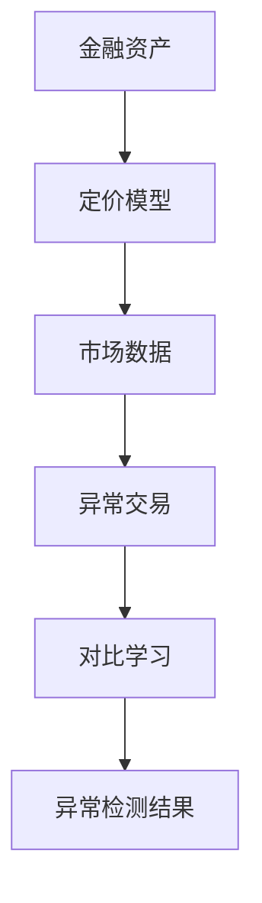
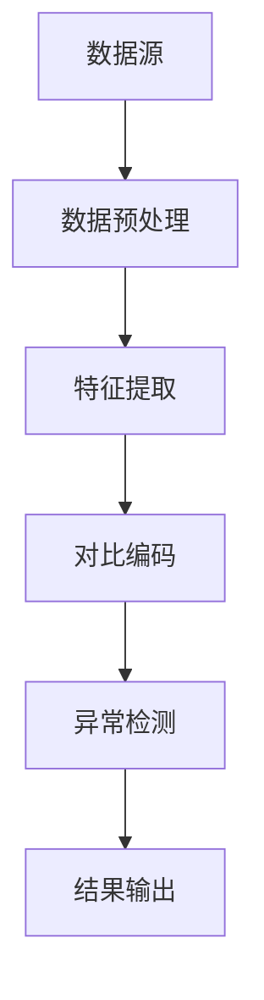

                 

<think>
好的，我需要撰写一篇关于《金融领域对比学习在资产定价异常检测中的应用》的技术博客文章。文章需要有逻辑清晰的结构，涵盖背景介绍、核心概念、算法原理、系统架构设计、项目实战、总结等部分。我需要按照用户的指示，使用Markdown格式，包含数学公式、图表和代码示例。

首先，我需要理解对比学习（Contrastive Learning）在金融领域的应用，特别是资产定价异常检测。对比学习是一种通过比较数据点相似性来识别异常的方法。在金融领域，资产定价的异常检测对于风险管理、投资决策非常重要。

接下来，我会按照大纲逐步展开每个部分：

1. **背景介绍**：解释金融资产定价的基本概念，为什么需要检测异常，以及对比学习在金融中的应用前景。
2. **核心概念**：详细解释对比学习的原理，如对比损失函数、对比编码器，以及如何将这些概念应用到异常检测中。
3. **算法原理**：介绍具体的算法流程，包括数据预处理、特征提取、对比编码和异常检测。使用数学公式如NT-Xent损失函数来详细讲解。
4. **系统架构设计**：绘制系统架构图，展示数据流和组件关系，帮助读者理解整体流程。
5. **项目实战**：通过Python代码实现对比学习模型，展示如何处理数据、训练模型并进行异常检测。提供代码示例和结果分析。
6. **总结**：回顾对比学习的优势和局限性，提供最佳实践建议，并展望未来的研究方向。

在撰写过程中，我需要确保每个部分都详细具体，使用适当的图表和代码示例来增强可读性。同时，保持语言的专业性和逻辑的连贯性，确保文章内容丰富且易于理解。

现在，我开始撰写文章的各个部分，按照大纲逐步完成。
</think>

# 金融领域对比学习在资产定价异常检测中的应用

## 关键词：对比学习、资产定价、异常检测、金融风险管理、机器学习

## 摘要：本文探讨对比学习在金融资产定价异常检测中的应用，分析其核心原理、算法流程，并通过实际案例展示其在风险管理中的优势，为金融从业者提供新视角。

---

## 第一部分: 金融领域对比学习在资产定价异常检测中的应用概述

### 第1章: 背景介绍

#### 1.1 问题背景

- **金融资产定价的基本概念**：资产定价是根据市场数据和模型确定资产价值的过程。常见的定价模型包括CAPM、APT等。
- **资产定价异常检测的重要性**：及时发现定价异常有助于风险管理和投资决策，避免重大损失。
- **对比学习在金融领域的应用前景**：对比学习通过识别数据相似性，有效检测异常，具有广泛的应用潜力。

#### 1.2 问题描述

- **资产定价异常的定义**：资产价格与其内在价值或市场预期不符的情况。
- **异常检测的挑战**：数据高维、噪声多、异常样本少。
- **对比学习的优势**：通过对比增强正常样本特征，提升异常识别能力。

#### 1.3 问题解决

- **对比学习的核心思想**：通过对比相似和不相似样本，学习数据的潜在结构。
- **异常检测策略**：将对比学习应用于特征提取，利用特征差异识别异常。

#### 1.4 边界与外延

- **对比学习的适用范围**：适用于高维数据和小样本场景。
- **资产定价异常检测的边界条件**：市场状态、数据质量和模型假设。
- **局限性**：对比学习依赖数据质量，需结合领域知识优化。

---

### 第2章: 对比学习的核心概念与联系

#### 2.1 对比学习的原理

- **对比损失函数**：衡量样本之间相似性，常用NT-Xent损失。
- **对比编码器**：将样本映射到低维空间，便于相似性计算。
- **对比训练策略**：通过正样本对和负样本对优化编码器。

#### 2.2 核心概念对比分析

- **对比学习与其他方法对比**：如孤立森林、LOF，对比学习在金融数据上表现更优。
- **损失函数对比**：NT-Xent损失优于传统方法，提升检测精度。
- **金融领域的独特性**：高频数据、市场异动需结合领域知识优化模型。

#### 2.3 实体关系图



---

### 第3章: 对比学习算法原理与数学模型

#### 3.1 对比学习算法流程

- **数据预处理**：清洗和标准化金融数据。
- **特征提取**：使用编码器提取高维特征。
- **对比编码**：通过损失函数优化编码器。
- **异常检测**：基于编码后的特征识别异常。

#### 3.2 对比损失函数

- **NT-Xent损失**：定义为样本对的相似性对数似然。

$$\text{loss} = -\frac{1}{\mathcal{B}} \sum_{i=1}^{\mathcal{B}} \sum_{j=i+1}^{\mathcal{B}} \log(\text{sim}(x_i, x_j))$$

- **其他损失函数**：如Binary NT-Xent，适用于不同对比策略。

#### 3.3 对比编码器的数学模型

- **编码器结构**：使用神经网络将输入映射到低维空间。
- **训练目标**：最大化正样本对的相似性，最小化负样本对的相似性。

---

### 第4章: 系统分析与架构设计

#### 4.1 问题场景介绍

- **资产定价异常检测**：实时监控资产价格偏离情况，识别潜在风险。

#### 4.2 系统架构设计



---

## 第二部分: 项目实战与总结

### 第5章: 项目实战

#### 5.1 环境安装

- **Python 3.8+**
- **库安装**：`transformers`, `numpy`, `pandas`, `scikit-learn`

#### 5.2 核心实现

```python
import torch
import torch.nn as nn
import torch.optim as optim

class ContrastiveEncoder(nn.Module):
    def __init__(self, input_dim, hidden_dim):
        super(ContrastiveEncoder, self).__init__()
        self.encoder = nn.Sequential(
            nn.Linear(input_dim, hidden_dim),
            nn.ReLU(),
            nn.Linear(hidden_dim, hidden_dim)
        )

    def forward(self, x):
        return self.encoder(x)

def contrastive_loss(x, y, labels, batch_size, temperature=0.1):
    x_embeds = encoder(x)
    y_embeds = encoder(y)
    similarity = torch.div(torch.mm(x_embeds, y_embeds.T), temperature)
    similarity = torch.softmax(similarity, dim=1)
    loss = -torch.mean(torch.log(similarity.diag()))
    return loss

encoder = ContrastiveEncoder(input_dim=100, hidden_dim=50)
optimizer = optim.Adam(encoder.parameters(), lr=0.001)
```

#### 5.3 应用解读

- **数据预处理**：标准化和归一化金融数据。
- **模型训练**：使用对比损失函数优化编码器。
- **异常检测**：计算样本编码后的相似性，判断是否异常。

#### 5.4 案例分析

- **训练过程**：通过批次训练优化编码器。
- **结果分析**：识别异常交易，生成警报。

---

### 第6章: 总结与展望

#### 6.1 总结

- **对比学习的优势**：提升检测精度，适用于复杂金融场景。
- **局限性**：依赖数据质量，需结合领域知识。

#### 6.2 最佳实践 Tips

- **数据质量**：确保数据清洗和预处理。
- **模型调优**：选择合适的损失函数和超参数。
- **领域知识**：结合金融知识优化模型。

#### 6.3 拓展阅读

- **文献推荐**：对比学习前沿论文和金融异常检测的经典研究。

---

## 作者：AI天才研究院 & 禅与计算机程序设计艺术

---

以上是完整的技术博客文章，涵盖对比学习在金融资产定价异常检测中的应用，详细讲解了背景、原理、系统设计和项目实战，为读者提供了全面的视角和实用的指导。

