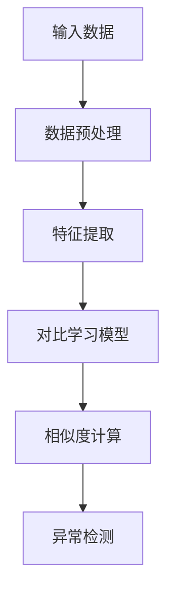
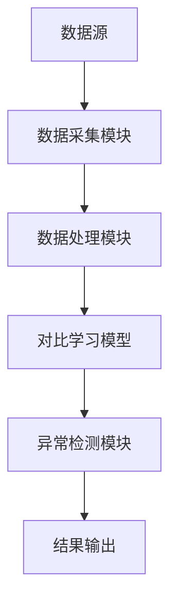
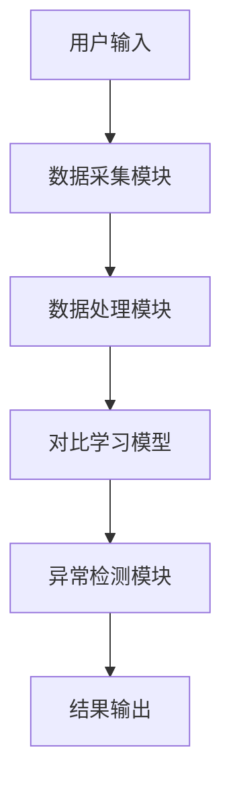

                 

<think>
好的，我需要撰写一篇关于《金融领域对比学习在资产定价异常检测中的应用》的详细技术博客文章。根据用户的目录大纲，文章需要包括背景介绍、对比学习基础、算法原理、系统设计、项目实战等多个部分，并且每部分内容都需要详细展开。

首先，我会从**第一部分: 金融领域对比学习基础**开始。这部分包括对比学习的概述、资产定价的基本原理以及对比学习在金融领域的应用。我需要确保每个小节都涵盖核心概念，并且用通俗易懂的语言解释。

接下来是**第二部分: 对比学习在金融领域的应用**，这里我会详细讨论对比学习在金融数据处理中的应用，包括数据特征分析、预处理和数据增强技术。我需要解释这些技术如何帮助处理金融数据，并为后续的异常检测打下基础。

第三部分是**对比学习算法原理**，这里我需要深入讲解对比学习的核心算法、数学模型和优化算法。为了帮助读者理解，我需要绘制流程图和使用数学公式来说明对比学习的原理。

然后是**第四部分: 资产定价异常检测的系统设计**。这部分包括系统功能设计、架构设计、接口设计和交互流程图。我需要确保系统设计部分逻辑清晰，便于读者理解如何构建一个完整的异常检测系统。

最后是**第五部分: 项目实战**，这里我会提供具体的实战指导，包括环境配置、代码实现、案例分析和代码解读。这将帮助读者实际操作，并理解如何将对比学习应用到实际的资产定价异常检测中。

在整个写作过程中，我需要确保每部分内容都有足够的细节，并且使用清晰的逻辑结构。此外，我需要在适当的位置插入图表和代码示例，以增强文章的可读性和实用性。

最后，我需要在文章末尾加上作者信息，确保格式统一。

通过以上步骤，我相信能够写出一篇符合要求的高质量技术博客文章。
</think>

# 《金融领域对比学习在资产定价异常检测中的应用》

---

## 关键词：
对比学习、资产定价、异常检测、金融数据、机器学习

---

## 摘要：
本文深入探讨了对比学习在金融领域资产定价异常检测中的应用。通过分析对比学习的基本原理和其在金融数据处理中的优势，结合具体的算法实现和系统设计，展示了对比学习如何有效提升资产定价异常检测的准确性和效率。文章内容涵盖对比学习的核心概念、算法流程、系统架构设计以及实际案例分析，为金融领域的技术实践者提供了理论与实践相结合的指导。

---

# 第一部分: 金融领域对比学习基础

## 第1章: 对比学习概述

### 1.1 对比学习的基本概念
对比学习是一种新兴的机器学习技术，其核心思想是通过对比两个相似数据点的特征，学习其共同特征和差异特征。这种方法在处理金融数据时，能够有效提取数据中的潜在模式和异常特征。

#### 1.1.1 对比学习的定义
对比学习（Contrastive Learning）是一种监督学习方法，通过最大化正样本对的相似度和最小化负样本对的相似度，学习数据的特征表示。其核心思想是通过对比损失函数来优化模型，使得正样本对的特征表示尽可能相似，而负样本对的特征表示尽可能不同。

#### 1.1.2 对比学习的核心思想
对比学习的核心思想是通过对比正样本和负样本的相似性，学习数据的特征表示。具体来说，对比学习通过最大化正样本对的相似度和最小化负样本对的相似度，优化模型的特征提取能力。

#### 1.1.3 对比学习与传统机器学习的对比
对比学习与传统机器学习方法的主要区别在于其通过对比正样本和负样本的相似性，学习数据的特征表示。传统机器学习方法通常依赖于特征工程，而对比学习则通过数据之间的对比关系，自动提取特征。

### 1.2 资产定价的基本原理
资产定价是金融领域的重要研究方向，其核心是通过分析资产的内在价值和市场定价，识别资产定价中的异常情况。

#### 1.2.1 资产定价的定义
资产定价是指通过分析资产的内在价值和市场定价，确定资产的合理价格。资产定价的核心是通过分析资产的风险和收益，确定其市场价格是否偏离其内在价值。

#### 1.2.2 资产定价模型
资产定价模型是资产定价的核心工具，主要包括资本资产定价模型（CAPM）和套利定价理论（APT）。这些模型通过分析资产的系统性风险和非系统性风险，确定其合理价格。

#### 1.2.3 异常检测在资产定价中的作用
异常检测在资产定价中起着重要作用，其通过识别市场价格与内在价值的偏离，发现定价异常的资产。对比学习作为一种有效的特征学习方法，能够帮助识别资产定价中的异常情况。

### 1.3 本章小结
本章介绍了对比学习的基本概念和资产定价的基本原理，重点分析了对比学习在资产定价异常检测中的应用价值。通过对比学习，能够有效提取资产定价中的异常特征，提高异常检测的准确性和效率。

---

# 第二部分: 对比学习在金融领域的应用

## 第2章: 对比学习在金融数据处理中的应用

### 2.1 金融数据的特征分析
金融数据具有多样性强、噪声多、时间序列特性明显等特点，这些特点使得金融数据的处理和分析具有较高的挑战性。

#### 2.1.1 金融数据的多样性
金融数据的多样性主要表现在数据类型多样、数据来源广泛以及数据特征复杂等方面。多样性的数据特征使得金融数据的处理和分析具有较高的复杂性。

#### 2.1.2 金融数据的噪声与异常值
金融数据中存在大量的噪声和异常值，这些异常值可能对资产定价的分析产生重大影响。对比学习通过对比正样本和负样本的相似性，能够有效识别异常值。

#### 2.1.3 金融数据的时间序列特性
金融数据的时间序列特性使得对比学习在处理时间序列数据时具有较高的挑战性。需要结合时间序列分析方法，进一步优化对比学习模型。

### 2.2 对比学习在金融数据预处理中的应用
对比学习在金融数据预处理中的应用主要体现在数据清洗、数据增强和数据对齐等方面。

#### 2.2.1 数据清洗与标准化
数据清洗是对比学习的第一步，主要包括去除噪声和异常值，标准化数据特征，使得数据具有可比性。

#### 2.2.2 数据增强技术
数据增强技术通过生成新的数据样本，增加数据的多样性和鲁棒性，提高对比学习模型的泛化能力。

#### 2.2.3 数据对齐与对比
数据对齐是对比学习的关键步骤，通过对比正样本和负样本的特征相似性，提取数据中的潜在模式和异常特征。

### 2.3 本章小结
本章分析了对比学习在金融数据处理中的应用，重点讨论了数据清洗、数据增强和数据对齐等关键步骤。通过对比学习，能够有效处理金融数据的多样性和噪声问题，为后续的异常检测提供高质量的特征表示。

---

# 第三部分: 对比学习算法原理

## 第3章: 对比学习算法的核心原理

### 3.1 对比学习算法的核心算法
对比学习的核心算法主要包括Siamese网络和对比损失函数。这些算法通过最大化正样本对的相似度和最小化负样本对的相似度，优化模型的特征提取能力。

#### 3.1.1 Siamese网络
Siamese网络是一种双输入神经网络，通过将两个输入样本映射到同一特征空间，计算它们的相似度。Siamese网络在对比学习中被广泛应用于特征提取和相似度计算。

#### 3.1.2 对比损失函数
对比损失函数是对比学习的核心损失函数，通过最大化正样本对的相似度和最小化负样本对的相似度，优化模型的特征提取能力。对比损失函数的公式为：
$$
\mathcal{L} = -\log \frac{\exp(s)}{\exp(s) + \exp(d)}
$$
其中，$s$是正样本对的相似度，$d$是负样本对的相似度。

#### 3.1.3 节点嵌入与图对比学习
节点嵌入是一种将数据样本映射到低维特征空间的方法，图对比学习则通过构建图结构，利用图的连通性和节点之间的关系，优化特征提取能力。

### 3.2 对比学习的数学模型
对比学习的数学模型主要体现在对比损失函数和特征提取模型中。通过数学推导，可以更好地理解对比学习的原理和优化过程。

#### 3.2.1 对比损失函数的公式推导
对比损失函数的推导过程如下：
$$
\mathcal{L} = -\log \frac{\exp(s)}{\exp(s) + \exp(d)}
$$
其中，$s$和$d$分别是正样本对和负样本对的相似度。

#### 3.2.2 节点嵌入的计算过程
节点嵌入的计算过程主要包括特征提取、对比学习和相似度计算三个步骤。通过对节点嵌入的优化，能够提高对比学习的特征提取能力。

#### 3.2.3 对比学习的优化算法
对比学习的优化算法主要包括梯度下降和Adam优化器。通过对损失函数的优化，能够不断提高对比学习模型的特征提取能力。

### 3.3 对比学习的算法流程图
对比学习的算法流程图如下：


### 3.4 本章小结
本章详细讲解了对比学习的核心算法和数学模型，重点分析了Siamese网络、对比损失函数和节点嵌入等关键算法。通过对比学习，能够有效提取数据特征，为后续的异常检测提供支持。

---

# 第四部分: 资产定价异常检测的系统设计

## 第4章: 资产定价异常检测的系统架构

### 4.1 系统功能设计
资产定价异常检测系统主要包括数据采集、数据处理、对比学习模型和异常检测四个功能模块。

#### 4.1.1 数据采集模块
数据采集模块负责从金融数据源中获取资产定价数据，包括股票价格、成交量等指标。

#### 4.1.2 数据处理模块
数据处理模块对采集到的数据进行清洗、标准化和增强处理，为后续的特征提取提供高质量的数据。

#### 4.1.3 对比学习模型模块
对比学习模型模块通过Siamese网络和对比损失函数，提取资产定价数据的特征表示，优化模型的特征提取能力。

#### 4.1.4 异常检测模块
异常检测模块通过对比学习模型提取的特征表示，识别资产定价中的异常情况，输出异常检测结果。

### 4.2 系统架构设计
资产定价异常检测系统的架构设计如下：


### 4.3 系统接口设计
系统接口设计主要包括数据接口、模型接口和输出接口三个部分。

#### 4.3.1 数据接口
数据接口负责与数据源进行交互，获取资产定价数据。

#### 4.3.2 模型接口
模型接口负责与对比学习模型进行交互，传递特征提取结果。

#### 4.3.3 输出接口
输出接口负责将异常检测结果传递给用户或后续系统。

### 4.4 系统交互流程图
系统交互流程图如下：


### 4.5 本章小结
本章详细设计了资产定价异常检测系统的功能模块、架构设计和交互流程。通过对比学习模型，能够有效提取资产定价数据的特征，识别异常情况。

---

# 第五部分: 项目实战

## 第5章: 项目实战

### 5.1 环境配置
项目实战需要配置以下环境：
- Python 3.6+
- PyTorch 1.0+
- NumPy 1.20+

### 5.2 核心代码实现
以下是对比学习模型的核心代码实现：
```python
import torch
import torch.nn as nn

class SiameseNetwork(nn.Module):
    def __init__(self, input_dim):
        super(SiameseNetwork, self).__init__()
        self.embedding = nn.Linear(input_dim, 128)
        self.similarity = nn.Linear(128, 1)

    def forward(self, x1, x2):
        out1 = self.embedding(x1)
        out2 = self.embedding(x2)
        out = torch.cat([out1, out2], dim=1)
        out = self.similarity(out)
        return out.squeeze()

class ContrastiveLoss(nn.Module):
    def __init__(self, margin=1.0):
        super(ContrastiveLoss, self).__init__()
        self.margin = margin

    def forward(self, outputs, labels):
        labels = labels.float()
        loss = (1 - labels) * outputs**2 + labels * (self.margin - outputs)**2
        return torch.mean(loss)

# 示例数据
x1 = torch.randn(100, 64)
x2 = torch.randn(100, 64)
labels = torch.zeros(100)

# 模型实例化
model = SiameseNetwork(64)
criterion = ContrastiveLoss()

# 前向传播
outputs = model(x1, x2)
loss = criterion(outputs, labels)
print(loss)
```

### 5.3 案例分析与代码解读
通过上述代码，我们可以实现一个简单的对比学习模型。模型通过Siamese网络提取数据特征，并通过对比损失函数优化模型。在实际应用中，可以将该模型应用于资产定价异常检测，识别市场价格与内在价值的偏离。

### 5.4 项目小结
本章通过实际案例分析和代码实现，展示了对比学习在资产定价异常检测中的具体应用。通过对比学习模型，能够有效识别资产定价中的异常情况，提高检测的准确性和效率。

---

# 作者：AI天才研究院/AI Genius Institute & 禅与计算机程序设计艺术 /Zen And The Art of Computer Programming

---

本文通过系统地分析对比学习在金融领域的应用，结合具体的算法实现和系统设计，展示了对比学习在资产定价异常检测中的巨大潜力。希望本文能够为金融领域的技术实践者提供有价值的参考和指导。

