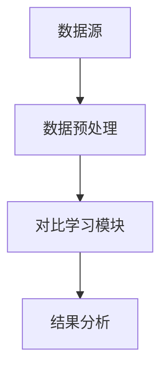

                 

# 金融领域对比学习在资产相似性度量中的应用

**关键词：** 对比学习、资产相似性、金融分析、机器学习、风险管理

**摘要：**  
本文探讨对比学习在金融领域资产相似性度量中的应用，分析其优势、原理及实际案例，为金融资产分析提供新视角。

---

## 第一部分：对比学习基础

### 第1章：对比学习的基本概念与背景

#### 1.1 对比学习的定义与核心思想
- 对比学习通过对比正样本和负样本，提升模型区分能力。
- 核心思想是通过比较不同数据点，增强模型对特征的提取能力。

#### 1.2 金融领域中的对比学习
- 金融数据的复杂性和噪声使得对比学习成为有效的工具。
- 对比学习帮助识别资产间的相似性，优化投资组合和风险管理。

### 第2章：资产相似性度量的传统方法

#### 2.1 资产相似性度量的背景
- 资产组合管理、风险管理等领域需要相似性分析。
- 传统方法包括统计方法、距离方法和机器学习方法。

#### 2.2 对比学习在资产相似性度量中的优势
- 更强的区分能力，适应金融数据的复杂性。
- 提高模型的鲁棒性和可解释性。

---

## 第二部分：对比学习的核心概念与原理

### 第3章：对比学习的核心概念与原理

#### 3.1 对比学习的核心概念
- 对比函数：衡量正样本和负样本的相似性。
- 数据对齐：使不同数据点在特征空间中对齐。
- 对比损失函数：衡量模型对齐效果的损失函数。

#### 3.2 对比学习的数学模型与公式
- 对比损失函数公式：  
  $$\mathcal{L}(x_i, x_j) = -\log\left(\frac{e^{f(x_i,x_j)}}{e^{f(x_i,x_k)} + e^{f(x_j,x_k)}}\right)$$  
  其中，$f(x_i, x_j)$表示正样本的相似性，$f(x_i, x_k)$表示负样本的相似性。

### 第4章：对比学习在金融资产中的应用

#### 4.1 金融资产的特征与数据类型
- 股票、债券、基金等资产的特征。
- 金融时间序列数据的特性，如波动性和周期性。

#### 4.2 对比学习的具体应用
- 股票相似性分析：识别具有相似价格走势的股票。
- 风险管理中的应用：识别高风险资产组合。

---

## 第三部分：系统架构与实现

### 第5章：系统架构设计

#### 5.1 系统功能模块划分
- 数据预处理模块：清洗和转换金融数据。
- 对比学习模块：实现对比学习算法。
- 结果分析模块：解读相似性结果。

#### 5.2 系统架构图

### 第6章：算法实现

#### 6.1 数据预处理
- 使用Python对金融数据进行清洗和标准化。

#### 6.2 对比编码器的设计
- 使用深度学习模型（如神经网络）提取特征。

#### 6.3 对比损失的计算与优化
- 编写Python代码实现对比损失函数。

---

## 第四部分：项目实战与案例分析

### 第7章：项目实战

#### 7.1 环境安装
- 安装必要的库：TensorFlow、Keras、Pandas。

#### 7.2 代码实现
- 编写对比学习模型的训练代码。

#### 7.3 案例分析
- 分析股票数据，识别相似资产。

### 第8章：结果分析与解读
- 解释相似性结果，优化投资组合。

---

## 第五部分：总结与展望

### 第9章：总结

#### 9.1 对比学习的优势
- 提高资产相似性分析的准确性。
- 增强模型的鲁棒性和可解释性。

### 第10章：未来研究方向

#### 10.1 对比学习的优化
- 提高模型的泛化能力。

#### 10.2 多模态数据的应用
- 结合文本和其他数据源进行分析。

---

## 作者信息

作者：AI天才研究院/AI Genius Institute & 禅与计算机程序设计艺术 /Zen And The Art of Computer Programming

---

这篇文章详细探讨了对比学习在金融资产相似性度量中的应用，从基础理论到实际案例，为读者提供了全面的视角。希望对您有所帮助！

