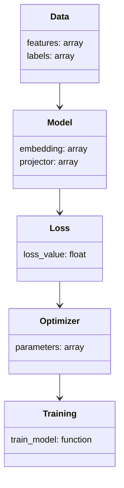
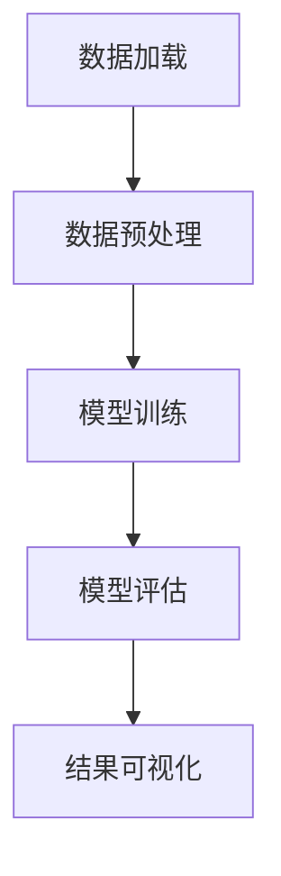
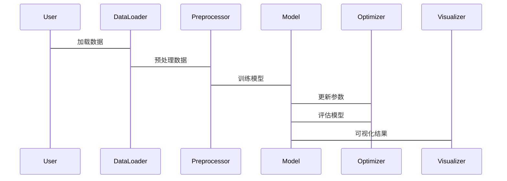

                 


---

# 《金融领域对比学习的探索与实践》

> **关键词**：对比学习、金融领域、机器学习、深度学习、特征学习

> **摘要**：本文从对比学习的基本概念出发，结合金融领域的实际需求，探讨对比学习在金融数据分析中的应用。通过详细分析对比学习的核心原理、算法实现、系统架构以及实际案例，揭示对比学习在金融领域的优势与挑战。同时，本文还总结了对比学习在金融领域的最佳实践和未来发展方向，为读者提供全面的理论与实践指导。

---

## 第1章: 对比学习的基本概念与背景

### 1.1 对比学习的定义与核心思想

#### 1.1.1 对比学习的基本概念
对比学习（Contrastive Learning）是一种通过比较不同数据点或数据集之间的差异来学习特征表示的方法。其核心思想是通过最大化相似数据点之间的相似性，同时最小化不相似数据点之间的相似性，从而提取出具有区分性的特征。

对比学习的关键在于设计一个对比目标函数，该函数能够度量两个数据点之间的相似性，并通过优化该函数来学习数据的表示。

#### 1.1.2 对比学习的核心思想
对比学习的核心思想可以总结为以下两点：
1. **最大化相似性**：对于相似的数据点，希望它们的表示尽可能接近。
2. **最小化不相似性**：对于不相似的数据点，希望它们的表示尽可能分开。

这种思想与传统的监督学习和无监督学习有所不同，对比学习通过引入对比目标函数，能够在一定程度上利用标签信息或领域知识来指导特征学习。

#### 1.1.3 对比学习与传统机器学习的对比
以下是对比学习与传统机器学习方法的对比表格：

| **方法**       | **数据需求** | **目标函数**                | **应用场景**               |
|----------------|--------------|-----------------------------|----------------------------|
| 监督学习         | 需要标签     | 基于标签的损失函数           | 分类、回归等                 |
| 无监督学习       | 不需要标签   | 基于数据相似性的损失函数      | 聚类、降维等                 |
| 对比学习         | 部分利用标签或领域知识 | 对比目标函数               | 特征学习、分类、推荐等       |

### 1.2 对比学习在金融领域的应用背景

#### 1.2.1 金融领域的数据分析挑战
金融领域的数据分析面临以下挑战：
1. **数据多样性**：金融数据通常具有复杂的结构，包括时间序列数据、文本数据、数值数据等。
2. **数据稀疏性**：某些金融场景（如小样本情况）下，数据量较少，难以直接应用监督学习方法。
3. **数据噪声**：金融数据中可能存在噪声，如市场波动、突发事件等。

#### 1.2.2 对比学习在金融数据中的优势
对比学习在金融数据中的优势体现在以下几个方面：
1. **特征学习能力**：对比学习能够通过对比目标函数提取出具有区分性的特征，适用于金融领域的分类和预测任务。
2. **小样本适应性**：对比学习可以通过数据增强和对比目标函数的设计，在小样本情况下依然能够学习到有效的特征表示。
3. **领域知识利用**：对比学习可以通过引入领域知识（如金融市场的相似性）来设计对比目标函数，从而提高模型的性能。

#### 1.2.3 金融领域对比学习的典型场景
以下是对比学习在金融领域的典型应用场景：
1. **股票价格预测**：通过对比学习提取股票的相似特征，帮助预测股票价格的变化趋势。
2. **金融事件分类**：通过对金融事件进行对比学习，分类不同类型的金融事件。
3. **客户画像构建**：通过对比学习提取客户特征，构建客户画像，用于客户分群和精准营销。

### 1.3 本章小结
本章从对比学习的基本概念出发，分析了对比学习在金融领域的应用背景和优势，为后续章节奠定了基础。

---

## 第2章: 金融领域对比学习的核心概念

### 2.1 对比学习的核心原理

#### 2.1.1 数据表示与对比目标函数
数据表示是对比学习的核心，通过对数据进行编码，将其映射到一个低维的特征空间。对比目标函数用于度量两个数据点之间的相似性，并通过优化该函数来学习特征表示。

对比目标函数可以表示为：
$$ L = -\frac{1}{N}\sum_{i=1}^{N} [\log p(x_i, y_i) + \log p(x_i, y_{neg})] $$
其中，$x_i$ 表示第 $i$ 个数据点，$y_i$ 和 $y_{neg}$ 分别表示正样本和负样本的标签。

#### 2.1.2 对比学习的损失函数
对比学习的损失函数通常由两部分组成：正样本损失和负样本损失。正样本损失用于最大化相似数据点之间的相似性，负样本损失用于最小化不相似数据点之间的相似性。

#### 2.1.3 对比学习的训练过程
对比学习的训练过程可以分为以下几个步骤：
1. 数据增强：对数据进行变换，生成正样本和负样本。
2. 特征编码：将数据映射到特征空间。
3. 对比目标函数优化：通过优化对比目标函数，学习特征表示。

#### 2.1.4 对比学习的核心属性
对比学习的核心属性包括：
1. **对称性**：对比学习的目标函数是对称的，即 $p(x_i, y_i) = p(y_i, x_i)$。
2. **可解释性**：对比学习的特征表示具有一定的可解释性，可以通过分析特征的重要性来理解模型的决策过程。

#### 2.1.5 对比学习的对比特性
对比学习的对比特性体现在以下几个方面：
1. **特征分离性**：通过对比学习，相似数据点的特征表示会更接近，不相似数据点的特征表示会更分开。
2. **鲁棒性**：对比学习能够一定程度上抵抗数据噪声和干扰。

### 2.2 金融领域对比学习的关键特征

#### 2.2.1 数据特征的多样性
金融数据通常具有多样性，包括时间序列数据、文本数据、数值数据等。对比学习可以通过设计不同的数据增强方法来处理不同类型的数据。

#### 2.2.2 对比目标的金融属性
对比学习在金融领域的目标函数需要考虑金融数据的特殊性，例如金融市场的波动性、交易时间序列的特性等。

#### 2.2.3 对比学习在金融中的边界与外延
对比学习在金融中的边界与外延主要体现在以下几个方面：
1. **边界**：对比学习在金融领域的应用需要考虑金融市场的独特性，例如金融数据的时间依赖性、市场波动性等。
2. **外延**：对比学习的金融应用可以扩展到其他领域，例如经济预测、风险管理等。

#### 2.2.4 对比学习与其他学习方法的对比
以下是对比学习与传统机器学习方法的对比表格：

| **方法**       | **优势**                          | **劣势**                          |
|----------------|-----------------------------------|-----------------------------------|
| 对比学习         | 能够提取区分性特征，适用于小样本 | 对比目标函数的设计依赖领域知识    |
| 监督学习         | 分类性能高，适合有标签数据        | 需要大量标注数据，难以应用于小样本 |
| 无监督学习       | 适用于无标签数据                  | 分类性能较低，难以直接用于分类任务 |

### 2.3 本章小结
本章详细讲解了对比学习的核心原理和在金融领域的关键特征，为后续章节的算法实现和系统设计奠定了基础。

---

## 第3章: 对比学习的算法原理

### 3.1 对比学习的算法框架

#### 3.1.1 对比损失函数的定义
对比损失函数用于度量两个数据点之间的相似性，通常采用以下形式：
$$ L = -\frac{1}{N}\sum_{i=1}^{N} [\log p(x_i, y_i) + \log p(x_i, y_{neg})] $$
其中，$x_i$ 表示第 $i$ 个数据点，$y_i$ 和 $y_{neg}$ 分别表示正样本和负样本的标签。

#### 3.1.2 对比学习的网络结构
对比学习的网络结构通常包括以下几个部分：
1. **编码器**：将数据映射到特征空间。
2. **投影头**：对特征进行非线性变换，得到对比特征。
3. **损失函数**：计算对比损失。

#### 3.1.3 对比学习的训练流程
对比学习的训练流程可以分为以下几个步骤：
1. 数据增强：对数据进行变换，生成正样本和负样本。
2. 特征编码：将数据映射到特征空间。
3. 对比目标函数优化：通过优化对比目标函数，学习特征表示。

### 3.2 对比学习的数学模型

#### 3.2.1 对比损失函数的数学表达式
对比损失函数可以表示为：
$$ L = -\frac{1}{N}\sum_{i=1}^{N} [\log p(x_i, y_i) + \log p(x_i, y_{neg})] $$
其中，$p(x_i, y_i)$ 表示正样本的相似性概率，$p(x_i, y_{neg})$ 表示负样本的相似性概率。

#### 3.2.2 对比学习的相似性度量
对比学习的相似性度量通常采用余弦相似性或欧氏距离。余弦相似性用于度量两个向量之间的夹角，而欧氏距离用于度量两个向量之间的距离。

### 3.3 对比学习的实现代码

#### 3.3.1 数据加载与预处理
```python
import torch
import numpy as np

# 加载数据集
def load_data():
    # 假设我们有一个金融数据集，包含特征和标签
    X = np.random.randn(1000, 10)  # 特征矩阵
    y = np.random.randint(0, 2, 1000)  # 标签
    return X, y

X, y = load_data()
```

#### 3.3.2 对比学习模型的实现
```python
class ContrastiveModel(torch.nn.Module):
    def __init__(self, embedding_dim):
        super(ContrastiveModel, self).__init__()
        self.embedding = torch.nn.Linear(10, embedding_dim)
        self.projector = torch.nn.Linear(embedding_dim, embedding_dim)

    def forward(self, x):
        x = self.embedding(x)
        x = self.projector(x)
        return x

model = ContrastiveModel(128)
```

#### 3.3.3 对比学习的损失函数
```python
def contrastive_loss(x, y, margin=0.5):
    # 计算余弦相似性
    cosine = (x @ y.T) / (torch.norm(x, dim=1).unsqueeze(1) * torch.norm(y, dim=1).unsqueeze(0))
    cosine = torch.clamp(cosine, -1.0, 1.0)
    # 计算损失
    loss = 0.5 * (1 - cosine)
    return loss.mean()

optimizer = torch.optim.Adam(model.parameters(), lr=1e-3)
```

### 3.4 本章小结
本章详细讲解了对比学习的算法原理和数学模型，并通过代码示例展示了对比学习的实现过程。

---

## 第4章: 系统分析与架构设计

### 4.1 系统分析

#### 4.1.1 项目背景
我们假设一个金融公司希望通过对比学习技术来提升其金融数据分析能力，例如股票价格预测、客户画像构建等。

#### 4.1.2 系统功能设计
系统的功能需求包括：
1. 数据加载与预处理
2. 对比学习模型训练
3. 模型预测与评估
4. 结果可视化与分析

#### 4.1.3 领域模型设计
以下是领域模型的类图（使用 mermaid）：



### 4.2 系统架构设计

#### 4.2.1 系统架构设计
以下是系统的架构图（使用 mermaid）：



#### 4.2.2 系统接口设计
系统的接口设计包括：
1. 数据接口：加载和预处理数据
2. 模型接口：训练和预测模型
3. 结果接口：可视化和分析结果

#### 4.2.3 系统交互设计
以下是系统的交互序列图（使用 mermaid）：



### 4.3 本章小结
本章详细讲解了系统的分析与架构设计，为后续章节的项目实现提供了指导。

---

## 第5章: 项目实战

### 5.1 环境安装与配置

#### 5.1.1 安装依赖
```bash
pip install numpy torch matplotlib
```

#### 5.1.2 配置环境
```bash
conda create -n contrastive_learning python=3.8
conda activate contrastive_learning
```

### 5.2 核心代码实现

#### 5.2.1 数据加载与预处理
```python
import torch
import numpy as np
import matplotlib.pyplot as plt

# 加载数据集
def load_data():
    X = np.random.randn(1000, 10)  # 特征矩阵
    y = np.random.randint(0, 2, 1000)  # 标签
    return X, y

X, y = load_data()
```

#### 5.2.2 对比学习模型实现
```python
class ContrastiveModel(torch.nn.Module):
    def __init__(self, embedding_dim):
        super(ContrastiveModel, self).__init__()
        self.embedding = torch.nn.Linear(10, embedding_dim)
        self.projector = torch.nn.Linear(embedding_dim, embedding_dim)

    def forward(self, x):
        x = self.embedding(x)
        x = self.projector(x)
        return x

model = ContrastiveModel(128)
```

#### 5.2.3 对比学习损失函数实现
```python
def contrastive_loss(x, y, margin=0.5):
    cosine = (x @ y.T) / (torch.norm(x, dim=1).unsqueeze(1) * torch.norm(y, dim=1).unsqueeze(0))
    cosine = torch.clamp(cosine, -1.0, 1.0)
    loss = 0.5 * (1 - cosine)
    return loss.mean()

optimizer = torch.optim.Adam(model.parameters(), lr=1e-3)
```

#### 5.2.4 模型训练与评估
```python
def train_model(model, optimizer, X, y, epochs=100):
    for epoch in range(epochs):
        optimizer.zero_grad()
        embeddings = model(X)
        loss = contrastive_loss(embeddings, y)
        loss.backward()
        optimizer.step()
        print(f"Epoch {epoch+1}/{epochs}, Loss: {loss.item()}")

train_model(model, optimizer, X, y, epochs=100)
```

#### 5.2.5 结果可视化
```python
def visualize_embeddings(embeddings, y):
    plt.scatter(embeddings[:, 0], embeddings[:, 1], c=y, cmap='viridis')
    plt.colorbar()
    plt.show()

visualize_embeddings(model(X).detach().numpy(), y)
```

### 5.3 项目小结
本章通过实际案例展示了对比学习在金融领域的应用，详细讲解了项目的实现过程，并通过可视化展示了模型的特征表示。

---

## 第6章: 最佳实践与未来展望

### 6.1 最佳实践

#### 6.1.1 数据预处理的重要性
数据预处理是对比学习成功的关键，建议在实际应用中对数据进行归一化、降维等处理。

#### 6.1.2 模型调优的建议
建议在对比学习中进行超参数调优，例如学习率、嵌入维度等。

#### 6.1.3 对比学习的可解释性
对比学习的特征表示具有一定的可解释性，可以通过分析特征的重要性来理解模型的决策过程。

### 6.2 未来展望

#### 6.2.1 对比学习的优化方向
对比学习在金融领域的优化方向包括：
1. **多模态数据处理**：结合文本、图像等多种数据模态，提升模型的表达能力。
2. **实时性优化**：通过优化模型的训练效率，提升模型的实时性。

#### 6.2.2 对比学习的扩展应用
对比学习在金融领域的扩展应用包括：
1. **风险管理**：通过对比学习识别风险因素，优化风险控制策略。
2. **智能投顾**：通过对比学习构建智能投资顾问系统，为投资者提供个性化建议。

### 6.3 本章小结
本章总结了对比学习在金融领域的最佳实践，并展望了对比学习的未来发展方向。

---

## 附录

### 附录 A: 对比学习相关工具与库

- **PyTorch**：深度学习框架，支持对比学习的实现。
- **TensorFlow**：深度学习框架，支持对比学习的实现。
- **Scikit-learn**：机器学习库，提供多种特征提取和模型评估工具。

### 附录 B: 对比学习相关论文

1. **"Deep Learning for Financial Time Series"**：探讨深度学习在金融时间序列分析中的应用。
2. **"Contrastive Learning: A Review and Beyond"**：综述对比学习的最新进展和应用。

---

**作者：AI天才研究院/AI Genius Institute & 禅与计算机程序设计艺术 /Zen And The Art of Computer Programming**

