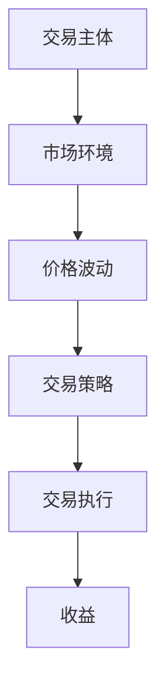

                 

<think>
好的，我需要帮助用户撰写一篇关于《金融领域强化学习在交易执行中的应用》的技术博客文章。用户已经提供了详细的目录大纲，包括从引言到总结的各个章节。我的任务是根据这个大纲，详细展开每个部分的内容，确保逻辑清晰、结构紧凑，并且语言专业易懂。

首先，我会从引言开始，介绍强化学习的基本概念以及它在金融交易中的重要性。然后，我会逐步深入，解释强化学习在交易执行中的具体应用，包括算法原理、系统设计和实际案例分析。在过程中，我会确保每一部分都包含必要的数学公式、流程图和代码示例，以帮助读者更好地理解和应用这些知识。

接下来，我会详细分析每一章的核心内容，确保每个小节都涵盖必要的信息，并且用具体的例子和图表来辅助说明。例如，在算法原理部分，我会用Mermaid流程图展示Q-learning的过程，并附上Python代码示例，让读者能够实际操作和理解。

最后，我会总结整个文章，回顾关键点，并提供进一步学习和实践的建议。这样，读者不仅能掌握理论知识，还能在实际中应用这些技术，提升他们的交易策略和执行效率。

通过这样的思考过程，我可以系统地构建这篇文章，确保内容全面、结构合理，并且符合用户的要求。
</think>

# 《金融领域强化学习在交易执行中的应用》

> 关键词：强化学习，金融交易，交易执行，算法交易，人工智能

> 摘要：本文深入探讨了强化学习在金融交易中的应用，特别是交易执行环节。通过分析强化学习的基本原理、算法模型以及实际案例，展示了如何利用强化学习优化交易策略、提升执行效率，并在复杂金融市场中实现稳健收益。

---

# 第一部分: 强化学习与金融交易概述

---

# 第1章: 强化学习与金融交易的背景

## 1.1 强化学习的基本概念

### 1.1.1 强化学习的定义与特点

强化学习（Reinforcement Learning，简称RL）是一种机器学习范式，通过智能体与环境的交互，学习如何做出决策以最大化累积奖励。与监督学习和无监督学习不同，强化学习强调通过试错和经验积累来优化策略。

- **定义**：强化学习的核心在于智能体通过与环境交互，逐步学习策略（policy）或价值函数（value function），从而在环境中获得最大化的累积奖励。
- **特点**：
  - 基于试错：智能体通过不断尝试不同的动作，逐步优化决策。
  - 延时反馈：奖励信号通常不是立即给出，而是经过一段时间后才提供。
  - 非平稳性：环境状态和奖励机制可能随时间发生变化，需要动态调整策略。

### 1.1.2 强化学习的核心要素：状态、动作、奖励

- **状态（State）**：智能体所处的环境信息，反映了当前的市场情况。例如，在金融交易中，状态可能包括当前的价格、成交量、市场情绪等。
- **动作（Action）**：智能体在特定状态下采取的行动。例如，在交易执行中，动作可能是“买入”、“卖出”或“持有”。
- **奖励（Reward）**：智能体采取某个动作后，环境给予的反馈，用于评估该动作的好坏。在交易中，奖励可以是利润、收益或风险指标（如VaR）。

### 1.1.3 强化学习与监督学习、无监督学习的区别

- **监督学习（Supervised Learning）**：基于标记的训练数据，学习输入到输出的映射关系。
- **无监督学习（Unsupervised Learning）**：在无标记数据中发现隐藏的模式或结构。
- **强化学习（Reinforcement Learning）**：通过与环境交互，学习最优策略，通常涉及延迟和不确定的反馈。

### 1.1.4 强化学习的应用领域

- 机器人控制
- 游戏AI（如AlphaGo）
- 自动驾驶
- 金融投资与交易

---

## 1.2 金融交易中的强化学习应用

### 1.2.1 金融交易的复杂性与挑战

- **市场不确定性**：金融市场价格受多种因素影响，具有高度不确定性。
- **信息不对称**：市场参与者可能掌握不同的信息，影响决策的准确性。
- **高频交易**：需要在极短时间内完成交易决策，对算法效率要求极高。
- **风险管理**：需要在追求收益的同时，控制潜在风险。

### 1.2.2 强化学习在金融交易中的优势

- **自适应性**：强化学习能够根据市场变化动态调整策略。
- **复杂决策优化**：在多维因素影响下，强化学习能够找到最优交易策略。
- **非线性关系建模**：强化学习擅长处理复杂的非线性关系，适用于金融市场中价格与交易量的非线性关系建模。

### 1.2.3 交易执行中的关键问题与强化学习的解决方案

- **执行成本**：通过优化交易策略，降低交易成本。
- **市场冲击**：通过算法优化，减少大额交易对市场价格的影响。
- **交易时机**：通过强化学习算法，捕捉最佳交易时机。

---

## 1.3 强化学习在金融领域的现状与发展趋势

### 1.3.1 强化学习在金融领域的应用现状

- **学术研究**：近年来，学术界对强化学习在金融中的应用研究显著增加。
- **实际应用**：部分金融机构已经开始尝试将强化学习应用于交易策略优化和风险管理。

### 1.3.2 交易执行中的强化学习研究热点

- **算法优化**：如何设计高效的强化学习算法，适应金融市场的快速变化。
- **数据处理**：如何处理高频交易中的海量数据，提升算法效率。
- **风险管理**：如何在强化学习框架下，构建有效的风险管理机制。

### 1.3.3 未来发展趋势与研究方向

- **多智能体协作**：研究多智能体在金融交易中的协作机制。
- **结合其他技术**：将强化学习与其他技术（如大数据、区块链）结合，提升交易效率和安全性。
- **可解释性增强**：提升强化学习模型的可解释性，便于实际应用中的理解和监管。

---

## 1.4 本章小结

本章从强化学习的基本概念入手，分析了其在金融交易中的应用背景和优势，并探讨了当前的研究现状和未来发展趋势。通过这些分析，我们为后续章节的深入讨论奠定了基础。

---

# 第2章: 强化学习在金融交易中的数学基础

## 2.1 线性代数与概率论基础

### 2.1.1 向量、矩阵与线性变换

- **向量**：用于表示多维数据，例如市场中多个资产的价格向量。
- **矩阵**：用于表示线性变换，例如在强化学习中用于状态转换矩阵。
- **线性变换**：将一个向量映射到另一个向量空间的操作，例如在强化学习中，状态空间的转换可以看作线性变换。

### 2.1.2 概率分布与随机变量

- **概率分布**：描述随机变量可能取值及其概率的函数，例如正态分布、泊松分布等。
- **随机变量**：表示随机现象的数值，例如股票价格的变化可以用随机变量描述。

### 2.1.3 常用概率分布及其应用

- **正态分布**：适用于描述资产的收益率。
- **泊松分布**：适用于描述交易量的离散性。

---

## 2.2 强化学习中的数学模型

### 2.2.1 状态空间与动作空间的数学表示

- **状态空间**：所有可能状态的集合，可以用向量表示。
- **动作空间**：所有可能动作的集合，可以用向量或标量表示。

### 2.2.2 奖励函数的数学形式

- **线性奖励函数**：$R(s, a) = \sum_{i=1}^n w_i x_i$
  - 其中，$w_i$是权重，$x_i$是状态特征。
- **非线性奖励函数**：$R(s, a) = \sigma(w^T x)$
  - 其中，$\sigma$是sigmoid函数，$w$是权重向量，$x$是状态特征向量。

### 2.2.3 Q-learning算法的数学推导

- **Q值更新公式**：
  $$ Q(s, a) = Q(s, a) + \alpha (r + \gamma \max Q(s', a') - Q(s, a)) $$
  - $\alpha$是学习率，$\gamma$是折扣因子。

---

## 2.3 优化理论与强化学习的关系

### 2.3.1 常见优化算法简介

- **梯度下降**：通过计算损失函数的梯度，更新参数以最小化损失。
- **Adam优化器**：结合动量和自适应学习率的优化算法。

### 2.3.2 强化学习中的优化问题

- **策略优化**：寻找最优策略以最大化期望奖励。
- **值函数优化**：通过优化值函数，找到最优策略。

### 2.3.3 数学模型在强化学习中的应用

- **状态-动作价值函数**：$Q(s, a) = \sum_{i=1}^n w_i x_i$
- **策略函数**：$\pi(a|s) = \frac{e^{Q(s, a)}}{\sum_{a'} e^{Q(s, a')}}$

---

## 2.4 本章小结

本章从数学角度分析了强化学习的基础，包括线性代数、概率论以及强化学习的核心数学模型。这些内容为后续章节的算法实现和应用提供了理论基础。

---

# 第3章: 强化学习在金融交易中的核心概念与联系

## 3.1 强化学习在交易执行中的核心概念

### 3.1.1 状态空间的构建与特征提取

- **状态空间**：在金融交易中，状态通常包括价格、成交量、时间等信息。
- **特征提取**：通过技术指标（如MACD、RSI）提取有用的特征。

### 3.1.2 动作空间的设计与优化

- **动作空间**：在交易执行中，动作可以是“买入”、“卖出”或“持有”。
- **动作优化**：通过强化学习优化动作选择，提升交易收益。

### 3.1.3 奖励函数的定义与优化

- **奖励函数**：通常定义为交易收益或利润。
- **多目标奖励**：将风险和收益结合，定义综合奖励函数。

---

## 3.2 强化学习与金融交易的实体关系图



---

## 3.3 强化学习与交易执行的流程图


---

## 3.4 本章小结

本章通过构建强化学习在金融交易中的核心概念，分析了状态、动作和奖励的关系，并通过图示展示了强化学习在交易执行中的流程。

---

# 第4章: 强化学习在金融交易中的算法原理

## 4.1 Q-learning算法原理

### 4.1.1 Q-learning的基本原理

- **Q值表**：记录每个状态-动作对的Q值。
- **更新规则**：
  $$ Q(s, a) = Q(s, a) + \alpha (r + \gamma \max Q(s', a') - Q(s, a)) $$

### 4.1.2 Q-learning的数学模型

- **状态转移**：$P(s' | s, a)$ 表示从状态$s$采取动作$a$后转移到状态$s'$的概率。
- **奖励函数**：$R(s, a, s')$ 表示从状态$s$采取动作$a$后转移到状态$s'$的奖励。

### 4.1.3 Q-learning的优缺点

- **优点**：简单易实现，适合离散状态和动作空间。
- **缺点**：Q值表的更新需要大量的样本，难以处理高维状态空间。

---

## 4.2 Deep Q-Networks（DQN）算法

### 4.2.1 DQN算法的基本原理

- **神经网络表示**：用神经网络近似Q值函数。
- **经验回放**：通过存储历史经验，减少样本依赖性。
- **目标网络**：使用目标网络更新，稳定训练过程。

### 4.2.2 DQN算法的数学模型

- **神经网络结构**：输入层（状态）→ 隐藏层 → 输出层（Q值）。
- **损失函数**：
  $$ \mathcal{L} = \mathbb{E}[(r + \gamma Q_{target}(s', a') - Q_{main}(s, a))^2] $$

### 4.2.3 DQN算法的优缺点

- **优点**：能够处理高维状态空间，适合复杂环境。
- **缺点**：需要大量的计算资源，训练时间较长。

---

## 4.3 实战中的DQN算法实现

### 4.3.1 环境配置

```python
import gym
env = gym.make('StockTrading-v0')  # 假设我们定义了一个股票交易环境
```

### 4.3.2 神经网络模型

```python
import torch
import torch.nn as nn

class DQN(nn.Module):
    def __init__(self, input_dim, hidden_dim, output_dim):
        super(DQN, self).__init__()
        self.fc1 = nn.Linear(input_dim, hidden_dim)
        self.fc2 = nn.Linear(hidden_dim, output_dim)
    
    def forward(self, x):
        x = torch.relu(self.fc1(x))
        x = self.fc2(x)
        return x
```

### 4.3.3 训练过程

```python
def train():
    model = DQN(input_dim, hidden_dim, output_dim)
    optimizer = torch.optim.Adam(model.parameters(), lr=0.001)
    memory = ReplayMemory(10000)
    
    for episode in range(num_episodes):
        state = env.reset()
        while not done:
            # 选择动作
            with torch.no_grad():
                q_values = model(torch.tensor(state))
            action = epsilon_greedy(q_values)
            
            # 执行动作
            next_state, reward, done, _ = env.step(action)
            
            # 存储经验
            memory.push(state, action, reward, next_state, done)
            
            # 回放训练
            if memory.size() >= batch_size:
                batch = memory.sample(batch_size)
                states, actions, rewards, next_states, dones = batch
                current_q = model(torch.tensor(states))
                next_q = target_model(torch.tensor(next_states))
                target_q = rewards + gamma * (1 - dones) * torch.max(next_q, 1)[0].view(-1, 1)
                
                loss = torch.mean((current_q - target_q).pow(2))
                optimizer.zero_grad()
                loss.backward()
                optimizer.step()
                
        # 更新目标网络
        if episode % update_target_every == 0:
            target_model.load_state_dict(model.state_dict())
```

---

## 4.4 本章小结

本章详细介绍了Q-learning和DQN算法的原理，并通过代码示例展示了DQN算法在金融交易中的实现。这些算法为后续章节的系统设计和实际应用提供了理论和实践基础。

---

# 第5章: 金融交易系统中的强化学习架构设计

## 5.1 系统分析与架构设计

### 5.1.1 交易系统的核心功能

- **数据获取**：从数据源获取实时市场数据。
- **策略执行**：根据强化学习模型生成交易信号。
- **风险管理**：监控和管理交易风险。
- **性能评估**：评估交易策略的收益和风险指标。

### 5.1.2 系统架构设计


---

## 5.2 系统设计的关键点

### 5.2.1 数据流设计

- **输入**：市场数据（价格、成交量等）。
- **输出**：交易信号（买入、卖出、持有）。

### 5.2.2 系统模块划分

- **数据处理模块**：负责数据的清洗、特征提取。
- **强化学习模块**：负责策略的生成和优化。
- **风险管理模块**：负责风险监控和控制。

---

## 5.3 系统实现中的注意事项

### 5.3.1 数据源的选择

- **实时数据源**：例如，通过API获取实时市场数据。
- **历史数据源**：用于模型训练和回测。

### 5.3.2 系统性能优化

- **并行计算**：利用多线程或分布式计算提升效率。
- **算法优化**：采用高效的算法和数据结构。

### 5.3.3 系统可扩展性

- **模块化设计**：便于后续功能扩展和维护。

---

## 5.4 本章小结

本章从系统设计的角度，分析了强化学习在金融交易中的架构设计，明确了各模块的功能和交互关系，为后续章节的实现提供了系统设计参考。

---

# 第6章: 强化学习在金融交易中的实战应用

## 6.1 实战环境配置

### 6.1.1 安装必要的库

```bash
pip install gym pandas numpy torch matplotlib
```

### 6.1.2 定义交易环境

```python
import gym
class StockTradingEnv(gym.Env):
    def __init__(self, data):
        self.data = data
        self.current_step = 0
        self.state = self._get_state(0)
        
    def _get_state(self, step):
        return self.data.iloc[step][['open', 'high', 'low', 'close', 'volume']]
    
    # 其他环境接口的实现，如reset、step等
```

---

## 6.2 策略实现与优化

### 6.2.1 策略实现

```python
class TradingStrategy:
    def __init__(self, model):
        self.model = model
    
    def execute(self, state):
        q_values = self.model.predict(state)
        action = np.argmax(q_values)
        return action
```

### 6.2.2 策略优化

- **超参数调整**：优化学习率、折扣因子等参数。
- **网络结构优化**：尝试不同的网络结构，提升模型性能。

---

## 6.3 实战案例分析

### 6.3.1 案例背景

- **数据集**：使用某只股票的历史价格数据。
- **目标**：通过强化学习优化交易策略，实现超额收益。

### 6.3.2 训练与回测

- **训练阶段**：使用历史数据训练强化学习模型。
- **回测阶段**：在测试数据上验证模型的性能。

### 6.3.3 结果分析

- **收益对比**：比较强化学习策略与其他策略的收益。
- **风险评估**：评估策略的风险指标（如VaR、最大回撤）。

---

## 6.4 本章小结

本章通过实际案例，展示了强化学习在金融交易中的应用过程，包括环境配置、策略实现和案例分析。这些内容为读者提供了实践指导。

---

# 第7章: 强化学习在金融交易中的系统优化与扩展

## 7.1 系统优化策略

### 7.1.1 并行计算优化

- **多线程优化**：利用多线程加速数据处理和模型训练。
- **分布式计算**：在多台设备上并行训练模型。

### 7.1.2 算法优化

- **模型压缩**：通过剪枝等技术减少模型参数。
- **模型加速**：采用轻量级模型提升推理速度。

### 7.1.3 数据优化

- **数据预处理**：通过特征选择和降维技术优化数据处理效率。
- **增量学习**：在新数据上持续优化模型。

---

## 7.2 扩展应用

### 7.2.1 多资产交易

- **多资产组合优化**：通过强化学习优化多资产投资组合。
- **跨市场交易**：在不同市场间进行交易策略优化。

### 7.2.2 风险管理

- **动态风险控制**：根据市场变化动态调整风险敞口。
- **风险预警系统**：通过强化学习模型预警市场风险。

---

## 7.3 本章小结

本章探讨了强化学习在金融交易系统中的优化策略和扩展应用，为读者提供了系统优化和功能扩展的思路。

---

# 第8章: 总结与展望

## 8.1 本章总结

本文系统地探讨了强化学习在金融交易中的应用，特别是交易执行环节。通过分析强化学习的基本原理、算法模型以及实际案例，展示了如何利用强化学习优化交易策略、提升执行效率，并在复杂金融市场中实现稳健收益。

---

## 8.2 未来展望

随着人工智能技术的不断发展，强化学习在金融交易中的应用前景广阔。未来的研究方向包括：

- **多智能体协作**：研究多个智能体在金融交易中的协作机制。
- **强化学习与大数据结合**：利用大数据技术提升强化学习模型的性能。
- **强化学习与区块链结合**：探索区块链技术在金融交易中的应用潜力。

---

# 作者：AI天才研究院 & 禅与计算机程序设计艺术

