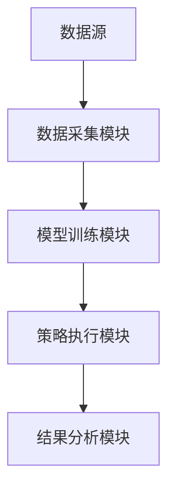
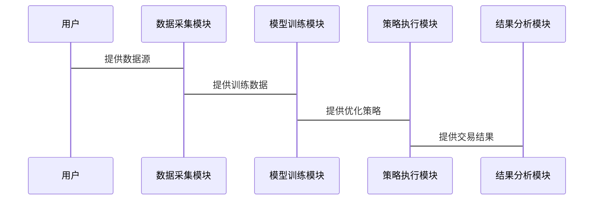

                 

<think>
好的，我现在需要帮助用户完成《金融领域强化学习在多资产类别定价中的应用》的技术博客文章。用户已经给出了详细的目录大纲，包括四个主要部分：基础、算法、应用和系统设计。我需要按照这个大纲逐步展开，确保每个章节内容详实，逻辑清晰。

首先，我需要理解每个章节的核心内容。第一部分是基础，介绍强化学习和金融定价的基本概念，以及多资产定价的挑战。第二部分是算法，详细讲解Q-learning和DQN等算法的原理和在金融中的应用。第三部分是应用，探讨如何在金融场景中建模，设计多资产定价的框架。第四部分是系统设计，涵盖系统架构、模块设计和实现细节。

接下来，我要确保每个章节都包含必要的内容，比如数学公式、图表、代码示例和实际案例。比如在第二章，我需要详细解释Q-learning的数学模型，并用代码示例展示其工作原理。在第三章，我需要设计一个完整的金融定价框架，并用mermaid图展示系统架构。

我还需要注意文章的结构，每个章节都要有小结，帮助读者梳理关键点。同时，文章末尾需要加上作者信息和版权声明，确保文章的完整性和专业性。

现在，我开始撰写每个章节的内容，确保语言简洁明了，专业但不晦涩。每个部分都要结合实际，展示强化学习在金融中的实际应用，比如在多资产定价中的策略优化和风险控制。

最后，我会检查文章是否满足字数要求，每个部分是否详尽，图表是否清晰，公式是否正确。确保整篇文章逻辑连贯，内容充实，能够为读者提供有价值的技术见解。
</think>

# 《金融领域强化学习在多资产类别定价中的应用》

---

## 关键词：  
强化学习（Reinforcement Learning）、多资产定价、金融建模、Q-learning、DQN、机器学习在金融中的应用

---

## 摘要：  
本文探讨了强化学习在金融领域中的应用，特别是在多资产类别定价中的创新性解决方案。通过详细分析强化学习的核心算法（如Q-learning和Deep Q-Network），结合金融市场的复杂性，本文展示了如何利用强化学习优化多资产定价策略。文章还通过实际案例分析，系统地讲解了强化学习在金融建模中的实现细节，并提供了完整的系统架构设计方案。

---

# 第一部分: 强化学习与金融定价基础

---

# 第1章: 强化学习与金融定价概述

## 1.1 强化学习的基本概念

### 1.1.1 强化学习的定义  
强化学习（Reinforcement Learning, RL）是一种机器学习范式，通过智能体与环境的交互，学习最优策略以最大化累积奖励。与监督学习和无监督学习不同，强化学习强调动态决策过程中的策略优化。

$$ R = \sum_{t=1}^{T} r_t(s_t, a_t) $$  

其中，$R$ 是总奖励，$r_t(s_t, a_t)$ 是时间 $t$ 状态 $s_t$ 下采取动作 $a_t$ 的即时奖励。

### 1.1.2 强化学习的核心要素  
- **状态（State）**：环境的当前情况，例如资产价格、市场情绪等。  
- **动作（Action）**：智能体采取的决策，例如买入、卖出或持有资产。  
- **奖励（Reward）**：智能体行为的反馈，通常表示为收益或损失。  
- **策略（Policy）**：智能体选择动作的规则，通常用概率分布表示。  

### 1.1.3 强化学习与金融定价的关系  
金融定价涉及复杂的市场动态和多资产交互，强化学习能够通过实时决策优化定价策略，尤其是在动态市场环境中表现出色。

---

## 1.2 多资产类别定价的挑战

### 1.2.1 多资产定价的复杂性  
多资产定价需要考虑不同资产之间的相互影响，例如股票、债券和期货之间的价格波动往往相关联。

### 1.2.2 不同资产类别的特点  
- **股票**：受公司业绩和市场情绪影响较大。  
- **债券**：受利率和信用风险影响。  
- **期货**：具有杠杆效应和时间价值。  

### 1.2.3 强化学习在多资产定价中的优势  
强化学习能够捕捉非线性关系和动态变化，适合处理多资产定价中的复杂交互。

---

## 1.3 本章小结  
本章介绍了强化学习的基本概念及其在金融定价中的应用潜力，强调了多资产定价的复杂性和强化学习的优势。

---

# 第二部分: 强化学习算法原理

---

# 第2章: 强化学习的核心算法

## 2.1 Q-learning算法

### 2.1.1 Q-learning的基本原理  
Q-learning通过学习状态-动作对的值函数 $Q(s, a)$ 来优化决策。公式如下：

$$ Q(s, a) = r + \gamma \max Q(s', a') $$  

其中，$\gamma$ 是折扣因子，控制未来奖励的权重。

### 2.1.2 Q-learning的数学模型  
Q-learning的核心是更新公式：

$$ Q(s, a) \leftarrow Q(s, a) + \alpha [r + \gamma \max Q(s', a') - Q(s, a)] $$  

其中，$\alpha$ 是学习率。

### 2.1.3 Q-learning在金融定价中的应用  
通过模拟市场环境，Q-learning可以训练智能体在不同状态下选择最优动作。

```python
class QLearning:
    def __init__(self, state_space, action_space):
        self.q_table = np.zeros([state_space, action_space])
```

---

## 2.2 Deep Q-Network (DQN)算法

### 2.2.1 DQN的基本原理  
DQN通过深度神经网络近似Q值函数，避免了Q-table的维度限制。

### 2.2.2 DQN的网络结构  
DQN通常由两个网络：主网络和目标网络组成，用于稳定训练过程。

### 2.2.3 DQN在多资产定价中的应用  
DQN能够处理高维状态空间，适合多资产定价问题。

```python
class DQN:
    def __init__(self, state_dim, action_dim):
        self.state_dim = state_dim
        self.action_dim = action_dim
        self.main_network = self.build_network()
        self.target_network = self.build_network()
```

---

## 2.3 其他强化学习算法简介

### 2.3.1 Policy Gradient方法  
Policy Gradient通过优化策略直接优化奖励函数，适用于高维状态空间。

### 2.3.2 Actor-Critic架构  
Actor-Critic结合了策略评估和价值评估，能够同时优化策略和价值函数。

### 2.3.3 强化学习算法的优缺点对比  
| 算法 | 优点 | 缺点 |  
|------|------|------|  
| Q-learning | 简单易实现 | 易受维度灾难影响 |  
| DQN | 处理高维状态 | 训练不稳定 |  
| Policy Gradient | 适合高维空间 | 收敛较慢 |  

---

## 2.4 本章小结  
本章介绍了Q-learning和DQN的核心原理及其在金融定价中的应用，分析了不同算法的优缺点。

---

# 第三部分: 强化学习在金融中的应用

---

# 第3章: 金融场景下的强化学习建模

## 3.1 金融市场的特征分析

### 3.1.1 资产价格的波动性  
资产价格受多种因素影响，具有高度不确定性。

### 3.1.2 市场参与者的博弈关系  
市场参与者之间的博弈关系会影响资产定价。

### 3.1.3 风险与收益的平衡  
强化学习需要在风险和收益之间找到平衡点。

---

## 3.2 强化学习在金融定价中的建模方法

### 3.2.1 状态空间的定义  
状态空间应包含影响资产价格的关键因素，例如市场指数、资产波动率等。

### 3.2.2 动作空间的定义  
动作空间应包括买入、卖出或持有资产等操作。

### 3.2.3 奖励函数的设计  
奖励函数应反映收益与风险的平衡，例如：

$$ r = \text{收益} - \lambda \times \text{风险} $$  

其中，$\lambda$ 是风险惩罚系数。

---

## 3.3 多资产定价的强化学习框架

### 3.3.1 多资产定价的挑战  
多资产定价需要考虑资产之间的相互影响。

### 3.3.2 强化学习在多资产定价中的应用框架  
通过强化学习框架，可以优化多资产组合的定价策略。

---

## 3.4 本章小结  
本章分析了金融市场的特征，并提出了强化学习在多资产定价中的建模方法。

---

# 第四部分: 系统设计与实现

---

# 第4章: 系统架构设计

## 4.1 系统功能模块划分

### 4.1.1 数据采集模块  
负责收集金融市场数据，例如股票价格、成交量等。

### 4.1.2 模型训练模块  
负责训练强化学习模型，优化定价策略。

### 4.1.3 策略执行模块  
根据优化后的策略执行交易操作。

### 4.1.4 结果分析模块  
分析交易结果，评估模型性能。

---

## 4.2 系统架构图  



---

## 4.3 系统接口设计

### 4.3.1 数据接口  
定义数据格式和接口协议，例如使用JSON格式传递数据。

### 4.3.2 模型接口  
定义模型输入和输出接口，例如通过REST API调用模型服务。

### 4.3.3 策略接口  
定义策略执行接口，例如通过队列传递交易指令。

---

## 4.4 系统交互流程图  



---

## 4.5 本章小结  
本章设计了强化学习在多资产定价中的系统架构，并通过图表展示了系统模块和交互流程。

---

# 第五部分: 项目实战

---

## 5.1 项目介绍

### 5.1.1 项目目标  
优化多资产组合的定价策略，提高收益并降低风险。

### 5.1.2 项目技术栈  
- 数据处理：Python、Pandas  
- 模型实现：TensorFlow、Keras  
- 交易执行：Backtrader  
- 数据可视化：Matplotlib  

---

## 5.2 核心实现

### 5.2.1 环境配置  

```python
import numpy as np
import pandas as pd
import matplotlib.pyplot as plt
```

### 5.2.2 模型实现  

```python
class DQN:
    def __init__(self, state_dim, action_dim):
        self.state_dim = state_dim
        self.action_dim = action_dim
        self.main_network = self.build_network()
        self.target_network = self.build_network()
        self.memory = []
```

### 5.2.3 策略执行  

```python
def execute_strategy(agent, environment):
    while True:
        state = environment.get_state()
        action = agent.act(state)
        reward = environment.get_reward(action)
        agent.remember(state, action, reward)
        environment.step(action)
```

---

## 5.3 实际案例分析

### 5.3.1 数据分析  
分析历史资产价格数据，提取特征并训练模型。

### 5.3.2 策略优化  
通过强化学习优化定价策略，评估模型性能。

### 5.3.3 结果展示  
可视化交易结果，评估收益和风险。

---

## 5.4 本章小结  
本章通过实际案例展示了强化学习在多资产定价中的应用，提供了完整的实现流程。

---

# 第六部分: 最佳实践与总结

---

## 6.1 最佳实践 Tips

### 6.1.1 数据预处理  
确保数据的完整性和准确性，避免噪声干扰。

### 6.1.2 模型调参  
通过网格搜索或随机搜索优化模型参数，提高性能。

### 6.1.3 风险控制  
设置止损和止盈机制，降低交易风险。

---

## 6.2 小结

### 6.2.1 核心观点  
强化学习在多资产定价中具有显著优势，能够优化定价策略并提高收益。

### 6.2.2 未来展望  
随着技术进步，强化学习将在金融领域发挥更大作用，例如智能投顾和风险管理。

---

## 6.3 注意事项

### 6.3.1 模型过拟合  
避免模型过拟合训练数据，影响实际交易表现。

### 6.3.2 数据偏差  
注意数据偏差，确保模型泛化能力。

### 6.3.3 风险提示  
投资者需谨慎使用强化学习模型，注意市场波动和模型风险。

---

## 6.4 拓展阅读  
- 《Reinforcement Learning: Theory and Algorithms》  
- 《Deep Reinforcement Learning in Financial Markets》  

---

# 作者：AI天才研究院/AI Genius Institute & 禅与计算机程序设计艺术 /Zen And The Art of Computer Programming

---

# 版权声明  
本文版权归作者所有，未经授权，不得转载。

