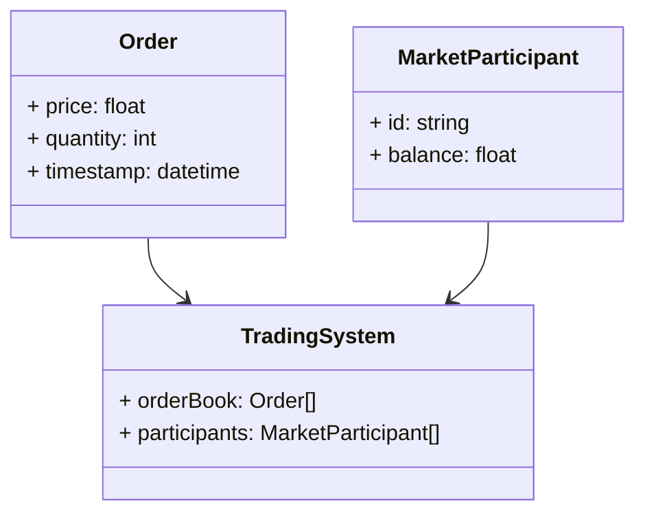
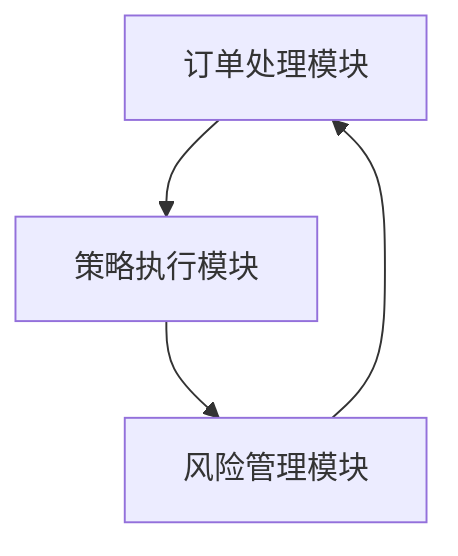
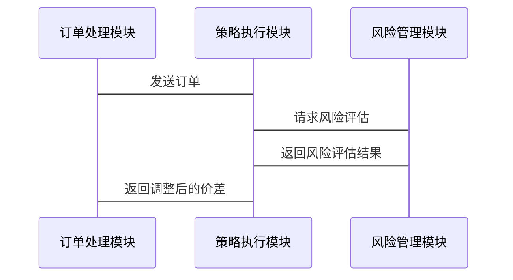

                 


# 《金融领域强化学习在市场做市商策略中的应用》

> 关键词：强化学习，做市商策略，金融市场，Q-learning，Deep Q-Networks，市场微观结构，订单簿分析

> 摘要：本文深入探讨了强化学习在金融市场做市商策略中的应用。通过分析强化学习的基本原理和算法，结合金融市场的特点，提出了一种基于强化学习的做市商策略框架。文章从背景介绍、核心概念、算法实现、系统架构到项目实战，全面阐述了强化学习在做市商策略中的应用，旨在为读者提供一个系统性、深入性的技术指南。

---

# 第一部分: 强化学习与金融市场的基础

## 第1章: 强化学习与做市商策略概述

### 1.1 强化学习的基本概念

#### 1.1.1 强化学习的定义与特点

强化学习（Reinforcement Learning，RL）是一种机器学习范式，通过智能体与环境的交互，学习最优策略以最大化累积奖励。其核心在于通过试错（trial-and-error）过程，智能体在环境中采取行动，获得奖励或惩罚，从而调整策略以优化目标。

强化学习的特点包括：
- **环境依赖性**：智能体的决策依赖于当前所处的环境状态。
- **延迟奖励**：奖励通常不是即时的，而是基于长期的累积效果。
- **策略优化**：通过不断调整策略，找到最优或近似最优的行动方案。

#### 1.1.2 做市商在金融市场中的角色与功能

做市商（Market Maker）是金融市场中的重要参与者，负责提供流动性，即在买卖双方之间撮合交易，确保市场的稳定运行。做市商的主要功能包括：
- **价格制定**：通过买卖报价为市场提供价格。
- **风险管理**：管理市场风险和信用风险。
- **流动性提供**：确保市场在交易时有足够的流动性。

### 1.2 强化学习在金融领域的应用背景

#### 1.2.1 金融市场的复杂性与不确定性

金融市场是一个高度复杂的系统，受到多种因素的影响，包括经济指标、政策变化、市场情绪等。这些因素使得市场的价格走势具有高度的不确定性，传统的基于统计的方法往往难以捕捉市场的动态变化。

#### 1.2.2 做市商策略的挑战与机遇

做市商在金融市场中面临的主要挑战包括：
- **价格波动**：市场的剧烈波动可能导致做市商的损失。
- **流动性风险**：在市场流动性不足时，做市商可能难以迅速平仓。
- **竞争压力**：市场中存在众多做市商，竞争激烈。

然而，这些挑战也为强化学习的应用提供了机遇。通过强化学习，做市商可以动态调整策略，适应市场的变化，提高盈利能力。

### 1.3 强化学习与做市商策略的结合

#### 1.3.1 强化学习在做市商策略中的优势

强化学习在做市商策略中的优势主要体现在以下几个方面：
- **动态适应性**：强化学习能够根据市场的变化动态调整策略。
- **全局优化**：强化学习能够在复杂环境中找到全局最优策略。
- **高效决策**：通过深度学习模型，强化学习可以快速做出决策。

#### 1.3.2 做市商策略的强化学习框架

一个典型的基于强化学习的做市商策略框架包括以下几个部分：
1. **状态空间**：表示市场的当前状态，例如订单簿信息、市场深度等。
2. **动作空间**：表示做市商可以采取的动作，例如调整买卖价差、改变库存水平等。
3. **奖励函数**：定义智能体的奖励机制，例如利润最大化或风险最小化。

### 1.4 本章小结

本章介绍了强化学习的基本概念和做市商在金融市场中的角色，分析了强化学习在做市商策略中的应用背景，提出了基于强化学习的做市商策略框架。

---

## 第2章: 强化学习的核心概念与数学模型

### 2.1 强化学习的基本原理

#### 2.1.1 状态空间与动作空间

**状态空间**（State Space）是智能体所处环境的所有可能状态的集合。在做市商策略中，状态可以包括订单簿信息、市场深度、价格走势等。

**动作空间**（Action Space）是智能体在每个状态下可以采取的所有动作的集合。在做市商策略中，动作可以包括调整买卖价差、改变库存水平等。

#### 2.1.2 奖励函数与目标函数

**奖励函数**（Reward Function）定义了智能体在每一步行动后所获得的奖励或惩罚。在做市商策略中，奖励函数可以定义为利润最大化或风险最小化。

**目标函数**（Objective Function）是智能体优化的目标，通常表示为累计奖励的最大化。

### 2.2 Q-learning算法的数学模型

#### 2.2.1 Q-learning的更新公式

Q-learning算法通过更新Q值表（Q-table）来学习最优策略。Q值表记录了智能体在每个状态下采取每个动作后的预期奖励。Q-learning的更新公式如下：

$$ Q(s, a) = (1-\alpha) Q(s, a) + \alpha (r + \gamma \max Q(s', a')) $$

其中：
- \( \alpha \) 是学习率（learning rate）。
- \( \gamma \) 是折扣因子（discount factor）。
- \( s \) 是当前状态。
- \( a \) 是当前动作。
- \( s' \) 是下一个状态。
- \( r \) 是奖励。

#### 2.2.2 状态转移概率矩阵

状态转移概率矩阵（State Transition Probability Matrix）描述了智能体在采取某个动作后，从当前状态转移到下一个状态的概率。在做市商策略中，状态转移概率矩阵可以帮助智能体预测不同动作下的市场反应。

### 2.3 Deep Q-Networks (DQN) 的原理

#### 2.3.1 DQN的网络结构

DQN通过深度神经网络来近似Q值函数。网络结构通常包括输入层、隐藏层和输出层。输入层接收状态信息，隐藏层进行特征提取，输出层输出每个动作的Q值。

#### 2.3.2 经验回放机制

经验回放机制（Experience Replay）是DQN的一个重要组成部分。智能体将每一步的经验存储在一个经验回放池（experience replay buffer）中，并在训练时随机抽取经验进行学习。这可以有效地减少样本之间的相关性，提高学习的稳定性。

#### 2.3.3 网络更新策略

DQN采用双网络结构，包括主网络（main network）和目标网络（target network）。主网络负责生成动作，目标网络用于更新Q值。目标网络的参数每隔一定步数会从主网络复制一次，以稳定学习过程。

### 2.4 本章小结

本章详细介绍了强化学习的核心概念和数学模型，包括Q-learning和DQN算法的原理和实现细节。

---

## 第3章: 金融市场中的做市商策略分析

### 3.1 做市商的订单簿分析

#### 3.1.1 订单簿的基本结构

订单簿（Order Book）是金融市场中买方和卖方订单的集合。订单簿通常包括以下几个部分：
- **买方订单**：以当前价格或更高价格愿意买入的订单。
- **卖方订单**：以当前价格或更低价格愿意卖出的订单。
- **深度**：订单簿中每个价格点的订单数量。

#### 3.1.2 市场深度与价格波动的关系

市场深度（Market Depth）是订单簿中所有未执行订单的总数量，反映了市场的流动性。市场深度越大，市场的稳定性越强，价格波动越小。

#### 3.1.3 市场微观结构

市场微观结构（Market Microstructure）是指市场的组织形式和运行机制，包括订单簿、市场参与者、交易规则等。了解市场微观结构对于设计做市商策略至关重要。

### 3.2 做市商的市场微观结构分析

#### 3.2.1 市场订单流的特征

市场订单流（Market Order Flow）是指市场中所有买入和卖出订单的流动情况。做市商需要分析市场订单流的特征，例如订单的大小、频率和方向。

#### 3.2.2 市场冲击与流动性风险

市场冲击（Market Impact）是指大额交易对市场价格的影响。做市商在交易时需要考虑市场冲击，避免因大额交易导致的价格波动。

#### 3.2.3 市场微观结构对做市商策略的影响

市场微观结构对做市商策略的影响主要体现在订单簿分析、市场冲击管理和流动性风险控制等方面。

### 3.3 做市商策略的强化学习框架

#### 3.3.1 状态空间设计

状态空间设计是强化学习在做市商策略中的关键步骤。状态空间需要包含足够的信息，以反映市场的当前状态。常见的状态空间设计包括：
- **订单簿信息**：买价、卖价、订单深度等。
- **市场指标**：波动率、流动性等。
- **时间因素**：市场周期、交易时间等。

#### 3.3.2 动作空间设计

动作空间设计需要考虑做市商在不同市场状态下的可能动作。常见的动作包括：
- **调整买卖价差**：通过调整买卖价差来影响市场订单流。
- **改变库存水平**：通过改变库存水平来管理流动性风险。
- **暂停或恢复交易**：在市场剧烈波动时，暂停或恢复交易。

#### 3.3.3 奖励函数设计

奖励函数设计需要结合做市商的业务目标，例如利润最大化或风险最小化。常见的奖励函数设计包括：
- **利润奖励**：根据每笔交易的利润给予奖励。
- **风险奖励**：根据风险指标（如VaR）给予奖励。
- **流动性奖励**：根据市场流动性给予奖励。

### 3.4 本章小结

本章分析了金融市场中的做市商策略，提出了基于强化学习的做市商策略框架，包括状态空间设计、动作空间设计和奖励函数设计。

---

## 第4章: 强化学习算法在做市商策略中的实现

### 4.1 DQN算法的实现步骤

#### 4.1.1 环境的定义与模拟

环境（Environment）是智能体所处的外部世界。在做市商策略中，环境可以模拟市场订单簿的变化。环境的定义包括状态、动作和奖励。

#### 4.1.2 神经网络的构建与训练

神经网络是DQN的核心组件，负责近似Q值函数。神经网络的构建包括输入层、隐藏层和输出层的设计。训练过程通过最小化预测Q值与实际Q值的差值进行优化。

#### 4.1.3 经验回放的实现

经验回放机制通过存储和重放经验，提高学习效率。经验包括状态、动作、奖励和下一个状态。训练时，随机抽取经验进行学习。

### 4.2 基于DQN的做市商策略实现

#### 4.2.1 状态空间的特征提取

状态空间的特征提取是DQN实现的关键步骤。通过特征提取，可以将复杂的市场状态转换为神经网络可以处理的输入。

#### 4.2.2 动作空间的策略选择

动作空间的策略选择需要结合当前状态和神经网络的输出，选择最优动作。

#### 4.2.3 奖励函数的优化

奖励函数的优化需要根据做市商的业务目标，不断调整奖励机制，以优化策略。

### 4.3 算法实现的数学模型

#### 4.3.1 DQN的损失函数

DQN的损失函数用于衡量预测Q值与实际Q值的差异。损失函数通常采用均方误差（Mean Squared Error，MSE）：

$$ \mathcal{L} = \mathcal{E}[ (Q(s, a) - Q_target(s, a))^2 ] $$

其中，\( Q_target(s, a) \) 是目标网络输出的Q值。

### 4.4 本章小结

本章详细介绍了强化学习算法在做市商策略中的实现，包括DQN算法的实现步骤和数学模型。

---

## 第5章: 做市商策略的系统架构设计

### 5.1 问题场景介绍

做市商在金融市场中需要实时监控订单簿，动态调整买卖价差和库存水平。系统架构设计需要满足实时性、可靠性和可扩展性的要求。

### 5.2 系统功能设计

#### 5.2.1 领域模型类图

领域模型类图（Domain Model Class Diagram）描述了系统中的核心实体及其关系。在做市商策略中，主要实体包括订单、市场参与者和交易系统。



#### 5.2.2 系统架构图

系统架构图（System Architecture Diagram）描述了系统的各个模块及其交互。在做市商策略中，系统架构包括订单处理模块、策略执行模块和风险管理模块。



### 5.3 系统接口设计

系统接口设计需要定义各个模块之间的交互接口。例如，订单处理模块需要与策略执行模块和风险管理模块进行数据交换。

### 5.4 系统交互序列图

系统交互序列图（System Interaction Sequence Diagram）描述了系统的运行流程。例如，订单处理模块接收市场订单，触发策略执行模块调整买卖价差，风险管理模块监控市场风险。



### 5.5 本章小结

本章设计了做市商策略的系统架构，包括领域模型类图、系统架构图和系统交互序列图。

---

## 第6章: 项目实战与案例分析

### 6.1 环境安装与配置

#### 6.1.1 安装Python环境

安装Python 3.x，确保环境满足项目需求。

#### 6.1.2 安装必要的库

安装以下库：
- `numpy`：用于数值计算。
- `pandas`：用于数据分析。
- `tensorflow`：用于深度学习。
- `matplotlib`：用于可视化。

#### 6.1.3 配置交易环境

配置交易环境，包括模拟订单簿和市场数据源。

### 6.2 系统核心实现

#### 6.2.1 数据获取与预处理

从数据源获取市场数据，包括订单簿、市场深度和价格走势。对数据进行清洗和归一化处理。

#### 6.2.2 神经网络模型的构建

构建DQN的神经网络模型，包括输入层、隐藏层和输出层的设计。

#### 6.2.3 策略训练与优化

通过训练数据优化神经网络模型，调整学习率和折扣因子，确保模型收敛。

### 6.3 代码实现与解读

#### 6.3.1 环境定义

```python
class TradingEnvironment:
    def __init__(self):
        self.order_book = OrderBook()
        self.market_data = MarketData()
    def get_state(self):
        return self.order_book.get_state()
    def take_action(self, action):
        return self.order_book.execute_action(action)
    def get_reward(self):
        return self.market_data.get_reward()
```

#### 6.3.2 DQN算法实现

```python
class DQNetwork:
    def __init__(self, input_dim, output_dim):
        self.model = self.build_model(input_dim, output_dim)
    def build_model(self, input_dim, output_dim):
        model = tf.keras.Sequential()
        model.add(tf.keras.layers.Dense(64, activation='relu', input_dim=input_dim))
        model.add(tf.keras.layers.Dense(64, activation='relu'))
        model.add(tf.keras.layers.Dense(output_dim, activation='linear'))
        model.compile(loss='mse', optimizer='adam')
        return model
```

### 6.4 实际案例分析

#### 6.4.1 数据回测

通过回测历史数据，验证策略的有效性。计算策略的收益、风险和流动性指标。

#### 6.4.2 策略优化

根据回测结果，优化策略参数，例如调整学习率和折扣因子。

#### 6.4.3 结果分析

分析策略的执行结果，包括收益曲线、风险指标和市场冲击。

### 6.5 本章小结

本章通过项目实战，详细介绍了做市商策略的实现过程，包括环境配置、模型构建、策略训练和结果分析。

---

## 第7章: 总结与展望

### 7.1 总结

本文深入探讨了强化学习在金融市场做市商策略中的应用，提出了基于DQN的做市商策略框架。通过分析强化学习的基本原理和算法，结合金融市场的特点，设计了系统的架构和实现步骤，验证了强化学习在做市商策略中的有效性。

### 7.2 展望

未来的研究方向包括：
- **多智能体强化学习**：在多做市商竞争的环境中，研究多智能体强化学习的应用。
- **复杂市场环境**：研究更复杂的市场环境，例如高频交易和算法交易。
- **风险管理与控制**：进一步优化风险控制机制，提高策略的稳健性。

### 7.3 最佳实践 tips

- **数据质量**：确保数据的准确性和完整性，数据预处理是关键。
- **模型选择**：根据具体问题选择合适的模型，避免过度复杂的模型。
- **风险控制**：在实际应用中，需要结合市场规则和风险控制机制，确保策略的稳健性。

### 7.4 作者信息

作者：AI天才研究院/AI Genius Institute & 禅与计算机程序设计艺术 /Zen And The Art of Computer Programming

---

# 附录: 参考文献

1. Mnih, V., et al. "Human-level control through deep reinforcement learning." Nature, 2015.
2.

