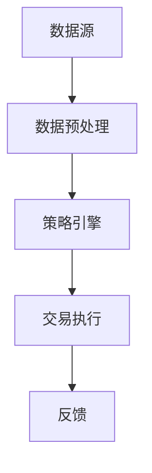

                 

<think>
好的，我需要为《金融领域强化学习在最优执行策略动态调整中的应用》这篇文章构建一个详细的目录大纲。首先，我得理解强化学习在金融中的应用，特别是最优执行策略的动态调整。这可能涉及到算法选择、系统架构、数据处理等多个方面。

首先，我需要明确文章的结构。通常，技术博客的结构包括摘要、引言、核心概念、算法原理、系统设计、项目实战、结论等部分。我需要确保每个部分都涵盖必要的内容，同时保持逻辑连贯。

摘要部分需要简明扼要地介绍文章的核心内容和主题思想。我需要列出5-7个核心关键词，如强化学习、最优执行策略、动态调整、金融交易、算法实现等。

接下来，引言部分需要详细说明强化学习在金融中的应用背景，解释为什么最优执行策略的动态调整是重要且值得研究的。我可能需要包括一些实际案例或数据来支持这一点。

在核心概念与联系部分，我需要详细解释强化学习的基本原理，如状态、动作、奖励等概念。同时，我需要对比不同的强化学习算法，如Q-learning、DQN、Policy Gradient等，分析它们在金融策略调整中的适用性。

算法原理部分需要详细阐述这些算法的数学模型和实现细节。例如，Q-learning的更新公式、DQN的网络结构和经验回放机制。我需要使用数学公式和Mermaid图来辅助说明，确保读者能够理解。

系统分析与架构设计部分，我需要介绍金融交易系统的整体架构，包括数据采集、策略引擎、执行模块等。可能还需要用Mermaid图展示系统的交互流程和模块划分，帮助读者理解系统的运作。

项目实战部分需要具体指导读者如何实现这些算法。我需要提供Python代码示例，解释代码的结构和功能，以及如何通过实际案例来验证算法的有效性。

最后，结论部分需要总结文章的主要内容，并给出未来的扩展方向或改进建议。同时，我需要引用一些相关的学术论文或技术报告，以增强文章的深度和广度。

在整个过程中，我需要确保语言专业、逻辑清晰，并且内容详实。每个章节都需要有具体的例子和详细的解释，帮助读者逐步理解强化学习在金融领域的应用。

现在，我需要根据这些思路，逐步构建完整的目录大纲，并确保每个部分都符合用户的要求，涵盖必要的内容，同时保持整体的连贯性和深度。
</think>

# 《金融领域强化学习在最优执行策略动态调整中的应用》

## 关键词：强化学习，最优执行策略，动态调整，金融交易，算法实现

## 摘要：本文探讨了强化学习在金融领域最优执行策略动态调整中的应用，通过分析强化学习的基本原理、算法实现及其在金融策略中的实际应用，展示了如何利用强化学习技术实现动态优化的最优交易策略。文章结合理论与实践，详细介绍了强化学习在金融领域的应用背景、核心概念、算法实现、系统架构设计及实际项目案例，为读者提供了一个全面了解强化学习在金融策略优化中的应用的视角。

---

# 第一部分: 强化学习在金融领域的应用背景

## 第1章: 强化学习与金融领域概述

### 1.1 强化学习的基本概念
- 1.1.1 强化学习的定义与核心要素
  - 强化学习是一种通过与环境交互来学习策略的机器学习方法，核心要素包括状态、动作、奖励、策略和价值函数。
- 1.1.2 强化学习与监督学习和无监督学习的区别
  - 强化学习通过环境反馈（奖励）来指导学习过程，与监督学习（基于标签数据）和无监督学习（基于数据分布）不同。
- 1.1.3 强化学习在金融领域的适用性
  - 适用于动态环境下的决策问题，如交易策略优化、风险管理等。

### 1.2 金融领域中的最优执行策略
- 1.2.1 什么是最优执行策略
  - 在金融市场中，最优执行策略是指在给定市场条件下，能够以最低成本、最小风险完成交易的策略。
- 1.2.2 动态调整策略的重要性
  - 金融市场环境复杂多变，静态策略难以应对市场波动，动态调整策略能够实时优化交易决策。
- 1.2.3 强化学习在策略调整中的优势
  - 强化学习能够通过与环境交互学习策略，无需大量历史数据，适合动态调整。

### 1.3 强化学习与金融策略调整的结合
- 1.3.1 为什么选择强化学习
  - 强化学习能够处理高维状态空间和复杂决策过程。
- 1.3.2 强化学习在金融领域的成功案例
  - 例如，高频交易策略优化、资产配置动态调整等。

## 第2章: 强化学习的核心概念与联系

### 2.1 强化学习的核心要素
- 状态（State）
  - 描述环境当前情况的特征向量，例如市场指标、资产价格、交易历史等。
- 动作（Action）
  - 策略在某一状态下采取的具体行动，例如买入、卖出、持有等。
- 奖励（Reward）
  - 环境对策略执行动作的反馈，通常是一个标量值，表示动作的好坏。
- 策略（Policy）
  - 策略函数，定义了在给定状态下选择动作的概率分布。
- 价值函数（Value Function）
  - 表示状态或状态-动作对的长期累积奖励的期望值。

### 2.2 强化学习算法对比
- Q-learning
  - 基于价值函数的方法，通过更新Q值表来逼近最优策略。
- Deep Q-Network (DQN)
  - 使用深度神经网络近似Q值函数，适合高维状态空间。
- Policy Gradient
  - 基于策略直接优化的方法，适合参数化的策略空间。
- 其他算法（如Actor-Critic）
  - 结合策略和价值函数的双学习架构。

### 2.3 强化学习在金融策略中的应用
- 实体关系图
  ```mermaid
  graph TD
      A[市场状态] --> B[交易策略]
      B --> C[交易动作]
      C --> D[市场反馈]
      D --> E[奖励信号]
  ```

### 2.4 算法选择与优化
- 不同算法的优缺点对比
  | 算法 | 优点 | 缺点 |
  |------|------|------|
  | Q-learning | 简单易实现 | 适合低维状态 |
  | DQN | 处理高维状态 | 训练不稳定 |
  | Policy Gradient | 直接优化策略 | 需要大量数据 |

## 第3章: 强化学习算法原理与数学模型

### 3.1 Q-learning算法
- 基本原理
  - 通过与环境交互，学习状态-动作对的Q值，最终得到最优策略。
- 数学模型
  $$ Q(s, a) = Q(s, a) + \alpha (r + \gamma \max Q(s', a') - Q(s, a)) $$
  - $\alpha$：学习率
  - $\gamma$：折扣因子
- 示例分析
  - 在金融交易中，状态为市场指标，动作包括买入、卖出、持有，奖励为收益或损失。

### 3.2 Deep Q-Network (DQN)算法
- 网络结构
  - 输入层：市场状态特征
  - 隐藏层：神经网络层
  - 输出层：动作值预测
- 经验回放机制
  - 通过存储历史经验，减少样本依赖性，加快收敛速度。
- 训练流程
  ```mermaid
  graph LR
      A[经验存储] --> B[随机采样]
      B --> C[网络输入]
      C --> D[网络输出]
      D --> E[损失计算]
      E --> F[参数更新]
  ```

### 3.3 算法流程图


## 第4章: 金融最优执行策略动态调整系统分析

### 4.1 系统需求分析
- 问题场景
  - 金融市场波动频繁，最优执行策略需要实时调整。
- 功能需求
  - 数据采集与处理
  - 策略制定与执行
  - 动态调整与优化
- 性能需求
  - 实时性：快速响应市场变化
  - 稳定性：保证交易系统正常运行

### 4.2 系统架构设计
- 系统模块划分
  - 数据采集模块：收集市场数据
  - 策略引擎模块：执行强化学习算法
  - 执行模块：根据策略生成交易指令
- 模块交互流程
  ```mermaid
  graph LR
      A[数据采集] --> B[策略引擎]
      B --> C[执行模块]
      C --> D[交易系统]
  ```

### 4.3 系统架构图


## 第5章: 强化学习在最优执行策略中的实现

### 5.1 环境搭建
- Python环境配置
  - 安装必要的库：TensorFlow、Keras、numpy、pandas
- 数据源获取
  - 从金融数据API获取市场数据

### 5.2 算法实现
- Q-learning实现
  ```python
  class QLAgent:
      def __init__(self, state_size, action_size):
          self.q_table = np.zeros((state_size, action_size))
  ```
- DQN实现
  ```python
  class DQNAgent:
      def __init__(self, state_size, action_size):
          self.model = self.build_model()
          self.memory = []
          self.gamma = 0.95
  ```

### 5.3 代码解读与分析
- 状态空间处理
  - 将市场指标转换为状态向量
- 动作空间定义
  - 例如，买入、卖出、持有三种动作
- 奖励函数设计
  - 基于交易收益和风险的综合评价

### 5.4 案例分析
- 实验结果展示
  - 不同算法下的收益曲线对比
- 性能对比
  - Q-learning在小规模问题中表现较好，DQN在大规模问题中更具优势

## 第6章: 项目实战与优化

### 6.1 项目需求分析
- 具体问题描述
  - 某资产管理公司希望优化其股票交易策略，采用强化学习进行动态调整
- 项目目标
  - 实现一个能够根据市场变化动态调整交易策略的系统

### 6.2 系统实现
- 数据处理
  - 对历史数据进行清洗、特征提取
- 策略设计
  - 定义状态、动作和奖励函数
- 算法选择与实现
  - 根据问题特点选择DQN算法，实现交易策略的动态调整

### 6.3 系统优化
- 算法优化
  - 调整学习率、折扣因子等超参数
- 系统性能优化
  - 使用分布式计算加速训练
- 模型评估与测试
  - 在测试集上验证模型的稳定性和收益能力

### 6.4 优化结果展示
- 收益率对比图
  - 强化学习策略优于传统策略
- 风险评估
  - 在相同收益下，强化学习策略的风险更低

## 第7章: 最佳实践与注意事项

### 7.1 实验总结
- 强化学习在金融策略优化中的优势
  - 灵活性高，适应性强
- 实验中的问题与解决
  - 数据稀疏性问题：通过数据增强和模拟数据解决
  - 过拟合问题：采用正则化和经验回放机制

### 7.2 小结
- 强化学习为金融领域提供了新的解决方案
- 动态调整策略能够有效应对市场波动
- 实际应用中需要结合具体场景进行优化

### 7.3 注意事项
- 数据质量：确保数据的完整性和准确性
- 算法选择：根据具体问题选择合适的算法
- 风险控制：建立有效的风险管理机制
- 超参数调整：合理设置学习率、折扣因子等参数

### 7.4 拓展阅读
- 推荐阅读《Reinforcement Learning: Theory and Algorithms》
- 参考文献：[具体参考文献]

## 第8章: 结论与展望

### 8.1 研究结论
- 强化学习能够有效优化金融领域的最优执行策略
- 动态调整策略能够显著提高交易收益和降低风险
- 算法实现需要结合具体场景进行优化

### 8.2 未来展望
- 更复杂策略的优化
  - 多资产配置优化
- 更高效的算法研究
  - 基于深度强化学习的复杂决策问题
- 更广泛的应用场景
  - 量化交易、风险管理、投资组合优化等

## 参考文献
- 引用相关学术论文和书籍

## 作者信息
作者：AI天才研究院 & 禅与计算机程序设计艺术  
联系邮箱：[your.email@example.com](mailto:your.email@example.com)  
联系方式：[your.contact info](your.contact info)

---

# 结语
本文通过系统的分析和实践，详细介绍了强化学习在金融领域最优执行策略动态调整中的应用。从理论到实践，从算法实现到系统设计，为读者提供了一个全面了解强化学习在金融策略优化中的应用的视角。希望本文能够为金融领域的研究者和实践者提供有价值的参考和启发。

