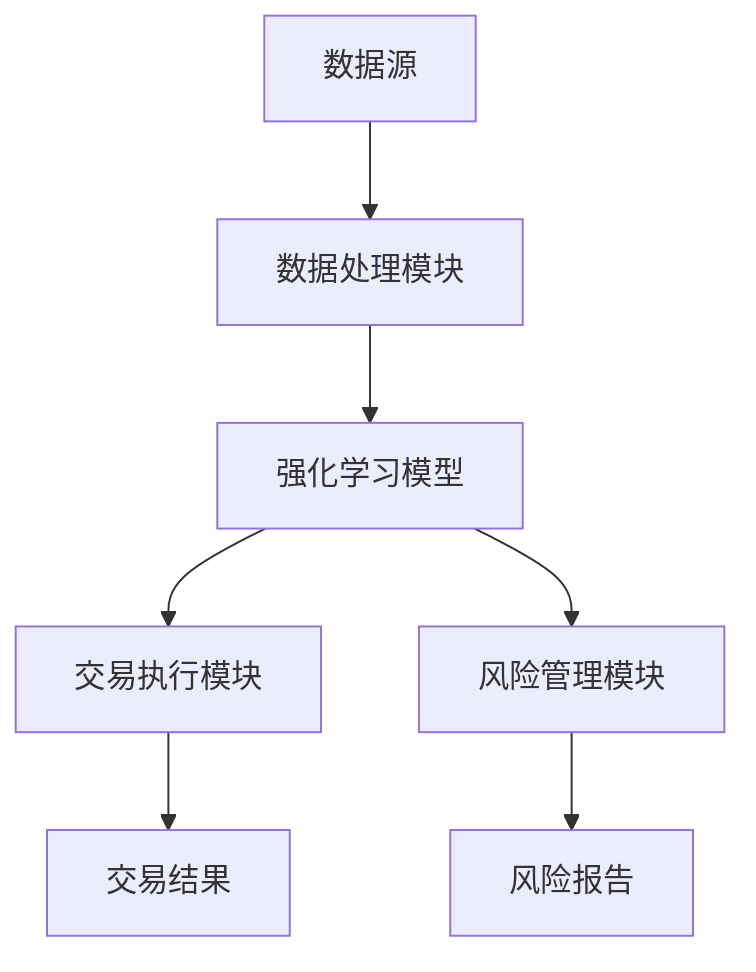
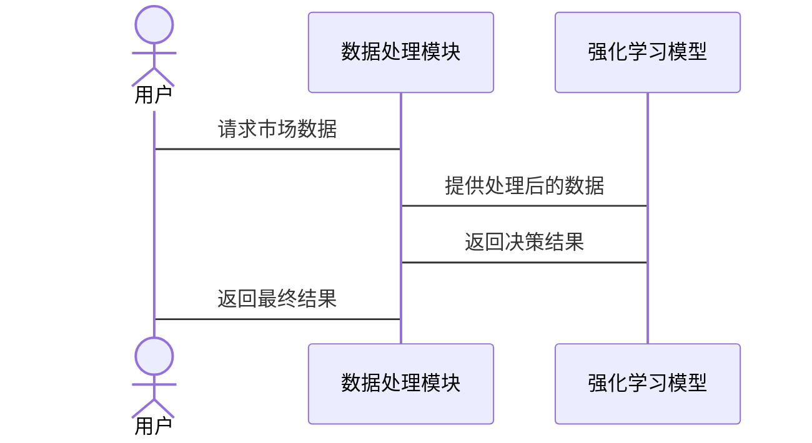

                 


# 《金融领域强化学习在资产定价中的应用》

## 关键词：强化学习, 资产定价, 金融, 算法, DQN

## 摘要：  
本文深入探讨了强化学习在金融领域资产定价中的应用。通过分析强化学习的核心概念、算法原理以及在金融中的实际应用案例，本文揭示了强化学习在资产定价中的独特优势。从基础理论到高级算法，从系统设计到项目实战，本文为读者提供了全面而深入的指导，帮助读者理解如何利用强化学习技术解决复杂的金融问题。

---

# 第1章: 强化学习与金融领域概述

## 1.1 强化学习的基本概念

### 1.1.1 强化学习的定义与特点
强化学习（Reinforcement Learning, RL）是一种机器学习范式，通过智能体与环境的交互，学习如何做出决策以最大化累积奖励。其核心特点是：
- **目标导向**：智能体通过选择动作来最大化累计奖励。
- **经验驱动**：通过与环境交互获得经验，逐步优化决策策略。
- **在线学习**：强化学习通常在动态环境中进行，智能体实时调整策略。

### 1.1.2 强化学习的核心要素：状态、动作、奖励
- **状态（State）**：智能体所处环境的信息表示，例如当前市场数据。
- **动作（Action）**：智能体在特定状态下做出的决策，例如买入或卖出某种资产。
- **奖励（Reward）**：智能体采取某个动作后获得的反馈，通常表示该动作的好坏。

### 1.1.3 强化学习与监督学习、无监督学习的区别
- **监督学习（Supervised Learning）**：基于有标签的数据，学习函数的输入输出映射。
- **无监督学习（Unsupervised Learning）**：基于无标签数据，发现数据中的隐含结构。
- **强化学习（Reinforcement Learning）**：基于与环境的交互，学习最优决策策略。

### 1.1.4 强化学习的核心算法
- Q-learning
- 深度强化学习（Deep RL）
- 策略梯度方法（Policy Gradient）

## 1.2 金融领域的基本概念

### 1.2.1 资产定价的定义与重要性
资产定价是指对金融资产的公允价值进行评估的过程。准确的资产定价对于投资者、企业和市场稳定性至关重要。

### 1.2.2 金融市场的基本结构与参与者
- **市场参与者**：投资者、机构、监管机构等。
- **市场结构**：包括股票市场、债券市场、期货市场等。

### 1.2.3 强化学习在金融领域的应用现状
- **量化交易**：利用强化学习进行高频交易。
- **风险管理**：通过强化学习优化风险控制策略。
- **投资组合优化**：基于强化学习构建最优投资组合。

## 1.3 强化学习在资产定价中的潜力

### 1.3.1 资产定价的传统方法与局限性
- **CAPM模型**：仅考虑系统性风险，难以应对复杂市场。
- **APT模型**：假设市场因子存在，实际应用中难以捕捉所有因子。

### 1.3.2 强化学习在资产定价中的优势
- **非线性关系**：强化学习能够捕捉复杂市场中的非线性关系。
- **动态适应性**：能够实时调整策略，适应市场变化。

### 1.3.3 实际案例：强化学习在量化交易中的应用
- **案例分析**：利用DQN算法在股票市场中进行买卖决策，实现超额收益。

## 1.4 本章小结
本章介绍了强化学习的基本概念、金融领域的基本结构以及强化学习在资产定价中的潜力。

---

# 第2章: 强化学习的数学基础

## 2.1 动态规划与马尔可夫决策过程

### 2.1.1 动态规划的基本原理
动态规划（Dynamic Programming, DP）是一种解决优化问题的递归方法，通过将问题分解为子问题，逐个解决。

### 2.1.2 马尔可夫决策过程（MDP）的定义与性质
- **状态空间（S）**：所有可能的状态集合。
- **动作空间（A）**：所有可能的动作集合。
- **转移概率（P）**：从当前状态采取某个动作后转移到下一个状态的概率。
- **奖励函数（R）**：智能体在状态s下采取动作a后获得的奖励。

### 2.1.3 状态值函数与动作值函数的数学表达
- **状态值函数（V(s)）**：在状态s下，智能体能够获得的最大期望奖励。
- **动作值函数（Q(s, a)）**：在状态s下采取动作a后，智能体能够获得的最大期望奖励。

### 2.1.4 Bellman方程
$$ V(s) = \max_{a} [ r(s, a) + \gamma \sum_{s'} P(s' | s, a) V(s') ] $$
其中，$\gamma$ 是折扣因子。

## 2.2 Q-learning算法原理

### 2.2.1 Q-learning的基本思想
Q-learning是一种基于值函数的强化学习算法，通过更新Q表来学习最优策略。

### 2.2.2 Q-learning的更新公式推导
$$ Q(s, a) = Q(s, a) + \alpha [ r + \gamma \max Q(s', a') - Q(s, a) ] $$
其中，$\alpha$ 是学习率。

### 2.2.3 Q-learning的收敛性分析
- Q-learning在离散状态下具有收敛性，最终收敛到最优值函数。

## 2.3 策略梯度方法

### 2.3.1 策略梯度的基本概念
策略梯度方法直接优化策略，通过梯度上升法寻找最优策略。

### 2.3.2 策略梯度的优化算法
- **REINFORCE算法**：基于蒙特卡洛采样的策略梯度方法。
- **Actor-Critic算法**：结合价值函数和策略函数的优化方法。

## 2.4 深度强化学习简介

### 2.4.1 深度强化学习的核心思想
深度强化学习结合深度学习和强化学习，通过神经网络逼近复杂的价值函数或策略函数。

### 2.4.2 DQN算法的基本结构
DQN（Deep Q-Network）算法通过神经网络近似Q值函数，解决高维状态空间下的强化学习问题。

### 2.4.3 深度强化学习在金融中的应用潜力
- **复杂市场建模**：利用深度强化学习捕捉复杂的市场特征。
- **实时决策优化**：在高频交易中实时优化交易策略。

## 2.5 本章小结
本章介绍了强化学习的数学基础，包括动态规划、马尔可夫决策过程、Q-learning算法以及深度强化学习的基本原理。

---

# 第3章: 资产定价的基本理论

## 3.1 资产定价的定义与目标

### 3.1.1 资产定价的基本概念
资产定价是指根据资产的风险和收益特征，对其未来现金流进行贴现，确定其公允价值。

### 3.1.2 资产定价的目标与意义
- **目标**：发现资产的内在价值，指导投资决策。
- **意义**：帮助投资者识别低估或高估的资产。

## 3.2 资本资产定价模型（CAPM）

### 3.2.1 CAPM的核心思想
CAPM假设资产的预期收益与系统性风险相关，公式为：
$$ E(r_i) = r_f + \beta_i (E(r_m) - r_f) $$
其中，$r_f$ 是无风险利率，$E(r_m)$ 是市场预期收益率，$\beta_i$ 是资产的贝塔系数。

### 3.2.2 CAPM的假设与局限性
- **假设**：市场是有效的，投资者是理性的。
- **局限性**：忽略了非系统性风险和交易成本。

## 3.3 Arbitrage Pricing Theory (APT)

### 3.3.1 APT的核心思想
APT假设资产的收益可以由一组因子线性解释，公式为：
$$ E(r_i) = \alpha_i + \beta_i F_1 + \beta_{i2} F_2 + \dots + \beta_{ik} F_k $$
其中，$F_j$ 是第j个风险因子。

### 3.3.2 APT与CAPM的对比
- **CAPM**：基于单一市场因子。
- **APT**：基于多个因子，更加灵活。

## 3.4 强化学习在资产定价中的应用

### 3.4.1 强化学习与传统定价模型的结合
- **案例分析**：利用强化学习优化CAPM中的贝塔系数。

### 3.4.2 强化学习在多因子模型中的应用
- **因子选择**：通过强化学习筛选最优因子组合。
- **因子权重优化**：通过强化学习动态调整因子权重。

## 3.5 本章小结
本章介绍了资产定价的基本理论，并探讨了强化学习在资产定价中的应用潜力。

---

# 第4章: 强化学习在资产定价中的应用

## 4.1 算法交易中的强化学习

### 4.1.1 算法交易的基本概念
算法交易是指利用计算机程序自动执行交易决策，通常基于算法和市场数据。

### 4.1.2 强化学习在算法交易中的应用
- **交易策略优化**：通过强化学习优化买卖时机。
- **市场微观结构建模**：利用强化学习捕捉市场中的微观特征。

## 4.2 风险管理中的强化学习

### 4.2.1 风险管理的基本概念
风险管理是指识别、评估和应对金融资产中的风险。

### 4.2.2 强化学习在风险管理中的应用
- **风险对冲策略**：通过强化学习优化风险对冲组合。
- **风险预警系统**：利用强化学习预测市场风险。

## 4.3 投资组合优化中的强化学习

### 4.3.1 投资组合优化的基本概念
投资组合优化是指在给定风险水平下，最大化投资组合的预期收益。

### 4.3.2 强化学习在投资组合优化中的应用
- **动态优化**：实时调整投资组合权重。
- **多目标优化**：同时优化收益和风险。

## 4.4 本章小结
本章探讨了强化学习在算法交易、风险管理和投资组合优化中的应用。

---

# 第5章: 系统设计与实现

## 5.1 系统架构设计

### 5.1.1 系统功能模块划分
- **数据获取模块**：获取市场数据。
- **策略执行模块**：执行交易策略。
- **风险管理模块**：监控和管理风险。

### 5.1.2 系统架构图


## 5.2 接口设计

### 5.2.1 系统接口定义
- **API接口**：提供标准接口供其他模块调用。

### 5.2.2 接口交互流程


## 5.3 本章小结
本章详细介绍了系统的架构设计和接口设计。

---

# 第6章: 项目实战

## 6.1 环境安装

### 6.1.1 安装Python环境
- 使用Anaconda安装Python 3.8及以上版本。

### 6.1.2 安装依赖库
- `pip install numpy`
- `pip install pandas`
- `pip install gym`

## 6.2 核心算法实现

### 6.2.1 DQN算法实现
```python
class DQN:
    def __init__(self, state_space, action_space, gamma=0.99, epsilon=1.0):
        self.state_space = state_space
        self.action_space = action_space
        self.gamma = gamma
        self.epsilon = epsilon
        self.q_table = defaultdict(lambda: np.zeros(len(action_space)))

    def choose_action(self, state):
        if np.random.random() < self.epsilon:
            return np.random.randint(len(self.action_space))
        else:
            q_values = self.q_table[state]
            return np.argmax(q_values)

    def learn(self, state, action, reward, next_state):
        q_values = self.q_table[state]
        next_q_values = self.q_table[next_state]
        target = reward + self.gamma * np.max(next_q_values)
        q_values[action] = target
        self.q_table[state] = q_values
```

### 6.2.2 算法实现解读
- **初始化**：初始化Q表和超参数。
- **选择动作**：基于贪心策略选择动作。
- **学习更新**：更新Q值函数。

## 6.3 实际案例分析

### 6.3.1 数据准备
- 使用股票数据训练模型。

### 6.3.2 模型训练
- 使用历史数据训练DQN模型。

### 6.3.3 模型测试
- 在测试数据上验证模型的交易收益。

## 6.4 本章小结
本章通过实际案例展示了强化学习在资产定价中的具体实现。

---

# 第7章: 总结与展望

## 7.1 总结

### 7.1.1 核心内容回顾
- 强化学习在资产定价中的应用潜力。
- DQN算法的实现与应用。

### 7.1.2 实践中的注意事项
- 数据质量的重要性。
- 模型的可解释性问题。

## 7.2 未来展望

### 7.2.1 强化学习在金融中的未来方向
- 更复杂的市场建模。
- 多智能体强化学习的应用。

### 7.2.2 技术进步对金融的影响
- 高频交易的进一步发展。
- 人工智能在金融中的广泛应用。

## 7.3 本章小结
本章总结了全文内容，并展望了强化学习在金融中的未来发展方向。

---

# 作者：AI天才研究院/AI Genius Institute & 禅与计算机程序设计艺术 /Zen And The Art of Computer Programming

