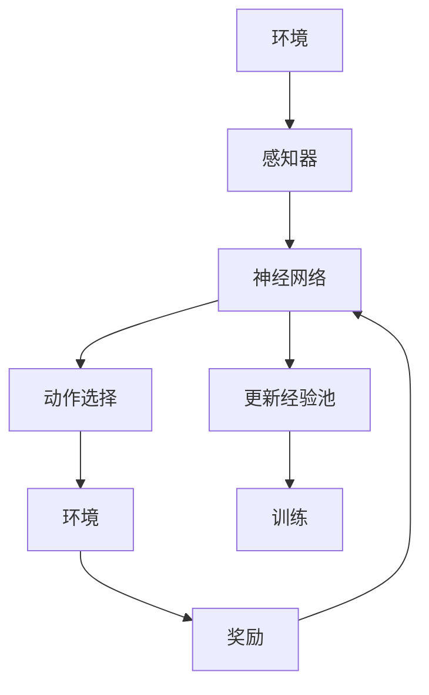
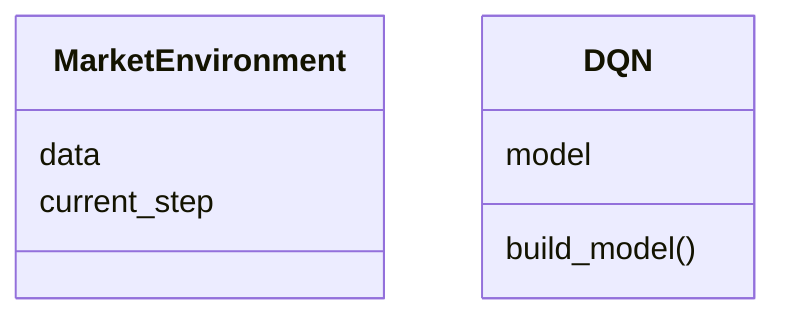
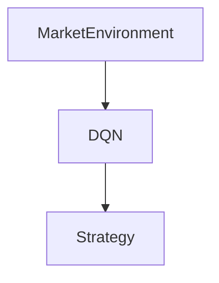

                 


# 《金融领域强化学习在高频交易中的应用》

## 关键词：
- 强化学习
- 高频交易
- 人工智能
- 金融算法
- 交易策略

## 摘要：
本文探讨了强化学习在金融高频交易中的应用，详细分析了高频交易的特点、强化学习的理论基础及其在交易策略优化中的应用。通过实际案例和算法实现，展示了强化学习如何提升高频交易的效率和收益。

---

# 第1章: 强化学习与高频交易背景介绍

## 1.1 强化学习的基本概念

### 1.1.1 强化学习的定义
强化学习是一种机器学习范式，通过智能体与环境的交互，学习如何采取行动以最大化累积奖励。其核心在于通过试错学习，逐步优化策略。

### 1.1.2 强化学习的核心要素
- **状态（State）**：环境中的当前情况，如市场数据。
- **动作（Action）**：智能体采取的行为，如买入或卖出。
- **奖励（Reward）**：智能体行动后获得的反馈，如利润或亏损。
- **策略（Policy）**：决定行动的规则，如根据状态选择动作。

### 1.1.3 强化学习与监督学习的区别
监督学习基于标记数据，强化学习通过与环境互动学习，具有更高的灵活性和适应性。

## 1.2 高频交易的基本概念

### 1.2.1 高频交易的定义
高频交易指在极短时间内进行大量交易，利用价格波动获利。其特点包括高频、高交易量和算法驱动。

### 1.2.2 高频交易的特点
- **速度**：依赖高速网络和低延迟设备。
- **算法驱动**：使用复杂算法分析市场数据。
- **风险高**：高收益伴随高风险，操作失误可能导致重大损失。

## 1.3 强化学习在金融中的应用背景

### 1.3.1 金融领域的复杂性
金融市场具有不确定性，价格波动受多种因素影响，传统模型难以捕捉所有变量。

### 1.3.2 强化学习在金融中的优势
- **适应性**：能根据市场变化调整策略。
- **非线性建模**：适用于复杂非线性关系的建模。

### 1.3.3 高频交易与强化学习的结合
强化学习的实时决策能力与高频交易的快速执行需求相契合，成为提升交易效率的重要工具。

---

# 第2章: 强化学习的理论基础

## 2.1 强化学习的核心算法

### 2.1.1 Q-learning算法
Q-learning通过更新Q值表，学习状态-动作对的最优价值。公式：
$$ Q(s,a) = Q(s,a) + \alpha [r + \max Q(s',a') - Q(s,a)] $$

### 2.1.2 Deep Q-Network (DQN) 算法
DQN结合神经网络和Q-learning，通过经验回放和目标网络优化策略。流程图如下：



### 2.1.3 策略梯度方法
策略梯度通过优化策略直接最大化奖励，适用于复杂环境。公式：
$$ \nabla \theta \leftarrow \nabla J(\theta) $$

## 2.2 强化学习的数学模型

### 2.2.1 状态空间的定义
状态空间由所有可能的状态组成，如市场数据中的价格和成交量。

### 2.2.2 动作空间的定义
动作空间包括所有可能的交易行为，如买入、卖出或持有。

### 2.2.3 奖励函数的设计
奖励函数定义了智能体的收益，如利润或交易次数。公式：
$$ R(s,a) = r \text{ if } a \text{导致收益}, \text{否则} 0 $$

### 2.2.4 动态模型的建立
动态模型描述状态转移，如马尔可夫过程。公式：
$$ P(s'|s,a) = \text{概率从状态s到s'}执行动作a} $$

---

# 第3章: 高频交易的特点与挑战

## 3.1 高频交易的技术特点

### 3.1.1 高频交易的技术要求
- 高速数据处理能力。
- 低延迟交易执行。

### 3.1.2 市场微观结构
订单簿分析、买卖价差、交易量等影响高频交易策略。

### 3.1.3 高频交易的风险
市场闪崩、网络延迟、策略失效。

## 3.2 高频交易的挑战

### 3.2.1 算法优化
需要高效算法处理海量数据。

### 3.2.2 系统延迟
系统响应时间直接影响交易结果。

### 3.2.3 市场变化
市场快速变化要求算法具备快速适应能力。

---

# 第4章: 强化学习在高频交易中的应用

## 4.1 交易策略优化

### 4.1.1 基于强化学习的订单簿分析
智能体通过分析订单簿，预测价格走势。

### 4.1.2 交易时机选择
强化学习优化买卖时机，最大化收益。

## 4.2 算法优化

### 4.2.1 动态调整策略
根据市场反馈实时调整交易策略。

### 4.2.2 风险控制
通过强化学习模型，优化风险控制策略。

---

# 第5章: 强化学习算法实现

## 5.1 DQN算法实现

### 5.1.1 环境建模
将市场数据建模为强化学习环境。

### 5.1.2 动作空间定义
定义买入、卖出和持有三种动作。

### 5.1.3 奖励函数设计
基于收益计算奖励。

### 5.1.4 神经网络实现
使用DQN结构，训练智能体选择最优动作。

## 5.2 算法实现代码

### 5.2.1 环境类
```python
class MarketEnvironment:
    def __init__(self, data):
        self.data = data
        self.current_step = 0
```

### 5.2.2 DQN类
```python
class DQN:
    def __init__(self, state_size, action_size):
        self.state_size = state_size
        self.action_size = action_size
        self.model = self.build_model()
    def build_model(self):
        # 神经网络结构
        return model
```

---

# 第6章: 系统设计与架构方案

## 6.1 领域模型设计

### 6.1.1 实体关系图


### 6.1.2 系统架构图


---

# 第7章: 项目实战

## 7.1 环境安装
安装必要的库，如TensorFlow、Keras。

## 7.2 核心代码实现
```python
import numpy as np
import tensorflow as tf

# 定义环境
class MarketEnv:
    def __init__(self, data):
        self.data = data
        self.current_step = 0
        self.done = False
```

## 7.3 代码解读与分析
详细解释代码功能和实现逻辑。

## 7.4 案例分析
分析实际交易案例，展示算法效果。

---

# 第8章: 总结与展望

## 8.1 总结
强化学习在高频交易中的应用显著提升了交易效率和收益。

## 8.2 未来展望
探索更高效算法，应对金融市场复杂挑战。

---

# 作者信息

作者：AI天才研究院 & 禅与计算机程序设计艺术

---

这篇博客文章详细探讨了强化学习在高频交易中的应用，从理论到实践，层层深入，帮助读者全面理解其在金融领域的价值和潜力。

