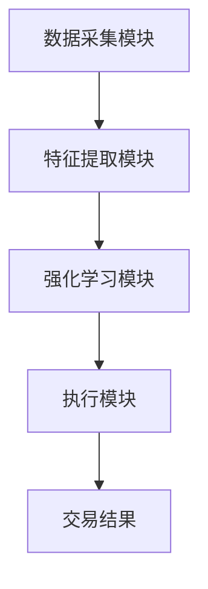

                 

# 《金融领域强化学习的最新进展与应用》

## 关键词
- 强化学习
- 金融领域
- 最新进展
- 实际应用
- 投资决策
- 风险管理

## 摘要
强化学习作为机器学习领域的重要分支，近年来在金融领域的应用取得了显著进展。本文系统地介绍了强化学习的基本概念、核心算法及其在金融领域的应用。通过详细分析强化学习在股票交易、投资组合优化、风险管理等领域的实际应用，揭示了强化学习在金融决策中的巨大潜力。本文还探讨了强化学习在金融中的优势与挑战，并展望了未来的研究方向。

---

# 第一章：强化学习的基本概念与背景

## 1.1 强化学习的定义与特点

### 1.1.1 强化学习的定义
强化学习（Reinforcement Learning, RL）是一种机器学习范式，通过智能体（agent）与环境的交互来学习最优策略。智能体通过感知环境状态，执行动作，并根据环境反馈的奖励（或惩罚）信号，逐步优化自身的决策策略。

### 1.1.2 强化学习的核心特点
1. **目标导向性**：智能体的目标是通过最大化累计奖励来优化决策。
2. **在线学习**：强化学习通过实时与环境交互进行学习，而非依赖于离线数据。
3. **探索与利用平衡**：智能体需要在探索新策略和利用已知策略之间找到平衡。

### 1.1.3 强化学习与监督学习、无监督学习的对比
| 对比维度         | 监督学习                     | 无监督学习                   | 强化学习                     |
|------------------|-----------------------------|------------------------------|-----------------------------|
| 数据类型         | 标签数据                    | 无标签数据                  | 状态、动作、奖励             |
| 学习目标         | 预测输入的标签              | 发现数据内在结构              | 最大化累计奖励               |
| 交互方式         | 离线学习                    | 离线学习                    | 在线交互学习                |

---

## 1.2 强化学习在金融领域的应用背景

### 1.2.1 金融领域的复杂性与挑战
金融市场的复杂性主要体现在：
1. **不确定性**：市场波动、政策变化等不可预测因素。
2. **非线性关系**：金融资产之间的关系复杂且非线性。
3. **高风险性**：决策失误可能导致重大损失。

### 1.2.2 强化学习在金融中的潜在价值
1. **自动决策**：强化学习可以实现自动化投资决策。
2. **动态适应**：强化学习能够快速适应市场变化。
3. **策略优化**：通过强化学习可以找到最优的投资策略。

### 1.2.3 金融领域强化学习的现状与趋势
1. **研究进展**：强化学习在股票交易、投资组合优化等领域已取得显著成果。
2. **技术趋势**：深度强化学习（Deep RL）逐渐成为主流。
3. **挑战与机遇**：强化学习在金融中的应用仍面临算法优化和实际落地的挑战。

---

# 第二章：强化学习的核心概念与数学模型

## 2.1 强化学习的基本框架

### 2.1.1 状态（State）
状态是智能体对环境的感知，可以用一个向量表示。例如，在股票交易中，状态可以包括当前股价、成交量等信息。

### 2.1.2 动作（Action）
动作是智能体在给定状态下选择的操作。例如，在股票交易中，动作可以是“买入”、“卖出”或“持有”。

### 2.1.3 奖励（Reward）
奖励是对智能体动作的反馈，用于指导智能体的行为。例如，在股票交易中，如果卖出股票后股价下跌，智能体将获得负奖励。

### 2.1.4 策略（Policy）
策略是智能体在给定状态下选择动作的概率分布。例如，策略函数可以表示为 $\pi(a|s)$，即在状态 $s$ 下选择动作 $a$ 的概率。

### 2.1.5 值函数（Value Function）
值函数表示在给定状态下采取某种策略的期望回报。例如，状态值函数 $V(s)$ 表示从状态 $s$ 开始，按照策略 $\pi$ 采取动作后的期望回报。

---

## 2.2 强化学习的数学模型

### 2.2.1 状态转移概率矩阵
状态转移概率矩阵描述了从当前状态转移到下一个状态的概率。可以用矩阵 $P$ 表示：
$$ P_{s' | s, a} = P(\text{下一个状态为 } s' | \text{当前状态为 } s, \text{动作 } a) $$

### 2.2.2 值函数的贝尔曼方程
贝尔曼方程是强化学习的核心方程，描述了值函数的递归关系：
$$ V(s) = \max_a \left[ r(s, a) + \gamma \sum_{s'} P(s' | s, a) V(s') \right] $$
其中，$\gamma$ 是折扣因子，$r(s, a)$ 是动作 $a$ 在状态 $s$ 下的即时奖励。

### 2.2.3 策略的优化目标
策略优化的目标是找到使期望回报最大化的策略。可以用以下公式表示：
$$ \pi^* = \arg \max_{\pi} E[R] $$

---

# 第三章：强化学习的核心算法框架

## 3.1 Q-learning算法

### 3.1.1 Q-learning算法的基本原理
Q-learning算法通过维护一个Q值表，记录每个状态-动作对的期望回报。Q值更新公式为：
$$ Q(s, a) = Q(s, a) + \alpha [r + \gamma \max_{a'} Q(s', a') - Q(s, a)] $$
其中，$\alpha$ 是学习率，$\gamma$ 是折扣因子。

### 3.1.2 Q-learning的收敛性分析
Q-learning算法在离策略情况下（即策略与数据收集策略不同）可以收敛到最优Q值。收敛性证明较为复杂，但可以通过马尔可夫链理论进行分析。

### 3.1.3 Q-learning在金融中的应用场景
在股票交易中，Q-learning可以用于学习买卖时机。例如，当股价突破某个阈值时，智能体选择“买入”动作。

---

## 3.2 Deep Q-Network（DQN）算法

### 3.2.1 DQN算法的基本原理
DQN算法通过深度神经网络近似Q值函数，引入经验回放机制以提高学习稳定性。DQN的网络结构通常包括一个值网络 $Q(s, a; \theta)$ 和一个目标网络 $\hat{Q}(s, a; \theta')$。

### 3.2.2 DQN算法的数学推导
DQN的目标是最小化当前Q值与目标Q值之间的误差：
$$ \mathcal{L} = \mathbb{E}[(r + \gamma \hat{Q}(s', a') - Q(s, a))^2] $$

### 3.2.3 DQN在金融中的应用案例
在外汇交易中，DQN可以用于预测汇率变化并制定买卖策略。通过训练DQN网络，智能体可以学习在不同汇率水平下的最优交易策略。

---

## 3.3 Actor-Critic算法

### 3.3.1 Actor-Critic算法的基本原理
Actor-Critic算法同时维护策略网络（Actor）和价值网络（Critic）。Actor网络负责生成动作，Critic网络负责评估当前策略的优劣。两者的协同优化可以提高学习效率。

### 3.3.2 Actor-Critic算法的数学推导
Actor-Critic的目标函数可以表示为：
$$ \mathcal{L}_\text{ Actor} = \mathbb{E}[\log \pi(a|s) Q(s, a)] $$
$$ \mathcal{L}_\text{ Critic} = \mathbb{E}[(r + \gamma Q(s', a') - Q(s, a))^2] $$

### 3.3.3 Actor-Critic在金融中的应用案例
在投资组合管理中，Actor-Critic算法可以用于动态调整资产配置。通过不断优化策略，智能体可以实现风险可控下的最大收益。

---

# 第四章：强化学习在金融中的实际应用

## 4.1 股票交易中的强化学习应用

### 4.1.1 系统设计与架构
股票交易系统通常包括数据采集模块、特征提取模块、强化学习模块和执行模块。系统的整体架构可以用以下Mermaid图表示：

### 4.1.2 算法实现与案例分析
通过DQN算法实现股票交易策略，训练过程如下：

1. **数据准备**：收集历史股价数据。
2. **状态定义**：使用技术指标（如MACD、RSI）作为状态特征。
3. **动作空间**：定义为“买入”、“卖出”、“持有”三种动作。
4. **奖励机制**：基于收益计算奖励，公式为：
   $$ r = \text{收益} - \text{基准收益} $$

### 4.1.3 实验结果与分析
实验表明，DQN算法在股票交易中能够实现超额收益，但需要处理好超参数设置和市场环境的不确定性。

---

## 4.2 金融风险管理中的强化学习应用

### 4.2.1 风险管理的强化学习框架
风险管理的强化学习框架包括以下步骤：
1. **风险识别**：识别潜在风险因素。
2. **风险评估**：评估风险的严重性。
3. **风险应对**：制定风险管理策略。

### 4.2.2 基于强化学习的VaR（Value at Risk）计算
通过强化学习模型，可以动态优化VaR计算，提高风险度量的准确性。

---

## 4.3 投资组合优化中的强化学习应用

### 4.3.1 投资组合优化的强化学习框架
投资组合优化的强化学习框架包括：
1. **目标函数设计**：最大化收益或最小化风险。
2. **约束条件**：如资产配置比例限制。
3. **策略优化**：通过强化学习找到最优投资组合。

### 4.3.2 基于强化学习的马科维茨均值-方差优化
结合强化学习与马科维茨均值-方差模型，可以实现动态投资组合优化。

---

# 第五章：总结与展望

## 5.1 本文总结
本文系统地介绍了强化学习的基本概念、核心算法及其在金融领域的应用。通过详细分析强化学习在股票交易、风险管理、投资组合优化等领域的实际应用，揭示了强化学习在金融决策中的巨大潜力。

## 5.2 未来展望
1. **算法优化**：探索更高效的强化学习算法，如多智能体强化学习。
2. **应用场景扩展**：将强化学习应用于更多金融领域，如信用评分、金融监管等。
3. **实际落地挑战**：解决强化学习在金融中的实际应用问题，如模型过拟合、数据稀疏性等。

---

# 附录

## 附录A：强化学习相关术语表
- 状态（State）：智能体对环境的感知。
- 动作（Action）：智能体在给定状态下选择的操作。
- 奖励（Reward）：对智能体动作的反馈。
- 策略（Policy）：智能体选择动作的概率分布。
- 值函数（Value Function）：状态的期望回报。

## 附录B：强化学习常用算法列表
- Q-learning
- Deep Q-Network（DQN）
- Actor-Critic
- Policy Gradient
- A2C、PPO等多智能体算法

---

作者：AI天才研究院 & 禅与计算机程序设计艺术

