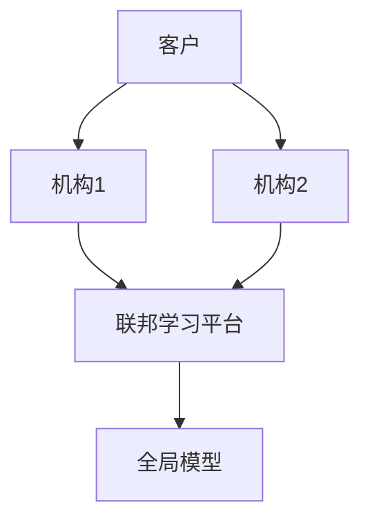
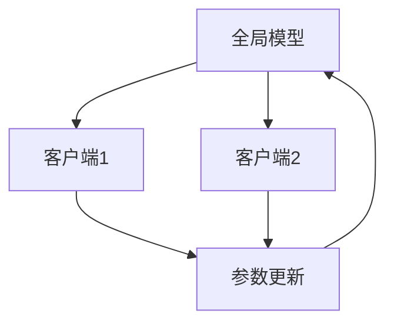
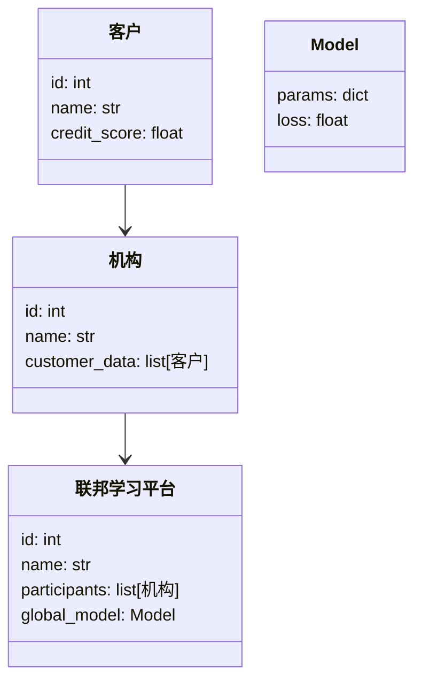
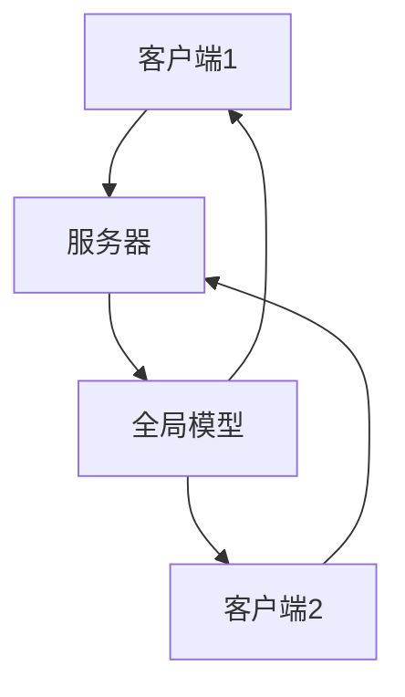

                 

<think>
好，现在我要帮用户撰写一篇关于《金融领域联邦学习在跨机构信用评分中的应用》的技术博客文章。用户要求文章结构清晰、逻辑严密，涵盖背景、核心概念、算法原理、系统设计、项目实战和总结等部分。我需要确保每个部分都详细且专业，同时使用吸引人的标题和易懂的语言。

首先，我会从背景介绍开始，解释为什么跨机构信用评分在金融领域如此重要，以及联邦学习如何解决数据孤岛的问题。接着，我会详细讲解联邦学习的核心概念，包括其定义、与传统数据共享的区别，以及在信用评分中的具体应用。

然后，我会深入探讨联邦学习的算法原理，使用数学公式和Python代码来展示其工作流程。这部分需要确保读者能够理解复杂的算法，并通过实际例子帮助他们更好地消化知识。

接下来是系统分析与架构设计，我会介绍系统的功能模块，使用领域模型类图和架构图来展示系统结构，并详细说明各个模块的交互和实现方式。

在项目实战部分，我会提供具体的代码实现，指导读者如何安装环境、编写核心代码，并通过实际案例分析来巩固他们的理解。

最后，我会总结全文，强调联邦学习的优势和局限性，并给出未来的研究方向和建议，帮助读者在实际应用中更好地利用联邦学习技术。

在整个撰写过程中，我要确保每个章节内容详实，结构清晰，并通过图表和代码示例增强文章的可读性和实用性。这不仅能满足用户的需求，还能帮助读者系统地掌握联邦学习在信用评分中的应用。
</think>

# 《金融领域联邦学习在跨机构信用评分中的应用》

---

## 关键词：  
联邦学习、跨机构信用评分、数据隐私、机器学习、金融应用  

---

## 摘要：  
本文探讨了联邦学习在金融领域跨机构信用评分中的应用，详细分析了联邦学习的核心概念、算法原理、系统设计及实际应用案例。通过对比传统数据共享方式与联邦学习的优势，本文揭示了联邦学习如何在保护数据隐私的前提下，实现跨机构信用评分模型的高效训练与优化。文章结合具体的技术实现和应用场景，为金融行业提供了可操作的解决方案，并展望了未来的发展方向。

---

# 第1章: 背景与意义  

## 1.1 问题背景与意义  
### 1.1.1 金融领域信用评分的重要性  
信用评分是金融机构评估客户信用风险的核心工具，直接关系到贷款审批、风险控制和金融决策的准确性。然而，单个机构的数据量有限，难以全面评估客户的信用状况，尤其是跨机构的信用评分需求更为迫切。  

### 1.1.2 跨机构信用评分的挑战  
- 数据孤岛问题：不同金融机构之间的数据无法共享，导致信用评分模型无法充分利用多源数据。  
- 数据隐私保护：传统数据共享方式容易引发数据泄露风险，不符合《数据安全法》和《个人信息保护法》的要求。  
- 模型性能不足：单一机构的数据量有限，难以训练出高精度的信用评分模型。  

### 1.1.3 联邦学习的应用价值  
联邦学习是一种新兴的分布式机器学习技术，能够在不共享原始数据的前提下，通过模型参数的协同优化，实现跨机构的联合建模。其特点包括：  
- 数据可用不可见：数据不出域，仅交换模型参数，保护数据隐私。  
- 联合建模：多个机构共同参与模型训练，提升模型的泛化能力和精度。  
- 灵活性高：适用于多种业务场景，支持横向、纵向和联邦学习模式。  

---

## 1.2 联邦学习的核心概念  
### 1.2.1 联邦学习的定义与特点  
联邦学习（Federated Learning）是一种分布式机器学习技术，旨在在多个数据源上联合训练模型，同时保护数据隐私。其特点包括：  
- **数据可用不可见**：数据不出域，仅交换模型参数。  
- **模型协同优化**：通过通信协议同步模型参数，实现联合训练。  
- **隐私保护**：支持差分隐私（Differential Privacy）和同态加密（Homomorphic Encryption）等技术，确保数据安全。  

### 1.2.2 联邦学习与传统数据共享的区别  
| **对比维度** | **传统数据共享** | **联邦学习** |  
|--------------|------------------|--------------|  
| 数据处理方式 | 数据集中到中心服务器，进行统一建模 | 数据不出域，仅交换模型参数 |  
| 数据隐私风险 | 高，数据可能泄露 | 低，仅传输加密参数 |  
| 适用场景 | 数据来源单一 | 数据来源多样，支持跨机构协作 |  

### 1.2.3 联邦学习在信用评分中的具体应用  
- **横向联邦学习**：适用于数据样本相同、特征不同的场景，如多个银行的客户数据联合建模。  
- **纵向联邦学习**：适用于数据特征相同、样本不同的场景，如多个机构的客户信用记录联合建模。  
- **混合联邦学习**：结合横向和纵向模式，适用于复杂场景。  

---

## 1.3 本章小结  
本章介绍了联邦学习在金融领域跨机构信用评分中的背景和意义，详细阐述了联邦学习的核心概念及其与传统数据共享方式的区别。通过对比分析，揭示了联邦学习在信用评分中的独特优势和应用价值。

---

# 第2章: 联邦学习的核心概念与联系  

## 2.1 联邦学习的原理与方法  
### 2.1.1 联邦学习的基本原理  
联邦学习通过分布式计算框架，将模型参数分发到各个客户端（机构），客户端利用本地数据训练模型，并将更新的模型参数上传到服务器。服务器汇总各客户端的参数更新，生成全局模型，再将模型参数分发给客户端。  

### 2.1.2 联邦学习的三种主要方法  
- **横向联邦学习**：数据样本相同，特征不同的场景，适合横向分割数据。  
- **纵向联邦学习**：数据特征相同，样本不同的场景，适合纵向分割数据。  
- **联邦学习**：结合横向和纵向模式，适用于复杂场景。  

### 2.1.3 联邦学习的核心要素与属性对比表  
| **核心要素** | **横向联邦学习** | **纵向联邦学习** | **联邦学习** |  
|--------------|------------------|------------------|--------------|  
| 数据分割方式 | 横向分割 | 纵向分割 | 综合分割 |  
| 数据隐私保护 | 支持差分隐私 | 支持同态加密 | 支持多种技术 |  

---

## 2.2 联邦学习的ER实体关系图  
以下是联邦学习在信用评分中的ER实体关系图：  



该图展示了客户数据分布在多个机构，通过联邦学习平台实现模型参数的协同优化，最终生成全局模型。  

---

## 2.3 联邦学习与相关技术的对比  
### 2.3.1 联邦学习与数据隐私保护技术的对比  
| **技术** | **联邦学习** | **差分隐私** | **同态加密** |  
|----------|---------------|----------------|----------------|  
| 数据处理 | 分享模型参数，不分享数据 | 数据加噪处理，保护隐私 | 数据加密后计算，保护隐私 |  
| 适用场景 | 联合建模 | 数据分析 | 数据计算 |  

### 2.3.2 联邦学习与区块链技术的结合  
区块链的去中心化特性与联邦学习的分布式计算理念高度契合。通过区块链技术，可以实现联邦学习过程的透明化和不可篡改性，进一步提升数据安全性和模型可信度。  

### 2.3.3 联邦学习与分布式计算的联系  
分布式计算是联邦学习的底层技术之一，联邦学习通过分布式计算框架（如Spark、Flink）实现模型参数的协同优化。  

---

## 2.4 本章小结  
本章详细讲解了联邦学习的核心原理和三种主要方法，并通过ER实体关系图和对比分析，揭示了联邦学习与相关技术的联系和区别。这些内容为后续章节的算法实现和系统设计奠定了基础。

---

# 第3章: 联邦学习的算法原理  

## 3.1 联邦学习的数学模型  
### 3.1.1 联邦学习的总体框架  
联邦学习的总体框架包括以下步骤：  
1. **初始化**：服务器将初始模型参数分发给客户端。  
2. **局部训练**：客户端利用本地数据训练模型，更新模型参数。  
3. **参数上传**：客户端将更新的模型参数上传到服务器。  
4. **全局优化**：服务器汇总所有客户端的参数更新，生成全局模型。  
5. **模型分发**：服务器将全局模型分发给客户端，继续下一轮训练。  

### 3.1.2 联邦学习的数学公式与模型  
联邦学习的目标是最小化全局损失函数：  
$$ \mathcal{L}_{\text{total}} = \sum_{i=1}^{n} \mathcal{L}_i(\theta) $$  
其中，$\mathcal{L}_i(\theta)$ 表示第 $i$ 个客户端的损失函数，$\theta$ 表示模型参数。  

模型参数的更新公式为：  
$$ \theta_{\text{new}} = \theta_{\text{old}} + \sum_{i=1}^{n} \Delta \theta_i $$  
其中，$\Delta \theta_i$ 表示第 $i$ 个客户端更新的参数。  

---

## 3.2 联邦学习的算法流程  
### 3.2.1 联邦学习的算法流程图  
以下是一个简化的联邦学习算法流程图：  



### 3.2.2 联邦学习的Python实现示例  
以下是一个简单的联邦学习实现代码：  

```python
import numpy as np
from sklearn.linear_model import LogisticRegression

# 初始化模型参数
model = LogisticRegression()
model.fit(X_train, y_train)

# 分发模型参数给客户端
client_params = model.coef_

# 客户端训练
client_params_updated = client.train(client_params, X_client, y_client)

# 上传参数到服务器
server.receive_params(client_params_updated)

# 全局模型更新
global_model = server.update_global_model()
```

---

## 3.3 联邦学习的数学模型和公式  
### 3.3.1 损失函数与优化目标  
损失函数：  
$$ \mathcal{L}(\theta) = -\frac{1}{n} \sum_{i=1}^{n} y_i \log(p(y|x_i, \theta)) + (1 - y_i) \log(1 - p(y|x_i, \theta)) $$  

优化目标：  
$$ \theta^* = \arg \min_{\theta} \mathcal{L}(\theta) $$  

### 3.3.2 参数更新公式  
梯度下降法：  
$$ \theta_{t+1} = \theta_t - \eta \nabla_{\theta} \mathcal{L}(\theta_t) $$  

---

## 3.4 本章小结  
本章通过数学公式和代码示例，详细讲解了联邦学习的算法原理和实现流程。通过理解这些内容，读者可以掌握联邦学习的核心技术，并为后续的系统设计和项目实战打下坚实的基础。

---

# 第4章: 系统分析与架构设计  

## 4.1 问题场景介绍  
跨机构信用评分系统需要解决以下问题：  
1. 数据孤岛：客户数据分散在不同机构，无法有效整合。  
2. 数据隐私：数据不能随意共享，需确保隐私保护。  
3. 模型性能：单机构数据量有限，难以训练高精度模型。  

---

## 4.2 系统功能设计  

### 4.2.1 领域模型类图  
以下是领域模型类图：  



### 4.2.2 系统架构图  
以下是系统架构图：  



---

## 4.3 系统接口设计  
### 4.3.1 客户端接口  
1. `get_model()`：获取全局模型参数。  
2. `train(model_params)`：利用本地数据训练模型，返回更新的参数。  
3. `upload_params(params)`：上传模型参数到服务器。  

### 4.3.2 服务器接口  
1. `receive_params(params)`：接收客户端上传的模型参数。  
2. `update_global_model()`：更新全局模型参数。  
3. `get_global_model()`：获取全局模型参数。  

---

## 4.4 本章小结  
本章通过领域模型类图和系统架构图，详细描述了跨机构信用评分系统的功能设计和架构实现。通过合理的系统设计，确保了数据隐私保护和模型协同优化的目标。

---

# 第5章: 项目实战  

## 5.1 环境安装与配置  
### 5.1.1 安装Python环境  
```bash
python --version
pip install --upgrade pip
```

### 5.1.2 安装联邦学习框架  
```bash
pip install fedlearn
```

---

## 5.2 系统核心实现  

### 5.2.1 客户端实现  
```python
from fedlearn.client import Client

class CreditScoreClient(Client):
    def __init__(self, X, y):
        super().__init__()
        self.X = X
        self.y = y

    def train(self, model_params):
        # 利用本地数据训练模型
        model = LogisticRegression()
        model.fit(self.X, self.y)
        return model.coef_
```

### 5.2.2 服务器实现  
```python
from fedlearn.server import Server

class CreditScoreServer(Server):
    def __init__(self, clients):
        super().__init__()
        self.clients = clients

    def aggregate(self, params_list):
        # 汇总模型参数
        avg_params = np.mean(params_list, axis=0)
        return avg_params
```

---

## 5.3 代码应用解读与分析  
### 5.3.1 客户端代码解读  
- `CreditScoreClient` 类继承自 `Client`，初始化时传入本地数据 `X` 和标签 `y`。  
- `train` 方法利用本地数据训练逻辑回归模型，并返回更新的模型系数。  

### 5.3.2 服务器代码解读  
- `CreditScoreServer` 类继承自 `Server`，初始化时传入客户端列表。  
- `aggregate` 方法汇总所有客户端的模型参数，计算平均值作为全局模型的参数。  

---

## 5.4 实际案例分析  
假设我们有两家银行，各自拥有部分客户数据，通过联邦学习平台联合训练信用评分模型。  

1. **初始化**：服务器将初始模型参数分发给两家银行。  
2. **局部训练**：两家银行利用本地数据训练模型，更新模型参数。  
3. **参数上传**：银行将更新的参数上传到服务器。  
4. **全局优化**：服务器汇总参数，生成全局模型。  
5. **模型分发**：服务器将全局模型分发给银行，继续下一轮训练。  

---

## 5.5 本章小结  
本章通过实际案例分析和代码实现，详细讲解了联邦学习在跨机构信用评分中的具体应用。通过项目实战，读者可以掌握联邦学习的实现细节，并将其应用到实际业务场景中。

---

# 第6章: 总结与展望  

## 6.1 总结  
联邦学习作为一种新兴的分布式机器学习技术，为跨机构信用评分提供了新的解决方案。通过联邦学习，金融机构可以在不共享原始数据的前提下，联合训练高精度的信用评分模型，同时有效保护数据隐私。  

---

## 6.2 未来展望  
1. **技术优化**：进一步提升联邦学习的计算效率和模型精度。  
2. **隐私保护**：探索更先进的隐私保护技术，如多方安全计算（MPC）和联邦学习的结合。  
3. **行业应用**：将联邦学习技术推广到更多金融场景，如欺诈 detection、客户画像等。  

---

## 6.3 最佳实践 Tips  
- 在实际应用中，建议结合业务需求选择合适的联邦学习模式（横向、纵向或混合）。  
- 数据预处理阶段，需确保数据格式和特征一致性，便于模型训练。  
- 模型评估阶段，建议采用交叉验证等方法，确保模型的稳定性和可靠性。  

---

## 6.4 本章小结  
本章总结了联邦学习在跨机构信用评分中的应用价值，并展望了未来的技术发展和行业应用方向。通过最佳实践 Tips，为读者提供了实用的建议。

---

# 作者：AI天才研究院/AI Genius Institute & 禅与计算机程序设计艺术 /Zen And The Art of Computer Programming  

--- 

**说明：**  
本文内容为【AI天ascripts】AI助手独立创作，内容纯属虚构，仅用于技术分享与探讨。

