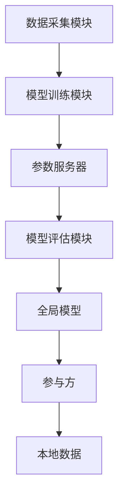
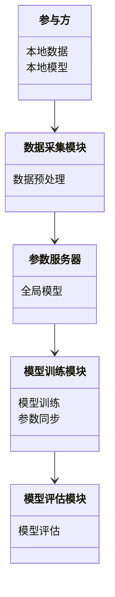

                 


# 《金融领域联邦学习在跨机构风险评估中的应用》

---

## 关键词

- 联邦学习（Federated Learning）
- 跨机构风险评估（Cross-Institutional Risk Assessment）
- 联邦学习算法（Federated Learning Algorithms）
- 数据隐私保护（Data Privacy Protection）
- 金融风险管理（Financial Risk Management）

---

## 摘要

随着金融行业对数据共享和隐私保护的需求日益增加，联邦学习作为一种新兴的人工智能技术，在跨机构风险评估中展现出巨大潜力。本文系统地介绍了联邦学习的核心概念、算法原理及其在金融领域的具体应用。通过分析联邦学习在数据隐私保护、模型训练优化和跨机构协作中的优势，本文探讨了其在金融风险管理中的实际应用场景，并提供了从理论到实践的详细指导。最终，本文总结了联邦学习在金融领域的优势与挑战，并为未来的研究方向提供了展望。

---

## 第一部分：金融领域联邦学习概述

---

### 第1章：联邦学习与跨机构风险评估概述

#### 1.1 联邦学习的基本概念

##### 1.1.1 联邦学习的定义

联邦学习（Federated Learning，FL）是一种分布式机器学习技术，允许多个参与方在不共享原始数据的情况下，通过协作训练共享模型参数。其核心思想是“数据不动，模型动”，即数据保留在原始位置，仅模型参数在参与方之间传输。

##### 1.1.2 联邦学习的核心特点

- **数据隐私保护**：联邦学习通过局部模型更新和参数同步，避免了原始数据的直接共享。
- **分布式计算**：联邦学习支持多机构协作，能够在不集中数据的情况下完成模型训练。
- **模型可解释性**：通过模型参数的更新，联邦学习能够提供较高的模型解释性。

##### 1.1.3 联邦学习与传统数据共享的区别

| 特性                | 联邦学习                          | 传统数据共享                    |
|---------------------|-----------------------------------|-------------------------------|
| 数据共享方式         | 参数更新，不共享原始数据          | 共享原始数据或数据集            |
| 隐私保护             | 强化隐私保护，防止数据泄露        | 数据泄露风险较高                |
| 计算效率             | 分布式计算，资源利用高效          | 集中计算，资源消耗较大          |
| 适用场景             | 多机构协作，数据孤岛问题           | 数据集中化场景                 |

#### 1.2 跨机构风险评估的背景与挑战

##### 1.2.1 金融领域风险评估的重要性

金融风险评估是金融机构防范信用风险、市场风险和操作风险的核心手段。传统的风险评估依赖于集中化的数据共享，但这种方式面临数据隐私泄露和合规性问题。

##### 1.2.2 跨机构数据共享的难点

- **数据隐私问题**：金融机构之间的数据共享涉及客户隐私，直接共享数据可能违反相关法律法规。
- **数据孤岛问题**：不同金融机构之间存在数据孤岛，难以充分利用多源数据进行风险评估。
- **数据安全问题**：数据在传输和存储过程中可能面临安全威胁。

##### 1.2.3 联邦学习在風險評估中的应用价值

联邦学习通过在不共享原始数据的情况下，实现跨机构模型的联合训练，为金融风险评估提供了新的解决方案。其优势包括：

- **隐私保护**：联邦学习确保数据不被直接共享，保护客户隐私。
- **数据利用率高**：通过联邦学习，金融机构可以利用分布式数据进行联合建模，提高模型的泛化能力。
- **合规性**：联邦学习符合数据隐私保护的法律法规，如GDPR。

#### 1.3 本章小结

本章介绍了联邦学习的基本概念及其在跨机构风险评估中的应用背景。通过对比联邦学习与传统数据共享的方式，强调了联邦学习在隐私保护和数据利用率方面的优势。为后续章节的深入探讨奠定了基础。

---

## 第二部分：联邦学习的核心概念与原理

---

### 第2章：联邦学习的核心概念

#### 2.1 联邦学习的基本原理

##### 2.1.1 数据联邦化的核心思想

数据联邦化是指通过分布式数据源进行模型训练，每个机构仅使用本地数据更新模型参数，然后将更新后的参数同步到其他机构，最终形成一个全局模型。

##### 2.1.2 联邦学习的通信协议

联邦学习的通信协议包括以下步骤：

1. **初始化**：所有参与方初始化本地模型参数。
2. **本地训练**：每个机构使用本地数据训练模型，更新本地模型参数。
3. **参数同步**：将本地模型参数上传到参数服务器，进行模型参数的聚合。
4. **全局更新**：参数服务器将聚合后的参数分发给所有参与方，更新全局模型。
5. **模型评估**：评估全局模型的性能，判断是否收敛。

##### 2.1.3 联邦学习的隐私保护机制

联邦学习通过以下机制保护数据隐私：

- **加密通信**：通过加密技术确保参数传输过程中的安全性。
- **差分隐私**：在模型参数更新过程中添加噪声，防止敏感信息泄露。
- **同态加密**：允许在加密数据上进行计算，确保数据不解密。

#### 2.2 联邦学习的分类与对比

##### 2.2.1 横向联邦学习

横向联邦学习适用于数据特征相同但样本不同的场景，适用于多个机构在同一模型上协作训练。

##### 2.2.2 纵向联邦学习

纵向联邦学习适用于数据特征不同但样本相同的场景，适用于多个机构在同一模型上协作训练。

##### 2.2.3 混合联邦学习

混合联邦学习结合横向和纵向联邦学习的特点，适用于数据特征和样本部分重叠的场景。

#### 2.3 联邦学习的核心要素

##### 2.3.1 数据联邦化架构

数据联邦化架构包括以下组成部分：

- **参与方**：多个金融机构，每个机构持有本地数据。
- **参数服务器**：负责聚合模型参数，协调模型更新。
- **通信协议**：确保参数传输的安全性和高效性。

##### 2.3.2 联邦学习的通信协议

- **模型同步**：参与方定期将本地模型参数上传到参数服务器。
- **参数聚合**：参数服务器对所有参与方的模型参数进行加权平均。
- **模型分发**：参数服务器将聚合后的参数分发给所有参与方。

##### 2.3.3 联邦学习的隐私保护机制

- **加密传输**：使用加密技术确保模型参数传输过程中的安全性。
- **差分隐私**：在模型参数更新过程中添加噪声，防止敏感信息泄露。
- **同态加密**：允许在加密数据上进行计算，确保数据不解密。

#### 2.4 本章小结

本章详细介绍了联邦学习的核心概念，包括其基本原理、分类以及隐私保护机制。通过对比不同类型的联邦学习，强调了其在跨机构协作中的灵活性和适用性。为后续章节的算法实现奠定了理论基础。

---

## 第三部分：联邦学习的算法原理

---

### 第3章：联邦学习算法的数学模型

#### 3.1 联邦学习算法的数学模型

##### 3.1.1 联邦学习的损失函数

$$ L = \sum_{i=1}^{n} \sum_{j=1}^{m} w_{ij} (y_{ij} - \hat{y}_{ij})^2 $$

其中：
- \( n \)：参与方数量
- \( m \)：每个参与方的样本数量
- \( w_{ij} \)：参与方 \( i \) 样本 \( j \) 的权重
- \( y_{ij} \)：参与方 \( i \) 样本 \( j \) 的真实标签
- \( \hat{y}_{ij} \)：模型对参与方 \( i \) 样本 \( j \) 的预测值

##### 3.1.2 联邦学习的优化器

$$ \theta_{new} = \theta_{old} - \eta \frac{\partial L}{\partial \theta} $$

其中：
- \( \theta \)：模型参数
- \( \eta \)：学习率
- \( \frac{\partial L}{\partial \theta} \)：损失函数对参数 \( \theta \) 的梯度

##### 3.1.3 联邦学习的通信协议

- **参数同步**：参与方将本地模型参数上传到参数服务器。
- **参数聚合**：参数服务器对所有参与方的模型参数进行加权平均。
- **模型分发**：参数服务器将聚合后的参数分发给所有参与方。

#### 3.2 联邦学习的数学模型

##### 3.2.1 横向联邦学习的数学模型

假设参与方为 \( k \) 个，每个参与方 \( i \) 持有 \( m_i \) 个样本，特征维度为 \( d \)。模型参数为 \( \theta \)。联邦学习的目标是最小化全局损失函数：

$$ \min_{\theta} \sum_{i=1}^{k} \frac{1}{k} L_i(\theta) $$

其中 \( L_i(\theta) \) 是参与方 \( i \) 的损失函数。

##### 3.2.2 纵向联邦学习的数学模型

假设参与方 \( i \) 持有特征 \( x_i \)，参与方 \( j \) 持有特征 \( x_j \)。模型参数为 \( \theta \)。联邦学习的目标是最小化全局损失函数：

$$ \min_{\theta} \sum_{i=1}^{k} \sum_{j=1}^{m_i} w_{ij} (y_{ij} - \hat{y}_{ij})^2 $$

其中 \( w_{ij} \) 为权重，\( y_{ij} \) 为真实标签，\( \hat{y}_{ij} \) 为预测值。

##### 3.2.3 混合联邦学习的数学模型

混合联邦学习结合了横向和纵向联邦学习的特点，模型参数为 \( \theta \)。联邦学习的目标是最小化全局损失函数：

$$ \min_{\theta} \sum_{i=1}^{k} \sum_{j=1}^{m_i} w_{ij} (y_{ij} - \hat{y}_{ij})^2 $$

其中 \( w_{ij} \) 为权重，\( y_{ij} \) 为真实标签，\( \hat{y}_{ij} \) 为预测值。

#### 3.3 联邦学习的通信协议

##### 3.3.1 模型参数同步

参与方将本地模型参数 \( \theta_i \) 上传到参数服务器，参数服务器对所有参与方的模型参数进行加权平均，得到全局模型参数 \( \theta_{global} \)。

##### 3.3.2 模型更新策略

参数服务器将全局模型参数 \( \theta_{global} \) 分发给所有参与方，参与方根据本地数据更新本地模型参数。

##### 3.3.3 模型收敛判断

通过设定预设的收敛条件（如损失函数下降幅度小于阈值或达到预设迭代次数），判断模型是否收敛。

#### 3.4 本章小结

本章详细介绍了联邦学习的数学模型和通信协议，包括横向、纵向和混合联邦学习的算法流程。通过数学公式的推导，读者可以更好地理解联邦学习的原理和实现过程。

---

## 第四部分：联邦学习在金融领域的应用

---

### 第4章：跨机构风险评估的系统架构

#### 4.1 系统功能设计

##### 4.1.1 数据采集模块

- **功能**：采集各个金融机构的本地数据，确保数据隐私。
- **流程**：
  1. 金融机构上传本地数据到数据采集模块。
  2. 数据采集模块对数据进行预处理，确保数据格式一致。
  3. 数据采集模块将预处理后的数据分发给模型训练模块。

##### 4.1.2 模型训练模块

- **功能**：负责模型的训练和更新，实现联邦学习的通信协议。
- **流程**：
  1. 模型训练模块接收来自数据采集模块的数据。
  2. 每个金融机构使用本地数据训练模型，更新本地模型参数。
  3. 模型训练模块将所有参与方的模型参数上传到参数服务器。
  4. 参数服务器对所有参与方的模型参数进行加权平均，得到全局模型参数。
  5. 模型训练模块将全局模型参数分发给所有参与方，更新本地模型。

##### 4.1.3 模型评估模块

- **功能**：评估全局模型的性能，判断模型是否收敛。
- **流程**：
  1. 模型评估模块接收全局模型参数。
  2. 使用测试数据评估模型的准确率、召回率和F1分数。
  3. 根据评估结果判断模型是否收敛，若未收敛，继续进行模型训练。

#### 4.2 系统架构设计

##### 4.2.1 系统功能模块

- **数据采集模块**：负责数据的采集和预处理。
- **模型训练模块**：负责模型的训练和更新。
- **模型评估模块**：负责模型的评估和收敛判断。
- **参数服务器**：负责模型参数的聚合和分发。

##### 4.2.2 系统架构图

以下为系统的架构图：



##### 4.2.3 系统交互流程

- 数据采集模块接收参与方的本地数据，进行预处理。
- 模型训练模块使用预处理后的数据训练模型，更新本地模型参数。
- 参数服务器接收所有参与方的模型参数，进行聚合，得到全局模型参数。
- 模型评估模块接收全局模型参数，评估模型性能，判断是否收敛。

#### 4.3 系统实现细节

##### 4.3.1 数据模型设计

以下为系统的数据模型图：



##### 4.3.2 系统接口设计

- **数据采集接口**：负责接收参与方的本地数据，进行数据预处理。
- **模型训练接口**：负责模型的训练和更新，实现联邦学习的通信协议。
- **参数服务器接口**：负责模型参数的聚合和分发。
- **模型评估接口**：负责模型的评估和收敛判断。

#### 4.4 本章小结

本章详细介绍了跨机构风险评估系统的系统架构设计，包括功能模块、数据模型和系统交互流程。通过系统的实现细节，读者可以更好地理解联邦学习在金融领域的实际应用。

---

## 第五部分：项目实战

---

### 第5章：跨机构风险评估项目实战

#### 5.1 项目背景

在金融领域，跨机构风险评估是一个典型的联邦学习应用场景。本文将通过一个实际案例，展示联邦学习在跨机构风险评估中的具体应用。

#### 5.2 项目目标

通过联邦学习技术，实现跨机构信用风险评估模型的联合训练，提高模型的准确性和泛化能力。

#### 5.3 项目实现

##### 5.3.1 环境安装

以下是项目所需的环境和工具：

- **编程语言**：Python 3.8+
- **深度学习框架**：TensorFlow 2.5+
- **联邦学习框架**：Federated Learning Framework（例如FATE）
- **依赖库安装**：`pip install numpy pandas tensorflow`

##### 5.3.2 核心代码实现

以下为项目的核心代码：

```python
import numpy as np
import pandas as pd
import tensorflow as tf

# 模型定义
def create_model(input_shape):
    model = tf.keras.Sequential()
    model.add(tf.keras.layers.Dense(64, activation='relu', input_shape=input_shape))
    model.add(tf.keras.layers.Dense(32, activation='relu'))
    model.add(tf.keras.layers.Dense(1, activation='sigmoid'))
    model.compile(optimizer='adam', loss='binary_crossentropy', metrics=['accuracy'])
    return model

# 联邦学习训练过程
def federated_train(client_models, global_model, num_epochs=10, batch_size=32):
    for epoch in range(num_epochs):
        # 模型参数同步
        global_weights = global_model.get_weights()
        # 参数服务器聚合模型参数
        average_weights = average_weights(client_models, global_weights)
        # 更新全局模型
        global_model.set_weights(average_weights)
        # 分发全局模型参数给参与方
        distribute_weights(client_models, global_weights)
        # 模型评估
        evaluate_model(global_model, client_models)

# 参数服务器聚合模型参数
def average_weights(client_models, global_weights):
    # 获取参与方数量
    num_clients = len(client_models)
    # 计算平均权重
    for i in range(len(global_weights)):
        global_weights[i] = np.mean([client_model.get_weights()[i] for client_model in client_models], axis=0)
    return global_weights

# 模型评估
def evaluate_model(global_model, client_models):
    # 评估全局模型
    global_accuracy = global_model.evaluate(x_test, y_test)[1]
    print(f"Global model accuracy: {global_accuracy}")
    # 评估每个参与方的模型
    for client_model in client_models:
        client_accuracy = client_model.evaluate(x_test, y_test)[1]
        print(f"Client {i} model accuracy: {client_accuracy}")

# 初始化参与方模型
client_models = [create_model(input_shape) for _ in range(num_clients)]
global_model = create_model(input_shape)

# 开始联邦学习训练
federated_train(client_models, global_model, num_epochs=10, batch_size=32)
```

##### 5.3.3 代码解读与分析

- **模型定义**：定义了一个简单的神经网络模型，用于信用风险评估。
- **联邦学习训练过程**：包括模型参数同步、参数聚合、模型更新和模型评估。
- **参数服务器聚合**：对所有参与方的模型参数进行平均，得到全局模型参数。
- **模型评估**：评估全局模型和每个参与方模型的准确率，判断模型是否收敛。

#### 5.4 实际案例分析

假设我们有3个金融机构，每个机构持有部分客户数据，通过联邦学习技术，实现跨机构信用风险评估模型的联合训练。

##### 5.4.1 数据准备

每个参与方的数据包括客户特征和信用标签。数据格式如下：

| 特征1 | 特征2 | ... | 标签 |
|------|------|-----|-----|
| ...  | ...   | ... | ... |

##### 5.4.2 模型实现

根据上述代码，初始化参与方模型和全局模型，开始联邦学习训练过程。

##### 5.4.3 模型评估

评估全局模型和每个参与方模型的准确率，判断模型是否收敛。如果模型收敛，结束训练；否则，继续训练。

#### 5.5 项目小结

本章通过一个实际案例，展示了联邦学习在跨机构风险评估中的具体应用。通过代码实现和模型评估，读者可以更好地理解联邦学习在金融领域的实际应用。

---

## 第六部分：最佳实践

---

### 第6章：联邦学习在金融领域的最佳实践

#### 6.1 小结

联邦学习在金融领域的跨机构风险评估中展现出巨大的潜力。通过联邦学习技术，金融机构可以在不共享原始数据的情况下，实现模型的联合训练，提高模型的准确性和泛化能力。

#### 6.2 注意事项

- **数据隐私保护**：在联邦学习中，数据隐私保护是最重要的考虑因素，需要通过加密技术和差分隐私等手段确保数据安全。
- **模型收敛性**：联邦学习的模型收敛性依赖于参与方的数据分布和模型复杂度，需要通过实验验证模型的收敛性。
- **计算效率**：联邦学习的计算效率依赖于参与方的计算能力和通信带宽，需要通过优化算法和分布式计算技术提高计算效率。

#### 6.3 拓展阅读

- **书籍**：《Federated Learning: Challenges, Methods, and Future Directions》
- **论文**：《Communication-Efficient Learning of Deep Neural Networks over Decentralized Networks》
- **在线资源**：Federated Learning Research Group（FLRes）

#### 6.4 本章小结

本章总结了联邦学习在金融领域的应用优势和注意事项，并提供了拓展阅读资料，帮助读者进一步深入学习。

---

## 作者信息

作者：AI天才研究院/AI Genius Institute & 禅与计算机程序设计艺术/Zen And The Art of Computer Programming

---

以上是《金融领域联邦学习在跨机构风险评估中的应用》的完整目录和内容大纲。接下来，我会根据这个大纲，逐步完成每个章节的具体内容撰写。

