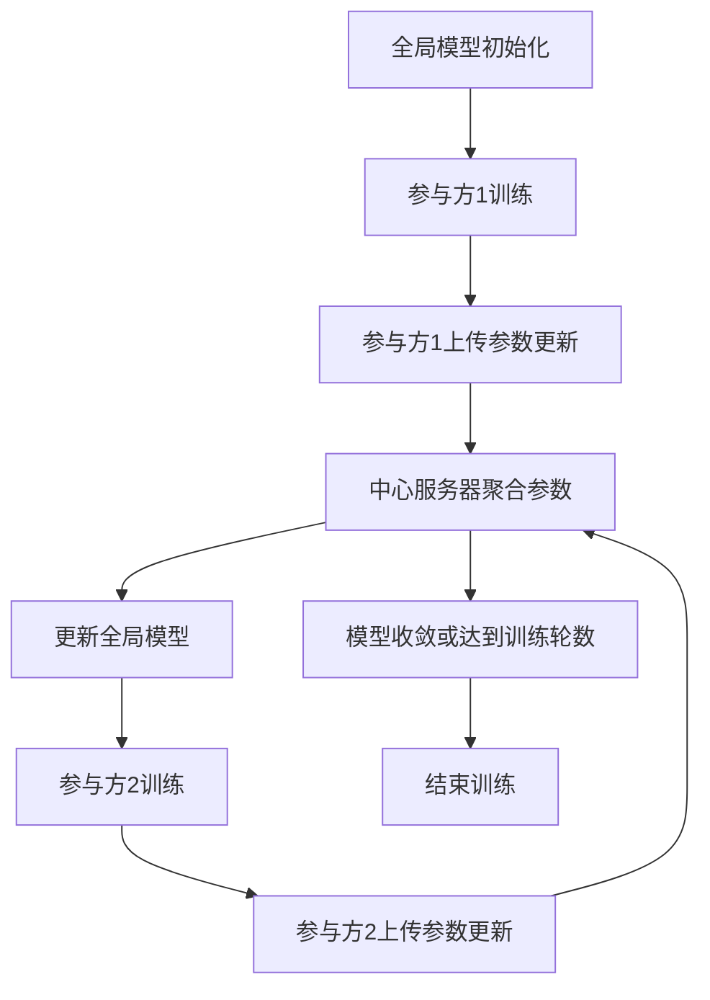
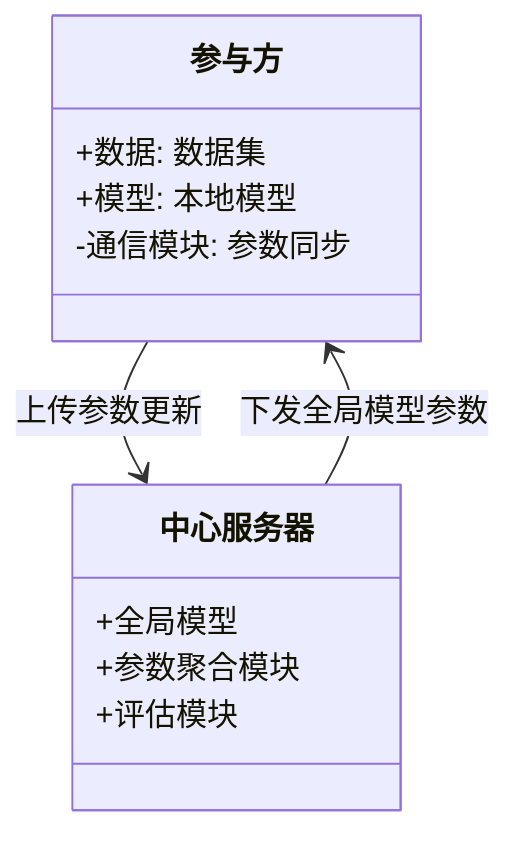
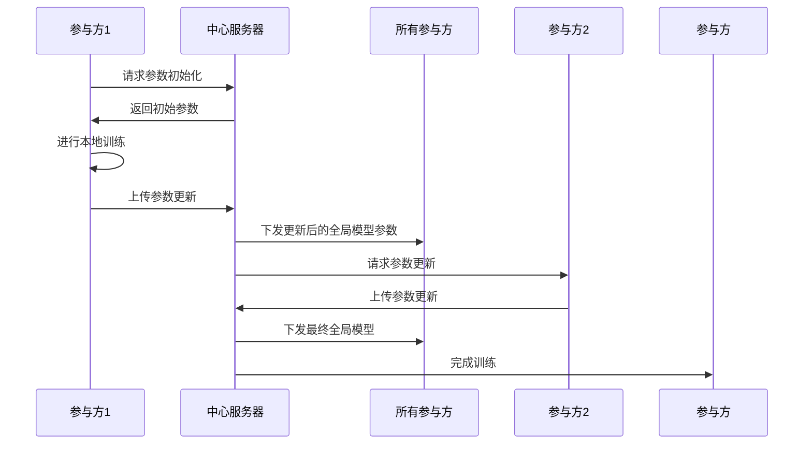

                 

<think>
好的，我现在需要根据用户提供的详细目录大纲，逐步分析并撰写《金融领域联邦学习在跨机构风险评估中的应用》这篇文章。为了确保内容完整且符合要求，我会按照以下步骤进行：

### 步骤一：撰写摘要
首先，我需要为文章撰写一个简明扼要的摘要，概述全文的核心内容和主要观点。摘要应简明扼要，突出联邦学习在金融跨机构风险评估中的应用及其优势。

### 步骤二：撰写背景介绍部分
接下来，我需要详细撰写第一部分的背景介绍，包括联邦学习的定义、优势、在金融领域的应用现状，以及跨机构风险评估的背景。这部分需要为读者提供足够的背景知识，帮助他们理解后续内容。

### 步骤三：详细阐述联邦学习的核心概念与原理
在这一部分，我需要解释联邦学习的基本原理，包括数据联邦化、模型联邦化，以及安全与隐私保护机制。这部分内容需要逻辑清晰，结构紧凑，同时使用图表来辅助说明，如ER实体关系图和流程图。

### 步骤四：解析联邦学习的算法原理
详细讲解联邦学习的数学模型和算法流程，使用mermaid流程图展示算法步骤，并附上Python代码示例。这部分需要确保数学公式正确无误，并使用LaTeX格式进行标注。

### 步骤五：设计系统架构与功能模块
介绍系统功能设计、架构设计以及接口设计，使用mermaid类图和序列图来展示系统的各个部分及其交互流程。这部分需要清晰展示系统的各个模块如何协同工作。

### 步骤六：项目实战与案例分析
提供环境安装步骤和核心代码实现，通过具体案例分析展示联邦学习在跨机构风险评估中的实际应用。案例分析需要详细解读数据预处理、模型训练和评估过程，并得出结论。

### 步骤七：总结与展望
总结全文的主要内容和结论，并提出未来的发展方向和建议。同时，加入一些最佳实践、注意事项和拓展阅读的内容，帮助读者进一步学习和应用。

### 步骤八：检查与完善
最后，我会通读全文，检查逻辑是否连贯，内容是否全面，图表是否清晰，确保文章符合字数要求，并按格式要求排版。

通过以上步骤，我能够系统地完成这篇文章的撰写，确保内容详实、结构清晰、逻辑严谨，满足用户的需求。
</think>

# 《金融领域联邦学习在跨机构风险评估中的应用》

## 关键词：联邦学习、金融风险评估、跨机构数据共享、数据隐私保护、机器学习

## 摘要：
本文深入探讨了联邦学习在金融领域跨机构风险评估中的应用，详细分析了其核心概念、算法原理、系统架构以及实际应用案例。通过理论与实践相结合的方式，展示了联邦学习如何在保护数据隐私的前提下，实现跨机构的数据协作，提升风险评估的准确性和效率。本文还总结了联邦学习的优势与挑战，并对未来的发展方向进行了展望。

---

# 第一部分: 背景介绍

## 第1章: 联邦学习在金融领域的应用背景

### 1.1 联邦学习的定义与特点

#### 1.1.1 联邦学习的定义
联邦学习（Federated Learning）是一种分布式机器学习技术，允许多个参与方在不共享原始数据的情况下，共同训练一个全局模型。其核心思想是“数据不动，模型动”，通过在各个数据源端进行局部模型训练，并将模型参数更新上传到中心服务器，最终汇总得到一个全局模型。

#### 1.1.2 联邦学习的核心特点
- **数据隐私保护**：数据无需离开本地，确保隐私安全。
- **数据多样性**：多个机构的数据具有多样性，提升模型的泛化能力。
- **协作性**：通过模型参数共享，实现跨机构协作。

#### 1.1.3 联邦学习与传统数据共享的区别
| 特性               | 联邦学习                          | 传统数据共享                     |
|--------------------|----------------------------------|---------------------------------|
| 数据共享方式       | 参数更新，不共享数据             | 数据集中到一个地方进行处理      |
| 数据隐私保护       | 高                               | 低或无                          |
| 计算效率           | 较低，需要多次通信               | 较高                            |
| 适用场景           | 数据无法集中或隐私要求高的场景   | 数据可以集中共享的场景          |

### 1.2 金融领域跨机构风险评估的背景

#### 1.2.1 金融风险评估的定义与重要性
金融风险评估是指通过分析客户的信用状况、市场波动等因素，预测其未来可能出现的财务风险。在金融领域，风险评估是信用评分、欺诈检测等核心业务的基础。

#### 1.2.2 跨机构数据共享的挑战
- **数据孤岛**：不同金融机构的数据往往分散在各自的系统中，难以形成合力。
- **隐私保护**：金融数据涉及客户隐私，直接共享数据可能违反法律法规。
- **数据异构性**：不同机构的数据格式、字段可能不同，增加了整合的难度。

#### 1.2.3 联邦学习在金融风险评估中的优势
- **保护隐私**：通过联邦学习，金融机构可以在不共享数据的情况下，共同训练风险评估模型。
- **提升模型性能**：利用跨机构的多样化数据，模型的泛化能力更强。
- **合规性**：符合数据隐私保护的法律法规，如GDPR。

### 1.3 联邦学习在金融领域的应用现状

#### 1.3.1 联邦学习在金融领域的应用场景
- **信用评分**：通过跨机构数据，提升信用评分模型的准确性。
- **欺诈检测**：利用多个机构的数据，发现跨机构的欺诈行为。
- **市场风险评估**：通过整合多个机构的市场数据，预测系统性风险。

#### 1.3.2 联邦学习在风险评估中的具体应用
- **客户画像构建**：通过跨机构数据，构建更全面的客户画像。
- **风险特征提取**：利用联邦学习提取跨机构的共同风险特征。
- **实时风险预警**：通过联邦学习模型，实现实时风险评估和预警。

#### 1.3.3 联邦学习在金融领域的未来发展趋势
- **技术标准化**：制定联邦学习的技术标准，推动其广泛应用。
- **隐私保护技术的创新**：研究更先进的加密算法，提升数据安全。
- **行业合作**：建立行业联盟，推动跨机构数据协作。

---

# 第二部分: 联邦学习的核心概念与原理

## 第2章: 联邦学习的核心概念

### 2.1 联邦学习的基本原理

#### 2.1.1 数据联邦化
数据联邦化是指在各个参与方本地进行数据处理和模型训练，通过通信协议交换模型参数，而不共享原始数据。数据联邦化的过程包括数据预处理、模型初始化、参数同步等步骤。

#### 2.1.2 模型联邦化
模型联邦化是指在多个参与方之间协同训练一个全局模型，每个参与方在本地训练模型，并将参数更新上传到中心服务器。中心服务器将各个参与方的参数更新进行聚合，得到全局模型的参数。

#### 2.1.3 联邦学习的通信机制
通信机制是指参与方之间如何进行参数同步和模型更新。常用的通信机制包括：

- **同步联邦学习**：所有参与方同时进行模型训练，并定期同步参数。
- **异步联邦学习**：参与方可以异步更新模型参数，减少通信开销。

### 2.2 联邦学习的安全与隐私保护

#### 2.2.1 数据隐私保护机制
数据隐私保护机制包括：

- **加密技术**：使用加密算法对模型参数或数据进行加密，确保传输过程中的安全性。
- **差分隐私**：在模型训练过程中，通过添加噪声，保护个体数据的隐私。

#### 2.2.2 加密算法在联邦学习中的应用
常用的加密算法包括：

- **同态加密**：允许在加密数据上进行计算，结果解密后与直接计算结果相同。
- **安全多方计算**：允许多个参与方在不共享数据的情况下，共同计算一个结果。

#### 2.2.3 联邦学习中的数据安全挑战
- **数据泄露风险**：如果通信过程中的参数被截获，可能被反推出原始数据。
- **恶意参与方**：存在恶意参与方干扰模型训练的可能性。
- **数据完整性**：需要确保参与方的数据真实性，防止数据被篡改。

---

## 第3章: 联邦学习的算法原理

### 3.1 联邦学习的数学模型与算法

#### 3.1.1 联邦学习的数学模型
联邦学习的数学模型可以表示为：

$$
\min_{\theta} \sum_{i=1}^{n} f_i(\theta)
$$

其中，$\theta$ 是模型参数，$f_i$ 是第$i$个参与方的损失函数。

#### 3.1.2 联邦学习的算法流程
联邦学习的算法流程如下：

1. 初始化全局模型参数 $\theta$。
2. 每个参与方在本地数据集上训练模型，得到参数更新 $\Delta\theta_i$。
3. 将参数更新 $\Delta\theta_i$ 上传到中心服务器。
4. 中心服务器将所有参与方的参数更新进行聚合，得到新的全局模型参数 $\theta_{\text{new}}$。
5. 重复步骤2-4，直到模型收敛或达到预设的训练轮数。

#### 3.1.3 联邦学习的实现代码示例

```python
import numpy as np

# 初始化全局模型参数
theta = np.zeros(10)

# 联邦学习的训练轮数
num_rounds = 10

for round in range(num_rounds):
    # 每个参与方进行本地训练
    for party in parties:
        # 本地数据集
        X_party, y_party = get_party_data(party)
        # 训练模型，得到参数更新
        theta_party, _ = train_model(theta, X_party, y_party)
        # 将参数更新上传到中心服务器
        theta = theta_party
    # 输出当前全局模型的性能
    print("Round {}, accuracy: {:.2f}%".format(round + 1, evaluate_model(theta)))
```

### 3.2 联邦学习的算法流程图



---

## 第4章: 联邦学习的系统架构设计

### 4.1 系统功能设计

#### 4.1.1 数据预处理模块
数据预处理模块负责对各参与方的数据进行清洗、归一化等处理，确保数据格式一致。

#### 4.1.2 模型训练模块
模型训练模块负责在各参与方本地进行模型训练，并将参数更新上传到中心服务器。

#### 4.1.3 模型评估模块
模型评估模块负责对全局模型的性能进行评估，包括准确率、召回率等指标。

### 4.2 系统架构图



### 4.3 系统接口设计

#### 4.3.1 参数同步接口
- 请求方式：POST
- 接口地址：/upload_parameters
- 请求参数：模型参数更新

#### 4.3.2 模型评估接口
- 请求方式：GET
- 接口地址：/evaluate_model
- 返回参数：模型性能指标

### 4.4 系统交互流程图



---

## 第5章: 项目实战与案例分析

### 5.1 项目环境安装

```bash
pip install numpy scikit-learn
```

### 5.2 核心代码实现

```python
import numpy as np
from sklearn.linear_model import LogisticRegression

# 初始化全局模型参数
model = LogisticRegression()

# 联邦学习的训练轮数
num_rounds = 5

for round in range(num_rounds):
    # 每个参与方进行本地训练
    for party in parties:
        # 本地数据集
        X_party, y_party = get_party_data(party)
        # 训练模型，得到参数更新
        model_party = train_model(model, X_party, y_party)
        # 将参数更新上传到中心服务器
        model = model_party
    # 输出当前全局模型的性能
    print("Round {}, accuracy: {:.2f}%".format(round + 1, evaluate_model(model)))
```

### 5.3 案例分析

#### 5.3.1 数据预处理
假设我们有三个金融机构的数据，每个机构的数据包括客户的信用评分、收入、消费习惯等。我们需要对这些数据进行清洗和归一化处理。

#### 5.3.2 模型训练
在每个参与方本地训练一个逻辑回归模型，并将参数更新上传到中心服务器。

#### 5.3.3 模型评估
评估全局模型在测试数据上的表现，包括准确率、召回率等指标。

### 5.4 项目小结
通过该项目，我们验证了联邦学习在跨机构风险评估中的可行性，同时展示了其在保护数据隐私的前提下，提升模型性能的优势。

---

## 第六部分: 总结与展望

## 第6章: 总结与展望

### 6.1 最佳实践
- **数据预处理**：确保数据格式一致，避免因数据异构性导致模型训练失败。
- **通信机制**：选择合适的通信机制，平衡通信开销和训练效率。
- **隐私保护**：采用多种加密技术，确保数据和模型的安全性。

### 6.2 小结
本文详细探讨了联邦学习在金融领域跨机构风险评估中的应用，从理论到实践，展示了其在保护数据隐私的前提下，实现跨机构协作的优势。

### 6.3 注意事项
- **数据隐私保护**：需要严格遵守相关法律法规，确保数据安全。
- **模型收敛性**：需要根据实际情况调整训练轮数和学习率，确保模型收敛。
- **系统性能**：需要优化通信机制和计算效率，提升系统性能。

### 6.4 拓展阅读
- 《Federated Learning: Challenges, Methods, and Applications》
- 《Differential Privacy: A Primer for the Perplexed》

---

# 作者：AI天才研究院 & 禅与计算机程序设计艺术

