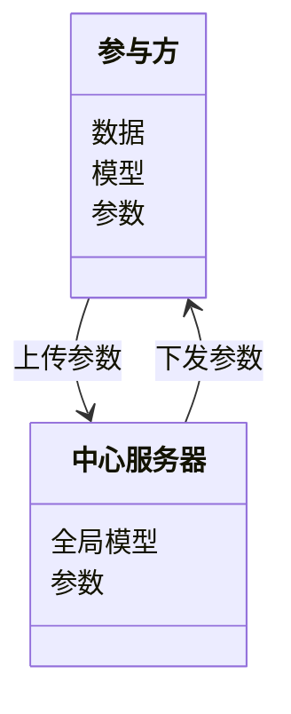
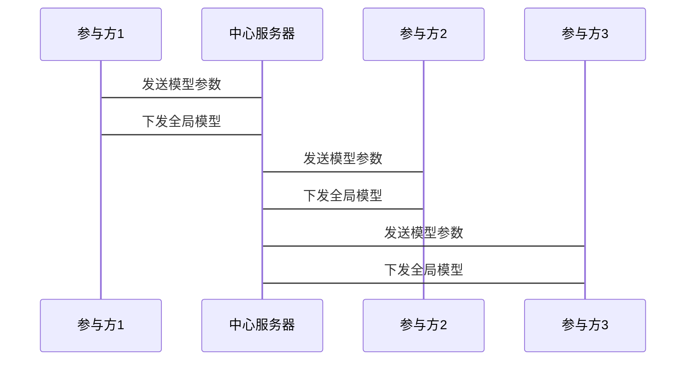

                 


---

# 《金融领域联邦学习在隐私保护中的应用》

---

## 关键词：
联邦学习、隐私保护、金融数据、人工智能、机器学习、数据安全、分布式计算

---

## 摘要：
本文详细探讨了联邦学习在金融领域隐私保护中的应用。通过分析联邦学习的核心概念、算法原理和系统架构，结合实际案例，展示了如何在保护数据隐私的前提下进行高效的金融模型训练。文章还介绍了联邦学习在金融风控、客户画像等场景中的具体应用，提出了系统设计的最佳实践和未来发展方向。

---

# 第1章: 背景介绍与核心概念

## 1.1 联邦学习的起源与发展

### 1.1.1 联邦学习的起源
联邦学习（Federated Learning）是一种分布式机器学习方法，旨在在不共享原始数据的情况下训练模型。其起源可以追溯到2016年Google提出的Federated Learning of Cohorts（FLC）框架，主要用于移动设备上的模型训练。

### 1.1.2 联邦学习的核心理念
联邦学习的核心理念是“数据不动，模型动”，即数据保持在原始设备或服务器上，只有模型参数在服务器之间进行同步和更新。

### 1.1.3 联邦学习在隐私保护中的作用
在金融领域，数据隐私保护尤为重要。联邦学习通过局部模型训练和参数聚合，避免了数据的直接共享，从而有效保护了用户隐私。

---

## 1.2 金融领域隐私保护的挑战

### 1.2.1 金融数据的敏感性
金融数据通常包含用户的个人信息、交易记录等敏感信息，这些数据一旦泄露，可能导致严重的经济损失和声誉损害。

### 1.2.2 金融行业隐私保护的法规要求
金融行业受到严格的隐私保护法规约束，如《通用数据保护条例》（GDPR）和《加州消费者隐私法案》（CCPA），要求金融机构必须采取严格的隐私保护措施。

### 1.2.3 联邦学习在金融领域的应用现状
目前，联邦学习在金融领域的应用主要集中在风控模型训练、客户画像构建等方面，但其大规模应用仍面临技术挑战。

---

## 1.3 本章小结

### 1.3.1 联邦学习的核心概念
联邦学习是一种分布式机器学习方法，通过模型参数的同步和更新，实现数据不出域的模型训练。

### 1.3.2 金融隐私保护的痛点
金融数据的敏感性和严格的隐私法规要求，使得传统的数据共享方式难以满足隐私保护的需求。

### 1.3.3 联邦学习的解决方案
通过联邦学习技术，可以在保护数据隐私的前提下，实现金融模型的高效训练和优化。

---

# 第2章: 联邦学习的核心概念与原理

## 2.1 联邦学习的定义与特点

### 2.1.1 联邦学习的定义
联邦学习是一种分布式机器学习方法，通过多个参与方协作训练模型，但数据不出域。

### 2.1.2 联邦学习的核心特点
- 数据本地化：数据不离开原始设备或服务器。
- 模型协作：模型参数在参与方之间同步和更新。
- 隐私保护：通过数据加密和差分隐私等技术保护数据隐私。

---

## 2.2 联邦学习的分类

### 2.2.1 横向联邦学习
横向联邦学习适用于数据特征相同但分布不同的场景，例如多个金融机构共享相同的客户特征，但数据分布不同。

### 2.2.2 纵向联邦学习
纵向联邦学习适用于数据特征不同但分布相关的场景，例如不同的金融机构共享不同的客户特征，但数据分布相关。

---

## 2.3 联邦学习的核心要素

### 2.3.1 数据分割策略
- 数据分割：将数据分成多个子集，每个子集在不同的参与方上。
- 数据平衡：确保每个子集的数据分布相似，以避免模型偏见。

### 2.3.2 模型同步机制
- 参数同步：定期将模型参数从参与方同步到中心服务器。
- 参数聚合：在中心服务器上聚合所有参与方的模型参数，生成全局模型。

### 2.3.3 权重更新方法
- 模型更新：基于本地数据训练模型，并更新模型参数。
- 参数聚合：将所有参与方的模型参数进行加权聚合，生成全局模型。

---

## 2.4 联邦学习的数学模型与公式

### 2.4.1 联邦学习的基本数学模型
$$ L_i(\theta) = \frac{1}{n_i}\sum_{j=1}^{n_i} \ell(\theta, x_j, y_j) $$
其中，$L_i(\theta)$ 是第i个参与方的损失函数，$n_i$ 是第i个参与方的样本数量，$\ell$ 是损失函数。

### 2.4.2 模型权重更新公式
$$ \theta_{\text{new}} = \theta_{\text{old}} + \sum_{i=1}^k \alpha_i (\theta_i - \theta_{\text{old}}) $$
其中，$\theta_{\text{new}}$ 是更新后的模型参数，$\alpha_i$ 是第i个参与方的权重，$\theta_i$ 是第i个参与方的模型参数。

### 2.4.3 联邦聚合算法
$$ \theta_{\text{global}} = \frac{1}{k}\sum_{i=1}^k \theta_i $$
其中，$\theta_{\text{global}}$ 是全局模型参数，$k$ 是参与方的数量。

---

# 第3章: 联邦学习的算法原理

## 3.1 联邦学习的算法流程

### 3.1.1 数据预处理
- 数据清洗：去除噪声数据，处理缺失值。
- 数据分割：将数据分成训练集和测试集。

### 3.1.2 模型初始化
- 初始化模型参数：随机初始化模型参数。
- 分配数据到参与方：将数据分配到不同的参与方。

### 3.1.3 模型训练与更新
- 每个参与方基于本地数据训练模型，并更新模型参数。
- 模型参数通过安全通信通道传输到中心服务器。

### 3.1.4 模型聚合与优化
- 中心服务器聚合所有参与方的模型参数，生成全局模型。
- 全局模型参数分发给所有参与方，进行下一轮训练。

---

## 3.2 联邦学习的数学模型

### 3.2.1 模型权重更新公式
$$ \theta_{i}^{(t+1)} = \theta_{i}^{(t)} + \eta \cdot \nabla L_i(\theta_i^{(t)}) $$
其中，$\theta_{i}^{(t)}$ 是第i个参与方在第t轮的模型参数，$\eta$ 是学习率，$\nabla L_i$ 是第i个参与方的损失函数梯度。

### 3.2.2 联邦聚合算法
$$ \theta_{\text{global}}^{(t+1)} = \frac{1}{k}\sum_{i=1}^k \theta_i^{(t+1)} $$
其中，$\theta_{\text{global}}^{(t+1)}$ 是第t+1轮的全局模型参数，$k$ 是参与方的数量。

### 3.2.3 模型收敛性分析
- 模型收敛性：随着轮数的增加，全局模型参数会逐渐收敛到最优解。
- 模型稳定性：联邦学习的模型收敛速度和稳定性取决于参与方的数据分布和模型复杂度。

---

## 3.3 联邦学习的算法实现

### 3.3.1 联邦学习的Python实现
```python
import numpy as np
import math

def train_local_model(theta, X, y, eta):
    # 计算损失函数梯度
    grad = (2 * np.dot(X.T, (np.dot(X, theta) - y))) / len(X)
    # 更新模型参数
    theta_new = theta - eta * grad
    return theta_new

# 初始化模型参数
theta = np.random.randn(1, 1)
eta = 0.01

# 数据预处理
X = np.array([[1, 2], [3, 4], [5, 6]])
y = np.array([[7], [8], [9]])

# 模型训练与更新
for _ in range(100):
    theta = train_local_model(theta, X, y, eta)
    print("模型参数:", theta)
```

### 3.3.2 模型训练过程示例
```python
# 初始化模型参数
theta = np.zeros((1, 1))
eta = 0.01

# 数据预处理
X = np.array([[1, 2], [3, 4], [5, 6]])
y = np.array([[7], [8], [9]])

# 模型训练与更新
for _ in range(100):
    # 计算损失函数梯度
    grad = (2 * np.dot(X.T, (np.dot(X, theta) - y))) / len(X)
    # 更新模型参数
    theta_new = theta - eta * grad
    theta = theta_new
    print("模型参数:", theta)
```

### 3.3.3 模型评估与优化
```python
# 计算模型预测值
y_pred = np.dot(X, theta)
# 计算均方误差
mse = np.mean((y_pred - y) ** 2)
print("均方误差:", mse)
```

---

# 第4章: 联邦学习在金融领域的系统架构设计

## 4.1 系统架构概述

### 4.1.1 系统组成
- 参与方：多个金融机构或数据源。
- 中心服务器：负责模型参数的聚合和分发。
- 客户端：负责本地数据的训练和模型更新。

### 4.1.2 系统功能
- 数据预处理：清洗、分割和加密。
- 模型训练：本地模型训练和参数更新。
- 模型聚合：全局模型参数的聚合和优化。
- 模型部署：将全局模型部署到参与方，进行预测和评估。

---

## 4.2 系统功能设计

### 4.2.1 领域模型mermaid类图


### 4.2.2 系统架构设计mermaid架构图
```mermaid
graph TD
    A[参与方1] --> B[中心服务器]
    C[参与方2] --> B
    D[参与方3] --> B
    B --> A: 下发全局模型
    B --> C: 下发全局模型
    B --> D: 下发全局模型
```

### 4.2.3 系统交互mermaid序列图


---

## 4.3 项目实战

### 4.3.1 环境安装
```bash
pip install numpy matplotlib scikit-learn
```

### 4.3.2 核心实现源代码
```python
import numpy as np

def train_local_model(theta, X, y, eta):
    grad = (2 * np.dot(X.T, (np.dot(X, theta) - y))) / len(X)
    theta_new = theta - eta * grad
    return theta_new

def main():
    theta = np.zeros((1, 1))
    eta = 0.01
    X = np.array([[1, 2], [3, 4], [5, 6]])
    y = np.array([[7], [8], [9]])
    
    for _ in range(100):
        theta = train_local_model(theta, X, y, eta)
        print("模型参数:", theta)
    
    y_pred = np.dot(X, theta)
    mse = np.mean((y_pred - y) ** 2)
    print("均方误差:", mse)

if __name__ == "__main__":
    main()
```

### 4.3.3 代码应用解读与分析
- 代码实现了一个简单的线性回归模型，展示了联邦学习的基本训练过程。
- 通过逐步更新模型参数，最终得到全局模型，并计算均方误差作为模型评估指标。

---

## 4.4 本章小结

### 4.4.1 系统架构设计
- 参与方本地训练模型，中心服务器聚合模型参数，实现数据不出域的模型训练。

### 4.4.2 系统功能实现
- 数据预处理、模型训练、参数聚合和模型部署等模块的实现。

### 4.4.3 项目实战总结
- 通过实际案例展示了联邦学习在金融领域的应用，验证了其在隐私保护下的高效性。

---

# 第5章: 联邦学习在金融领域的最佳实践

## 5.1 金融领域中的联邦学习应用

### 5.1.1 金融风控模型
- 应用场景：多个金融机构共享客户信用数据，构建联合风控模型。
- 实现方案：采用横向联邦学习，确保数据不出域，同时提高模型的准确性和泛化能力。

### 5.1.2 客户画像构建
- 应用场景：多个金融机构共享客户行为数据，构建客户画像。
- 实现方案：采用纵向联邦学习，保护客户隐私的同时，提高画像的精细度。

---

## 5.2 联邦学习的优化策略

### 5.2.1 数据预处理优化
- 数据清洗：去除噪声数据，处理缺失值。
- 数据增强：通过数据合成技术，增加数据多样性。

### 5.2.2 模型优化策略
- 模型选择：选择适合联邦学习的模型，如线性回归、逻辑回归等。
- 模型优化：通过调整学习率、批次大小等超参数，提高模型的收敛速度和精度。

---

## 5.3 注意事项

### 5.3.1 数据质量问题
- 数据分布不均衡可能导致模型偏见。
- 数据噪声会影响模型的准确性。

### 5.3.2 模型收敛问题
- 模型收敛速度慢可能影响训练效率。
- 模型不收敛可能需要调整算法参数或优化数据分布。

### 5.3.3 安全性问题
- 模型参数传输过程中的安全性问题。
- 参与方之间的信任问题。

---

## 5.4 未来发展方向

### 5.4.1 技术创新
- 研究更高效的模型聚合算法。
- 探索更强大的隐私保护技术，如同态加密、差分隐私等。

### 5.4.2 应用扩展
- 将联邦学习应用于更多金融场景，如欺诈检测、投资决策等。
- 探索联邦学习与其他技术的结合，如区块链、边缘计算等。

### 5.4.3 标准化与规范化
- 推动联邦学习技术的标准化。
- 建立统一的隐私保护规范和安全评估标准。

---

# 第6章: 总结与展望

## 6.1 本章总结

### 6.1.1 联邦学习的核心概念
- 数据不动，模型动。
- 模型参数同步，数据不出域。

### 6.1.2 金融领域隐私保护的挑战
- 金融数据的敏感性。
- 严格的隐私保护法规。

### 6.1.3 联邦学习的解决方案
- 通过联邦学习技术，在保护数据隐私的前提下，实现高效的数据利用。

---

## 6.2 未来展望

### 6.2.1 技术创新
- 研究更高效的模型聚合算法。
- 探索更强大的隐私保护技术。

### 6.2.2 应用扩展
- 将联邦学习应用于更多金融场景。
- 探索联邦学习与其他技术的结合。

### 6.2.3 标准化与规范化
- 推动联邦学习技术的标准化。
- 建立统一的隐私保护规范和安全评估标准。

---

# 作者：AI天才研究院/AI Genius Institute & 禅与计算机程序设计艺术 /Zen And The Art of Computer Programming

