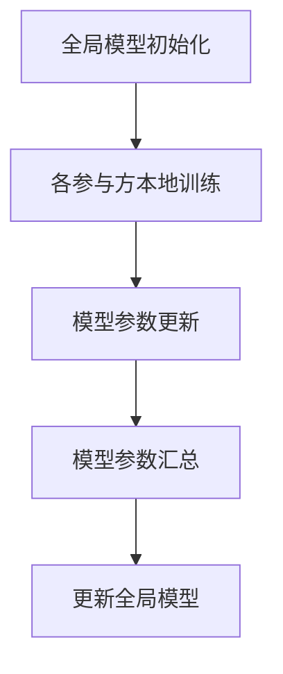
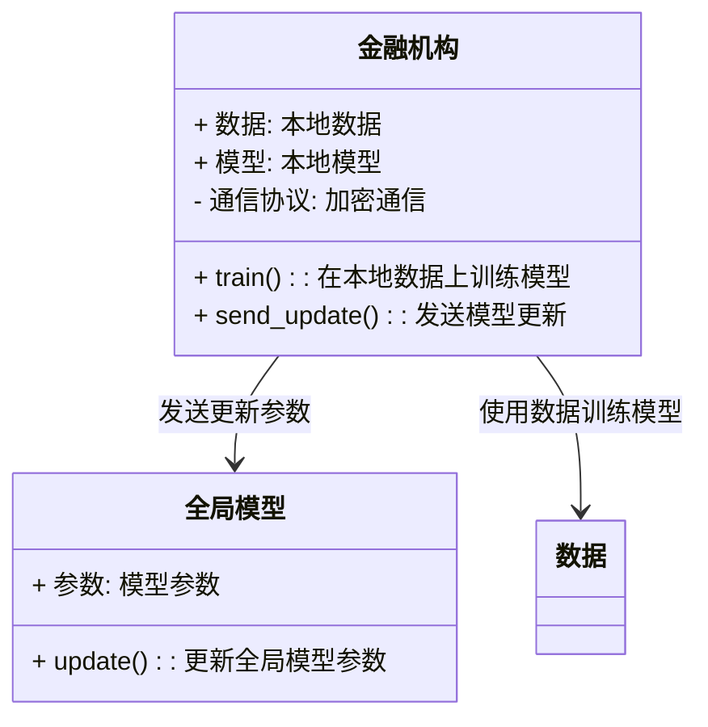
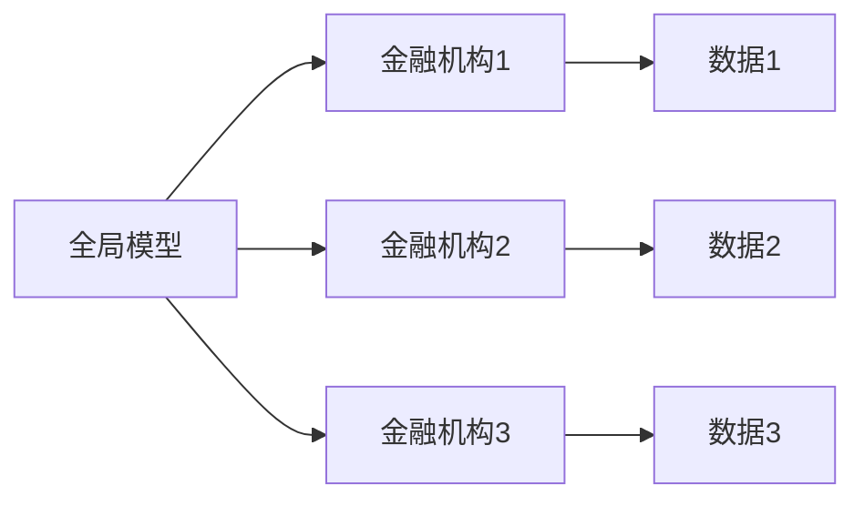
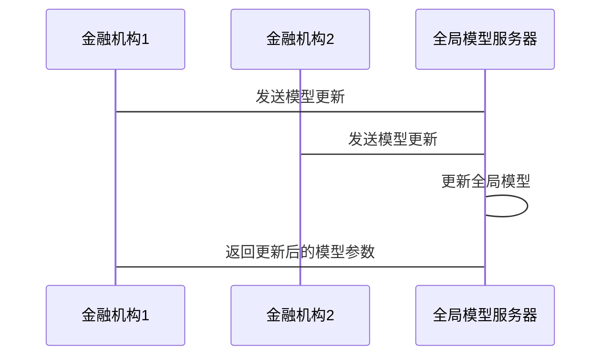

                 


# 《金融领域联邦学习的探索与实践》

---

## 关键词
- 联邦学习
- 金融领域
- 数据隐私
- 联合建模
- 分布式机器学习

---

## 摘要
随着金融行业对数据驱动决策的需求不断增长，数据隐私和安全成为金融机构面临的重大挑战。联邦学习作为一种新兴的分布式机器学习技术，能够在不共享原始数据的情况下，通过加密通信和联邦优化实现模型的联合训练。本文深入探讨联邦学习在金融领域的应用，从背景、原理到实践，系统性地分析其核心概念、算法实现和实际案例。通过详细的技术分析和实践指导，本文为金融领域的技术人员提供理论支持和实践参考。

---

## 目录大纲
1. [背景介绍](#背景介绍)
2. [核心概念与联系](#核心概念与联系)
3. [算法原理](#算法原理)
4. [系统分析与架构设计](#系统分析与架构设计)
5. [项目实战](#项目实战)
6. [最佳实践与总结](#最佳实践与总结)

---

## 第1章：背景介绍

### 1.1 联邦学习的背景

#### 1.1.1 数据隐私与安全的重要性
在金融领域，数据隐私和安全是重中之重。金融机构处理大量敏感数据，包括客户信息、交易记录等。如何在保护数据隐私的前提下进行数据共享和模型训练，成为金融机构面临的关键问题。

#### 1.1.2 金融领域数据共享的挑战
传统的数据共享方式通常需要将数据集中到一个地方进行处理，这不仅增加了数据泄露的风险，还可能触犯数据隐私保护的法律法规。金融机构之间的数据孤岛问题严重，限制了联合建模和共同优化的可能性。

#### 1.1.3 联邦学习的提出与目标
联邦学习（Federated Learning）是一种分布式机器学习技术，允许多个参与方在不共享原始数据的情况下，通过加密通信和分布式计算共同训练模型。其目标是在保护数据隐私的前提下，实现跨机构的联合建模和优化。

### 1.2 问题描述

#### 1.2.1 金融机构间的数据孤岛问题
由于数据隐私和安全的限制，金融机构之间难以共享数据，导致各自的数据孤岛现象严重，限制了跨机构的联合分析和建模能力。

#### 1.2.2 数据隐私保护的法律要求
全球范围内的数据隐私保护法规（如GDPR）要求金融机构必须在处理数据时严格遵守隐私保护原则，未经授权不得将数据共享给第三方。

#### 1.2.3 联邦学习如何解决这些问题
联邦学习通过加密通信和分布式计算，使得各参与方可以在本地数据上进行模型训练，无需共享原始数据，从而在保护隐私的同时实现联合建模。

### 1.3 问题解决

#### 1.3.1 联邦学习的核心思想
联邦学习的核心思想是通过在各个参与方本地进行模型训练，并通过加密通信机制同步模型参数，最终在所有参与方之间形成一个统一的全局模型。

#### 1.3.2 联邦学习的关键特性
- **数据局部性**：数据仅在本地进行处理，不共享原始数据。
- **通信加密**：通过加密技术确保模型更新过程中的数据安全。
- **联合优化**：通过分布式优化算法，实现全局模型的联合训练。

---

## 第2章：核心概念与联系

### 2.1 联邦学习的核心概念

#### 2.1.1 数据隐私与安全
联邦学习通过加密技术（如同态加密、差分隐私）确保数据在传输和计算过程中的隐私性。

#### 2.1.2 联邦优化与分布式计算
联邦学习采用分布式优化算法（如联邦平均算法），在各参与方本地优化模型，并通过通信协议同步模型参数。

#### 2.1.3 联合建模与模型共享
联邦学习允许多个参与方共同训练一个全局模型，同时保护各自的本地数据不被泄露。

### 2.2 核心概念对比

#### 2.2.1 联邦学习与其他分布式学习方法的对比

| **特性**          | **联邦学习**         | **分布式学习**       |
|--------------------|----------------------|----------------------|
| 数据共享方式       | 不共享原始数据       | 可能共享数据或模型   |
| 隐私保护           | 强重视               | 取决于具体实现         |
| 通信成本           | 较高                 | 较低                 |
| 应用场景           | 金融、医疗等隐私敏感领域 | 通用分布式场景       |

#### 2.2.2 联邦学习与数据孤岛的关系

| **关系**          | **联邦学习**         | **数据孤岛**          |
|--------------------|----------------------|-----------------------|
| 是否共享数据       | 不共享原始数据       | 数据孤岛，无法共享    |
| 是否能联合建模     | 可以                 | 无法                  |
| 解决方式           | 联邦学习             | 数据共享或联邦学习    |

### 2.3 实体关系图

```mermaid
er
title 实体关系图
classDiagram

actor 金融机构 : 金融机构
actor 数据 : 本地数据
actor 模型 : 全局模型

金融机构 --> 数据: 使用本地数据进行模型训练
金融机构 --> 模型: 参与全局模型的联合优化
数据 --> 模型: 数据驱动模型更新
```

---

## 第3章：算法原理

### 3.1 联邦学习的算法流程

#### 3.1.1 模型初始化
全局模型在各参与方本地初始化，通常采用随机初始化或预训练模型。

#### 3.1.2 分布式训练
各参与方在本地数据上进行模型训练，采用本地优化算法（如随机梯度下降）更新模型参数。

#### 3.1.3 模型同步
通过通信协议将各参与方的模型参数更新汇总，形成新的全局模型。

### 3.2 算法流程图



### 3.3 算法实现代码

```python
import numpy as np

def local_train(data, model, optimizer, epochs):
    for epoch in range(epochs):
        for X, y in data:
            prediction = model.predict(X)
            loss = loss_function(y, prediction)
            optimizer.zero_grad()
            loss.backward()
            optimizer.step()
    return model.state_dict()

def aggregate_parameters(participant_states):
    aggregated = {}
    for key in participant_states[0]:
        aggregated[key] = np.mean([p[key] for p in participant_states])
    return aggregated

# 示例用法
model = MyModel()
data = [...]  # 各参与方的本地数据
participants = 5
states = [local_train(data[i], model, optimizer, epochs) for i in range(participants)]
global_state = aggregate_parameters(states)
global_model.load_state_dict(global_state)
```

### 3.4 数学模型

#### 损失函数
$$ L(y, \hat{y}) = \frac{1}{n}\sum_{i=1}^{n}(y_i - \hat{y}_i)^2 $$

#### 优化器
$$ \theta_{t+1} = \theta_t - \eta \cdot \nabla_\theta L(\theta_t) $$

#### 联邦平均
$$ \theta_{\text{global}} = \frac{1}{K}\sum_{k=1}^{K}\theta_k $$

其中，$\theta_k$ 是第 $k$ 个参与方的模型参数，$K$ 是参与方总数。

---

## 第4章：系统分析与架构设计

### 4.1 问题场景

- **金融机构**：多个金融机构需要联合训练风险评估模型。
- **数据隐私**：各机构的数据不能被其他机构访问。
- **通信协议**：需要安全的通信机制保证模型更新的安全性。

### 4.2 系统功能设计

#### 4.2.1 领域模型类图



#### 4.2.2 系统架构图



### 4.3 系统接口设计

- **API接口**：
  - `POST /train`: 发送模型更新
  - `GET /model`: 获取全局模型参数
  - `PUT /participant`: 添加新参与方

### 4.4 系统交互流程

#### 4.4.1 序列图



---

## 第5章：项目实战

### 5.1 环境安装

```bash
pip install numpy
pip install torch
pip install matplotlib
```

### 5.2 系统核心实现

#### 5.2.1 数据预处理

```python
import numpy as np

def preprocess_data(data):
    # 数据清洗和特征工程
    processed_data = []
    for d in data:
        processed_data.append((d['features'], d['label']))
    return processed_data
```

#### 5.2.2 模型训练

```python
import torch
import torch.nn as nn
import torch.optim as optim

class SimpleModel(nn.Module):
    def __init__(self, input_dim):
        super(SimpleModel, self).__init__()
        self.linear = nn.Linear(input_dim, 1)

    def forward(self, x):
        return self.linear(x)

model = SimpleModel(input_dim=10)
optimizer = optim.SGD(model.parameters(), lr=0.01)
```

#### 5.2.3 联邦优化

```python
def federated_learning(participants, model, optimizer, epochs):
    for epoch in range(epochs):
        for participant in participants:
            # 在本地训练
            local_train(participant.data, model, optimizer, 1)
        # 同步模型参数
        global_state = aggregate_parameters(participant.states)
        model.load_state_dict(global_state)
```

### 5.3 案例分析

#### 5.3.1 实际案例：风险评估模型

- **数据来源**：多家银行的客户交易记录。
- **模型目标**：预测客户信用风险。
- **联邦学习应用**：各银行在本地训练模型，联合生成全局信用风险评估模型。

#### 5.3.2 代码实现

```python
# 初始化全局模型
global_model = SimpleModel(input_dim=10)

# 启动联邦学习
participants = [...]  # 各参与方
federated_learning(participants, global_model, optimizer, epochs=10)
```

---

## 第6章：最佳实践与总结

### 6.1 最佳实践

#### 6.1.1 数据隐私保护
- 使用同态加密或差分隐私技术确保数据在传输和计算过程中的隐私性。
- 定期进行数据隐私审计，确保符合相关法律法规。

#### 6.1.2 模型优化
- 根据具体业务需求选择合适的模型架构和优化算法。
- 定期更新模型以适应数据分布的变化。

#### 6.1.3 通信效率
- 优化通信协议，减少数据传输量。
- 使用压缩技术减少模型更新的传输成本。

### 6.2 总结

联邦学习为金融领域的数据隐私保护和联合建模提供了新的解决方案。通过加密通信和分布式计算，联邦学习能够在保护数据隐私的前提下，实现跨机构的联合建模和优化。然而，联邦学习的实现和应用还面临诸多挑战，如通信效率、模型收敛性、数据异质性等，这些都需要进一步研究和优化。

---

## 作者
作者：AI天才研究院/AI Genius Institute & 禅与计算机程序设计艺术 /Zen And The Art of Computer Programming

---

通过以上内容，我们系统性地探讨了联邦学习在金融领域的应用，从背景到实践，为读者提供了全面的技术指导和实践参考。希望本文能为金融领域的技术人员在数据隐私保护和联合建模方面提供有价值的见解和启发。

