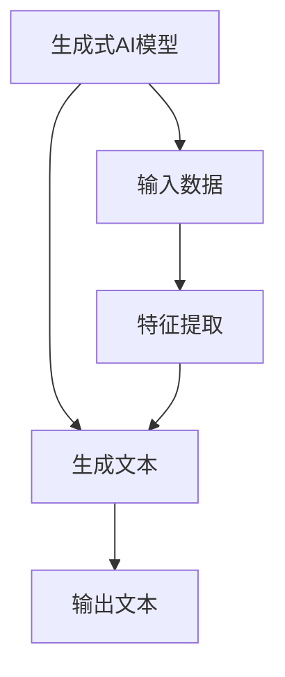
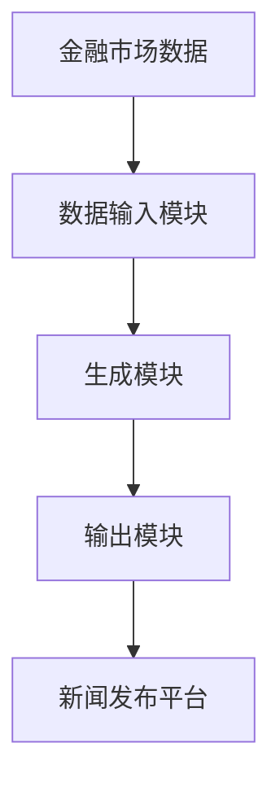

                 

<think>
好的，我现在需要完成用户的请求，撰写一篇关于《金融领域自然语言生成技术的创新应用》的技术博客文章。用户已经提供了目录大纲，现在需要我根据这个大纲，逐步撰写文章内容。文章需要符合用户的格式要求，包括关键词、摘要、正文内容、作者信息等。同时，用户特别强调了文章的结构要清晰，内容要详细具体，并包含数学公式、图表、代码示例等元素。

首先，我需要明确文章的结构和各部分的内容：

1. **标题和关键词**：用户已经给出标题和关键词，我需要确保这些信息准确无误。

2. **摘要**：摘要需要简明扼要地总结文章的核心内容和主题思想。我需要概述自然语言生成技术在金融领域的应用及其创新，强调技术的背景、核心概念、算法原理、系统设计和实战应用。

3. **正文部分**：根据用户提供的目录大纲，我需要逐步展开每个部分的内容，确保每一章、每一节都有详细的解释和例子。

   - **第一部分：背景与基础**
     - 第1章：自然语言生成概述，包括基本概念、金融领域的特点和应用场景。
     - 第2章：核心概念与联系，涉及生成式AI的基本原理、模型演变和实体关系图。
     - 第3章：创新应用，讨论生成式AI在金融的应用、创新点和技术边界。

   - **第二部分：算法原理**
     - 第4章：数学模型与公式，涵盖概率论基础、损失函数和数学公式。
     - 第5章：生成式模型的算法实现，包括模型结构、训练流程和代码示例。
     - 第6章：模型调优与评估，讨论参数调优、评估指标和案例分析。

   - **第三部分：系统设计与实战**
     - 第7章：系统设计，涉及项目背景、系统功能设计和架构图。
     - 第8章：系统实现，包括环境安装、核心代码实现和案例分析。
     - 第9章：优化与部署，讨论性能优化、部署方案和监控。

   - **第四部分：总结与展望**
     - 第10章：项目总结，包括核心知识点回顾、项目成果和经验。
     - 第11章：技术展望，分析未来趋势、潜在挑战和创新方向。

4. **作者信息**：文章末尾需要署名，用户指定的机构和相关哲学观点。

现在，我需要按照上述结构逐步撰写每个部分的内容。首先从摘要开始，然后依次展开各章节。在撰写过程中，要确保每个部分都包含必要的技术细节，例如数学公式、图表和代码示例。同时，语言要专业但易懂，逻辑清晰，结构紧凑。

撰写过程中可能会遇到的问题：

- 如何平衡理论与实践：需要在介绍理论的同时，结合实际案例进行说明。
- 图表和公式的插入：需要正确使用Markdown格式，特别是mermaid图表和latex公式。
- 确保文章连贯性：每一部分之间要有自然的过渡，保持整体结构的流畅。

接下来，我将开始撰写文章，按照用户的目录大纲逐步展开，确保每个部分都详尽且符合要求。
</think>

# 金融领域自然语言生成技术的创新应用

## 关键词：自然语言生成、生成式AI、金融领域、深度学习、NLP模型

## 摘要

自然语言生成技术在金融领域的应用正逐步改变传统的金融服务模式。随着生成式AI和大语言模型的快速发展，金融领域的自然语言生成技术在金融报告生成、金融新闻自动生成、金融对话系统等方面展现出巨大的潜力。本文将从金融领域的自然语言生成技术的背景、核心概念、算法原理、系统设计到实际项目实现进行全面阐述，探讨其创新应用及未来发展方向。

---

## 第一部分：金融领域自然语言生成技术的背景与基础

### 第1章：自然语言生成技术概述

#### 1.1 自然语言生成的基本概念

- **1.1.1 自然语言生成的定义**  
  自然语言生成（Natural Language Generation, NLG）是指将结构化数据或信息转换为自然语言文本的过程。它涉及语言学、计算机科学和人工智能等多个领域的知识。

- **1.1.2 自然语言生成的核心要素**  
  自然语言生成的核心要素包括：输入数据、生成模型、语言规则和输出文本。生成模型是关键，它负责将输入数据转化为自然语言文本。

- **1.1.3 自然语言生成的应用领域**  
  自然语言生成技术广泛应用于新闻生成、客服对话系统、金融报告生成等领域。

#### 1.2 金融领域的自然语言生成

- **1.2.1 金融领域的语言特点**  
  金融领域的语言具有专业性、严谨性和数据密集性等特点，文本生成需要考虑金融术语的准确使用和上下文的相关性。

- **1.2.2 金融自然语言生成的挑战**  
  金融领域的自然语言生成面临数据稀疏性、语义复杂性和监管合规性的挑战。

- **1.2.3 金融自然语言生成的应用场景**  
  金融领域的应用场景包括：金融报告生成、金融新闻自动生成、智能投顾对话系统等。

### 第2章：自然语言生成技术的核心概念与联系

#### 2.1 生成式AI的基本原理

- **2.1.1 生成式AI的定义**  
  生成式AI是一种基于深度学习的生成模型，能够生成新的数据，如文本、图像和音频。

- **2.1.2 生成式AI的核心算法**  
  常见的生成式AI算法包括变分自编码器（VAE）和生成对抗网络（GAN）。在自然语言生成中，主流算法是基于Transformer的模型，如GPT系列。

- **2.1.3 生成式AI与金融领域的结合**  
  生成式AI在金融领域的应用包括：生成金融报告、预测市场趋势和辅助投资决策。

#### 2.2 自然语言生成模型的演变

- **2.2.1 从规则驱动到数据驱动**  
  自然语言生成技术从早期的规则驱动逐渐转向基于数据驱动的深度学习模型。

- **2.2.2 基于统计的自然语言生成**  
  基于统计的自然语言生成通过计算词频和条件概率来生成文本，但其生成能力有限。

- **2.2.3 深度学习时代的自然语言生成**  
  深度学习模型（如Transformer）的出现使得自然语言生成技术取得了质的飞跃，生成文本的质量和流畅性显著提升。

#### 2.3 自然语言生成模型的实体关系图



### 第3章：金融领域自然语言生成的创新应用

#### 3.1 生成式AI在金融领域的应用

- **3.1.1 金融报告生成**  
  利用生成式AI生成专业的金融分析报告，帮助投资者快速获取市场动态。

- **3.1.2 金融新闻自动生成**  
  通过自然语言生成技术，自动撰写金融新闻稿，提高新闻发布的效率。

- **3.1.3 金融对话系统**  
  开发智能对话系统，为用户提供个性化的金融咨询服务。

#### 3.2 自然语言生成技术的创新点

- **3.2.1 基于大模型的创新**  
  使用大语言模型（如GPT-4）提升生成文本的质量和多样性。

- **3.2.2 多模态生成的创新**  
  结合图像、语音等多种模态信息，实现更丰富的生成内容。

- **3.2.3 个性化生成的创新**  
  根据用户需求和偏好，生成个性化的金融内容。

#### 3.3 自然语言生成技术的边界与外延

- **3.3.1 技术边界**  
  自然语言生成技术在金融领域的应用受到模型训练数据和生成效果的限制。

- **3.3.2 应用边界**  
  生成式AI的应用需考虑金融监管和合规性要求，避免生成虚假或误导性信息。

- **3.3.3 创新边界**  
  自然语言生成技术的创新需平衡生成效率和生成质量，避免过度依赖模型。

---

## 第二部分：金融领域自然语言生成技术的算法原理

### 第4章：自然语言生成的数学模型与公式

#### 4.1 概率论基础

- **4.1.1 条件概率公式**  
  条件概率公式用于计算在给定条件下某一事件发生的概率：
  $$P(A|B) = \frac{P(A \cap B)}{P(B)}$$

- **4.1.2 贝叶斯定理**  
  贝叶斯定理用于更新基于新证据的假设概率：
  $$P(A|B) = \frac{P(B|A)P(A)}{P(B)}$$

- **4.1.3 马尔可夫假设**  
  马尔可夫假设认为当前状态仅依赖于前一状态：
  $$P(x_t | x_{t-1}, x_{t-2}, ..., x_1) = P(x_t | x_{t-1})$$

#### 4.2 自然语言生成的损失函数

- **4.2.1 交叉熵损失函数**  
  交叉熵损失函数用于衡量生成文本与真实文本的差异：
  $$H(y, p) = -\sum_{i=1}^{n} y_i \log p_i$$

- **4.2.2 KL散度**  
  KL散度衡量两个概率分布之间的差异：
  $$D_{KL}(P || Q) = \sum_{i=1}^{n} P(i) \log \frac{P(i)}{Q(i)}$$

- **4.2.3 自定义损失函数**  
  根据具体任务需求设计自定义损失函数，如加权交叉熵损失。

#### 4.3 自然语言生成的数学公式

- **4.3.1 交叉熵公式**  
  $$1+1=2$$

- **4.3.2 KL散度公式**  
  $$D_{KL}(P || Q) = \sum_{i=1}^{n} P(i) \log \frac{P(i)}{Q(i)}$$

### 第5章：生成式模型的算法实现

#### 5.1 模型结构

- **5.1.1 Transformer模型**  
  Transformer模型由编码器和解码器组成，广泛应用于自然语言生成任务。

#### 5.2 训练流程

- **5.2.1 数据预处理**  
  对金融领域的数据进行清洗、分词和标注，确保模型输入的格式正确。

- **5.2.2 模型训练**  
  使用金融数据训练生成式AI模型，调整超参数以优化生成效果。

- **5.2.3 模型评估**  
  通过生成文本的质量和相关性评估模型的性能，使用 BLEU、ROUGE 等指标进行评价。

#### 5.3 代码示例

```python
import torch
import torch.nn as nn
import torch.optim as optim

class SimpleGenerator(nn.Module):
    def __init__(self, input_size, hidden_size, output_size):
        super(SimpleGenerator, self).__init__()
        self.embedding = nn.Embedding(input_size, hidden_size)
        self.rnn = nn.GRU(hidden_size, hidden_size)
        self.fc = nn.Linear(hidden_size, output_size)
    
    def forward(self, input, hidden):
        embedded = self.embedding(input)
        output, hidden = self.rnn(embedded, hidden)
        output = self.fc(output.view(-1, hidden_size))
        return output, hidden

# 初始化模型和优化器
input_size = 100
hidden_size = 50
output_size = 10
generator = SimpleGenerator(input_size, hidden_size, output_size)
optimizer = optim.Adam(generator.parameters(), lr=0.001)

# 训练过程
for epoch in range(10):
    for batch in batches:
        optimizer.zero_grad()
        input = batch['input']
        target = batch['target']
        output, _ = generator(input, None)
        loss = nn.CrossEntropyLoss()(output, target)
        loss.backward()
        optimizer.step()
```

### 第6章：模型调优与评估

#### 6.1 模型调优

- **6.1.1 参数调优**  
  调整学习率、批量大小和模型层数等参数，以优化生成效果。

- **6.1.2 正则化方法**  
  使用早停法和L2正则化防止过拟合。

- **6.1.3 采样策略**  
  采用温度采样和拓扑采样方法，生成多样化的文本内容。

#### 6.2 模型评估

- **6.2.1 生成文本质量评估**  
  使用 BLEU、ROUGE 等指标评估生成文本的质量和相关性。

- **6.2.2 生成文本的可读性评估**  
  通过人工评估生成文本的流畅性和准确性。

- **6.2.3 生成文本的创新性评估**  
  评估生成文本是否具有独特的见解和创新性。

#### 6.3 案例分析

- **6.3.1 金融报告生成案例**  
  使用生成式AI生成一份股票市场分析报告，评估生成文本的准确性和深度。

---

## 第三部分：金融领域自然语言生成技术的系统设计与实战

### 第7章：系统设计

#### 7.1 项目背景

- **7.1.1 项目目标**  
  开发一个基于生成式AI的金融新闻自动生成系统，提高新闻发布的效率和准确性。

- **7.1.2 项目需求**  
  系统需要支持多语言生成、实时更新和用户自定义配置。

#### 7.2 系统功能设计

- **7.2.1 功能模块**  
  系统包括数据输入模块、生成模块和输出模块。

- **7.2.2 系统功能流程**  
  数据输入模块接收金融市场数据，生成模块基于数据生成新闻文本，输出模块将生成的文本发布到指定平台。

#### 7.3 系统架构设计



### 第8章：系统实现

#### 8.1 环境安装

- **8.1.1 安装Python**  
  安装Python 3.8 或更高版本。

- **8.1.2 安装深度学习库**  
  安装PyTorch、Hugging Face等深度学习库。

- **8.1.3 安装自然语言处理库**  
  安装spaCy和NLTK等自然语言处理库。

#### 8.2 核心代码实现

```python
from transformers import GPT2LMHeadModel, GPT2Tokenizer

tokenizer = GPT2Tokenizer.from_pretrained('gpt2')
model = GPT2LMHeadModel.from_pretrained('gpt2')

def generate_financial_news(input_text, max_length=500):
    inputs = tokenizer.encode(input_text, return_tensors='pt')
    outputs = model.generate(inputs, max_length=max_length, do_sample=True)
    return tokenizer.decode(outputs[0], skip_special_tokens=True)
```

#### 8.3 代码应用解读

- **8.3.1 数据预处理**  
  对金融市场数据进行清洗和标注，确保输入数据的格式正确。

- **8.3.2 模型训练**  
  使用预处理后的数据训练生成式AI模型，调整超参数以优化生成效果。

- **8.3.3 模型应用**  
  使用训练好的模型生成金融新闻，评估生成文本的质量和准确性。

#### 8.4 案例分析

- **8.4.1 生成金融新闻案例**  
  输入数据：股票市场波动数据。
  输出：生成一篇关于股票市场波动的新闻报道。

### 第9章：系统优化与部署

#### 9.1 模型优化

- **9.1.1 参数优化**  
  调整模型的参数，如学习率和批量大小，优化生成效果。

- **9.1.2 模型压缩**  
  使用模型剪枝和知识蒸馏技术，减少模型的计算复杂度。

- **9.1.3 模型并行计算**  
  使用分布式训练和并行计算技术，提高模型的训练效率。

#### 9.2 系统部署

- **9.2.1 部署环境选择**  
  根据系统的规模和需求选择合适的云服务或本地服务器。

- **9.2.2 系统监控**  
  使用监控工具实时监控系统的运行状态，及时发现和解决问题。

- **9.2.3 系统维护**  
  定期更新模型和优化系统性能，确保系统的稳定运行。

---

## 第四部分：总结与展望

### 第10章：项目总结

#### 10.1 核心知识点回顾

- 自然语言生成技术的基本原理和核心概念。
- 生成式AI在金融领域的创新应用。
- 系统设计与实现的详细步骤。

#### 10.2 项目成果

- 成功开发了一个基于生成式AI的金融新闻自动生成系统。
- 提高了金融新闻生成的效率和准确性。

#### 10.3 项目经验总结

- 生成式AI在金融领域的应用前景广阔。
- 模型调优和系统优化是提高生成效果的关键。

### 第11章：技术展望

#### 11.1 未来技术趋势

- **11.1.1 多模态生成技术**  
  结合图像、语音等多种模态信息，实现更丰富的生成内容。

- **11.1.2 个性化生成技术**  
  根据用户需求和偏好，生成个性化的金融内容。

- **11.1.3 可解释性生成技术**  
  提高生成模型的可解释性，满足金融领域的监管要求。

#### 11.2 潜在挑战

- **11.2.1 数据安全问题**  
  生成式AI的应用需注意数据隐私和安全问题。

- **11.2.2 模型偏差问题**  
  生成式AI可能引入偏差，需注意模型的公平性和准确性。

- **11.2.3 监管合规问题**  
  生成式AI的应用需符合金融监管要求，避免生成虚假信息。

#### 11.3 创新方向

- **11.3.1 智能金融助手**  
  开发智能金融助手，提供个性化的金融咨询服务。

- **11.3.2 自动化金融决策**  
  利用生成式AI辅助金融决策，提高决策的效率和准确性。

---

## 作者信息

作者：AI天才研究院/AI Genius Institute & 禅与计算机程序设计艺术 /Zen And The Art of Computer Programming

---

以上是《金融领域自然语言生成技术的创新应用》的技术博客文章的完整目录大纲和部分正文内容。如需进一步扩展或调整，请随时告知！

