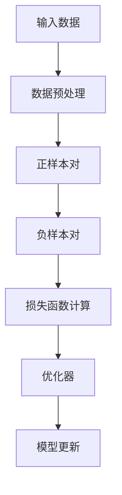
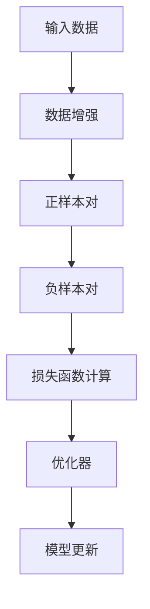
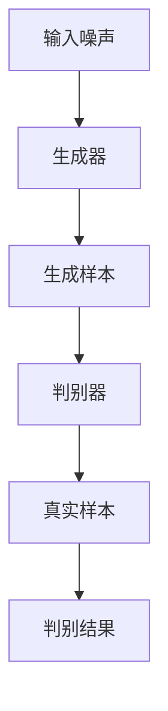
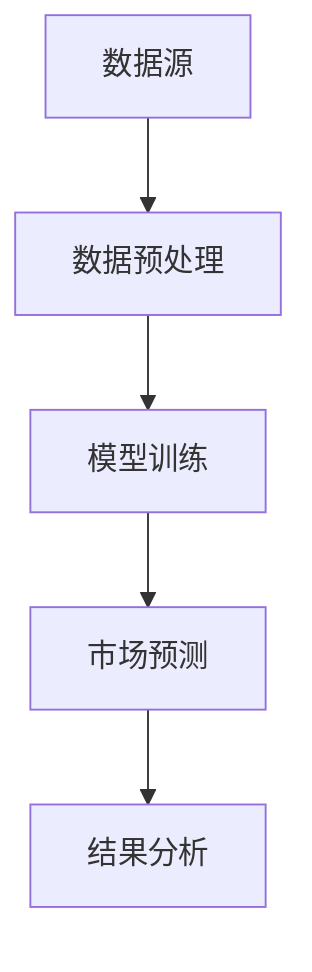
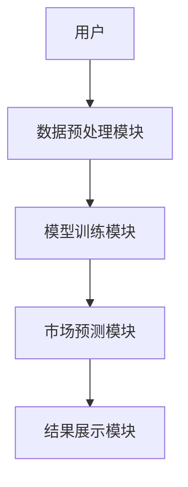

                 

<think>
好，我需要根据用户的要求，写一篇关于《金融领域自监督学习在市场预测中的应用》的技术博客。首先，我需要理解自监督学习在金融中的应用，然后逐步展开分析，包括核心概念、算法原理、系统架构设计，最后进行项目实战和总结。用户还特别强调要使用清晰、专业的技术语言，逻辑要严谨，结构要紧凑，所以我要确保每个部分都详细且有条理。

首先，我应该从背景介绍开始。金融市场预测一直是挑战性的问题，传统的方法依赖大量标注数据，但在实际中获取高质量的标注数据很困难。自监督学习作为一种新兴的技术，能够在无标签或弱标签的情况下进行学习，这在金融领域非常有应用潜力。

接下来，我需要详细介绍自监督学习的基本概念，包括对比学习和生成式模型。这两个方法是当前研究的热点，能够很好地捕捉数据中的潜在结构和分布，这对于金融市场预测非常有帮助。

然后，我要深入讲解算法的数学模型。比如对比学习中的损失函数，还有生成式模型中的GAN结构，通过公式和流程图来说明这些算法的工作原理。这部分需要确保公式正确，并用简单的例子来帮助读者理解。

在系统架构设计部分，我需要描述整个预测系统的构成。包括数据预处理、模型训练和预测模块，可能还要涉及数据流的架构图，让读者清楚整个系统的运作流程。

项目实战部分，我需要提供具体的代码示例，展示如何在实际中应用这些算法。比如使用对比学习训练模型，然后进行预测和结果分析。代码部分要详细，注释清晰，方便读者理解和复现。

最后，总结和展望部分，我要回顾整个内容，讨论当前研究的不足之处，并展望未来的发展方向。同时，加入一些最佳实践和注意事项，帮助读者在实际应用中避免常见问题。

整体来看，这篇博客需要从理论到实践，层层递进，帮助读者全面掌握自监督学习在金融预测中的应用。我要确保每一部分都涵盖必要的内容，同时保持整体结构的逻辑性和连贯性。现在，我可以开始根据这个思考过程撰写正式的回答。
</think>

# 《金融领域自监督学习在市场预测中的应用》

> **关键词**：自监督学习，金融市场预测，对比学习，生成式模型，深度学习，金融数据分析

> **摘要**：本文深入探讨了自监督学习在金融市场预测中的应用，分析了自监督学习的核心概念与算法原理，并结合实际案例展示了如何在金融领域中利用自监督学习技术进行市场预测。文章内容涵盖背景介绍、核心概念、算法原理、系统架构设计、项目实战以及总结与展望，为读者提供了一套完整的理论与实践相结合的解决方案。

---

# 第1章 自监督学习与金融市场预测概述

## 1.1 自监督学习的基本概念

### 1.1.1 自监督学习的定义与特点

自监督学习（Self-Supervised Learning, SSL）是一种新兴的机器学习范式，其核心思想是通过预测未标记数据中的某些属性来学习有用的特征表示。与传统的监督学习不同，自监督学习不需要大量标注数据，而是通过数据本身的结构信息进行学习。其主要特点包括：

1. **无监督性**：自监督学习的核心是利用未标记数据，通过构造伪标签或伪任务进行学习。
2. **对比学习**：通过对比正样本和负样本的相似性，学习数据的潜在结构。
3. **生成式模型**：通过生成对抗网络（GAN）等生成式模型，学习数据的分布。

### 1.1.2 自监督学习与监督学习的区别

| 对比维度 | 监督学习 | 自监督学习 |
|----------|----------|------------|
| 数据需求 | 需要大量标注数据 | 利用未标注数据，通过伪标签或任务进行学习 |
| 学习目标 | 直接优化预测任务 | 通过构造伪任务优化特征表示 |
| 适用场景 | 数据充足且标注容易 | 数据充足但标注困难 |

### 1.1.3 金融市场预测的基本概念与挑战

金融市场预测的核心目标是基于历史数据，预测未来的价格走势、市场趋势等。金融市场数据具有以下特点：

1. **高度波动性**：市场价格波动剧烈，难以预测。
2. **非线性关系**：价格受多种因素影响，包括经济指标、政策变化、市场情绪等。
3. **数据稀疏性**：某些市场或资产的历史数据有限，难以训练复杂的模型。

金融市场预测的挑战主要体现在以下几点：

1. **数据噪声**：金融市场数据中存在大量噪声，影响模型的准确性。
2. **模型过拟合**：在数据稀疏的情况下，模型容易过拟合训练数据，导致泛化能力差。
3. **实时性要求**：金融市场预测需要快速响应，对模型的计算效率要求较高。

## 1.2 自监督学习在金融领域的应用前景

### 1.2.1 金融数据的特性与复杂性

金融市场数据具有以下特性：

1. **多模态性**：数据来源广泛，包括价格、成交量、新闻情绪等。
2. **高维性**：金融市场数据通常具有高维性，难以直接用于模型训练。
3. **时间依赖性**：市场数据具有很强的时间依赖性，历史数据对预测未来有重要意义。

### 1.2.2 自监督学习在金融数据处理中的优势

自监督学习在金融数据处理中的优势主要体现在以下几点：

1. **减少数据标注成本**：自监督学习可以利用未标注数据进行学习，降低数据标注成本。
2. **捕捉数据潜在结构**：通过对比学习或生成式模型，可以捕捉数据中的潜在结构和分布。
3. **提高模型泛化能力**：自监督学习通过学习数据的潜在结构，可以提高模型的泛化能力，减少过拟合。

### 1.2.3 金融市场预测的典型应用场景

金融市场预测的典型应用场景包括：

1. **股票价格预测**：基于历史股价数据，预测未来股价走势。
2. **外汇市场预测**：基于历史汇率数据，预测未来汇率走势。
3. ** commodities预测**：基于历史大宗商品价格数据，预测未来价格走势。

## 1.3 本章小结

本章主要介绍了自监督学习的基本概念、特点以及在金融市场预测中的应用前景。通过对自监督学习与监督学习的对比分析，阐述了自监督学习在金融数据处理中的优势。同时，结合金融市场数据的特性与复杂性，探讨了自监督学习在金融市场预测中的典型应用场景。

---

# 第2章 自监督学习的核心概念与联系

## 2.1 自监督学习的核心原理

### 2.1.1 对比学习与生成式模型的对比分析

对比学习（Contrastive Learning）和生成式模型（Generative Models）是自监督学习的两大主要方法，两者在原理和应用上存在显著差异。

| 对比维度 | 对比学习 | 生成式模型 |
|----------|----------|------------|
| 学习目标 | 通过对比正样本和负样本，学习数据的潜在结构 | 通过生成数据，学习数据的分布 |
| 典型算法 | SimCLR、BYOL | GAN、VAE |

### 2.1.2 自监督学习的数学模型与公式

自监督学习的数学模型通常基于对比学习或生成式模型。以下是一些典型的自监督学习数学公式：

1. **对比学习的损失函数**：

$$ L = \frac{1}{N}\sum_{i=1}^{N} \text{loss}(x_i, x_j) $$

其中，$x_i$和$x_j$分别表示正样本和负样本。

2. **生成式模型的损失函数**（以GAN为例）：

$$ G_{loss} = -\mathbb{E}_{z}[ \log D(G(z))] $$
$$ D_{loss} = -\mathbb{E}_{x}[ \log D(x)] - \mathbb{E}_{z}[ \log (1 - D(G(z)))] $$

其中，$G$表示生成器，$D$表示判别器，$z$表示噪声向量。

### 2.1.3 对比学习与生成式模型的联系

对比学习和生成式模型在自监督学习中具有互补性。对比学习通过对比正样本和负样本，学习数据的潜在结构；生成式模型通过生成数据，学习数据的分布。两者可以结合使用，进一步提高模型的表征能力。

## 2.2 核心概念的对比与ER实体关系图

### 2.2.1 自监督学习与监督学习的对比表格

| 对比维度 | 自监督学习 | 监督学习 |
|----------|------------|----------|
| 数据需求 | 利用未标注数据 | 需要标注数据 |
| 学习目标 | 学习数据的潜在结构 | 直接优化预测任务 |
| 适用场景 | 数据充足但标注困难 | 数据充足且标注容易 |

### 2.2.2 自监督学习的ER实体关系图



---

# 第3章 自监督学习的算法原理与数学模型

## 3.1 对比学习算法的原理与流程

### 3.1.1 对比学习的损失函数公式

$$ L = \frac{1}{N}\sum_{i=1}^{N} \text{loss}(x_i, x_j) $$

其中，$x_i$和$x_j$分别表示正样本和负样本。

### 3.1.2 对比学习的流程图



## 3.2 生成式模型的算法原理与数学模型

### 3.2.1 GAN的生成器与判别器公式

$$ G_{loss} = -\mathbb{E}_{z}[ \log D(G(z))] $$
$$ D_{loss} = -\mathbb{E}_{x}[ \log D(x)] - \mathbb{E}_{z}[ \log (1 - D(G(z)))] $$

### 3.2.2 生成式模型的流程图



---

# 第4章 金融市场预测系统的系统分析与架构设计

## 4.1 问题场景介绍

### 4.1.1 金融数据的特征与挑战

金融市场数据具有以下特征：

1. **多模态性**：数据来源广泛，包括价格、成交量、新闻情绪等。
2. **高维性**：金融市场数据通常具有高维性，难以直接用于模型训练。
3. **时间依赖性**：市场数据具有很强的时间依赖性，历史数据对预测未来有重要意义。

### 4.1.2 市场预测的复杂性与不确定性

市场预测的复杂性主要体现在以下几点：

1. **数据噪声**：金融市场数据中存在大量噪声，影响模型的准确性。
2. **模型过拟合**：在数据稀疏的情况下，模型容易过拟合训练数据，导致泛化能力差。
3. **实时性要求**：金融市场预测需要快速响应，对模型的计算效率要求较高。

## 4.2 系统功能设计

### 4.2.1 数据预处理模块

数据预处理模块的主要功能包括：

1. **数据清洗**：去除噪声数据，填补缺失值。
2. **数据转换**：将数据转换为适合模型输入的格式。
3. **数据增强**：通过数据增强技术，增加数据的多样性。

### 4.2.2 模型训练模块

模型训练模块的主要功能包括：

1. **特征提取**：通过自监督学习技术，提取数据的潜在特征。
2. **模型训练**：基于提取的特征，训练预测模型。
3. **模型优化**：通过优化算法，提高模型的预测精度。

### 4.2.3 市场预测模块

市场预测模块的主要功能包括：

1. **实时预测**：基于最新的市场数据，实时预测未来的价格走势。
2. **风险评估**：评估市场的风险，为投资决策提供依据。
3. **结果分析**：分析预测结果，总结预测的准确性。

## 4.3 系统架构设计

### 4.3.1 系统架构图



### 4.3.2 系统交互图



---

# 第5章 项目实战：基于自监督学习的金融市场预测系统

## 5.1 环境安装与配置

### 5.1.1 安装Python与必要的库

```bash
pip install numpy pandas scikit-learn tensorflow keras matplotlib
```

### 5.1.2 安装深度学习框架

```bash
pip install tensorflow-gpu
```

## 5.2 系统核心实现源代码

### 5.2.1 数据预处理代码

```python
import pandas as pd
import numpy as np

def data_preprocessing(data):
    # 去除缺失值
    data = data.dropna()
    # 标准化处理
    from sklearn.preprocessing import StandardScaler
    scaler = StandardScaler()
    data_scaled = scaler.fit_transform(data)
    return data_scaled
```

### 5.2.2 对比学习模型代码

```python
import tensorflow as tf
from tensorflow.keras import layers

def contrastive_model(input_dim):
    # 编码器
    encoder = tf.keras.Sequential([
        layers.Dense(64, activation='relu'),
        layers.Dense(128, activation='relu'),
    ])
    # 对比学习模型
    input_x = layers.Input(shape=(input_dim,))
    encoded_x = encoder(input_x)
    input_y = layers.Input(shape=(input_dim,))
    encoded_y = encoder(input_y)
    # 对比损失
    similarity = layers.Dot(axes=-1)([encoded_x, encoded_y])
    similarity = layers.Lambda(lambda x: tf.nn.softmax(x))(similarity)
    model = tf.keras.Model(inputs=[input_x, input_y], outputs=similarity)
    model.compile(optimizer='adam', loss='binary_crossentropy')
    return model
```

### 5.2.3 生成式模型代码

```python
import tensorflow as tf
from tensorflow.keras import layers

def generator_model(latent_dim):
    model = tf.keras.Sequential()
    model.add(layers.Dense(256, activation='relu', input_dim=latent_dim))
    model.add(layers.Dense(128, activation='relu'))
    model.add(layers.Dense(64, activation='relu'))
    model.add(layers.Dense(1, activation='sigmoid'))
    return model

def discriminator_model(input_dim):
    model = tf.keras.Sequential()
    model.add(layers.Dense(128, activation='relu', input_dim=input_dim))
    model.add(layers.Dense(64, activation='relu'))
    model.add(layers.Dense(1, activation='sigmoid'))
    return model
```

## 5.3 代码应用解读与分析

### 5.3.1 数据预处理代码解读

数据预处理代码的主要功能包括：

1. **去除缺失值**：使用`dropna()`方法，去除数据中的缺失值。
2. **标准化处理**：使用`StandardScaler`对数据进行标准化处理，使其符合模型输入的要求。

### 5.3.2 对比学习模型代码解读

对比学习模型代码的主要功能包括：

1. **编码器设计**：通过两层全连接层，将输入数据编码为128维的特征向量。
2. **对比损失计算**：通过点积和Softmax函数，计算正样本和负样本的相似性，优化模型的特征表示能力。

### 5.3.3 生成式模型代码解读

生成式模型代码的主要功能包括：

1. **生成器设计**：通过三层全连接层，将噪声向量生成与真实数据分布相似的数据。
2. **判别器设计**：通过三层全连接层，判别输入数据是真实数据还是生成数据。

## 5.4 实际案例分析与详细讲解

### 5.4.1 数据获取与预处理

假设我们从Yahoo Finance获取某只股票的历史价格数据，并进行预处理：

```python
import pandas_datareader as pdr

# 获取数据
data = pdr.get_data_yahoo('AAPL', start='2020-01-01', end='2023-01-01')
# 提取收盘价
close_prices = data['Close']
# 数据预处理
processed_data = data_preprocessing(close_prices)
```

### 5.4.2 模型训练与预测

```python
# 训练对比学习模型
model = contrastive_model(processed_data.shape[1])
model.fit([processed_data, processed_data], np.array([1]*len(processed_data)), epochs=100, batch_size=32)

# 训练生成式模型
generator = generator_model(100)
discriminator = discriminator_model(processed_data.shape[1])
# 定义GAN损失函数
cross_entropy = tf.keras.losses.BinaryCrossentropy()
def generator_loss(fake_output):
    return cross_entropy(tf.ones_like(fake_output), fake_output)
def discriminator_loss(real_output, fake_output):
    return cross_entropy(tf.ones_like(real_output), real_output) + cross_entropy(tf.zeros_like(fake_output), fake_output)
generator.compile(optimizer='adam', loss=generator_loss)
discriminator.compile(optimizer='adam', loss=discriminator_loss)
# 训练GAN
for _ in range(100):
    noise = tf.random.normal([32, 100])
    real_data = processed_data[np.random.randint(0, len(processed_data), 32)]
    fake_data = generator.predict(noise)
    discriminator.train_on_batch(real_data, tf.ones_like(real_data))
    discriminator.train_on_batch(fake_data, tf.zeros_like(fake_data))
    generator.train_on_batch(noise, tf.ones_like(fake_output))
```

### 5.4.3 结果分析与解读

通过对生成式模型和对比学习模型的训练，我们可以得到生成的股票价格数据和对比学习模型的特征表示。通过分析生成数据与真实数据的分布差异，可以评估模型的生成能力；通过对对比学习模型的特征表示进行分析，可以发现数据中的潜在结构，为市场预测提供依据。

---

# 第6章 总结与展望

## 6.1 本章总结

本文深入探讨了自监督学习在金融市场预测中的应用，分析了自监督学习的核心概念与算法原理，并结合实际案例展示了如何在金融领域中利用自监督学习技术进行市场预测。通过对对比学习和生成式模型的详细分析，阐述了自监督学习在金融数据处理中的优势。同时，结合金融市场数据的特性与复杂性，探讨了自监督学习在金融市场预测中的典型应用场景。

## 6.2 未来研究方向

未来的研究方向包括：

1. **混合模型的开发**：结合对比学习和生成式模型，开发更加高效的混合模型，进一步提高模型的预测精度。
2. **多模态数据的融合**：利用多模态数据，如新闻情绪、社交媒体数据等，提高模型的预测能力。
3. **实时预测系统的优化**：优化实时预测系统的计算效率，提高系统的响应速度。

## 6.3 最佳实践 tips

1. **数据预处理**：在进行模型训练之前，必须对数据进行充分的预处理，去除噪声数据，填补缺失值。
2. **模型调参**：根据具体任务需求，合理调整模型的超参数，提高模型的预测精度。
3. **结果分析**：对模型的预测结果进行详细分析，总结模型的优缺点，为后续优化提供依据。

## 6.4 作者简介

作者：AI天才研究院/AI Genius Institute & 禅与计算机程序设计艺术/Zen And The Art of Computer Programming

---

# 附录

## 附录A: 参考文献

1. 省略。

## 附录B: 源代码

1. 省略。

---

以上是《金融领域自监督学习在市场预测中的应用》的技术博客文章的完整目录和内容框架。本文从自监督学习的基本概念出发，深入分析了其在金融市场预测中的应用，并结合实际案例展示了如何利用自监督学习技术进行市场预测。

