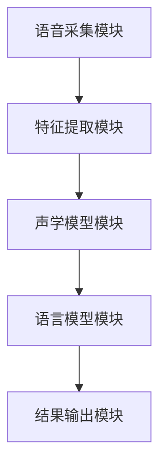

                 

<think>
好的，我现在需要帮用户撰写一篇关于《金融领域语音识别技术的优化与应用》的技术博客文章。用户已经提供了一个详细的目录大纲，并且明确了一些写作要求，包括内容的完整性和格式的准确性。我需要按照这个大纲逐步展开每个部分，确保每一章节都有足够的细节，并且符合技术博客的风格。

首先，我会从文章标题和关键词开始。标题已经给出，关键词包括金融语音识别、深度学习、语音信号处理、自然语言处理、语音识别优化和金融智能化。这些关键词涵盖了文章的主要内容，有助于SEO优化。

接下来是摘要部分。摘要需要简明扼要地总结文章的核心内容，包括背景、技术挑战、解决方案、优化策略以及应用场景。我需要确保摘要涵盖所有关键点，同时保持简洁。

然后是目录结构。用户已经给出了一个详细的大纲，包括四个主要部分：背景与应用概述、核心技术与原理、优化与应用、系统架构与设计。每个部分下面还有多个子章节，涵盖技术背景、核心概念、算法原理、优化策略、系统设计、项目实战、最佳实践等内容。

在撰写每个章节时，我需要确保内容逻辑清晰，结构紧凑。例如，在“语音识别技术的核心技术与算法”部分，我需要详细解释声音信号处理、声学模型、语言模型等概念，并使用对比表和ER图来帮助读者理解。同时，使用Mermaid流程图和Python代码来展示算法原理，确保技术细节的准确性和易懂性。

在优化策略部分，我需要讨论如何提高识别准确率、降低计算复杂度以及提升系统的鲁棒性。这可能涉及到数据增强、模型优化和后处理方法。每个优化方法都需要有具体的数学公式和实际案例支持，帮助读者更好地理解。

系统架构与设计部分需要详细描述系统架构图、功能模块划分以及接口设计。这部分内容需要结合实际项目，展示系统如何运作，并使用序列图来说明交互流程。

项目实战部分，我需要提供一个具体的案例，详细说明环境安装、代码实现、案例分析等步骤。这部分内容需要实用，确保读者可以跟随操作，实际应用所学知识。

最后，最佳实践和小结部分需要总结项目中的经验和教训，给出注意事项和未来的发展方向。这有助于读者巩固所学内容，并为他们提供进一步学习的资源。

在撰写过程中，我需要确保每个章节都有足够的细节，并且符合技术博客的风格。同时，注意使用适当的数学公式和图表，使内容更具专业性和可读性。最后，确保文章结构完整，逻辑清晰，符合用户的格式和内容要求。

总的来说，我需要系统地展开每个部分，结合理论和实践，确保文章内容丰富、结构合理，帮助读者全面理解金融领域语音识别技术的优化与应用。
</think>

# 《金融领域语音识别技术的优化与应用》

**关键词**：金融语音识别，深度学习，语音信号处理，自然语言处理，语音识别优化，金融智能化

**摘要**：随着人工智能技术的快速发展，语音识别技术在金融领域的应用越来越广泛。本文将从语音识别技术的基本概念出发，探讨其在金融领域的应用场景、技术挑战及优化策略。通过对语音信号处理、深度学习算法、系统架构设计等关键环节的详细分析，结合实际案例，总结出一套适用于金融领域的语音识别优化方案，并展望未来的发展方向。

---

# 第1章: 金融领域语音识别的背景与应用概述

## 1.1 语音识别技术的基本概念

### 1.1.1 语音识别的定义与核心概念

语音识别技术是一种通过计算机对人类语音进行识别、理解和处理的技术，其核心目标是将语音信号转换为相应的文本或命令。语音识别主要涉及以下几个核心概念：

- **语音信号**：人类发出的声音信号，包括语音波形、频谱等。
- **特征提取**：从语音信号中提取有用的特征，如梅尔频率倒谱系数（MFCC）。
- **声学模型**：用于描述语音信号的概率分布，如隐马尔可夫模型（HMM）。
- **语言模型**：用于描述语言的语法和语义结构，如n-gram模型。

### 1.1.2 语音识别的主要技术原理

语音识别技术的主要原理包括语音信号处理、特征提取、声学模型训练和语言模型构建。通过这些步骤，系统能够将语音信号转换为相应的文本或命令。

### 1.1.3 语音识别在金融领域的应用潜力

金融领域是语音识别技术的重要应用领域之一。例如，语音支付、语音客服、语音查询等场景都可以通过语音识别技术实现。随着金融行业的智能化发展，语音识别技术在提升用户体验、提高业务效率等方面具有巨大潜力。

## 1.2 金融领域语音识别的现状与挑战

### 1.2.1 金融领域语音识别的主要应用场景

目前，语音识别技术在金融领域的应用主要集中在以下几个方面：

- **语音支付**：通过语音指令完成支付操作。
- **语音客服**：客户通过语音与客服系统交互。
- **语音查询**：用户通过语音查询账户信息、交易记录等。

### 1.2.2 当前技术在金融领域的应用瓶颈

尽管语音识别技术在金融领域有广泛的应用，但仍然面临一些技术挑战：

- **语音质量**：在嘈杂的环境中，语音识别的准确率可能会下降。
- **领域适应性**：金融领域的专业术语和特定场景需要专门的优化。
- **安全性**：语音识别技术需要确保数据的安全性和隐私性。

### 1.2.3 金融领域语音识别的未来发展方向

未来，随着深度学习技术的不断进步，语音识别在金融领域的应用将更加广泛和智能化。例如，结合自然语言处理技术，实现更智能的语音交互；结合区块链技术，提升数据的安全性；结合边缘计算技术，实现低延迟的语音识别。

## 1.3 本章小结

本章主要介绍了语音识别技术的基本概念、技术原理以及在金融领域的应用潜力。同时，分析了当前技术在金融领域的应用瓶颈和未来发展方向。

---

# 第2章: 语音识别技术的核心技术与算法

## 2.1 语音信号处理技术

### 2.1.1 声音信号的基本特征

声音信号的基本特征包括频率、振幅、时域和频域特征等。在语音识别中，通常提取梅尔频率倒谱系数（MFCC）作为语音特征。

### 2.1.2 声音信号的预处理方法

声音信号的预处理包括降噪、端点检测、归一化等步骤，目的是提高语音识别的准确率。

### 2.1.3 特征提取的常用方法

常用的特征提取方法包括：

- **MFCC提取**：通过梅尔滤波器 banks 对语音信号进行能量积分，提取频域特征。
- **倒谱分析**：通过倒谱分析提取语音信号的特征。
- **声学特征提取**：通过改进的深度学习模型提取更高效的特征。

## 2.2 语音识别的核心算法

### 2.2.1 基于HMM的语音识别算法

隐马尔可夫模型（HMM）是一种经典的语音识别算法。它通过建模语音的时序特性，实现语音信号的识别。HMM模型主要包括状态转移概率和观测概率分布两部分。

### 2.2.2 基于深度学习的语音识别算法

深度学习算法，如卷积神经网络（CNN）和循环神经网络（RNN），在语音识别中表现出色。特别是基于Transformer的端到端语音识别模型（如Wav2Vec、HuBERT等），已经成为当前的研究热点。

### 2.2.3 当前主流的语音识别算法对比

以下是一个对比表格，展示了当前主流语音识别算法的主要特点：

| **算法名称** | **核心思想** | **优点** | **缺点** |
|--------------|--------------|----------|----------|
| HMM          | 基于状态转移和观测概率建模 | 简单易实现 | 依赖于严格的语音特征建模 |
| DNN (RNN)    | 基于神经网络的端到端建模 | 高准确率，适应性强 | 计算复杂度高 |
| Transformer   | 基于自注意力机制的端到端建模 | 高准确率，低延迟 | 对计算资源要求高 |

## 2.3 语音识别的优化策略

### 2.3.1 声学模型的优化方法

声学模型的优化主要通过改进特征提取方法、优化模型结构和引入迁移学习等技术实现。例如，使用深度学习模型提取更高效的特征表示。

### 2.3.2 语言模型的优化方法

语言模型的优化主要通过引入更复杂的语言模型（如双向Transformer）和优化训练数据来实现。例如，使用更大规模的语料库进行训练，可以显著提高语言模型的准确率。

### 2.3.3 端到端语音识别的优化思路

端到端语音识别的优化思路主要包括：

- **模型结构优化**：通过引入更深的网络结构或更高效的注意力机制，提高模型的表达能力。
- **损失函数优化**：使用CTC损失函数或交叉熵损失函数进行优化。
- **训练策略优化**：通过数据增强、学习率衰减等技术，提高模型的泛化能力。

## 2.4 本章小结

本章主要介绍了语音识别技术的核心技术与算法，包括语音信号处理技术、基于HMM的语音识别算法、基于深度学习的语音识别算法以及优化策略。通过对比分析，总结了当前主流算法的主要特点和优缺点。

---

# 第3章: 金融领域语音识别的优化策略

## 3.1 金融领域语音识别的优化目标

### 3.1.1 提高识别准确率

在金融领域，语音识别的准确率直接影响用户体验和业务效率。通过优化声学模型和语言模型，可以显著提高识别准确率。

### 3.1.2 降低计算复杂度

金融领域的应用场景通常对计算资源有限制，因此需要通过模型优化和算法改进，降低计算复杂度。

### 3.1.3 提升系统的鲁棒性

金融领域的语音识别系统需要在复杂环境中稳定工作，因此需要提高系统的鲁棒性，例如抗噪声、抗回声等。

## 3.2 金融领域语音识别的优化方法

### 3.2.1 基于数据增强的优化方法

数据增强是通过人为引入噪声、改变语速、改变音调等方法，增强训练数据的多样性，从而提高模型的泛化能力。

### 3.2.2 基于模型优化的策略

模型优化主要通过改进模型结构、引入迁移学习和优化训练参数等方法实现。例如，使用预训练的语音模型进行微调，可以显著提高识别准确率。

### 3.2.3 基于后处理的优化方法

后处理优化主要通过引入语言模型校正、结果过滤等技术，进一步提高识别准确率。

## 3.3 优化算法的数学模型与公式

### 3.3.1 声学模型的优化公式

声学模型的优化可以通过以下公式实现：

$$
\text{损失函数} = \text{CTC损失} = \sum_{i=1}^{n} \text{交叉熵损失}(y_i, \hat{y}_i)
$$

其中，$y_i$ 是真实标签，$\hat{y}_i$ 是预测标签。

### 3.3.2 语言模型的优化公式

语言模型的优化可以通过以下公式实现：

$$
P(w_i|w_{i-1}, ..., w_{i-k}) = \frac{P(w_i, w_{i-1}, ..., w_{i-k})}{P(w_{i-1}, ..., w_{i-k})}
$$

其中，$P(w_i|w_{i-1}, ..., w_{i-k})$ 是条件概率。

### 3.3.3 端到端识别模型的优化公式

端到端识别模型的优化可以通过以下公式实现：

$$
\text{损失函数} = \text{交叉熵损失} = -\sum_{i=1}^{n} \sum_{j=1}^{m} y_{ij} \log \hat{y}_{ij}
$$

其中，$y_{ij}$ 是真实标签，$\hat{y}_{ij}$ 是预测标签。

## 3.4 本章小结

本章主要介绍了金融领域语音识别的优化目标与优化方法，包括基于数据增强、模型优化和后处理的优化策略。通过数学公式和实际案例，详细讲解了优化算法的核心思想和实现方法。

---

# 第4章: 金融领域语音识别系统的架构与设计

## 4.1 系统总体架构

### 4.1.1 系统模块划分

金融领域语音识别系统的总体架构主要包括以下几个模块：

- **语音采集模块**：负责采集用户的语音信号。
- **特征提取模块**：对语音信号进行特征提取。
- **声学模型模块**：基于特征进行声学建模。
- **语言模型模块**：基于声学结果进行语言建模。
- **结果输出模块**：输出最终的识别结果。

### 4.1.2 系统功能设计

系统功能设计包括语音信号采集、特征提取、声学建模、语言建模和结果输出五个主要步骤。

### 4.1.3 系统架构图

以下是一个系统架构图的Mermaid示意图：



## 4.2 系统设计

### 4.2.1 问题场景介绍

在金融领域，语音识别系统需要在复杂环境下稳定工作，例如在银行柜面服务、移动支付等场景中。

### 4.2.2 系统功能设计

系统功能设计包括语音信号采集、特征提取、声学建模、语言建模和结果输出五个主要步骤。

### 4.2.3 系统架构设计

系统架构设计包括模块划分、数据流设计和接口设计。以下是一个系统架构图的Mermaid示意图：


### 4.2.4 系统接口设计

系统接口设计包括语音采集接口、特征提取接口、声学建模接口、语言建模接口和结果输出接口。

### 4.2.5 系统交互流程图

以下是一个系统交互流程图的Mermaid示意图：

```mermaid
graph TD
    User -> A[语音采集模块]: 发出语音指令
    A --> B[特征提取模块]: 提取语音特征
    B --> C[声学模型模块]: 建模声学特征
    C --> D[语言模型模块]: 建模语言特征
    D --> E[结果输出模块]: 输出识别结果
    E -> User: 返回识别结果
```

## 4.3 本章小结

本章主要介绍了金融领域语音识别系统的总体架构、系统设计和系统交互流程。通过Mermaid图，详细讲解了系统的模块划分和数据流设计。

---

# 第5章: 金融领域语音识别技术的项目实战

## 5.1 项目介绍

### 5.1.1 项目背景

本项目旨在开发一个适用于金融领域的语音识别系统，实现语音支付、语音查询等核心功能。

### 5.1.2 项目目标

项目目标包括提高识别准确率、降低计算复杂度、提升系统鲁棒性等。

## 5.2 项目核心实现

### 5.2.1 环境安装

项目需要以下环境：

- **Python 3.8+**
- **TensorFlow 2.0+**
- **PyTorch 1.0+**
- ** librosa、scipy 等依赖库**

### 5.2.2 核心代码实现

以下是一个基于Python的语音识别系统的核心代码示例：

```python
import librosa
import numpy as np
import torch
import torch.nn as nn
import torch.optim as optim

# 定义特征提取函数
def extract_features(audio_path):
    y, sr = librosa.load(audio_path, sr=None)
    mfccs = librosa.feature.mfcc(y, sr, n_mfcc=13)
    return mfccs.T

# 定义模型类
class VoiceRecognizer(nn.Module):
    def __init__(self, input_size, hidden_size, output_size):
        super(VoiceRecognizer, self).__init__()
        self.lstm = nn.LSTM(input_size, hidden_size, num_layers=2, bidirectional=True, batch_first=True)
        self.fc = nn.Linear(hidden_size*2, output_size)
    
    def forward(self, x):
        out, _ = self.lstm(x)
        out = self.fc(out[:, -1, :])
        return out

# 定义训练函数
def train_model(model, train_loader, criterion, optimizer, num_epochs):
    for epoch in range(num_epochs):
        for inputs, labels in train_loader:
            outputs = model(inputs)
            loss = criterion(outputs, labels)
            loss.backward()
            optimizer.step()
            optimizer.zero_grad()
```

### 5.2.3 代码应用解读与分析

以上代码实现了基于LSTM的语音识别模型。特征提取部分使用了 librosa 库提取MFCC特征，模型部分定义了一个双向LSTM网络，训练部分使用了交叉熵损失函数和Adam优化器。

## 5.3 实际案例分析

### 5.3.1 案例背景

以语音支付为例，用户通过语音指令完成支付操作。

### 5.3.2 案例实现

以下是一个语音支付系统的实现步骤：

1. **用户发出语音指令**：例如，“支付100元”。
2. **系统采集语音信号**：通过麦克风采集语音信号。
3. **特征提取**：提取MFCC特征。
4. **模型识别**：通过训练好的模型识别语音内容。
5. **系统处理**：根据识别结果完成支付操作。

## 5.4 项目小结

本章通过一个实际项目，详细讲解了金融领域语音识别技术的实现过程。从环境安装、代码实现到实际案例分析，全面展示了语音识别技术在金融领域的应用。

---

# 第6章: 金融领域语音识别技术的最佳实践与小结

## 6.1 最佳实践 tips

### 6.1.1 数据预处理

- 对语音数据进行降噪、端点检测等预处理，可以显著提高识别准确率。
- 使用多样化的训练数据，包括不同语速、不同音调、不同环境下的语音数据。

### 6.1.2 模型优化

- 使用深度学习模型，如Transformer，可以显著提高识别准确率。
- 通过数据增强技术，增强模型的泛化能力。
- 引入领域特定的训练数据，提高模型在金融领域的适应性。

### 6.1.3 系统设计

- 在系统设计中，注意模块划分和接口设计，确保系统的可扩展性和可维护性。
- 使用边缘计算技术，降低系统的计算复杂度。

## 6.2 小结

通过本文的详细讲解，读者可以全面了解金融领域语音识别技术的优化与应用。从技术背景到核心算法，从系统设计到项目实战，本文为读者提供了一套完整的解决方案。

## 6.3 注意事项

- 在实际应用中，需要注意数据的安全性和隐私性。
- 系统设计中，要注意模块之间的耦合度，确保系统的稳定性和可靠性。
- 在优化过程中，要注意模型的计算复杂度，确保系统的实时性。

## 6.4 拓展阅读

- 《Deep Learning for Speech Recognition》
- 《语音识别与自然语言处理》
- 《金融智能化与人工智能》

---

**作者**：AI天才研究院/AI Genius Institute & 禅与计算机程序设计艺术/Zen And The Art of Computer Programming

