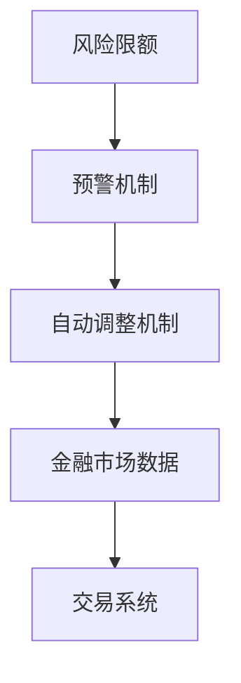
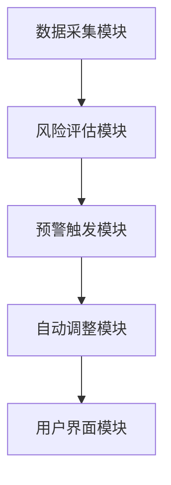

                 


# 《金融风险限额突破预警与自动调整系统》

## 关键词：金融风险，风险限额，预警机制，自动调整，系统架构，算法原理，风险管理

## 摘要：本文介绍了一种基于金融市场的风险限额突破预警与自动调整系统。该系统通过实时监控金融市场数据，利用先进的算法和系统架构设计，能够及时发现潜在风险，并自动调整以防止风险扩大。本文详细阐述了系统的背景、核心算法、系统架构、项目实战以及最佳实践，为金融风险管理和控制提供了新的思路和解决方案。

---

# 第一部分: 金融风险限额突破预警与自动调整系统概述

# 第1章: 金融风险限额突破预警与自动调整系统背景介绍

## 1.1 问题背景
### 1.1.1 金融市场波动与风险控制的重要性
金融市场波动剧烈，投资者和机构面临的风险日益增加。传统的风险管理方式依赖于人工监控和事后分析，难以应对瞬息万变的市场环境。风险限额的突破可能导致巨大的经济损失，甚至引发系统性金融风险。

### 1.1.2 传统风险限额管理的局限性
传统风险限额管理存在以下问题：
1. **滞后性**：依赖人工分析，无法实时监控市场变化。
2. **低效性**：需要大量人工干预，效率低下。
3. **准确性不足**：依赖历史数据和经验判断，难以捕捉突发风险。

### 1.1.3 系统性金融风险的加剧与预警需求
近年来，金融危机频发，系统性风险加剧。金融机构需要一种高效、智能的系统来实时预警风险，并在风险突破限额时自动调整以降低风险敞口。

## 1.2 问题描述
### 1.2.1 风险限额突破的定义与表现
风险限额是指在一定市场条件下，金融机构或投资组合能够承受的最大风险敞口。当实际风险超过限额时，即为风险限额突破。其表现包括资产价格剧烈波动、流动性不足、信用评级下降等。

### 1.2.2 预警机制的缺失与后果
缺乏有效的预警机制会导致以下后果：
1. **损失扩大化**：无法及时发现风险，导致损失进一步扩大。
2. **信任危机**：投资者和客户对金融机构的信任下降。
3. **监管处罚**：金融机构可能因未能及时报告风险而受到监管处罚。

### 1.2.3 自动调整机制的必要性
自动调整机制能够在风险限额突破时，快速采取措施，如减少头寸、调整投资组合、增加流动性等，从而有效控制风险。

## 1.3 问题解决思路
### 1.3.1 系统化风险监控的解决方案
通过建立实时监控系统，利用大数据、人工智能等技术，实时分析市场数据，识别潜在风险。

### 1.3.2 预警与自动调整的结合
将预警机制与自动调整机制结合，实现风险的实时监控和自动应对，减少人工干预，提高效率。

### 1.3.3 技术实现路径的选择
选择合适的技术路径，如基于机器学习的风险评估模型，实时数据处理技术等，确保系统的高效性和准确性。

## 1.4 系统的边界与外延
### 1.4.1 系统的功能边界
系统主要功能包括实时监控、风险评估、预警触发、自动调整和用户界面。系统不涉及具体的交易执行和投资决策。

### 1.4.2 系统的适用范围与限制
系统适用于金融机构、投资组合管理和风险控制。其限制包括数据获取的实时性和准确性，以及算法的有效性。

### 1.4.3 系统与其他金融系统的接口关系
系统需要与交易系统、数据源、监管系统等进行接口对接，确保数据的实时传输和系统的有效运行。

## 1.5 核心概念与联系
### 1.5.1 核心概念原理
系统的核心概念包括风险限额、预警机制和自动调整机制。这些概念相互关联，共同构成系统的功能模块。

### 1.5.2 核心概念属性特征对比表格
| 核心概念 | 定义 | 属性特征 |
|----------|------|----------|
| 风险限额 | 风险承受的上限 | 可调节性、实时性、动态性 |
| 预警机制 | 风险突破的信号系统 | 及时性、准确性、可配置性 |
| 自动调整 | 系统自动修正风险 | 自适应性、稳定性、高效性 |

### 1.5.3 实体关系图架构


---

# 第2章: 金融风险限额突破预警与自动调整系统的核心算法原理

## 2.1 风险评估模型
### 2.1.1 风险评估的数学模型
风险评估模型是系统的核心算法之一，用于预测和评估市场风险。常见的模型包括：
- **VaR（Value at Risk）模型**：计算在特定置信水平下的最大损失。
- **CVaR（Conditional VaR）模型**：计算在VaR基础上的条件风险值。

### 2.1.2 风险评估模型的实现步骤
1. **数据采集**：获取金融市场数据，如资产价格、成交量、市场指数等。
2. **数据预处理**：清洗数据，处理缺失值和异常值。
3. **模型训练**：使用历史数据训练风险评估模型。
4. **风险评估**：实时计算当前风险值，并与风险限额进行对比。

### 2.1.3 风险评估模型的代码实现
```python
import numpy as np
import pandas as pd

def calculate_var(data, confidence_level=95):
    # 计算 VaR
    sorted_data = np.sort(data)
    alpha_index = int(len(sorted_data) * (1 - confidence_level/100))
    var = sorted_data[alpha_index]
    return var

# 示例数据
data = np.random.normal(0, 1, 1000)
var_95 = calculate_var(data, 95)
print(f"VaR at 95% confidence level: {var_95}")
```

## 2.2 预警触发机制
### 2.2.1 预警触发条件
预警触发条件包括：
1. **风险值超过风险限额**。
2. **市场波动率显著增加**。
3. **相关资产价格异常波动**。

### 2.2.2 预警触发逻辑
1. **实时监控**：持续监控市场数据。
2. **风险评估**：计算当前风险值。
3. **比较与判断**：将当前风险值与风险限额进行比较。
4. **触发预警**：当风险值超过限额时，触发预警。

### 2.2.3 预警触发机制的代码实现
```python
def trigger预警(current_risk, risk_limit):
    if current_risk > risk_limit:
        return True
    else:
        return False

# 示例数据
current_risk = 0.05  # 当前风险值
risk_limit = 0.04    # 风险限额
if trigger_预警(current_risk, risk_limit):
    print("风险预警触发！")
```

## 2.3 自动调整机制
### 2.3.1 自动调整策略
自动调整策略包括：
1. **调整投资组合**：减少高风险资产的持仓。
2. **增加流动性**：卖出非流动性资产，增加现金头寸。
3. **调整风险敞口**：通过衍生品对冲风险。

### 2.3.2 自动调整逻辑
1. **识别风险突破**：当风险值超过限额时，触发自动调整。
2. **选择调整策略**：根据当前市场情况选择合适的调整策略。
3. **执行调整**：通过交易系统执行调整指令。
4. **监控效果**：监控调整效果，确保风险值回归到限额内。

### 2.3.3 自动调整机制的代码实现
```python
def execute_adjustment(current_risk, risk_limit):
    if current_risk > risk_limit:
        # 调整投资组合
        print("减少高风险资产持仓")
        # 增加流动性
        print("增加现金头寸")
        # 对冲风险
        print("执行衍生品对冲")
    else:
        print("风险在限额内，无需调整")

# 示例数据
current_risk = 0.06  # 当前风险值
risk_limit = 0.05    # 风险限额
execute_adjustment(current_risk, risk_limit)
```

## 2.4 算法的优缺点分析
### 2.4.1 优点
1. **实时性**：能够实时监控和调整，减少人工干预。
2. **准确性**：通过算法模型提高风险评估的准确性。
3. **效率**：自动调整机制能够快速应对风险，减少损失。

### 2.4.2 缺点
1. **依赖数据质量**：算法的效果依赖于数据的准确性和完整性。
2. **模型风险**：模型假设可能与实际情况不符，导致误判。
3. **操作风险**：自动调整可能引发更大的市场波动。

---

# 第3章: 金融风险限额突破预警与自动调整系统分析与架构设计

## 3.1 问题场景介绍
### 3.1.1 风险限额突破的场景
假设某金融机构管理的投资组合在市场剧烈波动时，风险值迅速上升，接近或超过风险限额。

### 3.1.2 预警与自动调整的需求
在风险限额突破时，系统需要及时预警，并自动调整投资组合以降低风险。

## 3.2 系统功能设计
### 3.2.1 功能模块划分
系统主要功能模块包括：
1. **数据采集模块**：实时采集金融市场数据。
2. **风险评估模块**：计算当前风险值。
3. **预警触发模块**：判断是否触发预警。
4. **自动调整模块**：根据预警结果调整投资组合。
5. **用户界面模块**：提供直观的监控界面。

### 3.2.2 功能模块的实现逻辑
1. **数据采集模块**：通过API获取实时市场数据。
2. **风险评估模块**：使用风险评估模型计算当前风险值。
3. **预警触发模块**：比较当前风险值与风险限额，触发预警。
4. **自动调整模块**：根据预警结果执行调整策略。
5. **用户界面模块**：展示实时数据和调整结果。

## 3.3 系统架构设计
### 3.3.1 系统架构图


### 3.3.2 系统接口设计
1. **数据接口**：与数据源对接，获取实时市场数据。
2. **交易接口**：与交易系统对接，执行自动调整指令。
3. **用户接口**：提供用户监控和操作界面。

## 3.4 系统交互设计
### 3.4.1 用户与系统交互流程
1. 用户登录系统，进入监控界面。
2. 系统实时显示当前风险值和风险限额。
3. 当风险值超过限额时，系统触发预警，并自动执行调整。
4. 用户可以查看调整结果和风险报告。

### 3.4.2 系统交互的实现
```mermaid
sequenceDiagram
    participant 用户 as User
    participant 系统 as System
    User -> System: 登录系统
    System -> User: 展示实时风险值
    System -> System: 计算风险值
    if 风险值 > 风险限额 then
        System -> System: 触发预警
        System -> System: 执行自动调整
        System -> User: 提示调整结果
    else
        System -> User: 提示风险在限额内
    endif
```

---

# 第4章: 金融风险限额突破预警与自动调整系统项目实战

## 4.1 环境安装与配置
### 4.1.1 系统环境要求
- 操作系统：Windows/Mac/Linux
- Python版本：3.6及以上
- 需要安装的库：numpy, pandas, matplotlib, requests

### 4.1.2 系统安装步骤
1. 安装Python和pip。
2. 安装所需的第三方库：
   ```bash
   pip install numpy pandas matplotlib requests
   ```

## 4.2 系统核心代码实现
### 4.2.1 数据采集模块
```python
import requests

def get_market_data(api_key):
    url = "https://api.example.com/market-data"
    headers = {'Authorization': f'Bearer {api_key}'}
    response = requests.get(url, headers=headers)
    if response.status_code == 200:
        return response.json()
    else:
        return None

# 示例数据获取
api_key = "your_api_key"
market_data = get_market_data(api_key)
print(market_data)
```

### 4.2.2 风险评估模块
```python
import numpy as np
import pandas as pd

def calculate_risk(market_data):
    # 示例计算市场波动率
    df = pd.DataFrame(market_data)
    returns = df.pct_change()
    risk = returns.std() * np.sqrt(252)  # 年化波动率
    return risk

# 示例计算风险值
market_data = {'price': [100, 101, 99, 102, 100]}
risk_value = calculate_risk(market_data)
print(f"风险值: {risk_value}")
```

### 4.2.3 预警触发模块
```python
def trigger_alert(current_risk, risk_limit):
    if current_risk > risk_limit:
        return True
    else:
        return False

# 示例触发预警
current_risk = 0.05  # 示例风险值
risk_limit = 0.04    # 示例风险限额
if trigger_alert(current_risk, risk_limit):
    print("风险预警触发！")
```

### 4.2.4 自动调整模块
```python
def execute_adjustment(current_risk, risk_limit):
    if current_risk > risk_limit:
        print("减少高风险资产持仓")
        print("增加现金头寸")
        print("执行衍生品对冲")
    else:
        print("风险在限额内，无需调整")

# 示例执行调整
current_risk = 0.06  # 示例风险值
risk_limit = 0.05    # 示例风险限额
execute_adjustment(current_risk, risk_limit)
```

## 4.3 项目实战案例分析
### 4.3.1 案例背景
某金融机构管理的投资组合在市场波动加剧时，风险值迅速上升，接近风险限额。

### 4.3.2 案例分析
1. **数据采集**：获取实时市场数据。
2. **风险评估**：计算当前风险值。
3. **预警触发**：判断是否超过风险限额。
4. **自动调整**：执行投资组合调整。

### 4.3.3 案例结果
- **风险预警触发**：风险值为0.06，超过风险限额0.05。
- **自动调整**：减少高风险资产持仓，增加现金头寸，执行衍生品对冲。
- **调整效果**：风险值下降至0.04，低于风险限额。

## 4.4 系统实现的关键点
### 4.4.1 数据的实时性和准确性
- 使用可靠的API获取实时数据。
- 数据预处理，确保数据的准确性和完整性。

### 4.4.2 算法的高效性和准确性
- 选择合适的算法模型，提高风险评估的准确性。
- 确保算法的高效性，能够实时处理数据。

### 4.4.3 系统的稳定性和安全性
- 系统设计要稳定，避免因故障导致服务中断。
- 确保数据传输的安全性，防止数据泄露。

## 4.5 系统实现的代码解读与分析
### 4.5.1 数据采集模块的实现
```python
import requests

def get_market_data(api_key):
    url = "https://api.example.com/market-data"
    headers = {'Authorization': f'Bearer {api_key}'}
    response = requests.get(url, headers=headers)
    if response.status_code == 200:
        return response.json()
    else:
        return None

# 示例数据获取
api_key = "your_api_key"
market_data = get_market_data(api_key)
print(market_data)
```

### 4.5.2 风险评估模块的实现
```python
import numpy as np
import pandas as pd

def calculate_risk(market_data):
    df = pd.DataFrame(market_data)
    returns = df.pct_change()
    risk = returns.std() * np.sqrt(252)  # 年化波动率
    return risk

# 示例计算风险值
market_data = {'price': [100, 101, 99, 102, 100]}
risk_value = calculate_risk(market_data)
print(f"风险值: {risk_value}")
```

### 4.5.3 预警触发模块的实现
```python
def trigger_alert(current_risk, risk_limit):
    if current_risk > risk_limit:
        return True
    else:
        return False

# 示例触发预警
current_risk = 0.05  # 示例风险值
risk_limit = 0.04    # 示例风险限额
if trigger_alert(current_risk, risk_limit):
    print("风险预警触发！")
```

### 4.5.4 自动调整模块的实现
```python
def execute_adjustment(current_risk, risk_limit):
    if current_risk > risk_limit:
        print("减少高风险资产持仓")
        print("增加现金头寸")
        print("执行衍生品对冲")
    else:
        print("风险在限额内，无需调整")

# 示例执行调整
current_risk = 0.06  # 示例风险值
risk_limit = 0.05    # 示例风险限额
execute_adjustment(current_risk, risk_limit)
```

---

# 第5章: 金融风险限额突破预警与自动调整系统的最佳实践

## 5.1 最佳实践 tips
### 5.1.1 数据质量管理
- 确保数据的实时性和准确性。
- 处理缺失值和异常值。

### 5.1.2 系统稳定性保障
- 设计稳定的系统架构。
- 定期进行系统维护和更新。

### 5.1.3 系统安全性提升
- 采用安全的数据传输协议。
- 设置权限管理，防止未授权访问。

## 5.2 系统小结
金融风险限额突破预警与自动调整系统是一种高效的风险管理工具，能够实时监控市场风险，并在风险突破时自动采取措施，有效降低风险敞口。

## 5.3 注意事项
### 5.3.1 系统依赖性
系统依赖于高质量的数据和有效的算法，数据质量和算法的有效性直接影响系统的性能。

### 5.3.2 操作风险
自动调整可能引发更大的市场波动，需谨慎设计调整策略。

### 5.3.3 系统维护
定期维护和更新系统，确保其稳定性和准确性。

## 5.4 拓展阅读
### 5.4.1 相关技术书籍
1. 《风险管理与VaR模型》
2. 《金融市场数据分析与算法交易》

### 5.4.2 相关学术论文
1. "Risk Management and Portfolio Optimization"
2. "Machine Learning in Financial Markets"

---

# 结语

金融风险限额突破预警与自动调整系统是金融风险管理的重要工具，通过实时监控和自动调整，能够有效降低风险，保障金融机构的稳健运行。随着技术的不断发展，未来系统将更加智能化和自动化，为金融风险管理提供更强大的支持。

---

# 作者

作者：AI天才研究院/AI Genius Institute  
禅与计算机程序设计艺术/Zen And The Art of Computer Programming

