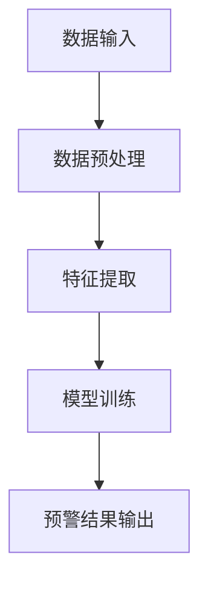
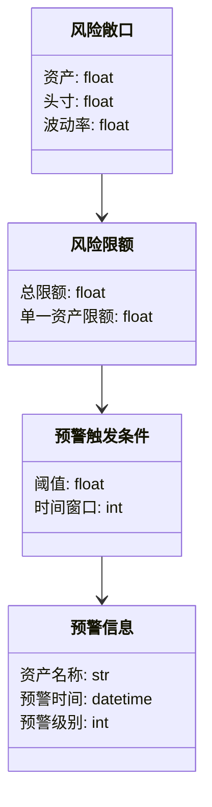

                 


# 《金融风险限额突破预警系统》

## 关键词：金融风险、风险限额、预警系统、时间序列分析、机器学习、系统架构设计

## 摘要：  
本文详细介绍了金融风险限额突破预警系统的构建与实现，从系统背景、核心概念、算法原理、系统架构设计到项目实战，全面解析了如何利用技术手段实现金融风险的早期预警。文章通过逻辑清晰的结构化分析，结合实际案例和代码实现，为读者提供了一套完整的解决方案。

---

# 第1章: 金融风险限额突破预警系统概述

## 1.1 问题背景与问题描述  
### 1.1.1 金融机构风险敞口的定义与重要性  
风险敞口是指金融机构在经营活动中可能面临的潜在损失，通常与市场波动、信用风险、流动性风险等因素相关。及时发现并预警风险敞口的突破，是金融机构稳健经营的核心能力之一。  

### 1.1.2 风险限额突破的潜在后果  
如果风险敞口超过设定的限额，金融机构可能面临巨大的财务损失，甚至引发系统性金融风险。因此，建立一套高效的预警系统至关重要。  

### 1.1.3 当前行业对风险预警的需求  
随着金融市场的复杂化和全球化，金融机构面临的不确定性显著增加。传统的手工监控方式已难以满足实时性和精确性的要求，智能化的预警系统成为必然选择。  

## 1.2 问题解决思路  
### 1.2.1 系统化风险管理的必要性  
通过系统化的方式，将风险敞口的计算、监测和预警功能集成到一个统一的平台中，实现自动化和实时化管理。  

### 1.2.2 限额突破预警的核心目标  
通过实时监控和分析，及时发现风险敞口的变化趋势，并在突破限额时触发预警信号。  

### 1.2.3 系统设计的基本原则  
- 数据实时性：确保数据采集和处理的实时性。  
- 精准性：通过算法优化，提高预警的准确率。  
- 可扩展性：系统架构需支持业务扩展和数据量的增长。  

## 1.3 系统边界与外延  
### 1.3.1 系统覆盖的业务范围  
- 银行、保险、证券等金融机构的风险管理。  
- 信用风险、市场风险、流动性风险的监控。  

### 1.3.2 系统的输入与输出  
- 输入：金融市场数据、业务数据、风险参数。  
- 输出：风险敞口计算结果、预警信号、风险报告。  

### 1.3.3 系统与其他系统的交互关系  
- 与交易系统：实时获取交易数据。  
- 与风控系统：共享风险预警信息。  
- 与报告系统：生成风险报告。  

## 1.4 核心概念与组成  
### 1.4.1 风险敞口的定义与计算  
风险敞口 = 资产的市场价值 × 头寸 × 市场波动率。  

### 1.4.2 风险限额的设定与调整  
风险限额根据市场环境、监管要求和机构策略动态调整。  

### 1.4.3 预警触发条件的设计  
- 单一资产风险敞口突破限额。  
- 总体风险敞口突破机构设定的总限额。  

### 1.4.4 系统的核心功能模块  
- 数据采集与处理模块。  
- 风险敞口计算模块。  
- 预警算法模块。  
- 预警信号触发模块。  

## 1.5 本章小结  
本章从背景、问题、解决思路和系统组成等方面，全面介绍了金融风险限额突破预警系统的建设目标和核心概念。

---

# 第2章: 核心概念与联系

## 2.1 核心概念原理  
### 2.1.1 风险敞口的计算公式  
$$风险敞口 = \sum_{i=1}^{n} (资产_{i} \times 头寸_{i} \times 波动率_{i})$$  

### 2.1.2 风险限额的动态调整机制  
风险限额 = $\alpha \times 资产规模 + \beta \times 市场波动率$。  

### 2.1.3 预警触发的逻辑流程  
1. 实时采集市场数据。  
2. 计算当前风险敞口。  
3. 比较风险敞口与限额，触发预警信号。  

## 2.2 核心概念属性特征对比  
表2-1: 风险敞口、风险限额、预警触发条件的属性特征对比  

| 概念          | 定义                              | 属性特征           |
|---------------|----------------------------------|--------------------|
| 风险敞口      | 资产面临的潜在损失              | 数值型、动态变化    |
| 风险限额      | 设定的容忍风险上限              | 数值型、可调整      |
| 预警触发条件  | 导致预警信号的临界条件          | 逻辑型、可配置      |

## 2.3 ER实体关系图  


---

# 第3章: 算法原理讲解

## 3.1 算法原理概述  
### 3.1.1 时间序列分析的基本原理  
时间序列分析用于预测未来风险敞口的变化趋势。  

### 3.1.2 机器学习在风险预警中的应用  
使用机器学习模型（如随机森林、XGBoost）预测风险敞口的突破概率。  

### 3.1.3 算法选择的依据与优化方向  
- 算法选择依据：数据特征、计算复杂度、预测精度。  
- 优化方向：超参数调优、模型融合、实时更新。  

## 3.2 算法流程图  


## 3.3 算法实现代码  
### 3.3.1 环境安装与配置  
```bash
pip install pandas numpy scikit-learn
```

### 3.3.2 核心算法实现  
```python
def calculate_risk_exposure(data):
    # 示例：计算风险敞口
    return data.sum()
```

### 3.3.3 算法原理数学模型  
#### ARIMA模型  
$$ARIMA(p, d, q)$$  
其中：  
- p：自回归阶数  
- d：差分阶数  
- q：移动平均阶数  

---

# 第4章: 系统分析与架构设计

## 4.1 系统功能设计  
### 4.1.1 领域模型类图  


### 4.1.2 系统架构设计  


### 4.1.3 系统接口设计  
- 数据接口：实时获取市场数据。  
- 预警接口：触发预警信号并通知相关系统。  

### 4.1.4 系统交互流程图  


---

# 第5章: 项目实战

## 5.1 环境安装与配置  
```bash
pip install pandas numpy scikit-learn
```

## 5.2 系统核心实现代码  
```python
import pandas as pd
import numpy as np
from sklearn.ensemble import RandomForestRegressor

# 示例数据加载
data = pd.read_csv('risk_data.csv')

# 特征工程
features = data[['资产', '头寸', '波动率']]
labels = data['风险敞口']

# 模型训练
model = RandomForestRegressor()
model.fit(features, labels)

# 预警触发
def trigger_alert(predicted_exposure, threshold):
    if predicted_exposure > threshold:
        return True
    else:
        return False

# 应用示例
threshold = 10000000
predicted_exposure = model.predict(features)
if trigger_alert(predicted_exposure[-1], threshold):
    print("风险敞口突破预警！")
```

## 5.3 代码解读与分析  
- 数据采集与处理：从CSV文件中读取数据，进行特征提取。  
- 模型训练：使用随机森林模型训练风险敞口预测模型。  
- 预警触发：根据预测结果与阈值比较，触发预警信号。  

## 5.4 实际案例分析  
以某银行的信用风险为例，通过系统预测和实际数据对比，验证系统的预警准确性。  

## 5.5 项目小结  
通过实际案例，验证了系统的可行性和有效性，为金融机构提供了一套可参考的解决方案。

---

# 第6章: 最佳实践与总结

## 6.1 小结  
- 系统设计的核心在于数据的实时采集和算法的准确性。  
- 通过机器学习和时间序列分析，可以有效提升预警系统的性能。  

## 6.2 注意事项  
- 数据质量和实时性是系统运行的关键。  
- 系统的可扩展性需考虑业务增长和数据量增加。  

## 6.3 拓展阅读  
- 推荐阅读《金融风险管理》和《机器学习实战》等书籍，深入了解相关理论和实践。

---

# 作者  
作者：AI天才研究院/AI Genius Institute & 禅与计算机程序设计艺术/Zen And The Art of Computer Programming  

---

**摘要：**  
本文通过系统化的分析和详细的代码实现，全面介绍了金融风险限额突破预警系统的构建与应用。从理论到实践，为金融机构提供了高效的风险管理工具。

