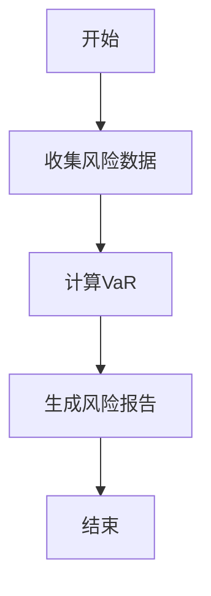
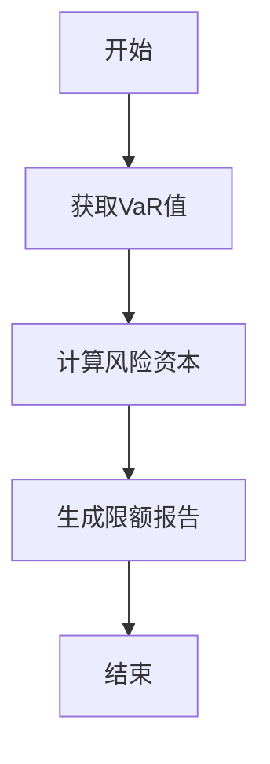

                 

# 金融风险限额管理系统设计

## 关键词：金融风险管理、限额管理、系统设计、算法原理、风险控制、系统架构、风险评估

## 摘要：
金融风险限额管理是金融行业中的重要环节，旨在通过科学的系统设计和算法实现，有效控制和管理金融风险。本文从金融风险限额管理的核心概念出发，结合系统设计与实现，详细阐述了限额管理系统的架构、算法原理、功能模块实现及实际案例分析。通过系统化的解决方案，本文为金融行业提供了可操作的风险管理策略，同时探讨了未来的发展方向。

---

## 第一章：金融风险限额管理概述

### 1.1 金融风险限额管理的背景与意义
#### 1.1.1 金融风险的基本概念
金融风险是指在金融活动中，由于内外部环境的变化导致资金损失的可能性。主要类型包括市场风险、信用风险、流动性风险等。

#### 1.1.2 限额管理的定义与作用
限额管理是指通过设定和监控风险敞口的上限，确保金融机构在可控风险范围内开展业务。其作用在于防范过度风险暴露，保障金融体系的稳定。

#### 1.1.3 限额管理在金融行业中的重要性
限额管理是金融机构风险管理的核心工具之一，能够帮助机构在复杂多变的市场环境中保持稳健运营。

### 1.2 金融风险限额管理的核心问题
#### 1.2.1 风险识别与量化
风险识别是限额管理的第一步，需要准确识别可能影响机构的各类风险。风险量化则是通过数学模型评估风险的严重程度。

#### 1.2.2 限额设定与调整
限额设定需要结合机构的资本实力、风险承受能力和市场环境。限额调整则是一个动态过程，需要根据市场变化及时优化。

#### 1.2.3 系统化管理的需求
传统的人工管理方式效率低、误差大，系统化管理能够提高风险监控的效率和准确性。

### 1.3 本章小结
本章从金融风险和限额管理的基本概念出发，分析了限额管理的重要性和核心问题，为后续的系统设计奠定了基础。

---

## 第二章：金融风险限额管理的核心概念

### 2.1 风险管理的基本原理
#### 2.1.1 风险识别的步骤与方法
风险识别包括数据收集、风险清单制定和风险评估等步骤。常用方法包括问卷调查、专家访谈和数据分析等。

#### 2.1.2 风险评估的指标与模型
风险评估的指标包括概率（P）和影响（I），常用模型有风险矩阵模型和蒙特卡洛模拟。

#### 2.1.3 风险控制的策略与措施
风险控制策略包括风险规避、风险降低和风险转移等。

### 2.2 限额管理的理论基础
#### 2.2.1 限额管理的定义与分类
限额管理是指在一定范围内对风险敞口进行限制。根据管理对象的不同，可以分为市场风险限额、信用风险限额等。

#### 2.2.2 限额管理的核心要素
限额管理的核心要素包括风险敞口、风险资本、风险容忍度和风险调整资本等。

#### 2.2.3 限额管理与风险控制的关系
限额管理是风险控制的重要手段，两者相互依存，共同构成风险管理的完整体系。

### 2.3 本章小结
本章从风险管理的基本原理出发，详细探讨了限额管理的理论基础和核心要素，为后续的系统设计提供了理论支持。

---

## 第三章：金融风险限额管理系统的架构设计

### 3.1 系统需求分析
#### 3.1.1 业务需求分析
系统需要支持风险识别、限额计算、实时监控和报告生成等功能。

#### 3.1.2 功能需求分析
包括用户管理、权限设置、数据录入、风险评估和限额监控等功能。

#### 3.1.3 性能需求分析
系统需要具备高并发处理能力，确保数据实时更新和快速响应。

### 3.2 系统模块划分
#### 3.2.1 风险识别模块
负责识别潜在风险并生成风险清单。

#### 3.2.2 限额计算模块
根据风险评估结果计算各业务线的限额。

#### 3.2.3 系统监控模块
实时监控风险敞口，及时预警超限情况。

### 3.3 系统架构设计
#### 3.3.1 分层架构设计
系统采用分层架构，包括数据层、业务逻辑层和表现层。

#### 3.3.2 微服务架构设计
各功能模块采用微服务架构，提高系统的可扩展性和灵活性。

#### 3.3.3 数据流与控制流设计
数据流包括风险数据的采集、处理和存储；控制流包括用户操作、权限校验和业务逻辑执行。

### 3.4 本章小结
本章从系统架构设计的角度，详细规划了金融风险限额管理系统的功能模块和整体架构，为后续的系统实现奠定了基础。

---

## 第四章：金融风险限额管理系统的实现

### 4.1 系统实现的环境搭建
#### 4.1.1 开发工具的选择与安装
推荐使用IntelliJ IDEA或Eclipse作为开发工具，安装JDK和相关插件。

#### 4.1.2 数据库的选择与配置
推荐使用MySQL或PostgreSQL作为数据库，配置数据源和连接池。

#### 4.1.3 依赖库的安装与配置
使用Maven管理项目依赖，安装Spring Boot和Spring Security等框架。

### 4.2 核心算法实现
#### 4.2.1 风险评估算法
采用VaR（在险值）模型进行风险评估，公式如下：
$$ VaR = \mu + z \times \sigma $$
其中，$\mu$为均值，$z$为标准正态分布的分位数，$\sigma$为标准差。

#### 4.2.2 限额计算算法
基于VaR模型计算风险资本，公式如下：
$$ RC = VaR \times \text{风险系数} $$

#### 4.2.3 系统监控算法
采用滑动窗口技术实时监控风险敞口，当实际敞口超过限额时触发预警。

### 4.3 算法原理与流程图
#### 4.3.1 风险评估算法流程图

#### 4.3.2 限额计算算法流程图

### 4.4 本章小结
本章详细讲解了系统实现的环境搭建和核心算法实现，通过流程图和公式推导，清晰地展示了系统的工作原理。

---

## 第五章：项目实战与案例分析

### 5.1 项目背景与目标
某银行希望通过限额管理系统实现对信用风险和市场风险的实时监控。

### 5.2 系统功能实现
#### 5.2.1 用户管理模块
实现用户注册、登录和权限管理功能。

#### 5.2.2 风险评估模块
基于VaR模型进行风险评估，并生成风险报告。

#### 5.2.3 限额监控模块
实时监控风险敞口，并在超限时触发预警。

### 5.3 系统测试与优化
通过单元测试、集成测试和性能测试对系统进行全面验证，并根据测试结果进行优化。

### 5.4 案例分析
通过实际案例分析，验证系统的有效性，并总结经验教训。

### 5.5 本章小结
本章通过项目实战，详细展示了金融风险限额管理系统的实现过程和实际应用效果。

---

## 第六章：总结与展望

### 6.1 本章总结
本文从金融风险限额管理的核心概念出发，详细探讨了系统的架构设计和实现过程，并通过案例分析验证了系统的有效性。

### 6.2 未来展望
未来的研究方向包括引入人工智能技术提升风险评估的准确性，以及开发更智能化的限额管理系统。

---

## 作者：AI天才研究院 & 禅与计算机程序设计艺术

