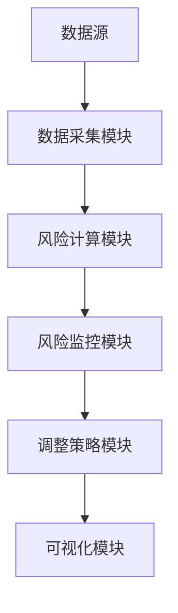

                 


# 《金融风险限额管理自动化系统》

---

## 关键词：
金融风险，风险限额，自动化系统，风险管理，风险监控，系统架构

---

## 摘要：
金融风险限额管理是金融机构确保其资产安全、稳健运行的重要手段。随着金融市场波动加剧和监管要求的提高，传统的手动风险管理方式已难以满足效率和精准性的需求。本文介绍了一种基于自动化技术的金融风险限额管理系统，从系统架构、算法原理、功能设计等多维度深入探讨了如何实现风险限额的自动化管理。通过本文，读者可以了解如何利用现代技术手段提升金融风险管理效率，降低风险敞口，确保金融机构的稳健运营。

---

## 第一部分：金融风险限额管理概述

### 第1章：金融风险与限额管理的基本概念

#### 1.1 金融风险的定义与分类
金融风险是指在金融市场中，由于资产价格波动、利率变化、信用违约等因素导致的资产损失可能性。常见的金融风险类型包括市场风险、信用风险、流动性风险和操作风险。

- **市场风险**：由于市场价格波动导致的投资损失。
- **信用风险**：由于交易对手违约导致的损失。
- **流动性风险**：无法及时以合理价格变现资产的风险。
- **操作风险**：由于内部操作失误或外部事件导致的损失。

#### 1.2 风险限额管理的定义与目标
风险限额管理是通过设定和监控风险敞口的上限，确保金融机构在可控风险范围内开展业务。其核心目标包括：
1. **控制风险敞口**：通过设定风险限额，避免过度承担风险。
2. **优化资产配置**：根据风险承受能力，合理分配资产。
3. **实时监控与调整**：动态监控市场变化，及时调整风险敞口。

#### 1.3 自动化系统在风险限额管理中的作用
自动化系统通过技术手段实现风险限额的实时计算、监控和调整，显著提升了风险管理的效率和准确性。其主要作用包括：
1. **实时数据处理**：快速处理市场数据，计算风险敞口。
2. **自动化决策**：基于预设规则和模型，自动调整风险限额。
3. **可视化监控**：通过图表和仪表盘，直观展示风险敞口和限额使用情况。

---

## 第二部分：风险限额管理的核心概念与联系

### 第2章：风险识别与量化

#### 2.1 风险识别的基本原理
风险识别是风险限额管理的第一步，主要通过分析市场数据和业务流程，识别潜在的风险来源。常见的风险识别方法包括：
1. **数据分析法**：通过历史数据和统计模型识别风险。
2. **情景分析法**：模拟不同市场情景，评估风险影响。
3. **专家判断法**：依赖专家经验判断潜在风险。

#### 2.2 风险量化的数学模型
风险量化是通过数学模型将风险转化为可量化的指标，如VaR（Value at Risk）和CVaR（Conditional Value at Risk）。

- **VaR模型**：衡量在给定置信水平下，资产可能遭受的最大损失。
- **CVaR模型**：衡量在VaR基础上的平均损失，更适用于风险厌恶型投资者。

#### 2.3 风险识别与量化的关系
风险识别是风险量化的基础，而风险量化为风险限额管理提供了数据支持。两者相辅相成，共同构成了风险限额管理的核心流程。

### 第3章：风险监控与调整

#### 3.1 风险监控的实现方法
风险监控是通过实时数据和监控系统，持续跟踪风险敞口的变化。常用的风险监控方法包括：
1. **实时监控**：通过自动化系统，实时跟踪市场数据和资产头寸。
2. **定期报告**：生成定期风险报告，评估风险敞口的变化。
3. **预警机制**：设置风险预警线，及时提醒相关部门采取措施。

#### 3.2 风险调整的策略与步骤
当风险敞口接近或超过风险限额时，需要及时调整资产配置或交易策略。常见的风险调整策略包括：
1. **资产再平衡**：调整资产头寸，降低风险敞口。
2. **交易对冲**：通过衍生品交易对冲风险。
3. **限额调整**：根据市场变化，动态调整风险限额。

#### 3.3 监控与调整的系统化流程
风险监控与调整的系统化流程包括：
1. 数据采集：收集市场数据和资产头寸。
2. 风险计算：计算当前风险敞口。
3. 风险评估：判断是否超过风险限额。
4. 调整决策：根据评估结果，制定调整策略。
5. 执行调整：实施调整措施，降低风险敞口。

---

## 第三部分：算法原理与系统架构设计

### 第4章：算法原理

#### 4.1 风险限额计算算法
风险限额计算是通过数学模型和算法，根据市场数据和风险偏好，计算出风险敞口的上限。

- **马科维茨有效组合模型**：通过优化理论，计算风险收益最优化的资产组合。
- **VaR/CVaR模型**：基于统计学方法，计算风险敞口的VaR和CVaR值。

#### 4.2 算法实现步骤
1. 数据预处理：清洗和标准化市场数据。
2. 模型训练：训练风险限额计算模型。
3. 风险计算：根据当前市场数据，计算风险敞口。
4. 风险评估：判断风险敞口是否超过风险限额。
5. 调整策略：制定风险调整策略，降低风险敞口。

#### 4.3 算法实现的数学公式
- **VaR计算公式**：
  $$ VaR = \mu + z \cdot \sigma $$
  其中，$\mu$ 是平均收益，$z$ 是标准正态分布的分位数，$\sigma$ 是标准差。
  
- **马科维茨有效组合模型**：
  $$ \min_{w} w^T \Sigma w $$
  $$ \text{s.t.} \quad w^T \mu = \text{target return} $$

---

### 第5章：系统架构设计

#### 5.1 系统功能设计
- **数据采集模块**：收集市场数据和资产头寸。
- **风险计算模块**：计算风险敞口。
- **风险监控模块**：实时监控风险敞口。
- **调整策略模块**：制定和执行风险调整策略。
- **可视化模块**：展示风险敞口和限额使用情况。

#### 5.2 系统架构图


#### 5.3 系统交互流程
1. 数据采集模块从数据源获取市场数据。
2. 风险计算模块根据市场数据计算风险敞口。
3. 风险监控模块实时监控风险敞口，判断是否超过风险限额。
4. 调整策略模块根据监控结果，制定调整策略。
5. 可视化模块展示风险敞口和限额使用情况。

---

## 第四部分：项目实战

### 第6章：环境安装与核心代码实现

#### 6.1 环境安装
- **Python环境**：安装Python 3.8及以上版本。
- **依赖库安装**：安装Pandas、NumPy、Matplotlib、Scikit-learn等库。

#### 6.2 核心代码实现
```python
import numpy as np
import pandas as pd
from sklearn.linear_model import LinearRegression

# 数据预处理
data = pd.read_csv('market_data.csv')
data = data.dropna()

# 训练模型
model = LinearRegression()
model.fit(data[['market_return']], data[['risk_exposure']])

# 风险计算
current_return = 0.05
predicted_risk = model.predict([[current_return]])[0][0]
```

---

### 第7章：案例分析与项目总结

#### 7.1 案例分析
假设某金融机构管理的资产规模为10亿元，市场波动率为5%。根据VaR模型计算出的风险限额为8亿元。当市场波动率上升至10%时，风险敞口超过限额，系统自动触发调整策略，通过卖出部分资产降低风险敞口。

#### 7.2 项目总结
通过自动化系统实现金融风险限额管理，可以显著提升风险管理的效率和准确性。系统能够实时监控风险敞口，及时调整风险限额，确保金融机构在可控风险范围内开展业务。

---

## 第五部分：最佳实践与注意事项

### 第8章：最佳实践

#### 8.1 系统维护
- 定期更新市场数据。
- 调整风险限额和模型参数。

#### 8.2 注意事项
- 确保数据源的准确性和及时性。
- 定期测试系统功能，确保系统稳定运行。

---

## 第9章：小结与展望

### 9.1 小结
本文介绍了金融风险限额管理自动化系统的核心概念、算法原理和系统架构设计。通过案例分析和项目实战，展示了如何利用自动化技术提升金融风险管理效率。

### 9.2 展望
未来，随着人工智能和大数据技术的发展，金融风险限额管理系统将更加智能化和自动化。通过引入机器学习和深度学习技术，可以进一步提升风险预测和风险调整的准确性。

---

## 作者：
AI天才研究院/AI Genius Institute  
禅与计算机程序设计艺术/Zen And The Art of Computer Programming

