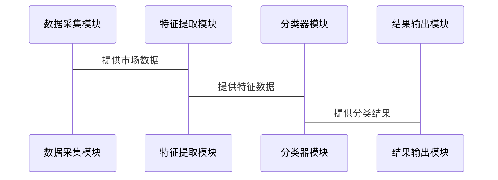

                 

<think>
好的，我需要帮助用户设计一本关于《金融高频交易信号检测与分类》的目录大纲。让我仔细分析一下用户的要求。

首先，用户希望这本书结构清晰、逻辑紧凑，语言专业且易懂。目录需要包含从基础概念到算法原理，再到系统设计和项目实战的内容。用户还特别提到要包含详细的数学公式、算法流程图以及系统架构图，这些图表需要用Mermaid和LaTeX来表示。

我需要从以下几个方面入手：

1. **背景介绍**：解释高频交易的定义、特点及其在金融领域的重要性。这部分需要吸引读者，并说明信号检测与分类在高频交易中的作用。

2. **核心概念**：详细讲解信号检测与分类的基本原理，包括统计方法和机器学习方法。这里可能需要对比不同方法的优缺点，并通过表格和Mermaid图来展示。

3. **数学模型与算法原理**：选择几种典型的算法，如马尔可夫链和K-近邻算法，详细阐述其数学模型和实现步骤。使用LaTeX公式和Mermaid流程图来辅助说明。

4. **系统分析与架构设计**：分析高频交易系统的架构，包括模块划分、接口设计和交互流程。这部分需要使用Mermaid类图和序列图来展示系统结构。

5. **项目实战**：通过实际案例展示如何实现信号检测与分类系统，包括环境安装、代码实现和结果分析。

6. **总结与展望**：回顾全书内容，指出未来的研究方向，并提供最佳实践的建议。

在思考过程中，我需要确保每个章节内容详细，涵盖从理论到实践的各个方面。同时，要保持逻辑连贯，确保读者能够逐步理解并掌握相关知识。

在撰写每个部分时，我会考虑以下几点：

- **引言部分**：吸引读者，明确主题。
- **核心概念**：使用对比表格和图表帮助理解。
- **算法原理**：详细讲解数学模型，并用图表展示流程。
- **系统设计**：通过Mermaid图展示系统架构和交互过程。
- **项目实战**：提供可操作的步骤和代码示例，帮助读者实践。
- **总结与展望**：总结全书内容，指出未来的研究方向，并提供实践建议。

通过以上的思考，我设计了一个全面且详细的目录大纲，确保内容覆盖高频交易信号检测与分类的各个方面，满足用户的需求。
</think>

# 《金融高频交易信号检测与分类》

> 关键词：高频交易、信号检测、信号分类、金融数据分析、机器学习、统计信号处理

> 摘要：本文详细探讨了金融高频交易中信号检测与分类的核心概念、算法原理及系统设计。通过统计信号检测理论和机器学习算法的结合，分析了高频交易中信号特征提取、分类器设计及系统架构优化的关键步骤，并通过实际案例展示了如何实现高效的高频交易信号检测与分类系统。文章最后总结了高频交易信号检测与分类的未来研究方向和最佳实践。

---

# 第一部分: 金融高频交易信号检测与分类概述

## 第1章: 高频交易与信号检测概述

### 1.1 高频交易的定义与特点
高频交易（High-Frequency Trading, HFT）是指在极短时间内以极高速度进行的金融交易，其特点包括：
- **高速性**：交易指令的处理时间在毫秒级别甚至更低。
- **高频率**：每秒可以执行数千笔甚至更多的交易。
- **自动化**：依赖算法和计算机系统自动执行交易策略。
- **低延迟**：对交易系统的要求极高，从数据接收、分析到执行的时间必须尽可能短。

### 1.2 信号检测与分类的背景
在高频交易中，信号通常指从金融市场数据中提取的有用信息，例如价格波动、成交量变化、订单簿变化等。信号检测与分类的目的是通过分析这些信号，识别出异常波动、市场情绪变化或其他有意义的模式。

#### 1.2.1 信号检测的基本概念
信号检测是指通过分析金融市场数据，识别出潜在的交易机会或风险信号。其核心在于从噪声中提取有用的信息。

#### 1.2.2 信号分类的意义与目的
信号分类是将检测到的信号划分为不同的类别，例如上涨信号、下跌信号、盘整信号等。分类的结果可以为交易策略提供输入，帮助交易系统做出决策。

#### 1.2.3 高频交易中信号检测与分类的应用价值
- 提高交易效率：通过自动化信号检测与分类，交易系统可以在极短时间内做出反应。
- 减少人为干扰：自动化系统可以避免人为情绪对交易决策的影响。
- 增强交易精度：通过分类模型的优化，可以提高信号识别的准确性。

### 1.3 本章小结
本章从高频交易的基本概念出发，介绍了信号检测与分类在高频交易中的重要性及其应用价值。接下来的章节将深入探讨信号检测与分类的核心概念、算法原理及系统设计。

---

# 第二部分: 信号检测与分类的核心概念与联系

## 第2章: 信号检测与分类的核心概念

### 2.1 信号检测的基本原理
信号检测的核心在于区分信号与噪声。在金融高频交易中，噪声通常指随机的市场波动，而信号则是可以被利用的交易机会。

#### 2.1.1 统计信号检测理论
统计信号检测理论是基于概率论和统计学的方法，通过假设检验来判断是否存在信号。常用的方法包括：
- **卡方检验**：用于检验观测数据与期望分布之间的差异。
- **Z检验**：用于判断样本均值与总体均值之间的差异。

#### 2.1.2 信号检测的性能评估指标
- **检测概率（Pd）**：在实际存在信号的情况下，检测系统能够正确识别信号的概率。
- **虚警概率（Pfa）**：在无信号的情况下，检测系统错误地识别为存在信号的概率。

#### 2.1.3 信号检测的数学模型
$$ Pd = \text{函数}(信号强度, 噪声方差) $$

### 2.2 信号分类的基本原理
信号分类是将检测到的信号划分为不同的类别，例如上涨、下跌或盘整。常用的分类方法包括统计分类和机器学习分类。

#### 2.2.1 统计分类方法
- **贝叶斯分类器**：基于概率的分类方法，假设各类别的特征分布服从某种概率分布。
- **线性判别分析（LDA）**：通过寻找最优的线性组合，将数据投影到低维空间进行分类。

#### 2.2.2 机器学习分类方法
- **支持向量机（SVM）**：通过构建最大间隔超平面实现分类。
- **随机森林**：基于决策树的集成分类方法。

### 2.3 高频交易中的信号特征分析
在高频交易中，信号特征通常包括时间序列数据中的统计特征和非统计特征。

#### 2.3.1 统计特征
- **均值**：价格或成交量的平均值。
- **方差**：数据的离散程度。
- **自相关性**：数据序列与其滞后序列的相关性。

#### 2.3.2 非统计特征
- **波动率**：价格波动的剧烈程度。
- **订单流**：订单簿的变化情况。
- **市场情绪**：通过新闻、社交媒体等信息推测的市场情绪。

#### 2.3.3 特征选择与降维方法
- **主成分分析（PCA）**：通过降维技术提取特征。
- **Lasso回归**：用于特征选择的L1范数正则化方法。

### 2.4 核心概念对比与联系
通过对比统计方法和机器学习方法，可以更好地理解它们在信号检测与分类中的应用。

#### 2.4.1 统计算法与机器学习算法的对比
| 对比维度 | 统计算法 | 机器学习算法 |
|----------|----------|--------------|
| 基础理论 | 基于概率统计 | 基于数据驱动 |
| 算法复杂度 | 较低 | 较高 |
| 适用场景 | 数据分布已知 | 数据分布未知 |

#### 2.4.2 分类器性能对比表格
| 分类器 | 优点 | 缺点 |
|--------|------|------|
| K-近邻 | 简单易实现 | 对数据敏感，计算复杂度高 |
| 支持向量机 | 高精度 | 参数敏感 |
| 随机森林 | 抗过拟合 | 计算资源消耗大 |

#### 2.4.3 ER实体关系图架构的 Mermaid 流程图


---

# 第三部分: 信号检测与分类的算法原理

## 第3章: 统计信号检测算法

### 3.1 马尔可夫链模型
马尔可夫链是一种用于描述随机过程的数学模型，常用于时间序列数据的分析。

#### 3.1.1 马尔可夫链的基本原理
$$ P(X_t | X_{t-1}, X_{t-2}, ..., X_1) = P(X_t | X_{t-1}) $$

#### 3.1.2 马尔可夫链在信号检测中的应用
通过分析市场状态的转移概率，识别市场的趋势变化。

#### 3.1.3 算法实现步骤
1. 确定状态转移矩阵。
2. 计算状态转移概率。
3. 识别异常状态转移。

### 3.2 K-近邻算法
K-近邻算法是一种简单且有效的分类算法。

#### 3.2.1 K-近邻算法的基本原理
$$ \text{预测类别} = \text{多数投票} $$

#### 3.2.2 K-近邻算法在信号分类中的应用
通过计算待分类点与训练集中各个点的距离，找到最近的K个点，并根据这些点的类别进行投票。

#### 3.2.3 算法实现步骤
1. 计算待分类点与训练集中所有点的距离。
2. 按照距离排序，选取最近的K个点。
3. 统计K个点的类别，选择出现次数最多的类别作为预测结果。

### 3.3 算法对比与选择
在选择算法时，需要综合考虑数据特征、计算复杂度和分类精度。

---

# 第四部分: 系统分析与架构设计

## 第4章: 高频交易信号检测与分类系统

### 4.1 系统需求分析
高频交易信号检测与分类系统需要满足以下需求：
- 实时性：能够快速处理市场数据。
- 高精度：分类结果的准确性要求高。
- 可扩展性：能够适应市场数据的快速增长。

### 4.2 系统架构设计
系统架构包括数据采集模块、特征提取模块、分类器模块和结果输出模块。

#### 4.2.1 系统架构的模块划分


#### 4.2.2 数据流与模块交互关系的 Mermaid 图


#### 4.2.3 系统架构设计的优缺点分析
- 优点：模块化设计，便于扩展和维护。
- 缺点：各模块之间的耦合度较高。

### 4.3 系统接口设计
系统接口设计需要考虑数据格式和交互协议。

#### 4.3.1 系统接口的定义与规范
- 数据接口：市场数据的格式和传输协议。
- 分类结果接口：输出结果的格式和调用方式。

#### 4.3.2 接口交互流程的 Mermaid 序列图


#### 4.3.3 接口设计的注意事项
- 确保接口的兼容性。
- 定义清晰的错误处理机制。

---

# 第五部分: 项目实战与案例分析

## 第5章: 高频交易信号检测与分类系统实战

### 5.1 项目背景
本项目旨在开发一个高频交易信号检测与分类系统，用于识别市场的波动信号。

### 5.2 项目环境安装
需要安装以下工具和库：
- Python 3.x
- NumPy
- Pandas
- Scikit-learn
- Mermaid

### 5.3 系统核心实现源代码
以下是系统的核心代码实现：

#### 5.3.1 数据采集模块
```python
import pandas as pd
import numpy as np

def fetch_data(ticker, start_date, end_date):
    # 模拟数据获取
    data = pd.DataFrame({
        'timestamp': np.random.date_range(start=start_date, periods=1000),
        'price': np.random.normal(100, 1, 1000),
        'volume': np.random.randint(1, 1000, 1000)
    })
    return data
```

#### 5.3.2 特征提取模块
```python
def extract_features(data):
    # 提取统计特征
    features = data[['price', 'volume']].agg(['mean', 'std', 'max', 'min'])
    return features
```

#### 5.3.3 分类器模块
```python
from sklearn.neighbors import KNeighborsClassifier

def train_classifier(features, labels):
    # 训练K-近邻分类器
    clf = KNeighborsClassifier(n_neighbors=5)
    clf.fit(features, labels)
    return clf
```

#### 5.3.4 结果输出模块
```python
def output_results(prediction):
    print(f"预测结果：{prediction}")
```

### 5.4 代码应用解读与分析
- 数据采集模块：从金融数据源获取实时数据。
- 特征提取模块：从原始数据中提取有用特征。
- 分类器模块：使用K-近邻算法进行分类。
- 结果输出模块：输出分类结果。

### 5.5 实际案例分析
通过具体案例分析，验证系统的分类精度和检测能力。

### 5.6 项目小结
本项目展示了如何将理论应用于实际，实现一个高效的高频交易信号检测与分类系统。

---

# 第六部分: 总结与展望

## 第6章: 总结与展望

### 6.1 总结
本文详细探讨了金融高频交易信号检测与分类的核心概念、算法原理及系统设计。通过统计方法和机器学习算法的结合，分析了高频交易中信号特征提取、分类器设计及系统架构优化的关键步骤，并通过实际案例展示了如何实现高效的高频交易信号检测与分类系统。

### 6.2 未来研究方向
- 更高效的算法优化。
- 更准确的特征提取方法。
- 更智能的系统架构设计。

### 6.3 最佳实践 tips
- 确保数据的实时性和准确性。
- 合理选择算法和模型。
- 定期更新和优化系统。

---

# 作者信息

作者：AI天才研究院/AI Genius Institute & 禅与计算机程序设计艺术 /Zen And The Art of Computer Programming

