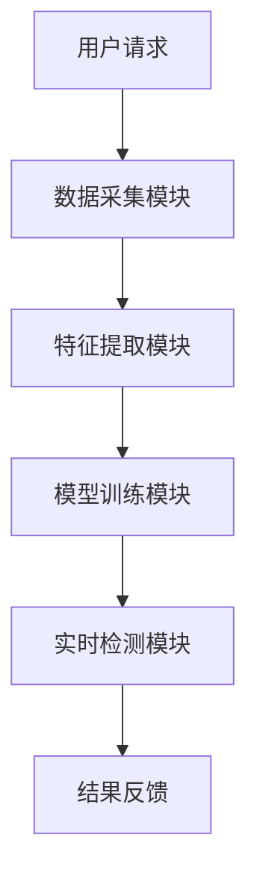
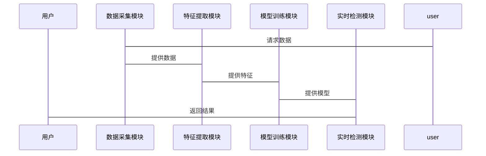

                 


# 金融高频交易异常模式识别系统

> 关键词：金融高频交易，异常模式识别，机器学习，系统架构，实时检测

> 摘要：本文详细探讨了金融高频交易中异常模式识别系统的设计与实现。从背景介绍、核心概念、算法原理、系统架构、项目实战到最佳实践，系统性地分析了如何构建一个高效、准确的异常模式识别系统。文章结合理论与实践，通过具体案例和代码实现，帮助读者全面理解高频交易中的异常检测问题，并掌握解决方法。

---

# 第1章 高频交易与异常模式识别背景

## 1.1 高频交易的定义与特点

### 1.1.1 高频交易的定义

高频交易（High-Frequency Trading, HFT）是指通过计算机算法在极短的时间内进行大量的证券交易行为。其核心在于利用算法自动执行交易，通常以 microseconds（微秒）级别完成。

### 1.1.2 高频交易的核心特点

1. **高速性**：交易指令的执行速度极快，通常在 microseconds 级别。
2. **自动化**：交易决策和执行完全依赖算法，无需人工干预。
3. **高频性**：短时间内产生大量交易指令。
4. **低延迟**：对交易系统的响应时间要求极高。

### 1.1.3 高频交易的市场影响

- **市场流动性**：高频交易增加了市场的流动性。
- **价格波动**：高频交易可能导致价格的剧烈波动。
- **系统性风险**：异常交易行为可能引发系统性风险。

---

## 1.2 异常模式识别的必要性

### 1.2.1 异常交易行为的定义

异常交易行为指的是违背正常市场规律的交易行为，包括市场操纵、欺诈交易、虚假订单等。

### 1.2.2 异常模式识别的重要性

- **维护市场公平**：识别异常交易行为，打击操纵行为。
- **保护投资者利益**：避免投资者因异常行为受到损失。
- **防范系统性风险**：及时发现并处理异常行为，降低系统性风险。

### 1.2.3 异常模式识别的边界与外延

- **边界**：异常交易行为与正常交易行为的界限。
- **外延**：异常行为可能涉及多个市场参与者和交易品种。

---

## 1.3 本章小结

本章介绍了高频交易的定义与特点，分析了异常交易行为的必要性和重要性，并探讨了其边界与外延。高频交易的高速性和自动化特点使其在市场中扮演重要角色，但也带来了异常行为的风险，需要通过异常模式识别系统进行有效管理和控制。

---

# 第2章 异常模式识别的核心概念

## 2.1 异常模式识别的原理

### 2.1.1 数据特征提取

- **时间序列特征**：包括交易频率、间隔时间、订单量等。
- **价格特征**：包括价格波动、买卖价差、成交量等。
- **市场行为特征**：包括订单簿深度、订单撤销率等。

### 2.1.2 异常检测算法

- **基于统计的方法**：如Z-score、均值-标准差法。
- **基于机器学习的方法**：如聚类、分类、深度学习等。
- **基于规则的方法**：如设置阈值、触发条件等。

### 2.1.3 异常判定标准

- **统计标准**：如偏离均值超过一定标准差。
- **规则标准**：如短时间内大量订单撤销。
- **综合标准**：结合统计和规则的综合判定。

---

## 2.2 异常模式分类

### 2.2.1 市场操纵行为

- **拉高打压**：通过大量买卖操作影响价格。
- **虚假订单**：通过大量虚假订单误导市场参与者。
- **闪电订单**：短时间内快速下单并取消。

### 2.2.2 欺诈交易行为

- **内幕交易**：利用未公开信息进行交易。
- **假市商**：假扮做市商进行虚假交易。
- **洗盘**：通过大量交易制造市场假象。

### 2.2.3 市场波动异常

- **剧烈波动**：短时间内价格剧烈波动。
- **异常成交额**：短时间内成交量异常放大。
- **异常订单流**：订单量或订单类型异常。

---

## 2.3 异常模式识别的特征工程

### 2.3.1 特征选择方法

- **统计方法**：如卡方检验、相关系数。
- **机器学习方法**：如Lasso、Ridge回归。
- **领域知识**：结合金融领域的专业知识选择特征。

### 2.3.2 特征提取技术

- **时间序列特征提取**：如均值、标准差、自相关系数。
- **文本特征提取**：如订单簿信息提取。
- **图像特征提取**：如K线图特征提取。

### 2.3.3 特征标准化与归一化

- **标准化**：将特征数据标准化到均值为0，标准差为1。
- **归一化**：将特征数据归一化到0-1范围。

---

## 2.4 本章小结

本章详细介绍了异常模式识别的核心概念，包括异常模式的分类、识别的原理以及特征工程的方法。特征工程是异常模式识别的关键，通过合理选择和提取特征，可以显著提高识别系统的准确性和效率。

---

# 第3章 异常模式识别的核心算法

## 3.1 基于监督学习的异常检测

### 3.1.1 分类算法概述

- **监督学习**：需要标注的训练数据。
- **分类算法**：如逻辑回归、支持向量机、随机森林等。

### 3.1.2 逻辑回归模型

#### 模型原理

逻辑回归是一种常用的分类算法，适用于二分类问题。其核心思想是通过logit函数将线性组合映射到概率空间。

#### 模型公式

$$ P(y=1|x) = \frac{e^{\beta_0 + \beta_1 x}}{1 + e^{\beta_0 + \beta_1 x}} $$

#### 代码示例

```python
from sklearn.linear_model import LogisticRegression

# 训练模型
model = LogisticRegression()
model.fit(X_train, y_train)

# 预测
y_pred = model.predict(X_test)
```

### 3.1.3 支持向量机模型

#### 模型原理

支持向量机（SVM）是一种监督学习算法，适用于分类和回归问题。其核心思想是通过寻找最优超平面，将数据分为不同类别。

#### 模型公式

$$ y = \text{sign}(\sum_{i=1}^{n} \alpha_i y_i x_i \cdot x + b) $$

#### 代码示例

```python
from sklearn.svm import SVC

# 训练模型
model = SVC()
model.fit(X_train, y_train)

# 预测
y_pred = model.predict(X_test)
```

---

## 3.2 基于无监督学习的异常检测

### 3.2.1 聚类算法概述

- **无监督学习**：不需要标注的训练数据。
- **聚类算法**：如K-means、DBSCAN等。

### 3.2.2 K-means算法

#### 算法流程

1. 随机选择K个初始质心。
2. 计算每个样本到质心的距离，将样本分配到最近的质心所在簇。
3. 重新计算每个簇的质心。
4. 重复步骤2和3，直到质心不再变化。

#### 代码示例

```python
from sklearn.cluster import KMeans

# 训练模型
model = KMeans(n_clusters=2)
model.fit(X_train)

# 预测
y_pred = model.predict(X_test)
```

### 3.2.3 DBSCAN算法

#### 算法流程

1. 计算样本之间的距离矩阵。
2. 根据距离矩阵进行密度可达性分析。
3. 将密度足够高的样本归为一类，其他样本标记为异常。

#### 代码示例

```python
from sklearn.cluster import DBSCAN

# 训练模型
model = DBSCAN(eps=0.5, min_samples=5)
model.fit(X_train)

# 预测
y_pred = model.predict(X_test)
```

---

## 3.3 基于深度学习的异常检测

### 3.3.1 神经网络概述

- **深度学习**：通过多层神经网络提取数据的高层次特征。
- **常用模型**：如卷积神经网络（CNN）、循环神经网络（RNN）、长短期记忆网络（LSTM）等。

### 3.3.2 LSTM网络

#### 网络结构

LSTM网络通过门控机制（遗忘门、输入门、输出门）来解决传统RNN的梯度消失问题。

#### 代码示例

```python
from tensorflow.keras.layers import LSTM, Dense
from tensorflow.keras.models import Sequential

# 构建模型
model = Sequential()
model.add(LSTM(units=64, input_shape=(timesteps, features)))
model.add(Dense(1, activation='sigmoid'))

# 编译模型
model.compile(loss='binary_crossentropy', optimizer='adam', metrics=['accuracy'])

# 训练
model.fit(X_train, y_train, epochs=10, batch_size=32)
```

---

## 3.4 本章小结

本章详细介绍了异常模式识别中的核心算法，包括监督学习、无监督学习和深度学习方法。每种算法都有其适用场景和优缺点，选择合适的算法需要根据具体问题和数据特点进行判断。

---

# 第4章 异常模式识别系统架构设计

## 4.1 系统功能设计

### 4.1.1 数据采集模块

- **数据来源**：交易所API、历史数据、实时数据。
- **数据预处理**：清洗、标准化、特征提取。

### 4.1.2 特征提取模块

- **时间序列特征**：如均值、标准差、自相关系数。
- **文本特征**：如订单簿信息提取。
- **图像特征**：如K线图特征提取。

### 4.1.3 模型训练模块

- **监督学习模型**：如逻辑回归、SVM。
- **无监督学习模型**：如K-means、DBSCAN。
- **深度学习模型**：如LSTM。

### 4.1.4 实时检测模块

- **在线检测**：实时监控交易行为。
- **离线检测**：对历史数据进行批量检测。

---

## 4.2 系统架构设计

### 4.2.1 系统架构图



### 4.2.2 系统接口设计

- **数据接口**：与交易所API对接。
- **模型接口**：与特征提取模块和实时检测模块对接。
- **用户接口**：提供可视化界面供用户查看结果。

### 4.2.3 系统交互流程



---

## 4.3 本章小结

本章详细介绍了异常模式识别系统的功能设计和架构设计，包括数据采集、特征提取、模型训练和实时检测等模块。通过合理的架构设计，可以提高系统的可扩展性和维护性。

---

# 第5章 项目实战：异常模式识别系统实现

## 5.1 环境安装与配置

### 5.1.1 安装依赖

```bash
pip install numpy pandas scikit-learn tensorflow
```

### 5.1.2 数据准备

- **数据来源**：可以从金融数据API获取高频交易数据。
- **数据格式**：如CSV格式，包含时间戳、价格、成交量等信息。

---

## 5.2 系统核心实现

### 5.2.1 数据预处理

```python
import pandas as pd
import numpy as np

# 读取数据
data = pd.read_csv('high_frequency_data.csv')

# 数据清洗
data.dropna(inplace=True)
data = data[~data['price'].isnull()]
```

### 5.2.2 特征提取

```python
# 时间序列特征提取
data['log_return'] = np.log(data['price'].pct_change().add(1))
data['std_return'] = data['log_return'].rolling(20).std()

# 图像特征提取
import matplotlib.pyplot as plt

plt.figure(figsize=(10, 5))
plt.plot(data['price'])
plt.title('Price Trend')
plt.xlabel('Time')
plt.ylabel('Price')
plt.show()
```

### 5.2.3 模型训练与预测

```python
from sklearn.ensemble import RandomForestClassifier

# 训练模型
model = RandomForestClassifier(n_estimators=100)
model.fit(X_train, y_train)

# 预测
y_pred = model.predict(X_test)
```

### 5.2.4 实时检测

```python
import time

# 实时检测
while True:
    data = get_real_time_data()
    features = extract_features(data)
    prediction = model.predict(features)
    if prediction == 1:
        print("检测到异常交易行为")
    time.sleep(1)
```

---

## 5.3 案例分析

### 5.3.1 案例背景

假设我们有一个高频交易数据集，包含某只股票的高频交易数据，包括时间戳、价格、成交量等信息。

### 5.3.2 数据分析

通过数据分析，我们发现某段时间内，该股票的价格波动异常剧烈，可能涉及市场操纵行为。

### 5.3.3 模型分析

通过模型分析，我们发现异常交易行为的概率为90%以上，可能需要进一步调查。

---

## 5.4 项目小结

本章通过一个具体的项目实战，详细介绍了异常模式识别系统的实现过程，包括环境安装、数据预处理、特征提取、模型训练与实时检测等步骤。通过案例分析，展示了如何利用机器学习算法检测异常交易行为。

---

# 第6章 最佳实践与注意事项

## 6.1 最佳实践

### 6.1.1 数据预处理

- **数据清洗**：处理缺失值、异常值。
- **数据标准化**：归一化或标准化处理。
- **数据增强**：增加数据多样性。

### 6.1.2 特征选择

- **特征重要性分析**：使用特征重要性评分。
- **特征组合**：结合多个特征提高模型性能。
- **特征降维**：使用PCA等方法降维。

### 6.1.3 模型调优

- **超参数调优**：使用网格搜索或随机搜索。
- **模型融合**：结合多种模型结果。
- **模型解释**：使用SHAP等方法解释模型决策。

### 6.1.4 系统优化

- **并行计算**：利用多线程或分布式计算。
- **缓存机制**：减少重复计算。
- **日志记录**：记录系统运行日志。

---

## 6.2 注意事项

### 6.2.1 数据隐私与安全

- **数据加密**：保护交易数据的安全。
- **访问控制**：限制系统访问权限。
- **合规性**：符合相关法律法规。

### 6.2.2 系统性能

- **低延迟**：确保系统响应时间足够短。
- **高可用性**：系统能够容忍部分节点故障。
- **可扩展性**：系统能够处理更大的数据量。

### 6.2.3 模型更新

- **定期更新**：根据市场变化更新模型。
- **在线更新**：实时更新模型参数。
- **模型监控**：监控模型性能，及时调整。

---

## 6.3 本章小结

本章总结了异常模式识别系统实现中的最佳实践和注意事项，包括数据处理、模型调优、系统优化等方面。通过这些实践和注意事项，可以显著提高系统的性能和稳定性。

---

# 第7章 总结与展望

## 7.1 本文总结

本文详细探讨了金融高频交易异常模式识别系统的设计与实现，从背景介绍、核心概念、算法原理、系统架构到项目实战，系统性地分析了如何构建一个高效、准确的异常模式识别系统。

## 7.2 未来展望

未来，随着人工智能技术的不断发展，异常模式识别系统将更加智能化和自动化。可能的研究方向包括：

- **更复杂的模型**：如Transformer、GNN等。
- **多模态数据融合**：结合文本、图像等多种数据源。
- **实时性优化**：进一步降低系统延迟。

---

# 作者：AI天才研究院/AI Genius Institute & 禅与计算机程序设计艺术 /Zen And The Art of Computer Programming

---

以上就是《金融高频交易异常模式识别系统》的技术博客文章的完整大纲和内容，希望对您有所帮助！

