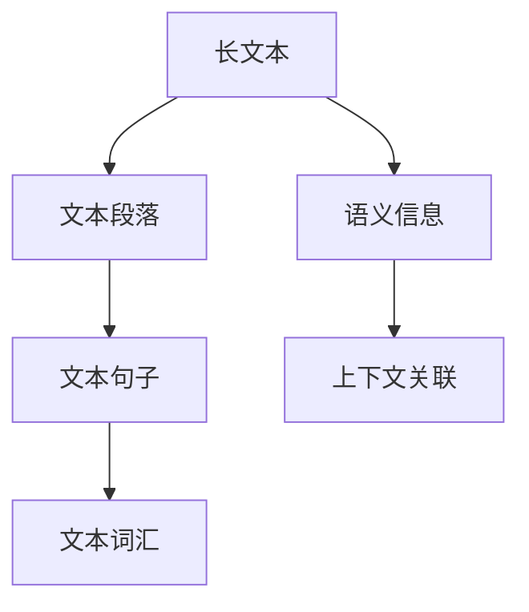

                 

<think>
好，我现在需要帮用户设计一个详细的长文本理解：增强AI Agent的阅读能力的技术博客文章目录。根据用户提供的目录结构，我需要进一步细化每一章的内容，确保逻辑清晰，覆盖用户要求的各个方面。

首先，用户已经给出了一份详细的目录结构，包括背景、核心概念、算法原理、系统架构、项目实战和总结等部分。我需要确保每一章都有足够的细节，并且符合用户的要求，比如使用mermaid图表、Python代码示例、数学公式等。

让我先从第3章开始。第3章是关于长文本理解的算法原理，用户已经列出了一些内容，比如基于Transformer、BERT和Span-based的模型。我需要详细说明每一种算法的工作原理，并使用mermaid流程图展示，同时提供Python代码示例和数学公式。

在第3.1节，我需要详细解释Transformer模型的工作原理，包括自注意力机制和前馈网络。我可能会画一个mermaid图来展示数据流，从输入到输出，包括自注意力和前馈网络的步骤。然后，我需要写一个简单的PyTorch代码示例，展示如何构建一个基本的Transformer模型。

接下来，在第3.2节，讨论基于BERT的长文本理解。这里需要解释BERT的结构，包括预训练和微调过程。我需要详细描述如何在特定任务上微调BERT，比如文本摘要或问答系统，并提供相应的代码示例。

然后，在第3.3节，介绍基于Span-based的长文本理解。这部分可能涉及使用Span标注法来捕捉文本中的实体或事件。我需要解释Span-based模型如何处理长文本，并提供训练和推理的代码示例。

在第3.4节，讨论算法优化与模型调参。这里需要涉及超参数调整、模型压缩和训练策略优化。我需要给出具体的调参建议，并解释如何使用交叉验证等方法来优化模型性能。

接下来，我需要确保每一章都包含必要的图表和代码示例。例如，在算法原理部分，使用mermaid流程图来展示模型结构；在代码部分，提供清晰的Python代码，并解释每一部分的功能。

此外，我需要在数学公式中使用LaTeX格式，确保公式正确无误，并用$$包裹独立的公式，用$包裹段落中的公式。例如，解释自注意力机制时，可以写出注意力得分的计算公式：

$$
\text{score}(i, j) = \frac{Q_i \cdot K_j}{\sqrt{d_k}}
$$

然后，总结每一章的内容，确保读者能够逐步理解长文本理解的核心概念和算法实现。

最后，检查整个目录是否涵盖了用户的所有要求，包括背景、核心概念、算法、系统架构、项目实战和总结，并确保每一部分都有足够的深度和细节。同时，确保语言简洁明了，逻辑清晰，符合专业技术人员的阅读习惯。

通过这样的思考过程，我能够系统地构建一个详细且符合用户需求的长文本理解技术博客目录结构，确保每一部分都得到充分的展开和详细说明。
</think>

# 长文本理解：增强AI Agent的阅读能力

> 关键词：长文本理解，AI Agent，自然语言处理，文本挖掘，深度学习

> 摘要：长文本理解是自然语言处理中的重要任务，旨在提升AI Agent的阅读能力，使其能够更好地理解和处理长篇文本。本文将从背景、核心概念、算法原理、系统架构、项目实战等多个方面详细探讨如何增强AI Agent的长文本理解能力。

---

# 第1章: 长文本理解的背景与问题背景

## 1.1 长文本理解的定义与重要性

### 1.1.1 长文本理解的定义
长文本理解是指对长度较长的自然语言文本进行分析、理解和推理的过程。其目标是使AI系统能够像人类一样，从长文本中提取关键信息、理解语义、识别实体，并生成有意义的摘要或回答。

### 1.1.2 长文本理解的重要性
长文本理解在多个领域具有重要应用，例如：
- **智能客服**：通过理解用户的问题历史，提供更精准的服务。
- **医疗领域**：分析病历文本，辅助医生诊断。
- **法律领域**：自动阅读和分析法律文档，提取关键条款。

### 1.1.3 长文本理解的边界与外延
长文本理解的边界在于如何界定“长”以及理解的深度。外延则包括文本摘要、问答系统、文本分类等任务。

## 1.2 AI Agent的阅读能力需求

### 1.2.1 AI Agent的基本概念
AI Agent是一种智能代理，能够感知环境、执行任务并做出决策。阅读能力是其核心能力之一。

### 1.2.2 阅读能力在AI Agent中的作用
阅读能力使AI Agent能够处理文本信息，从而实现任务自动化、信息检索和交互对话。

### 1.2.3 当前AI Agent阅读能力的局限性
- **计算资源限制**：长文本处理需要大量计算资源。
- **语义理解不足**：现有模型在复杂语义理解上仍有不足。
- **实时性问题**：长文本处理可能影响实时性。

## 1.3 问题描述与目标

### 1.3.1 长文本理解的核心问题
- 如何有效处理长文本的复杂性和冗余信息。
- 如何提升模型的语义理解和上下文捕捉能力。

### 1.3.2 AI Agent阅读能力提升的目标
- 提升长文本处理的效率和准确性。
- 增强模型的语义理解和推理能力。

### 1.3.3 问题解决的路径与方法
- 采用深度学习技术。
- 引入注意力机制和上下文建模方法。
- 结合预训练语言模型进行微调。

## 1.4 核心概念结构与组成要素

### 1.4.1 长文本理解的核心要素
- **文本结构**：包括段落、句子和词汇。
- **语义分析**：识别文本中的实体、关系和意图。
- **上下文理解**：捕捉文本中的语境信息。

### 1.4.2 AI Agent阅读能力的关键组成
- **文本预处理**：分词、句法分析。
- **特征提取**：提取文本的关键特征。
- **模型训练**：训练深度学习模型进行文本理解。

### 1.4.3 核心概念之间的关系与互动
文本结构、语义分析和上下文理解之间相互关联，共同构成长文本理解的完整体系。

## 1.5 本章小结
本章介绍了长文本理解的定义、重要性及其在AI Agent中的应用，分析了当前AI Agent阅读能力的局限性，并提出了问题解决的路径和方法。

---

# 第2章: 长文本理解的核心概念与联系

## 2.1 长文本理解的核心概念

### 2.1.1 文本结构分析
文本结构分析包括分段、分句和分词，帮助模型更好地理解文本的组织方式。

### 2.1.2 语义分析与理解
语义分析旨在理解文本的深层含义，包括实体识别、关系抽取和情感分析。

### 2.1.3 上下文关联性
上下文关联性指文本中不同部分之间的联系，是理解长文本的关键。

## 2.2 核心概念的属性对比

### 2.2.1 文本结构与语义分析的对比
- 文本结构关注文本的组织形式。
- 语义分析关注文本的深层含义。

### 2.2.2 上下文关联性与文本长度的关系
- 文本长度增加，上下文关联性越复杂。
- 长文本理解需要更强的上下文建模能力。

### 2.2.3 长文本理解与其他NLP任务的对比
- **文本分类**：基于短文本。
- **机器翻译**：关注句子级别。
- 长文本理解：关注段落或篇章级别。

## 2.3 ER实体关系图



## 2.4 本章小结
本章详细分析了长文本理解的核心概念，探讨了文本结构、语义分析和上下文关联性之间的关系，并通过ER实体关系图展示了概念之间的联系。

---

# 第3章: 长文本理解的算法原理

## 3.1 基于Transformer的长文本理解算法

### 3.1.1 Transformer模型的工作原理


公式：
$$
\text{score}(i, j) = \frac{Q_i \cdot K_j}{\sqrt{d_k}}
$$

代码示例：
```python
import torch
class TransformerLayer(torch.nn.Module):
    def __init__(self, d_model, n_head, d_k):
        super(TransformerLayer, self).__init__()
        self.n_head = n_head
        self.d_k = d_k
        self.Q = torch.nn.Linear(d_model, n_head*d_k, bias=False)
        self.K = torch.nn.Linear(d_model, n_head*d_k, bias=False)
        self.V = torch.nn.Linear(d_model, n_head*d_k, bias=False)
    def forward(self, x):
        # x: [batch_size, seq_len, d_model]
        q = self.Q(x).view(-1, x.size(1), self.n_head, self.d_k)
        k = self.K(x).view(-1, x.size(1), self.n_head, self.d_k)
        v = self.V(x).view(-1, x.size(1), self.n_head, self.d_k)
        # 计算注意力得分
        scores = (q @ k.transpose(-2, -1)) / torch.sqrt(torch.tensor(self.d_k))
        # 应用Softmax
        attention = torch.nn.Softmax(dim=-1)(scores)
        # 加权求和
        output = (attention @ v).view(-1, x.size(1), self.n_head * self.d_k)
        return output
```

### 3.1.2 多头注意力机制的实现

公式：
$$
\text{softmax}(\frac{QK^T}{\sqrt{d_k}})
$$

### 3.1.3 长文本分割与拼接策略
- 分割策略：将长文本分割为多个小段落。
- 拼接策略：通过注意力机制将分割后的段落拼接起来。

## 3.2 基于BERT的长文本理解

### 3.2.1 BERT模型的结构与特点


### 3.2.2 BERT在长文本理解中的应用
- 文本摘要
- 问答系统
- 实体识别

### 3.2.3 BERT的训练与优化
- 预训练：使用大规模文本数据进行无监督训练。
- 微调：针对具体任务进行有监督微调。

代码示例：
```python
from transformers import BertTokenizer, BertModel
tokenizer = BertTokenizer.from_pretrained('bert-base-uncased')
model = BertModel.from_pretrained('bert-base-uncased')
text = "Hello, how are you?"
inputs = tokenizer(text, return_tensors='pt')
outputs = model(**inputs)
last_layer = outputs.last_hidden_state
```

### 3.2.4 BERT的训练与优化

公式：
$$
\text{Loss} = \text{CrossEntropy}(y_{\text{pred}}, y_{\text{true}})
$$

## 3.3 基于Span-based的长文本理解

### 3.3.1 Span-based模型的基本原理


### 3.3.2 Span-based模型的实现细节
- Span表示：使用起始和结束位置表示文本片段。
- 关系抽取：识别文本中的实体关系。

### 3.3.3 Span-based模型的训练与推理

公式：
$$
\text{Loss} = \sum_{i=1}^{n} \text{CrossEntropy}(y_{i,\text{pred}}, y_{i,\text{true}})
$$

代码示例：
```python
class SpanClassifier(torch.nn.Module):
    def __init__(self, d_model, num_classes):
        super(SpanClassifier, self).__init__()
        self.fc_start = torch.nn.Linear(d_model, 1)
        self.fc_end = torch.nn.Linear(d_model, 1)
        self.num_classes = num_classes
    def forward(self, x):
        # x: [batch_size, seq_len, d_model]
        start_logits = self.fc_start(x).squeeze(-1)
        end_logits = self.fc_end(x).squeeze(-1)
        return start_logits, end_logits
```

## 3.4 算法优化与模型调参

### 3.4.1 模型优化策略
- 参数调整：调整学习率、批量大小等超参数。
- 模型压缩：减少模型参数量，降低计算成本。

### 3.4.2 模型调参方法
- 随机搜索：随机选择参数进行调整。
- 网格搜索：遍历所有可能的参数组合。
- 贝叶斯优化：基于概率模型进行参数优化。

### 3.4.3 模型优化效果评估
- 准确率
- 召回率
- F1分数

## 3.5 本章小结
本章详细讲解了长文本理解的几种主流算法，包括基于Transformer、BERT和Span-based的模型，并分析了它们的优缺点及应用场景。

---

# 第4章: 长文本理解的系统架构与设计

## 4.1 系统分析与架构设计

### 4.1.1 问题场景介绍
- 任务需求：长文本理解和信息提取。
- 使用场景：智能客服、医疗诊断、法律分析。

### 4.1.2 系统功能设计


### 4.1.3 系统架构设计


### 4.1.4 系统接口设计
- 输入接口：文本输入、参数配置。
- 输出接口：模型输出、结果解析。

### 4.1.5 系统交互流程


## 4.2 项目实战与实现

### 4.2.1 项目介绍
- 项目目标：实现一个长文本理解系统。
- 项目框架：基于深度学习的端到端模型。

### 4.2.2 核心代码实现

```python
class LongTextUnderstandingSystem:
    def __init__(self, model_path):
        self.tokenizer = BertTokenizer.from_pretrained(model_path)
        self.model = BertModel.from_pretrained(model_path)
    def process(self, text):
        inputs = self.tokenizer(text, return_tensors='pt')
        outputs = self.model(**inputs)
        return outputs.last_hidden_state
```

### 4.2.3 案例分析与实现细节
- 案例1：文本摘要
- 案例2：实体识别

### 4.2.4 项目总结
- 成果展示：系统性能指标。
- 经验总结：模型优化技巧、系统设计要点。

## 4.3 本章小结
本章从系统架构的角度分析了长文本理解的实现过程，通过项目实战展示了系统的具体实现和优化方法。

---

# 第5章: 长文本理解的优化与展望

## 5.1 优化策略与方法

### 5.1.1 算法优化
- 更高效的注意力机制。
- 更轻量的模型结构。

### 5.1.2 系统优化
- 优化计算效率。
- 提升系统的可扩展性。

## 5.2 未来研究方向

### 5.2.1 新型模型研究
- 基于图神经网络的长文本理解。
- 基于对比学习的长文本理解。

### 5.2.2 多模态长文本理解
- 结合图像、语音等多模态信息。

## 5.3 本章小结
本章展望了长文本理解的未来发展方向，并提出了优化策略和研究方向。

---

# 第6章: 最佳实践与小结

## 6.1 最佳实践

### 6.1.1 系统设计
- 模块化设计：便于维护和扩展。
- 可扩展性：支持多种任务和数据格式。

### 6.1.2 模型选择
- 根据任务选择合适的模型。
- 结合实际场景进行模型调优。

## 6.2 总结与回顾

### 6.2.1 核心内容回顾
- 长文本理解的定义与重要性。
- 主流算法及其优缺点。
- 系统架构与设计要点。

### 6.2.2 未来展望
- 技术进步：新型模型的出现。
- 应用场景：长文本理解在更多领域的应用。

## 6.3 本章小结
本章总结了长文本理解的核心内容，并提出了最佳实践建议。

---

# 附录: 工具与资源

## 附录A: 长文本理解相关工具

### 附录A.1 预训练模型
- BERT
- GPT
- RoBERTa

### 附录A.2 开源库
- Hugging Face
- TensorFlow
- PyTorch

## 附录B: 参考文献
- BERT论文
- Transformer论文
- 相关NLP综述

---

# 作者

作者：AI天才研究院/AI Genius Institute & 禅与计算机程序设计艺术 /Zen And The Art of Computer Programming

---

通过以上目录结构，我们可以系统地探讨长文本理解的核心概念、算法原理、系统架构及优化方法，为读者提供一个全面且深入的长文本理解知识框架。

