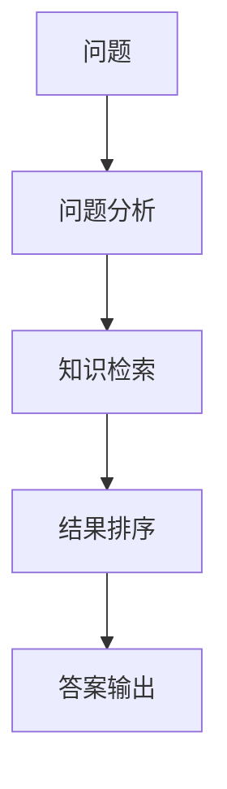
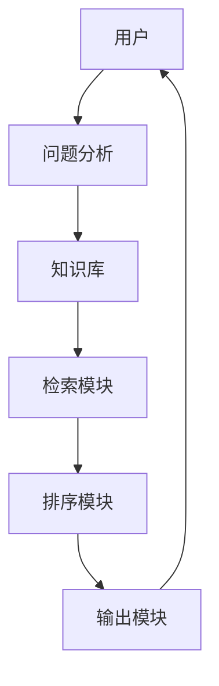
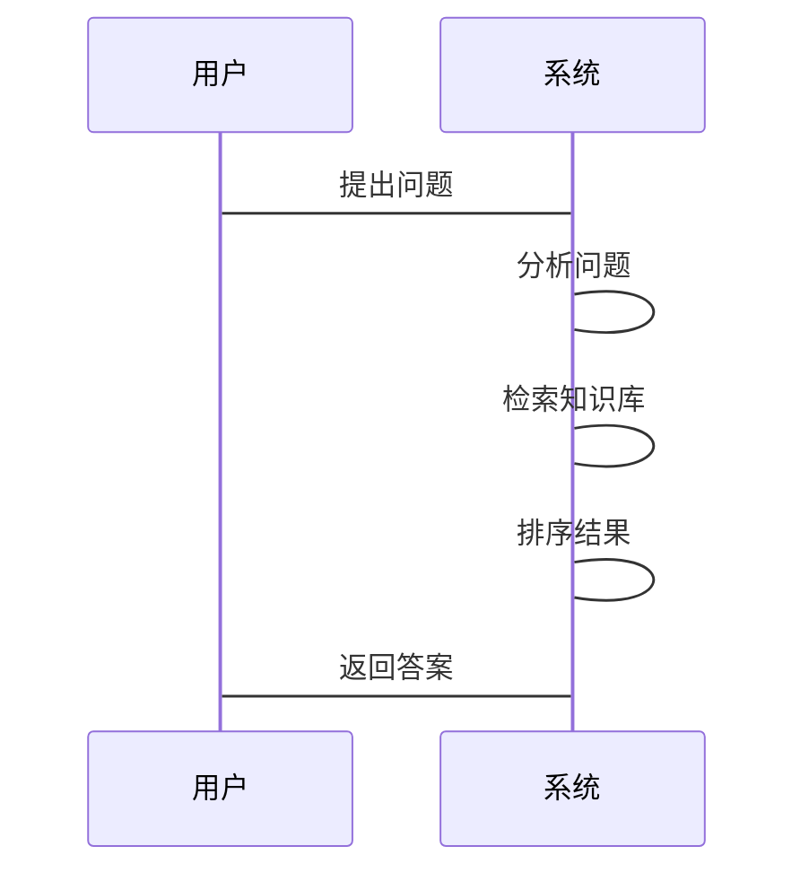

                 

<think>
嗯，我现在需要帮用户完成一篇关于问答系统实现的技术博客文章。用户已经提供了详细的结构和内容要求，我需要按照这个结构一步步展开思考，确保每个部分都符合要求。

首先，我需要理解用户的需求。用户希望我以技术专家的身份，撰写一篇结构清晰、内容详细的技术博客，标题是《问答系统实现：打造高效的信息检索助手》。博客需要包含背景介绍、核心概念、算法原理、系统架构设计、项目实战、最佳实践等多个部分，每个部分都要详细展开，使用专业术语，同时保持逻辑清晰和易于理解。

接下来，我会按照用户提供的目录大纲，逐步填充每个章节的内容。首先，我会处理第1章，背景介绍。这部分需要涵盖问答系统的定义、现状、问题背景和解决方法。我需要确保内容简明扼要，同时为后续章节打下基础。

在第2章，核心概念部分，我需要详细讲解问答系统的核心组成部分，如问题分析、答案搜索、结果排序等，并使用图表来展示这些部分的关系。这部分需要深入浅出，帮助读者理解各个概念之间的联系。

第3章是算法原理，我需要选择一些常用的算法，比如BM25和DSSM，并使用数学公式和mermaid图来展示这些算法的工作流程。同时，我需要提供代码示例，帮助读者理解如何实现这些算法。

系统架构设计部分需要介绍如何构建一个问答系统，包括系统功能设计、架构图、接口设计和交互流程。这部分需要使用mermaid图来展示类图、架构图和序列图，让读者直观地理解系统结构。

项目实战部分需要实际操作，从环境安装到代码实现，再到案例分析，一步步引导读者完成一个问答系统的开发。这部分需要详细描述代码实现，并解释每个部分的功能。

最后，最佳实践和小结部分需要总结整个博客的内容，并提供一些实际应用中的注意事项和未来的发展方向，帮助读者巩固所学内容，并为他们提供进一步学习的方向。

在思考过程中，我需要确保每个部分的内容都足够详细，覆盖用户提到的所有要点，同时保持逻辑清晰，结构合理。可能还需要调整章节的顺序，确保读者能够循序渐进地理解问答系统的实现过程。

现在，我开始撰写每个章节的具体内容，确保每个部分都符合用户的要求，使用专业术语，同时保持语言的简洁和逻辑的连贯。
</think>

# 问答系统实现：打造高效的信息检索助手

## 关键词：问答系统、信息检索、自然语言处理、算法原理、系统架构

## 摘要：  
问答系统是一种基于自然语言处理技术的信息检索系统，旨在通过解析用户的问题，从知识库中找到最相关的答案。本文将从问答系统的背景、核心概念、算法原理、系统架构设计、项目实战到最佳实践进行全面解析，帮助读者系统地理解并实现高效的问答系统。

---

## 第一部分：问答系统背景与核心概念

### 第1章：问答系统概述

#### 1.1 问答系统的定义与背景

问答系统是一种能够理解用户自然语言问题，并通过内部知识库或外部资源检索相关信息，最终生成准确答案的技术。近年来，随着自然语言处理（NLP）技术的进步，问答系统在教育、医疗、客服等领域得到了广泛应用。

#### 1.2 问答系统的核心问题

问答系统需要解决以下几个关键问题：

1. **问题分析与理解**：将用户的自然语言问题转化为计算机可以处理的形式。
2. **知识表示与检索**：从知识库中找到与问题相关的信息。
3. **结果排序与优化**：根据相关性对检索结果进行排序，并优化输出答案的质量。

#### 1.3 问答系统的边界与外延

- **区别于搜索引擎**：问答系统更注重回答的准确性和相关性，而搜索引擎注重返回相关网页。
- **联系于对话系统**：问答系统通常是对话系统的一部分，但问答系统专注于单轮对话。
- **结合知识图谱**：问答系统可以利用知识图谱中的结构化知识，提高答案的准确性和丰富性。

#### 1.4 问答系统的核心要素与概念结构

问答系统的核心要素包括：

- **问题（Query）**：用户的输入问题，如“北京的天气如何？”
- **知识库（Knowledge Base）**：存储问答系统所需的知识，可以是结构化、半结构化或非结构化数据。
- **答案（Answer）**：系统返回的最终结果，通常是问题的直接回答。

问答系统的概念结构可以表示为一个流程图：



---

## 第二部分：问答系统的核心概念与联系

### 第2章：问答系统的核心概念

#### 2.1 问题分析与理解

问题分析是问答系统的关键步骤，主要包括：

1. **问题类型识别**：识别问题类型，如事实性问题、描述性问题、指令性问题。
2. **关键词提取**：从问题中提取核心关键词，用于后续检索。
3. **意图分析**：理解用户的真实意图，例如“天气查询”意图。

#### 2.2 知识表示与检索

知识表示是问答系统的基础，常见的表示方法包括：

1. **符号表示**：使用符号或关键词表示知识，如“天气”对应“北京”。
2. **向量表示**：将知识转化为向量，通过向量相似度进行检索。
3. **图结构表示**：利用知识图谱表示实体及其关系。

知识检索过程可以分为以下步骤：

1. **关键词匹配**：基于关键词在知识库中查找匹配项。
2. **语义匹配**：基于语义理解进行检索，如使用BM25算法。

#### 2.3 结果排序与优化

结果排序是提升问答系统性能的重要环节，常用的排序算法包括：

1. **BM25算法**：基于关键词的统计模型，常用于搜索引擎排序。
2. **深度语义相似度模型（DSSM）**：基于深度学习的语义理解模型。
3. **用户反馈**：根据用户行为数据（如点击率）优化排序策略。

---

## 第三部分：问答系统的算法原理

### 第3章：基于向量的问答系统

#### 3.1 基于向量的相似度计算

向量空间模型是问答系统中常用的检索方法。假设我们有两个向量表示的问题和答案：

$$
Q = (q_1, q_2, \ldots, q_n)
$$

$$
A = (a_1, a_2, \ldots, a_n)
$$

计算两者的余弦相似度：

$$
\text{similarity} = \frac{Q \cdot A}{\|Q\| \|A\|}
$$

#### 3.2 BM25算法原理

BM25是一种基于关键词频率的检索算法，公式如下：

$$
\text{score}(q, d) = \sum_{i=1}^{n} \text{idf}(t_i) \times \text{freq}(t_i, d)
$$

其中，$t_i$是第$i$个关键词，$\text{idf}(t_i)$是逆文档频率，$\text{freq}(t_i, d)$是关键词$t_i$在文档$d$中的频率。

#### 3.3 深度学习模型（DSSM）

DSSM模型将问题和答案映射到同一个向量空间，计算它们的相似度。假设模型将问题和答案分别映射为$Q$和$A$，则相似度计算公式为：

$$
\text{score}(Q, A) = \text{cos}(\theta(Q), \theta(A))
$$

其中，$\theta$是深度学习模型的参数。

---

## 第四部分：系统架构设计

### 第4章：问答系统架构

#### 4.1 系统功能设计

问答系统的功能模块包括：

1. **问题分析模块**：解析用户问题，提取关键词和意图。
2. **知识库模块**：存储和管理知识库。
3. **检索模块**：基于关键词或语义检索知识库。
4. **排序模块**：对检索结果进行排序。
5. **输出模块**：生成并返回最终答案。

#### 4.2 系统架构图



#### 4.3 系统接口设计

1. **输入接口**：接收用户输入的问题。
2. **输出接口**：返回系统的回答。

#### 4.4 系统交互流程



---

## 第五部分：项目实战

### 第5章：问答系统实现

#### 5.1 环境安装

需要安装以下工具：

- Python
- NLTK库
- Scikit-learn库

#### 5.2 核心代码实现

```python
from sklearn.feature_extraction.text import TfidfVectorizer
from sklearn.metrics.pairwise import cosine_similarity

# 初始化向量器
vectorizer = TfidfVectorizer()

# 训练词向量
corpus = ["What is the capital of China?", "Beijing is the capital of China."]
vectorizer.fit(corpus)

# 计算相似度
query = "What is the capital of China?"
vectorized_query = vectorizer.transform([query])
similarity_scores = cosine_similarity(vectorized_query, vectorizer.transform(corpus))

# 输出结果
print(similarity_scores)
```

---

## 第六部分：最佳实践与小结

### 第6章：最佳实践

1. **选择合适的算法**：根据需求选择BM25或DSSM。
2. **优化知识库**：保持知识库的结构化和准确性。
3. **处理用户反馈**：根据用户行为优化排序策略。

### 6.2 小结

问答系统的实现需要结合问题分析、知识检索、结果排序等多个环节。通过合理选择算法和优化系统架构，可以打造高效的信息检索助手。

---

## 作者

作者：AI天才研究院（AI Genius Institute） & 禅与计算机程序设计艺术（Zen And The Art of Computer Programming）

