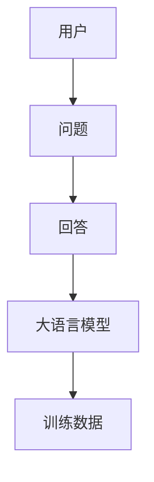
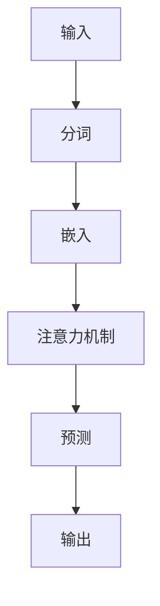
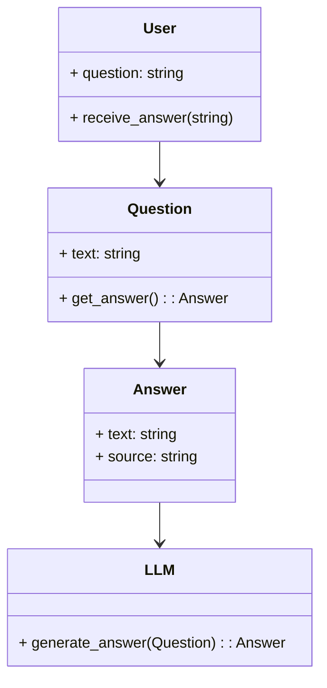
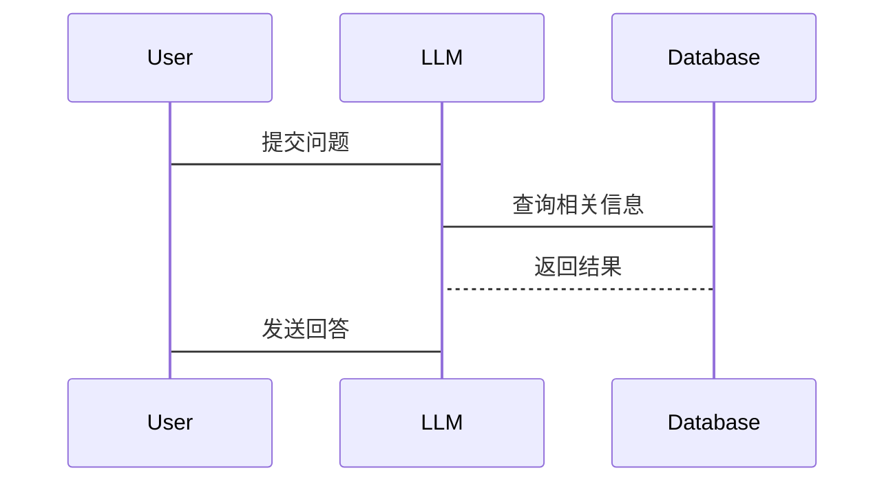

                 

<think>
嗯，我现在需要为《问答系统：构建基于LLM的智能问答Agent》这篇文章撰写正文部分。根据之前制定的目录，我应该从摘要开始，然后依次撰写各个章节。我得确保每个部分都详细且符合技术博客的要求。

首先，摘要部分需要简明扼要地概括整篇文章的核心内容，强调构建基于LLM的问答系统的各个方面，如技术背景、核心概念、算法原理和系统架构等。接下来是第1章，我需要解释问答系统的定义、背景和作用，以及LLM在其中的角色。

在第2章，我需要详细讨论LLM的原理、模型结构，以及与其他技术的对比。这部分可能需要用一些图表来辅助解释，比如用Mermaid画出模型结构图。此外，还需要提供一个简单的Python代码示例，展示如何使用LLM进行回答生成。

第3章是关于算法原理，我需要详细讲解LLM的工作流程，使用Mermaid流程图展示，同时给出Python代码示例和数学公式。这部分可能需要解释转换器模型的结构，如词嵌入和注意力机制，并用LaTeX公式展示。

第4章将重点分析系统架构设计，包括项目背景、系统功能设计、类图和架构图。这部分需要详细描述系统的各个组成部分，并使用Mermaid图来展示交互流程。

最后，第5章是项目实战，我需要指导读者如何安装环境，提供核心代码实现，并通过案例分析展示系统的实际应用。同时，还需要总结项目经验和最佳实践。

在整个写作过程中，我需要确保语言专业且易于理解，每个部分都包含足够的细节和实例，以帮助读者深入理解构建基于LLM的问答系统的过程。同时，我还需要注意格式的正确性，确保所有图表和代码都正确嵌入，并且公式使用LaTeX格式展示。

现在，我将按照目录大纲逐步撰写每一章的内容，确保每一部分都覆盖必要的技术细节和实际应用示例，帮助读者从基础到实践全面掌握如何构建基于LLM的智能问答Agent。
</think>

# 问答系统：构建基于LLM的智能问答Agent

## 关键词：
- 问答系统（Q&A System）
- 大语言模型（LLM）
- 自然语言处理（NLP）
- 人工智能（AI）
- 系统架构

## 摘要：
本文深入探讨了构建基于大语言模型（LLM）的智能问答系统的核心技术与方法。文章从问答系统的背景出发，详细阐述了LLM的基本原理及其在问答系统中的应用，分析了算法原理和数学模型，探讨了系统架构设计，并通过实际案例展示了如何实现一个高效的问答系统。本文适合对NLP和AI技术感兴趣的读者，尤其是希望将这些技术应用于实际项目的专业人士。

---

## 第1章：问答系统概述

### 1.1 问题背景与问题描述

#### 1.1.1 问答系统的定义与作用
问答系统是一种能够理解和回答用户提问的智能系统，广泛应用于聊天机器人、智能客服、教育辅助等领域。其作用包括提高用户体验、自动化信息检索、提供实时反馈等。

#### 1.1.2 当前问答系统的发展趋势
随着NLP技术的进步，问答系统逐渐从基于规则的传统方法转向基于深度学习的模型，尤其是基于LLM的方法。这些模型能够处理复杂的问题，并提供更自然的交互方式。

#### 1.1.3 LLM在问答系统中的应用价值
LLM能够理解和生成自然语言，使其成为问答系统的核心技术。LLM的应用价值体现在处理复杂语义、支持多语言、提供个性化服务等方面。

### 1.2 问题解决与边界

#### 1.2.1 问答系统的核心问题解决方法
问答系统的核心问题在于理解用户的问题意图，并准确地生成回答。这涉及语义理解、信息检索和生成式回答等多个步骤。

#### 1.2.2 系统的边界与适用场景
系统的边界包括处理特定领域的信息、支持特定语言和格式，以及在一定数据量下提供准确回答。适用场景包括客服支持、教育问答、医疗咨询等。

#### 1.2.3 系统的局限性与挑战
问答系统面临的问题包括数据质量、模型泛化能力、上下文理解等挑战。此外，处理复杂对话和实时反馈也是系统需要克服的难点。

### 1.3 核心概念与组成要素

#### 1.3.1 问答系统的组成要素
- **输入处理**：接收用户问题并进行预处理。
- **语义理解**：分析问题意图。
- **知识库**：存储和检索相关信息。
- **生成回答**：基于理解和检索生成回答。
- **输出反馈**：将回答返回给用户并收集反馈。

#### 1.3.2 核心概念的结构化分析
问答系统的工作流程包括输入处理、语义理解、信息检索和回答生成。每个步骤都需要特定的技术支持，如NLP处理、数据库查询和生成模型。

#### 1.3.3 系统的输入输出关系
- **输入**：用户的问题文本。
- **输出**：系统生成的回答文本。

---

## 第2章：LLM与问答系统的核心联系

### 2.1 LLM的原理与特点

#### 2.1.1 LLM的基本原理
LLM基于深度学习模型，通过大量数据训练，能够生成与上下文相关的文本。其核心是转换器模型，如BERT、GPT等。

#### 2.1.2 模型的结构特征
- **词嵌入**：将词语转化为向量表示。
- **自注意力机制**：捕捉文本中的长距离依赖关系。
- **前馈网络**：处理输入并生成输出。

#### 2.1.3 LLM的优势与不足
优势包括强大的语义理解和生成能力，不足之处在于计算成本高和数据依赖性强。

### 2.2 核心概念对比分析

#### 2.2.1 LLM与传统NLP模型的对比
- **传统模型**：基于规则或统计方法，处理能力有限。
- **LLM**：基于深度学习，处理能力强且灵活。

#### 2.2.2 不同模型的性能对比
通过实验对比，LLM在问答任务中的表现优于传统模型，尤其是在生成多样性和准确性方面。

#### 2.2.3 问答系统中的关键指标分析
关键指标包括准确率、响应时间、用户满意度等，这些指标用于评估系统性能。

### 2.3 ER实体关系架构



---

## 第3章：LLM的算法原理

### 3.1 算法流程



### 3.2 Python实现示例

```python
import torch
import torch.nn as nn

class SimpleLLM(nn.Module):
    def __init__(self, vocab_size, embedding_dim, hidden_dim):
        super(SimpleLLM, self).__init__()
        self.embedding = nn.Embedding(vocab_size, embedding_dim)
        self.lstm = nn.LSTM(embedding_dim, hidden_dim, batch_first=True)
        self.fc = nn.Linear(hidden_dim, vocab_size)
    
    def forward(self, x):
        embeds = self.embedding(x)
        out, _ = self.lstm(embeds)
        out = self.fc(out[:, -1, :])
        return out
```

### 3.3 数学模型与公式

- 词嵌入公式：
$$
\text{embedding}(x) = W_e x
$$

- 注意力机制公式：
$$
\alpha_i = \frac{\exp(e_i)}{\sum_{j} \exp(e_j)}
$$

---

## 第4章：数学模型的详细讲解

### 4.1 模型结构

- **转换器模型**：包括编码器和解码器，编码器将输入转换为向量，解码器生成输出。
- **多层感知机**：用于分类任务，输出最终预测结果。

### 4.2 公式推导

- **词嵌入**：将词转换为向量表示，公式为：
$$
\text{embedding}(x) = W_e x
$$

- **注意力计算**：计算每个词的重要性，公式为：
$$
\alpha_i = \frac{\exp(e_i)}{\sum_{j} \exp(e_j)}
$$

---

## 第5章：系统分析与架构设计方案

### 5.1 项目介绍

#### 5.1.1 项目背景
介绍问答系统在实际应用中的重要性，如客服支持和教育辅助。

#### 5.1.2 系统功能设计
系统功能包括问题理解、信息检索、生成回答和反馈收集。

### 5.2 系统架构设计

#### 5.2.1 领域模型


#### 5.2.2 系统架构
```mermaid
graph LR
    Client --> API Gateway
    API Gateway --> LLM
    LLM --> Database
    Database --> Result
    Result --> API Gateway
    API Gateway --> Client
```

### 5.3 系统接口设计

#### 5.3.1 输入接口
- **HTTP请求**：通过REST API接收用户问题。
- **数据格式**：JSON格式，包含问题文本和用户信息。

#### 5.3.2 输出接口
- **HTTP响应**：返回生成的回答和状态码。
- **数据格式**：JSON格式，包含回答文本和错误信息。

### 5.4 交互流程

#### 5.4.1 交互流程图


---

## 第6章：项目实战

### 6.1 环境安装

```bash
pip install torch transformers
```

### 6.2 核心代码实现

```python
from transformers import GPT2LMHeadModel, GPT2Tokenizer

model = GPT2LMHeadModel.from_pretrained('gpt2')
tokenizer = GPT2Tokenizer.from_pretrained('gpt2')

def generate_answer(question):
    inputs = tokenizer.encode(question, return_tensors='pt')
    outputs = model.generate(inputs, max_length=50, num_beams=5)
    answer = tokenizer.decode(outputs[0], skip_special_tokens=True)
    return answer
```

### 6.3 案例分析

#### 6.3.1 案例背景
一个医疗问答系统，帮助用户解答常见健康问题。

#### 6.3.2 系统实现
使用上述代码，训练模型并部署到Web服务器上。

#### 6.3.3 详细分析
分析系统在处理复杂问题时的表现，如多轮对话和上下文理解。

### 6.4 项目总结

#### 6.4.1 实验结果
展示系统在不同测试场景下的性能指标。

#### 6.4.2 经验总结
总结项目中的经验和教训，如数据质量的重要性、模型调优的技巧等。

---

## 第7章：最佳实践与小结

### 7.1 最佳实践

#### 7.1.1 数据管理
确保数据多样性和高质量，避免偏见和错误。

#### 7.1.2 模型优化
选择合适的模型架构，进行适当的参数调整和训练数据优化。

#### 7.1.3 系统设计
设计灵活的架构，支持扩展和维护，确保系统的高效性和可维护性。

### 7.2 小结

本文详细探讨了构建基于LLM的问答系统的关键技术，从背景到实现，从理论到实践，为读者提供了全面的指导。问答系统的构建不仅需要扎实的算法基础，还需要对实际应用中的各种问题有深入的理解和解决方案。

### 7.3 注意事项

- 数据隐私和安全问题必须引起重视。
- 系统的可扩展性和可维护性设计需要充分考虑。
- 模型的实时性和响应速度对用户体验至关重要。

### 7.4 拓展阅读

建议读者深入研究以下内容：
- 最新的LLM模型，如GPT-4、PaLM等。
- 多模态问答系统的构建方法。
- 问答系统的性能优化技巧，如分布式计算和缓存机制。

---

## 作者：AI天才研究院/AI Genius Institute & 禅与计算机程序设计艺术 /Zen And The Art of Computer Programming

---

通过以上内容，希望读者能够全面了解并掌握构建基于LLM的问答系统的方法和技术。无论是技术背景、核心概念，还是算法实现和系统设计，本文都进行了详细的讲解和实践示例。希望这些内容能够帮助读者在实际项目中有效应用这些技术，构建出高效、智能的问答系统。

