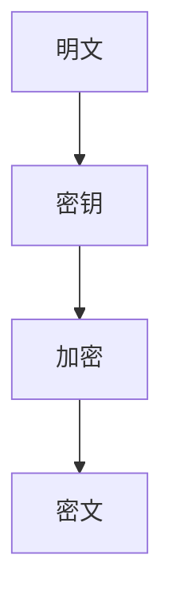
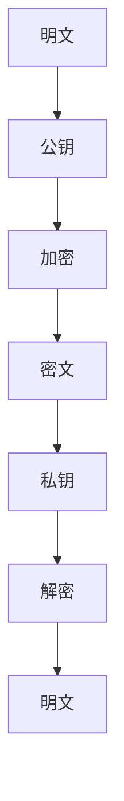
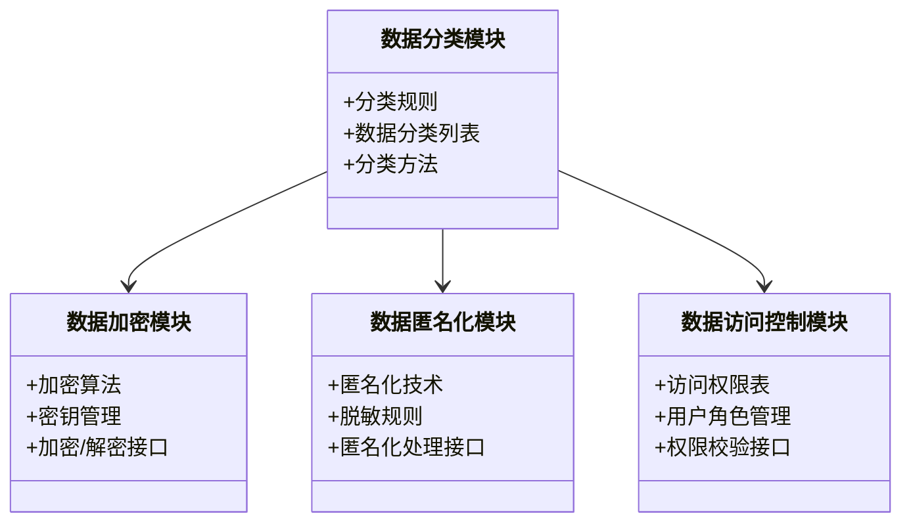

                 


# 隐私保护：确保用户数据安全

## 关键词：数据安全、隐私保护、加密算法、数据分类、匿名化、访问控制

## 摘要：  
在数字化时代，隐私保护已成为企业和个人面临的重要挑战。本文从隐私保护的核心概念出发，详细分析了数据分类、加密算法、匿名化处理等关键技术和方法，探讨了隐私保护系统的架构设计与实际应用案例，最后总结了隐私保护的最佳实践。

---

## 第1章：隐私保护的背景与核心概念

### 1.1 问题背景与问题描述

#### 1.1.1 数字化时代的数据爆炸与隐私泄露风险
在当今数字化时代，数据的生成和使用量呈指数级增长。企业和个人每天都会产生大量的数据，这些数据可能包含敏感信息，如个人信息、财务数据、医疗记录等。随着数据量的增加，数据泄露的风险也急剧上升。据统计，近年来数据泄露事件频发，导致大量用户的隐私信息被滥用，甚至引发身份盗窃、金融损失等问题。

#### 1.1.2 隐私保护的必要性与重要性
隐私保护是保护个人和企业免受数据泄露和滥用的关键。随着法律法规的不断完善（如欧盟的GDPR、中国的《个人信息保护法》），企业有法律义务保护用户数据。此外，用户也越来越重视自己的隐私权，对企业的信任度也会因为数据保护措施而受到影响。

#### 1.1.3 当前隐私保护的主要挑战
当前隐私保护面临的主要挑战包括：
1. **技术挑战**：如何在数据使用过程中保护隐私，同时不影响数据的可用性。
2. **法律挑战**：不同国家和地区的法律法规差异较大，企业需要满足多方面的合规要求。
3. **用户行为挑战**：用户自身的隐私保护意识参差不齐，部分用户可能无意中泄露了自己的数据。

---

### 1.2 隐私保护的核心概念

#### 1.2.1 数据分类与敏感数据识别
数据分类是隐私保护的第一步。数据可以分为以下几类：
1. **公开数据**：可以公开分享的数据，如企业的产品信息。
2. **受限数据**：需要特定权限才能访问的数据，如员工的工资信息。
3. **敏感数据**：涉及个人隐私或机密信息的数据，如用户的身份证号码、医疗记录等。

通过数据分类，企业可以明确哪些数据需要额外的保护措施。

#### 1.2.2 隐私保护的边界与外延
隐私保护的边界是指在什么范围内需要保护数据。例如，企业的内部数据需要保护，但一旦数据被公开发布，保护的边界就不再适用。隐私保护的外延则包括数据的收集、存储、处理、传输和销毁等全生命周期。

#### 1.2.3 隐私保护的法律框架与合规要求
不同国家和地区的隐私保护法规有不同的要求。例如，欧盟的GDPR要求企业明确数据处理的目的，并获得用户的同意；而中国的《个人信息保护法》则要求企业在处理个人信息时，必须采取必要措施确保数据安全。

---

### 1.3 隐私保护的核心要素与概念结构

#### 1.3.1 数据生命周期中的隐私保护
数据生命周期包括数据的生成、收集、存储、处理、传输、删除等阶段。在每个阶段，都需要采取相应的隐私保护措施：
- **数据生成**：明确数据的敏感程度。
- **数据收集**：确保收集的数据符合法律要求。
- **数据存储**：采取加密存储等技术。
- **数据处理**：在处理过程中避免数据泄露。
- **数据传输**：使用加密通道传输数据。
- **数据删除**：彻底删除敏感数据，防止数据恢复。

#### 1.3.2 隐私保护的主体、客体与行为关系
- **主体**：包括数据所有者（如用户）、数据处理者（如企业）和监管机构。
- **客体**：主要是指需要保护的数据。
- **行为**：包括数据的收集、存储、处理、传输、删除等操作。

#### 1.3.3 隐私保护的核心要素对比表格

| **核心要素** | **描述** |
|--------------|----------|
| 数据分类     | 数据的分类和敏感数据识别 |
| 数据加密     | 数据的加密处理方法 |
| 数据匿名化   | 数据的匿名化处理技术 |
| 数据访问控制 | 数据的访问权限管理 |

---

## 第2章：隐私保护的核心概念与联系

### 2.1 隐私保护的核心概念原理

#### 2.1.1 数据分类与敏感数据识别的原理
数据分类的原理是基于数据的敏感程度进行分类。例如，用户的身份证号码属于高度敏感数据，需要采取严格的保护措施；而用户的姓名可能属于中度敏感数据，保护措施相对宽松。

#### 2.1.2 数据加密与匿名化处理的原理
- **数据加密**：通过加密算法将敏感数据转化为不可读的格式，确保数据在传输或存储过程中不会被未经授权的人员窃取。
- **数据匿名化**：通过技术手段去除数据中的个人标识信息，使得数据无法被追溯到具体个人。

#### 2.1.3 数据访问控制的原理
数据访问控制是通过权限管理来限制只有授权的人员才能访问敏感数据。常见的访问控制方法包括基于角色的访问控制（RBAC）和基于属性的访问控制（ABAC）。

### 2.2 核心概念属性特征对比表格

| **核心概念** | **属性**         | **特征**                                                                 |
|--------------|------------------|--------------------------------------------------------------------------|
| 数据分类     | 敏感程度         | 高度敏感、中度敏感、低度敏感                                           |
| 数据加密     | 加密算法         | AES、RSA、DES等                                                         |
| 数据匿名化   | 匿名化技术       | 数据脱敏、哈希函数、随机化处理                                           |
| 数据访问控制 | 访问控制策略     | 基于角色的访问控制（RBAC）、基于属性的访问控制（ABAC）                 |

### 2.3 ER实体关系图

```mermaid
erd
    数据主体 -> 数据分类: 数据主体拥有不同分类的数据
    数据主体 <-o 数据处理者: 数据处理者处理数据主体的数据
    数据处理者 -> 数据存储: 数据存储在数据库中
    数据存储 <-o 数据加密: 数据加密后存储
```

---

## 第3章：数据加密算法原理

### 3.1 数据加密算法概述

#### 3.1.1 对称加密与非对称加密的对比
- **对称加密**：加密和解密使用相同的密钥，速度快，适用于大量数据的加密。
- **非对称加密**：加密和解密使用不同的密钥，安全性高，适用于数据传输中的身份验证和签名。

### 3.2 AES加密算法的实现

#### 3.2.1 AES加密算法的流程


#### 3.2.2 AES加密算法的Python代码实现
```python
from cryptography.hazmat.primitives.ciphers import Cipher, algorithms, modes
from cryptography.hazmat.backends import default_backend

# 生成密钥和偏移量
backend = default_backend()
key = os.urandom(16)
iv = os.urandom(16)

# 创建加密器
cipher = Cipher(algorithms.AES(key), modes.CBC(iv), backend=backend)
encryptor = cipher.encryptor()

# 加密明文
plaintext = b"Hello, World!"
ciphertext = encryptor.update(plaintext) + encryptor.finalize()
print("加密后的密文：", ciphertext)
```

#### 3.2.3 AES算法的数学模型与公式
AES算法基于有限域GF(2^8)上的运算，其核心是仿射变换：
$$ y = a x + b $$
其中，$a$ 是乘法常数，$b$ 是加法常数。

### 3.3 RSA加密算法的实现

#### 3.3.1 RSA加密算法的流程


#### 3.3.2 RSA加密算法的Python代码实现
```python
from cryptography.hazmat.primitives.asymmetric import padding, rsa
from cryptography.hazmat.backends import default_backend

# 生成RSA密钥对
backend = default_backend()
private_key = rsa.generate_private_key(public_exponent=65537, key_size=2048)
public_key = private_key.public_key()

# 加密明文
plaintext = b"Hello, World!"
encrypted_data = public_key.encrypt(
    plaintext,
    padding.OAEP(
        mgf=padding.MGF1(salt_length=32),
        algorithm=hashes.SHA256(),
        label=None
    )
)
print("加密后的密文：", encrypted_data)

# 解密密文
decrypted_data = private_key.decrypt(encrypted_data)
print("解密后的明文：", decrypted_data.decode())
```

#### 3.3.3 RSA算法的数学模型与公式
RSA算法基于大整数的因数分解问题，其核心公式为：
$$ c = m^e \mod n $$
$$ m = c^d \mod n $$
其中，$e$ 是公钥指数，$d$ 是私钥指数，$n$ 是模数。

---

## 第4章：隐私保护系统分析

### 4.1 隐私保护系统的问题场景介绍

#### 4.1.1 数据泄露的场景
- **数据泄露场景**：攻击者通过漏洞入侵系统，窃取用户数据。
- **数据滥用场景**：合法访问者滥用数据权限，导致数据泄露。

### 4.2 系统功能设计

#### 4.2.1 隐私保护系统功能模块设计


### 4.3 系统架构设计

#### 4.3.1 隐私保护系统的整体架构设计
```mermaid
archi
    前端 --> 后端：API调用
    后端 --> 数据库：数据存储
    后端 --> 加密模块：数据加密
    后端 --> 访问控制模块：权限管理
```

---

## 第5章：隐私保护项目实战

### 5.1 环境安装与配置

#### 5.1.1 开发环境搭建
- **操作系统**：建议使用Linux或macOS。
- **Python版本**：建议使用Python 3.8或更高版本。
- **依赖库安装**：使用`pip`安装`cryptography`库。

#### 5.1.2 工具安装与配置
- 安装`cryptography`库：
  ```bash
  pip install cryptography
  ```

### 5.2 系统核心实现

#### 5.2.1 数据分类与敏感数据识别
```python
def classify_data(data):
    if data.is_sensitive:
        return "高敏感"
    elif data.is_restricted:
        return "中敏感"
    else:
        return "低敏感"
```

---

## 第6章：隐私保护的总结与展望

### 6.1 本章小结
隐私保护是一个复杂而重要的任务，需要从数据分类、加密算法、匿名化处理、访问控制等多个方面进行综合考虑。通过合理的技术手段和严格的管理制度，可以有效保护用户的隐私数据。

### 6.2 本章注意事项
- 数据分类要准确，避免遗漏敏感数据。
- 加密算法的选择要根据实际需求，平衡安全性与性能。
- 匿名化处理要确保无法还原到原始数据。

### 6.3 拓展阅读
- 《数据加密与安全》
- 《隐私保护的法律框架与合规实践》
- 《区块链技术在隐私保护中的应用》

---

## 作者：AI天才研究院/AI Genius Institute & 禅与计算机程序设计艺术 /Zen And The Art of Computer Programming

---

以上是《隐私保护：确保用户数据安全》的完整大纲和文章内容，涵盖了隐私保护的背景、核心概念、算法原理、系统分析和项目实战等各个方面。希望本文能为读者提供深入的理论知识和实际应用指导。

