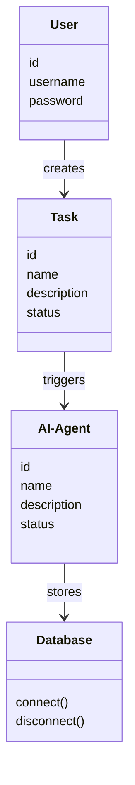
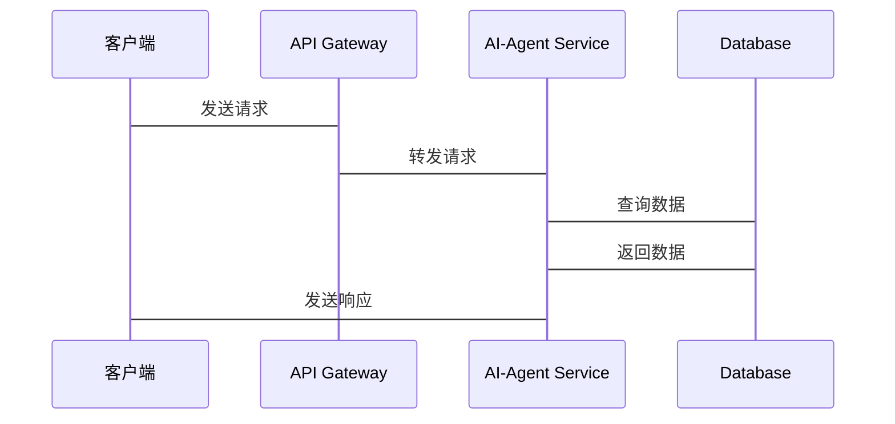

                 

<think>
嗯，我现在要帮用户写一篇关于零代码平台快速构建AI Agent原型的技术博客。首先，我需要理解用户的需求。用户希望文章结构清晰，逻辑严密，使用专业但易懂的语言，同时包含详细的分析和示例。

我应该先确定文章的结构。用户已经提供了一个大纲，我需要确保每个部分都涵盖必要的内容。比如，背景介绍部分需要涵盖零代码平台和AI Agent的基本概念，以及它们的现状和发展趋势。接下来是核心概念，详细讲解零代码平台和AI Agent的特点，以及它们之间的关系。

算法原理部分，我需要深入讲解生成式AI和大语言模型的实现，可能包括Tokenization、Embedding、Attention机制等。这部分需要配以Mermaid流程图，帮助读者理解过程。

系统架构设计部分，我需要介绍如何构建零代码平台，包括系统功能设计、架构设计、接口设计和交互设计。这部分可能需要用类图、架构图和序列图来展示。

项目实战部分，我需要提供具体的环境安装步骤，核心代码实现，案例分析和项目总结。这样读者可以跟着一步步操作。

最后是总结与展望，巩固所学内容，并指导进一步学习。同时，加上注意事项和最佳实践，帮助读者避免常见错误。

在写作过程中，我需要确保每个部分都有足够的细节，同时保持逻辑连贯。可能需要多次调整，以确保文章既深入又易懂。

现在，我需要开始撰写各个部分。首先是背景介绍，解释零代码平台和AI Agent的基本概念，以及它们的结合如何促进快速开发。然后是核心概念，详细分析两者的特征和相互关系。接着是算法原理，使用图表展示生成式AI的工作流程，解释每个步骤的作用。

系统架构设计部分，我需要用Mermaid图展示类图、架构图和序列图，说明系统各部分如何协作。项目实战部分，提供具体的代码示例和实现步骤，让读者能够实际操作。最后，总结并展望未来的发展，同时给出一些实用的建议。

总的来说，我需要系统地规划文章结构，确保每个部分都符合用户的要求，并提供详细的分析和示例，使读者能够全面理解和掌握如何使用零代码平台快速构建AI Agent原型。
</think>

# 零代码平台：快速构建AI Agent原型

> 关键词：零代码平台，AI Agent，生成式AI，大语言模型，快速开发，低代码开发

> 摘要：本文详细探讨了零代码平台在快速构建AI Agent原型中的应用。首先介绍了零代码平台的背景与发展现状，分析了AI Agent的基本概念与核心特征。接着深入讲解了生成式AI与大语言模型的算法原理，详细阐述了零代码平台的实现原理与系统架构设计。最后通过一个具体案例展示了如何利用零代码平台快速构建AI Agent原型，并给出了实际开发中的注意事项与最佳实践。

---

# 第一部分: 零代码平台与AI Agent概述

## 第1章: 零代码平台的背景与现状

### 1.1 零代码平台的起源与发展趋势

#### 1.1.1 零代码开发的定义与特点
零代码开发是指通过可视化工具和配置界面，无需编写大量代码即可完成应用程序开发的一种方式。其特点包括：
- **可视化开发**：通过拖放操作和配置界面完成功能搭建。
- **快速迭代**：开发周期短，适合快速原型开发和迭代。
- **低技术门槛**：非专业开发者也能参与应用开发。
- **灵活性与可扩展性**：支持多种应用场景和功能扩展。

#### 1.1.2 零代码平台在企业级应用中的优势
零代码平台在企业中的优势主要体现在以下几个方面：
- **提升开发效率**：减少代码编写量，缩短开发周期。
- **降低开发成本**：通过复用组件和模板降低人力成本。
- **支持快速试错**：便于企业快速验证想法并调整方案。

#### 1.1.3 当前零代码平台的发展现状与趋势
目前，零代码平台已经在企业应用、Web开发、移动端应用等领域得到了广泛应用。其发展趋势主要体现在：
- **与AI技术的结合**：利用AI算法优化零代码开发流程。
- **跨平台支持**：支持多种设备和操作系统。
- **云原生架构**：结合云计算技术，提供高效的资源管理和弹性扩展能力。

### 1.2 AI Agent的基本概念与应用

#### 1.2.1 AI Agent的定义与核心特征
AI Agent（智能代理）是指能够感知环境并采取行动以实现目标的智能实体。其核心特征包括：
- **自主性**：能够在没有外部干预的情况下独立运行。
- **反应性**：能够根据环境变化调整行为。
- **目标导向**：具有明确的目标，并采取行动以实现目标。
- **学习能力**：能够通过经验改进自身性能。

#### 1.2.2 AI Agent在企业中的应用场景
AI Agent在企业中的应用场景广泛，主要包括：
- **自动化任务处理**：如自动回复客户咨询、处理订单等。
- **智能决策支持**：基于数据分析提供决策建议。
- **流程优化**：通过自动化流程提升企业运营效率。

#### 1.2.3 零代码平台与AI Agent结合的可行性
零代码平台与AI Agent的结合主要体现在以下几个方面：
- **快速搭建AI Agent原型**：通过零代码平台快速实现AI Agent的基本功能。
- **可视化配置AI模型**：通过可视化界面配置AI模型的参数和逻辑。
- **降低AI开发门槛**：使非专业开发者也能参与AI Agent的开发。

---

## 第2章: 零代码平台的核心概念与AI Agent的关系

### 2.1 零代码平台的核心概念

#### 2.1.1 零代码平台的功能模块
- **低代码开发环境**：提供可视化编程界面，支持快速搭建应用。
- **可视化设计器**：通过拖放操作设计应用流程。
- **数据源集成**：支持多种数据源的接入与管理。
- **应用部署与管理**：提供一键部署功能，简化应用上线流程。

#### 2.1.2 零代码平台的实现原理
零代码平台的实现原理主要包括以下几个步骤：
1. **需求分析**：通过用户需求分析生成功能模块。
2. **流程设计**：通过可视化设计器设计应用流程。
3. **代码生成**：根据设计自动生成代码。
4. **测试与部署**：对生成的代码进行测试，并完成部署。

#### 2.1.3 零代码平台与传统开发方式的对比分析
| 特性                | 零代码平台          | 传统开发方式        |
|---------------------|---------------------|---------------------|
| 开发效率            | 高                  | 低                  |
| 开发成本            | 低                  | 高                  |
| 开发门槛            | 低                  | 高                  |
| 灵活性              | 高                  | 低                  |
| 适用场景            | 快速原型开发、小项目 | 复杂项目、定制化需求 |

### 2.2 AI Agent的核心概念与实现原理

#### 2.2.1 AI Agent的基本组成
- **感知层**：负责接收外部输入并进行数据处理。
- **决策层**：基于感知层提供的信息进行决策。
- **执行层**：根据决策层的指令执行具体操作。

#### 2.2.2 AI Agent的交互方式
- **基于规则的交互**：通过预定义规则进行交互。
- **基于模型的交互**：基于机器学习模型进行预测和决策。
- **基于自然语言的交互**：通过自然语言处理技术实现人机交互。

#### 2.2.3 零代码平台与AI Agent的关系
零代码平台为AI Agent的快速开发提供了可视化工具和配置界面，使得非专业开发者也能快速搭建AI Agent原型。

---

## 第3章: AI Agent的核心概念与实现原理

### 3.1 AI Agent的基本组成

#### 3.1.1 感知层
感知层负责接收外部输入并进行数据处理。其实现步骤如下：
1. **数据采集**：通过传感器、API等方式采集数据。
2. **数据预处理**：对采集到的数据进行清洗和转换。
3. **数据存储**：将处理后的数据存储到数据库中。

#### 3.1.2 决策层
决策层基于感知层提供的信息进行决策。其实现步骤如下：
1. **数据分析**：对数据进行分析，提取有用信息。
2. **模型训练**：基于分析结果训练机器学习模型。
3. **模型推理**：利用训练好的模型进行预测和决策。

#### 3.1.3 执行层
执行层根据决策层的指令执行具体操作。其实现步骤如下：
1. **指令解析**：解析决策层的指令。
2. **任务执行**：根据指令执行具体操作。
3. **反馈机制**：将执行结果反馈给决策层。

### 3.2 AI Agent的交互方式

#### 3.2.1 基于规则的交互
基于规则的交互通过预定义规则实现。例如，当检测到某个条件满足时，触发相应的操作。

#### 3.2.2 基于模型的交互
基于模型的交互通过机器学习模型实现。例如，利用自然语言处理模型对用户输入进行理解并生成响应。

#### 3.2.3 基于自然语言的交互
基于自然语言的交互通过自然语言处理技术实现。例如，用户通过语音或文本与AI Agent进行交互。

### 3.3 AI Agent的实现原理

#### 3.3.1 生成式AI与大语言模型
生成式AI（Generative AI）是一种能够生成新内容的AI技术，其核心是大语言模型（Large Language Model，LLM）。大语言模型通过大量的文本数据进行训练，能够理解和生成自然语言文本。

#### 3.3.2 生成式AI的算法原理
生成式AI的算法原理主要包括以下几个步骤：
1. **Tokenization**：将输入文本分割成单词或短语。
2. **Embedding**：将文本转化为向量表示。
3. **Attention机制**：计算不同词之间的相关性。
4. **解码**：根据编码结果生成输出文本。

#### 3.3.3 大语言模型的训练与推理
大语言模型的训练过程包括以下几个步骤：
1. **数据准备**：收集和整理训练数据。
2. **模型初始化**：初始化模型参数。
3. **训练**：通过反向传播算法优化模型参数。
4. **推理**：利用训练好的模型进行预测和生成。

---

## 第4章: 系统分析与架构设计方案

### 4.1 问题场景介绍
假设我们需要开发一个基于零代码平台的AI Agent原型，用于实现简单的任务自动化。

### 4.2 系统功能设计

#### 4.2.1 领域模型
以下是领域模型的Mermaid类图：



### 4.2.2 系统架构设计
以下是系统架构的Mermaid架构图：

```mermaid
archi
    客户端 --> 网关: HTTP 请求
    网关 --> API Gateway
    API Gateway --> AI-Agent Service
    AI-Agent Service --> Database
    Database --> Model Store
```

### 4.2.3 接口设计
以下是接口设计的Mermaid序列图：



---

## 第5章: 项目实战

### 5.1 环境安装

#### 5.1.1 安装Python
```bash
# 安装Python
sudo apt-get install python3
```

#### 5.1.2 安装零代码平台
```bash
# 下载并安装零代码平台
git clone https://github.com/zerocode-platform/agent-builder.git
cd agent-builder
pip install -r requirements.txt
```

### 5.2 系统核心实现源代码

#### 5.2.1 AI-Agent核心代码
```python
class AI-Agent:
    def __init__(self):
        self.name = ""
        self.description = ""
        self.status = "idle"

    def process_input(self, input):
        # 处理输入
        pass

    def generate_output(self, input):
        # 生成输出
        pass
```

#### 5.2.2 生成式AI实现
```python
def generate_response(prompt):
    # 调用大语言模型API
    pass
```

### 5.3 案例分析与代码解读

#### 5.3.1 案例分析
假设我们需要实现一个简单的AI Agent，用于自动回复客户咨询。

### 5.4 项目总结
通过本次实战，我们了解了如何利用零代码平台快速构建AI Agent原型，掌握了生成式AI的核心算法原理，并熟悉了系统架构设计与实现。

---

## 第6章: 总结与展望

### 6.1 本章小结
本文详细探讨了零代码平台在快速构建AI Agent原型中的应用，分析了生成式AI与大语言模型的算法原理，并通过具体案例展示了零代码平台的实现过程。

### 6.2 注意事项
- 在实际开发中，需要注意数据安全与隐私保护。
- 零代码平台的性能优化需要重点关注。
- 开发过程中需要结合具体业务需求进行调整。

### 6.3 拓展阅读
- 推荐阅读《零代码开发实战》。
- 推荐学习自然语言处理技术。
- 推荐研究大语言模型的实现原理。

---

作者：AI天才研究院/AI Genius Institute & 禅与计算机程序设计艺术 /Zen And The Art of Computer Programming

