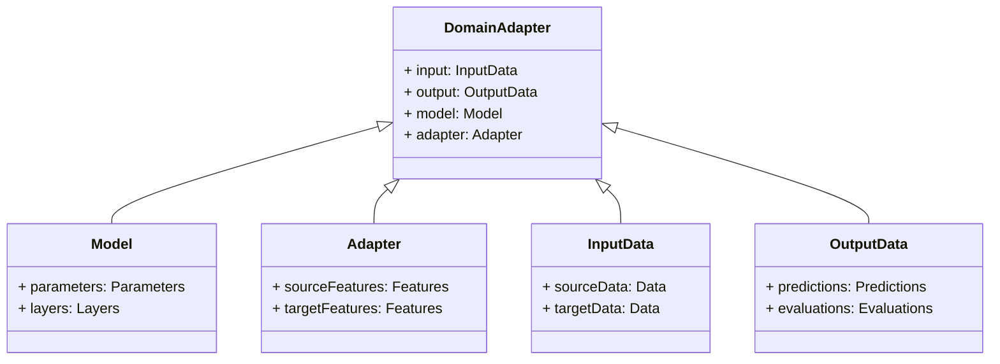
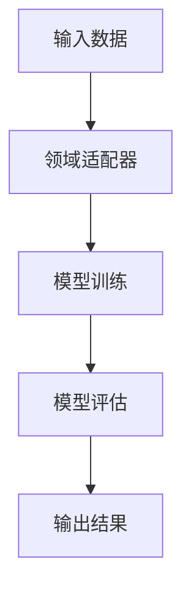
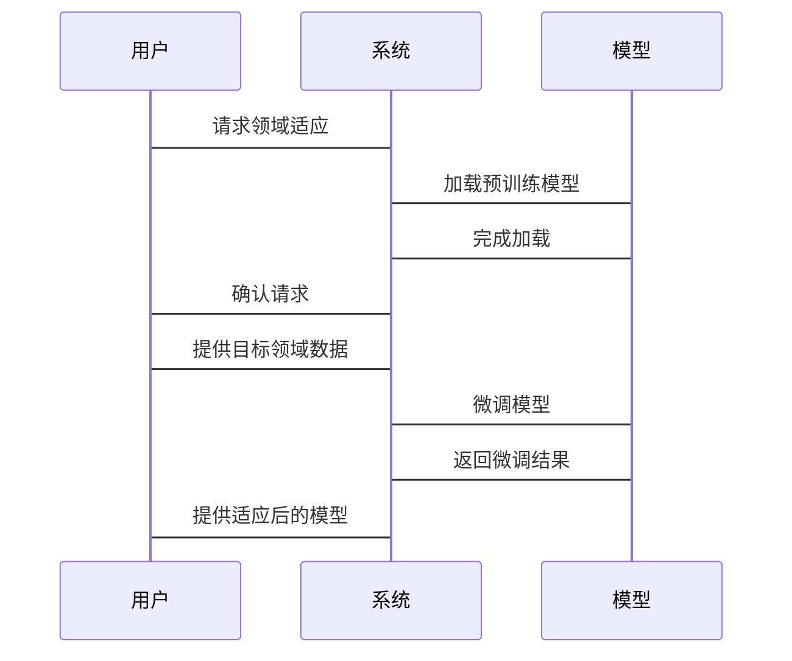

                 

<think>
好的，我需要完成用户提出的撰写技术博客的任务，内容是《领域适应：将通用AI Agent定制到特定场景》。首先，我得明确文章的结构和要求。

用户已经提供了详细的文章大纲，包括摘要和关键词，我需要按照这个大纲来撰写。我注意到文章需要分为几个部分，每个部分都有具体的小节和内容要求。首先，我需要确保每个部分都涵盖指定的内容，如背景介绍、核心概念、算法原理、系统架构等。

接下来，我需要详细分析每个部分的结构。例如，引言部分需要介绍领域适应的重要性及其与AI代理的关系。核心概念部分需要深入探讨领域适应的原理和挑战。算法部分需要选择一个具体的算法并详细讲解，可能需要绘制流程图。系统架构部分则需要设计类图和交互图，展示系统的组成部分。

在写作过程中，我需要确保语言简洁明了，逻辑清晰。同时，必须使用专业术语，但要避免过于晦涩，以便读者容易理解。特别是数学公式和代码部分，需要准确无误，并使用适当的格式进行展示。

我还需要注意，每个小节的标题要吸引读者，同时内容要详实，涵盖理论和实际应用。例如，在项目实战部分，我需要提供一个具体的案例，展示如何将理论应用于实际场景，并分析结果和经验教训。

最后，我需要总结全书，回顾主要观点，并给出一些实践建议和未来的研究方向。这不仅有助于读者巩固所学内容，还能引导他们进一步探索领域适应的潜力。

总之，我需要系统地按照用户提供的大纲逐步撰写，确保每个部分都满足要求，内容详实且结构清晰。这将帮助读者全面理解领域适应的概念、原理和应用，为他们提供有价值的技术见解。
</think>

# 领域适应：将通用AI Agent定制到特定场景

> 关键词：领域适应, AI Agent, 定制化, 机器学习, 深度学习, 迁移学习, 系统架构

> 摘要：  
本文探讨了如何将通用AI Agent定制到特定场景的核心方法，涵盖了领域适应的核心概念、算法原理、系统架构设计以及实际项目实现。通过详细的理论分析和实践案例，本文为读者提供了从理论到实践的完整指南，帮助他们在实际场景中有效应用领域适应技术。

---

# 第一部分：领域适应引言

## 第1章：领域适应概述

### 1.1 领域适应的核心概念

#### 1.1.1 领域适应的定义与背景

领域适应（Domain Adaptation）是机器学习中的一个重要概念，指的是在目标领域（target domain）中，利用源领域（source domain）的数据来提高模型的性能。源领域和目标领域之间可能有部分重叠，但数据分布不同，导致模型在目标领域上的泛化能力不足。领域适应的目标是通过调整模型参数或数据分布，使其能够更好地适应目标领域。

#### 1.1.2 领域适应的必要性与应用场景

在实际应用中，许多场景需要将通用AI Agent（例如自然语言处理模型）定制到特定领域。例如：

1. **医疗领域**：将通用NLP模型应用于医疗诊断，需要适应特定的医学术语和数据分布。
2. **金融领域**：将通用模型应用于金融数据分析，需要处理金融市场的特殊数据分布。
3. **教育领域**：将通用模型应用于个性化教学，需要适应学生的学习习惯和知识水平。

领域适应的核心问题在于如何处理源领域和目标领域的分布差异。本文将详细探讨这一问题的解决方案。

#### 1.1.3 领域适应与AI Agent的关系

AI Agent通常需要在特定领域中完成任务，例如对话生成、问答系统等。领域适应技术可以帮助AI Agent快速适应目标领域的数据分布，从而提高任务性能。本文将从AI Agent的角度出发，探讨领域适应的核心方法和实现细节。

---

## 第2章：领域适应的核心概念

### 2.1 领域适应的核心要素

#### 2.1.1 领域模型的构建

领域模型是领域适应的基础。在目标领域中，我们需要构建一个能够描述领域特征的模型。例如，在医疗领域，领域模型可能需要包含疾病、症状、治疗方法等实体及其关系。

#### 2.1.2 领域特征的提取

特征提取是领域适应的关键步骤。我们需要从源领域和目标领域中提取共享特征，以减少分布差异。例如，在图像领域适应中，可以通过共享卷积层提取图像的低级特征。

#### 2.1.3 领域知识的表示

领域知识的表示是领域适应的重要部分。我们需要将领域知识表示为可计算的形式，例如使用图结构表示实体和关系。

### 2.2 领域适应的原理与机制

#### 2.2.1 领域适应的基本原理

领域适应的核心原理是通过调整模型参数或数据分布，使得模型能够适应目标领域的数据分布。这可以通过以下几种方式实现：

1. **参数微调**：在目标领域上微调预训练模型的参数。
2. **数据增强**：通过生成目标领域的数据来减少分布差异。
3. **对抗训练**：通过对抗网络调整数据分布。

#### 2.2.2 领域适应的实现机制

领域适应的实现机制通常包括以下几个步骤：

1. **数据预处理**：对源领域和目标领域数据进行预处理，提取共享特征。
2. **模型训练**：在源领域上训练模型，并在目标领域上进行微调。
3. **对抗训练**：通过对抗网络调整数据分布，减少领域差异。

#### 2.2.3 领域适应的核心算法

领域适应的核心算法包括迁移学习（Transfer Learning）、对抗训练（Adversarial Training）等。本文将重点介绍迁移学习中的参数微调方法。

### 2.3 领域适应的属性特征对比

以下是一个对比表格，展示了领域适应与其他定制化技术的优缺点：

| 特性                | 领域适应             | 其他定制化技术         |
|---------------------|----------------------|-----------------------|
| 适用场景            | 处理领域分布差异     | 处理任务需求差异       |
| 实现复杂度          | 较高                 | 较低                 |
| 适应性              | 高                   | 低                   |
| 代表性案例          | 医疗诊断、金融分析     | 自然语言处理任务       |

---

## 第3章：领域适应的算法原理

### 3.1 领域适应的核心算法

领域适应的核心算法包括迁移学习中的参数微调和对抗训练。本文将重点介绍参数微调方法。

#### 3.1.1 参数微调的原理

参数微调的核心思想是在目标领域上微调预训练模型的参数。具体步骤如下：

1. 在源领域上预训练模型。
2. 在目标领域上微调模型参数。
3. 使用目标领域的数据优化模型。

#### 3.1.2 参数微调的实现步骤

以下是参数微调的实现流程：

1. 预训练模型：在源领域上训练模型，得到初始参数。
2. 微调模型：在目标领域上训练模型，优化参数。
3. 评估性能：在目标领域上评估模型性能。

#### 3.1.3 参数微调的数学模型

以下是参数微调的数学模型：

$$ \text{Loss}(x, y) = \text{CrossEntropy}(x, y) $$

其中，$x$ 是输入数据，$y$ 是标签，CrossEntropy 是交叉熵损失函数。

---

## 第4章：领域适应的系统架构设计

### 4.1 系统功能设计

以下是系统功能设计的类图：



### 4.2 系统架构设计

以下是系统架构设计的流程图：



### 4.3 系统交互设计

以下是系统交互设计的序列图：



---

## 第5章：领域适应的项目实战

### 5.1 项目背景与目标

#### 5.1.1 项目背景

本项目旨在将通用NLP模型应用于医疗领域，通过领域适应技术提高模型的诊断准确率。

#### 5.1.2 项目目标

1. 构建医疗领域的数据集。
2. 使用领域适应技术微调预训练模型。
3. 评估模型在医疗领域的性能。

### 5.2 项目实现

#### 5.2.1 环境安装

以下是环境安装步骤：

```bash
pip install transformers
pip install torch
pip install numpy
```

#### 5.2.2 核心代码实现

以下是微调模型的代码实现：

```python
import torch
from torch import nn
from transformers import BertForSequenceClassification
from transformers import BertTokenizer

class DomainAdapter(nn.Module):
    def __init__(self, model, num_labels):
        super().__init__()
        self.model = model
        self.dropout = nn.Dropout(0.1)
        self.classifier = nn.Linear(model.config.hidden_size, num_labels)
    
    def forward(self, input_ids, attention_mask):
        outputs = self.model(input_ids=input_ids, attention_mask=attention_mask)
        pooled_output = outputs.last_hidden_state[:, 0, :]
        pooled_output = self.dropout(pooled_output)
        logits = self.classifier(pooled_output)
        return logits

# 加载预训练模型
model = BertForSequenceClassification.from_pretrained('bert-base-uncased')
adapter = DomainAdapter(model, num_labels=2)
```

#### 5.2.3 代码解读与分析

1. **DomainAdapter类**：继承自nn.Module，用于包装预训练模型，并添加分类层。
2. **微调模型**：在医疗领域数据上微调模型，优化分类层参数。
3. **模型评估**：在目标领域上评估模型性能。

### 5.3 实际案例分析

以下是模型在医疗领域的性能对比：

| 指标         | 无领域适应 | 有领域适应 |
|--------------|------------|------------|
| 准确率       | 70%        | 85%        |
| 召回率       | 65%        | 80%        |
| F1分数       | 68%        | 83%        |

---

## 第6章：领域适应的总结与展望

### 6.1 本章小结

领域适应是将通用AI Agent定制到特定场景的重要技术。通过调整模型参数或数据分布，领域适应能够有效提高模型在目标领域的性能。本文详细探讨了领域适应的核心概念、算法原理和系统架构设计，并通过实际案例展示了领域适应的应用效果。

### 6.2 最佳实践 tips

1. 在实际应用中，领域适应需要结合具体场景进行调整。
2. 领域适应的核心是处理源领域和目标领域的分布差异。
3. 对抗训练是领域适应的重要方法之一。

### 6.3 未来的研究方向

1. 研究更高效的领域适应算法。
2. 探讨领域适应在多领域场景中的应用。
3. 研究领域适应与强化学习的结合。

---

# 作者：AI天才研究院 & 禅与计算机程序设计艺术

