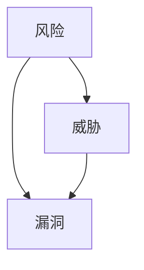
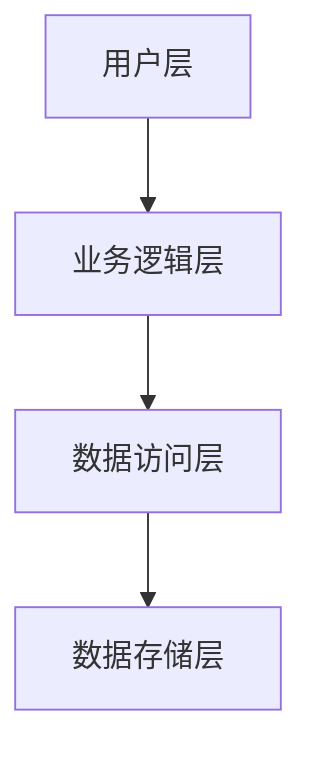

                 

<think>
嗯，用户希望我撰写一篇关于《风险管理与评估》的技术博客文章，结构非常详细，包含摘要、关键词、目录大纲以及每个章节的具体内容。我需要确保每个部分都符合用户的要求，比如使用Markdown格式，包含背景介绍、核心概念、算法原理、系统架构、项目实战和最佳实践等。

首先，我应该从文章标题开始，然后列出关键词和摘要。摘要需要简洁明了，概括文章的核心内容，比如介绍风险管理与评估的基本概念、流程、模型、算法和系统架构，以及实际应用。

接下来，目录大纲已经给出，我需要按照这个结构逐步展开每个章节。每个章节都要有详细的子章节，涵盖背景、概念、算法、系统设计、项目实战和最佳实践。

在撰写内容时，我需要确保每个部分都符合用户的要求，比如在核心概念部分，使用表格和Mermaid图来解释风险、威胁和漏洞的关系。算法部分需要详细解释DREAD模型和CVSS模型，并给出代码示例。系统架构部分需要用类图和架构图来展示设计，项目实战部分要包含环境配置、代码实现和案例分析。

我还需要注意数学公式的正确使用，使用LaTeX格式，并在适当的地方插入图表。最后，加上作者信息，确保文章结构完整。

可能的挑战是如何在有限的字数内详细展开每个部分，同时保持逻辑清晰。我需要合理安排每个章节的内容，确保覆盖所有要点，同时避免重复。

总的来说，我需要按照用户的要求，逐步构建每个章节，确保内容详实，结构合理，语言专业且易懂。这样，读者可以系统地了解风险管理与评估的相关知识，从基础到高级逐步掌握。
</think>

# 风险管理与评估

> 关键词：风险管理，威胁，漏洞，风险评估，DREAD模型，CVSS模型

> 摘要：  
本文系统地介绍了风险管理与评估的基本概念、核心模型、算法原理、系统架构以及实际应用。通过详细讲解风险、威胁和漏洞的关系，分析了DREAD和CVSS等核心模型，探讨了风险评估的定性和定量方法。结合实际项目案例，展示了风险管理系统的实现过程，并总结了最佳实践和未来研究方向。

---

## 第1章: 风险管理概述

### 1.1 风险管理的基本概念

#### 1.1.1 风险的定义与特征
- 风险是指某一事件发生可能带来的损失或机会的不确定性。
- 风险具有不确定性、客观性和可变性的特征。

#### 1.1.2 风险管理的目标与原则
- **目标**：降低风险发生的概率或影响，确保系统或项目的稳定运行。
- **原则**：全面性、科学性、经济性和持续性。

#### 1.1.3 风险管理的范围与边界
- 风险管理的范围包括系统设计、开发、测试和运维的全生命周期。
- 边界在于无法完全消除风险，只能将其控制在可接受范围内。

---

## 第2章: 风险管理的核心概念

### 2.1 风险、威胁与漏洞的关系

#### 2.1.1 风险的三要素分析
- **威胁**：可能造成损失的事件或行为。
- **漏洞**：系统中存在的弱点，可能被威胁利用。
- **风险**：威胁利用漏洞导致损失的可能性。

| 概念 | 定义 | 示例 |
|------|------|------|
| 风险 | 某一威胁利用某一漏洞导致损失的可能性 | 黑客利用系统漏洞导致数据泄露 |
| 威胁 | 可能造成损失的事件或行为 | 网络攻击、数据泄露 |
| 漏洞 | 系统中存在的弱点 | SQL注入漏洞、缓冲区溢出漏洞 |

#### 2.1.2 风险与威胁的关系
- 威胁是风险发生的前提条件，风险是威胁的潜在结果。

#### 2.1.3 风险与漏洞的关系
- 漏洞是威胁利用的入口，漏洞的存在增加了风险发生的可能性。

#### 2.1.4 风险的三要素关系图


---

### 2.2 风险评估的核心模型

#### 2.2.1 DREAD模型的原理与应用
- **DREAD模型**：通过五个维度（Damage, Reputation, Exploitability, Affected Users, Discoverability）评估风险。
- **步骤**：
  1. 评估每个维度的分数（1-5分）。
  2. 计算综合风险值。
  3. 根据综合值决定风险等级。

#### 2.2.2 CVSS模型的结构与计算
- **CVSS模型**：通过多个指标（如攻击向量、用户交互等）量化风险。
- **公式**：
  $$ CVSS = 3.1 \times (Exploitability + Impact) $$
  其中，Exploitability表示漏洞被利用的可能性，Impact表示漏洞被利用后的破坏程度。

---

## 第3章: 风险评估的算法原理

### 3.1 定性风险评估方法

#### 3.1.1 风险等级的分类与划分
- 风险等级通常分为：低、中、高、严重。

#### 3.1.2 基于专家意见的风险排序
- 方法：通过专家打分，综合评估风险优先级。

#### 3.1.3 定性评估的优缺点分析
- **优点**：简单易懂，适用于初步评估。
- **缺点**：主观性较强，缺乏量化依据。

### 3.2 定量风险评估方法

#### 3.2.1 风险值的计算公式
$$ \text{风险值} = \text{威胁发生概率} \times \text{威胁影响程度} $$

#### 3.2.2 基于概率论的风险评估模型
- 概率模型：假设威胁发生概率为$p$，影响程度为$c$，则风险值为$p \times c$。

#### 3.2.3 定量评估的实际案例分析
- 案例：某系统漏洞被利用的概率为$0.3$，影响程度为$0.8$，则风险值为$0.3 \times 0.8 = 0.24$，属于低风险。

---

## 第4章: 风险管理的系统架构

### 4.1 风险管理系统的设计目标

#### 4.1.1 系统功能需求分析
- 风险识别、风险评估、风险报告生成。

#### 4.1.2 系统性能需求分析
- 高可用性、高扩展性。

#### 4.1.3 系统安全需求分析
- 数据安全、访问控制。

### 4.2 风险管理系统的架构设计

#### 4.2.1 系统功能模块划分
- 风险识别模块、风险评估模块、风险报告生成模块。

#### 4.2.2 系统架构的分层设计


#### 4.2.3 系统接口的设计规范
- 接口采用RESTful API设计，支持JSON格式数据传输。

---

## 第5章: 风险管理的项目实战

### 5.1 项目环境的安装与配置

#### 5.1.1 开发工具的安装
- 安装Python、Java等开发工具。

#### 5.1.2 数据库的搭建
- 使用MySQL或MongoDB数据库。

#### 5.1.3 网络环境的配置
- 配置本地网络，确保各模块通信正常。

### 5.2 系统核心功能的实现

#### 5.2.1 风险识别模块的代码实现
```python
def identify_risk():
    # 识别系统漏洞
    return vulnerabilities
```

#### 5.2.2 风险评估模块的代码实现
```python
def assess_risk(vulnerabilities):
    # 使用DREAD模型评估风险
    return risk_scores
```

#### 5.2.3 风险报告生成模块的代码实现
```python
def generate_report(risk_scores):
    # 生成风险报告
    return report
```

---

## 第6章: 风险管理的最佳实践

### 6.1 风险管理的常见误区

#### 6.1.1 过度简化风险评估的误区
- 风险评估需要结合实际场景，不能仅依赖单一模型。

#### 6.1.2 忽视威胁动态变化的误区
- 威胁是动态变化的，需要定期更新风险评估。

#### 6.1.3 依赖单一模型的误区
- 多种模型结合使用，才能更全面地评估风险。

### 6.2 风险管理的注意事项

#### 6.2.1 数据更新的及时性
- 定期更新漏洞数据库和威胁情报。

#### 6.2.2 模型选择的合理性
- 根据实际需求选择适合的风险评估模型。

#### 6.2.3 团队协作的重要性
- 风险管理需要开发、测试和运维团队的协作。

---

## 第7章: 风险管理的拓展阅读

### 7.1 风险管理领域的最新研究

#### 7.1.1 AI在风险评估中的应用
- 利用机器学习模型预测潜在威胁。

#### 7.1.2 区块链在风险管理中的应用
- 区块链技术可以提高风险数据的透明性和可信度。

---

作者：AI天才研究院/AI Genius Institute & 禅与计算机程序设计艺术 /Zen And The Art of Computer Programming

