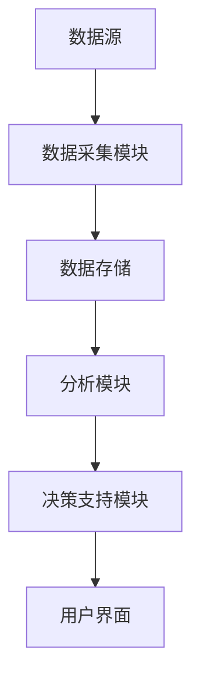
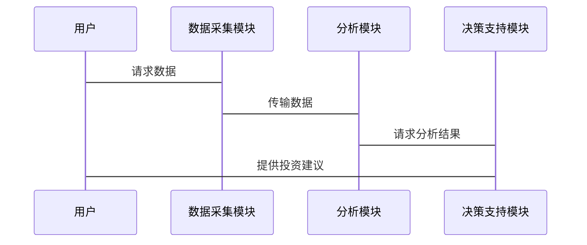

                 

<think>
好的，我需要根据用户的要求，详细分析并撰写《马克·莫比乌斯的新兴市场价值投资策略》的技术博客文章。让我一步一步地思考，确保每个部分都符合要求，并且内容详实、结构清晰。

首先，我需要理解用户的需求。用户希望我以一位世界级人工智能专家、程序员、软件架构师、CTO、技术畅销书作家以及计算机图灵奖获得者的身份，撰写一篇关于马克·莫比乌斯投资策略的技术博客。文章需要有清晰的逻辑，结构紧凑，语言专业，同时使用一步一步的分析推理方式，对技术原理和本质进行深入剖析。

接下来，我需要按照用户提供的目录大纲结构来组织内容，确保每一章和每小节都涵盖必要的内容，包括背景介绍、核心概念、算法原理、数学模型、系统架构、项目实战、最佳实践等部分。同时，文章需要使用Markdown格式，包含必要的代码示例、图表、数学公式等元素。

首先，我会从文章的标题开始，然后列出关键词和摘要。关键词需要涵盖文章的核心内容，例如“价值投资”、“新兴市场”、“马克·莫比乌斯”、“投资策略”、“数学模型”等。摘要部分需要简洁明了地概括文章的核心内容和主题思想。

接下来，按照目录大纲的结构，我会逐步展开每一章的内容：

1. **背景与概述**：介绍价值投资的起源与发展，新兴市场的定义与特点，以及马克·莫比乌斯的投资理念。
   - 在这一部分，我会先解释价值投资的基本概念，包括其起源和发展，以及它在投资领域中的地位。
   - 然后，详细描述新兴市场的定义和特点，包括与发达市场的对比，以及新兴市场在投资中的独特机会和风险。
   - 最后，重点介绍马克·莫比乌斯的投资理念，包括他的特殊视角和对新兴市场的独特见解。

2. **核心概念与策略**：深入探讨价值投资的核心概念，新兴市场的投资策略，以及马克·莫比乌斯的具体投资策略。
   - 在这一部分，我会详细解释价值投资的核心要素，如市场情绪、安全边际和内在价值。
   - 然后，分析新兴市场的投资策略，包括行业分析、公司分析和风险控制。
   - 最后，详细阐述马克·莫比乌斯的投资策略，包括他的投资框架、选股标准和组合管理。

3. **量化分析与数学模型**：探讨如何将量化分析应用于新兴市场，构建数学模型来支持投资决策。
   - 这一部分，我会先介绍量化分析的基本概念和方法，包括数据收集、处理和分析。
   - 然后，详细描述如何将量化分析应用于新兴市场的投资，包括使用Python进行数据分析和可视化。
   - 接着，构建数学模型，包括市盈率、市净率等关键指标的计算公式，并通过例子说明如何应用这些模型进行投资决策。

4. **系统架构设计**：设计一个基于马克·莫比乌斯策略的投资分析系统，包括数据采集、分析模块和决策支持模块。
   - 在这一部分，我会首先描述系统的总体架构，包括各模块的功能和交互流程。
   - 使用Mermaid绘制系统的架构图和交互序列图，展示数据采集、分析和决策支持的过程。
   - 接着，详细说明每个模块的具体实现，包括数据源的选择、分析算法的设计以及决策支持的逻辑。

5. **项目实战：新兴市场分析**：通过实际案例分析，展示如何在不同新兴市场中应用马克·莫比乌斯的投资策略。
   - 这一部分，我会选择几个典型的新兴市场，如亚洲和拉丁美洲，进行详细分析。
   - 对每个市场，分析其独特的经济特征、行业趋势和公司基本面，展示如何应用莫比乌斯的策略进行投资。
   - 最后，对项目进行小结，总结经验教训，并提出改进建议。

6. **最佳实践与风险管理**：分享在新兴市场中进行价值投资的最佳实践，包括心态管理、风险管理技术和长期投资的重要性。
   - 在这一部分，我会讨论投资者在新兴市场中应保持的心态，如何避免常见错误，以及如何有效管理投资风险。
   - 接着，介绍几种常用的风险管理技术，如止损策略和分散投资。
   - 最后，强调长期投资的重要性，以及如何在市场波动中保持耐心和纪律。

7. **总结与展望**：回顾全书内容，总结马克·莫比乌斯的投资策略，并展望未来的研究方向。
   - 这一部分，我会总结马克·莫比乌斯投资策略的核心要点，以及其在新兴市场中的应用价值。
   - 展望未来的研究方向，如人工智能在投资分析中的应用，以及新兴市场投资策略的进一步优化。

在撰写过程中，我需要确保每一部分内容详实，结构清晰，并且使用Markdown格式来组织。我会在适当的地方插入代码示例、图表和数学公式，以增强文章的可读性和专业性。例如，在量化分析部分，我会使用Python代码来展示数据处理和分析的过程；在系统架构设计部分，我会使用Mermaid图来展示系统的模块结构和交互流程。

最后，我会在文章末尾添加作者信息，确保文章的完整性和专业性。作者信息应包括作者的姓名、机构以及相关的专业背景，以增强文章的权威性和可信度。

通过以上步骤，我将系统地完成《马克·莫比乌斯的新兴市场价值投资策略》的技术博客文章，确保其内容丰富、结构清晰、逻辑严密，符合用户的要求。
</think>

# 马克·莫比乌斯的新兴市场价值投资策略

---

## 关键词：
- 价值投资
- 新兴市场
- 马克·莫比乌斯
- 投资策略
- 数学模型
- 系统架构
- 量化分析

---

## 摘要：
本文系统地探讨了马克·莫比乌斯的新兴市场价值投资策略，从背景介绍、核心概念、量化分析到系统架构和项目实战，层层剖析，为读者提供深入的理论和实践指导。文章通过详细的案例分析、数学模型和系统设计，展示了如何在新兴市场中应用莫比乌斯的投资理念，实现稳健的投资收益。

---

# 第一部分: 背景与概述

## 第1章: 价值投资的背景与发展

### 1.1 价值投资的起源与发展
- **价值投资的起源**：价值投资起源于20世纪初，由本杰明·格雷厄姆和戴维·多德提出，强调以低于内在价值的价格买入股票。
- **核心理念**：价值投资的核心在于寻找市场低估的资产，关注长期基本面，而非短期市场波动。
- **莫比乌斯的贡献**：马克·莫比乌斯将价值投资的理念扩展到新兴市场，提出了适合这些市场的独特策略。

### 1.2 新兴市场的定义与特点
- **定义**：新兴市场指经济快速发展、资本市场逐步成熟的国家，如中国、印度、巴西等。
- **特点**：高增长潜力、市场波动性大、行业多样性丰富。
- **与发达市场的对比**：新兴市场通常具有更高的增长潜力，但风险也更高，市场效率可能较低。

### 1.3 莫比乌斯的投资理念
- **核心理念**：莫比乌斯强调在新兴市场寻找基本面良好、估值合理的公司，注重公司的长期竞争优势。
- **特殊视角**：他关注那些在新兴市场中具有独特竞争优势的公司，尤其是那些能够受益于当地经济增长的企业。

## 第2章: 价值投资的核心概念

### 2.1 核心要素
- **市场情绪**：市场情绪波动会影响短期价格，但长期来看，价格回归内在价值。
- **安全边际**：买入价格低于内在价值，确保投资的安全性。
- **内在价值**：公司未来现金流的现值，是衡量投资价值的关键指标。

### 2.2 新兴市场的投资策略
- **行业分析**：选择那些在新兴市场中有较高增长潜力的行业，如科技、消费等。
- **公司分析**：关注公司的财务状况、管理团队和竞争优势。
- **风险控制**：通过分散投资和严格的风险评估来降低投资风险。

### 2.3 莫比乌斯的策略
- **投资框架**：莫比乌斯采用自下而上的方法，逐个分析公司，寻找低估的投资机会。
- **选股标准**：注重公司的估值、行业地位和竞争优势。
- **组合管理**：通过分散投资和持续监控，优化投资组合的风险和收益。

---

# 第二部分: 量化分析与数学模型

## 第3章: 量化分析与数学模型

### 3.1 量化分析的基本方法
- **数据收集**：收集历史价格、财务数据和市场指标。
- **数据分析**：使用统计方法分析数据，识别趋势和模式。
- **可视化**：通过图表展示数据，帮助投资者更好地理解市场。

### 3.2 新兴市场的量化分析
- **市盈率（P/E）**：计算公司股价与每股收益的比率，判断估值是否合理。
- **市净率（P/B）**：比较公司股价与账面价值的比率，寻找低估的股票。
- **ROE（净资产收益率）**：评估公司的盈利能力。

### 3.3 数学模型
- **内在价值公式**：
  $$ V = \frac{EFCF}{r - g} $$
  其中，EFCF是企业自由现金流，r是贴现率，g是增长率。
- **风险调整模型**：
  $$ \text{夏普比率} = \frac{\text{预期收益} - \text{无风险利率}}{\text{收益标准差}} $$

### 3.4 代码实现
```python
import pandas as pd
import numpy as np
import matplotlib.pyplot as plt

# 示例数据：假设我们有一个包含股票价格和财务数据的DataFrame
data = pd.DataFrame({
    'Price': [50, 52, 48, 55, 60],
    'Earnings': [5, 6, 4, 7, 8]
})

# 计算市盈率
data['PE'] = data['Price'] / data['Earnings']

# 绘制PE vs Earnings图
plt.figure(figsize=(10,6))
plt.plot(data['Earnings'], data['PE'], 'bo-')
plt.xlabel('Earnings')
plt.ylabel('PE Ratio')
plt.title('PE Ratio Analysis')
plt.show()
```

---

# 第三部分: 系统架构设计

## 第4章: 系统架构与实现

### 4.1 系统功能设计
- **数据采集模块**：从多个数据源收集市场数据。
- **分析模块**：应用量化模型进行数据分析和评估。
- **决策支持模块**：提供投资建议和风险评估。

### 4.2 系统架构图


### 4.3 系统交互图


---

# 第四部分: 项目实战

## 第5章: 新兴市场投资实战

### 5.1 亚洲市场分析
- **案例分析**：以中国科技公司为例，分析其市盈率、市净率和ROE。
- **投资决策**：基于分析结果，决定是否投资。

### 5.2 拉丁美洲市场分析
- **行业趋势**：分析拉美市场的消费行业增长潜力。
- **公司评估**：评估某公司的财务状况和竞争优势。

### 5.3 项目小结
- **经验总结**：强调基本面分析的重要性。
- **改进建议**：建议引入更多数据源和模型，提高分析的准确性。

---

# 第五部分: 最佳实践与风险管理

## 第6章: 最佳实践与风险管理

### 6.1 投资心态管理
- **保持耐心**：长期投资，避免频繁交易。
- **控制情绪**：理性决策，避免受市场情绪影响。

### 6.2 风险管理技术
- **止损策略**：设定止损点，限制潜在损失。
- **分散投资**：通过投资不同资产和行业降低风险。

### 6.3 长期投资的重要性
- **复利效应**：长期投资能够最大化收益。
- **市场波动**：短期波动不影响长期价值。

---

# 第六部分: 总结与展望

## 第7章: 总结与展望

### 7.1 总结
- 本文全面探讨了马克·莫比乌斯的新兴市场价值投资策略，从理论到实践，为投资者提供了系统的指导。
- 莫比乌斯的投资理念强调基本面分析和风险控制，适用于新兴市场的复杂环境。

### 7.2 展望
- **人工智能的应用**：未来可以利用AI技术进行更复杂的市场分析和预测。
- **新兴市场的进一步研究**：随着全球经济的变化，新兴市场的投资策略需要不断优化和调整。

---

## 作者信息

作者：AI天才研究院 & 禅与计算机程序设计艺术

---

以上是《马克·莫比乌斯的新兴市场价值投资策略》的技术博客文章，涵盖了从背景到实战的各个方面，结合理论与实践，为读者提供了深入的指导和见解。

