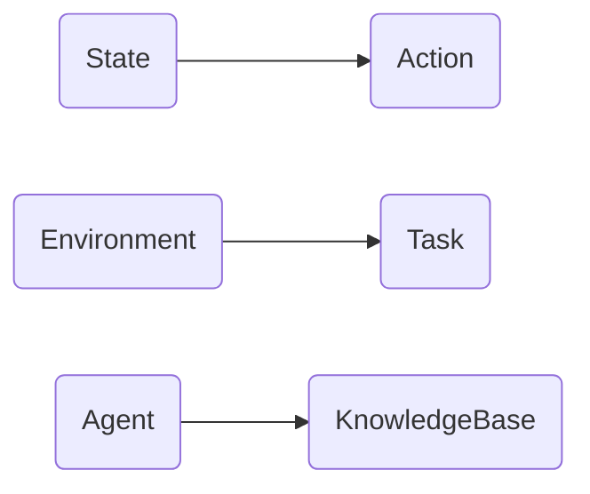
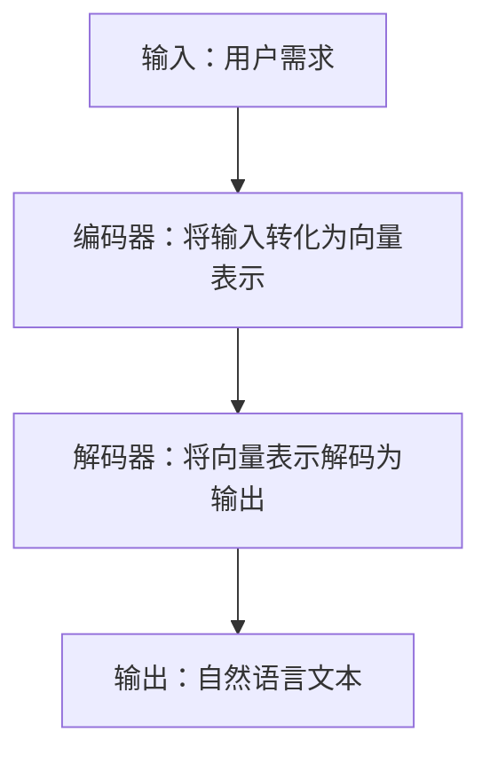
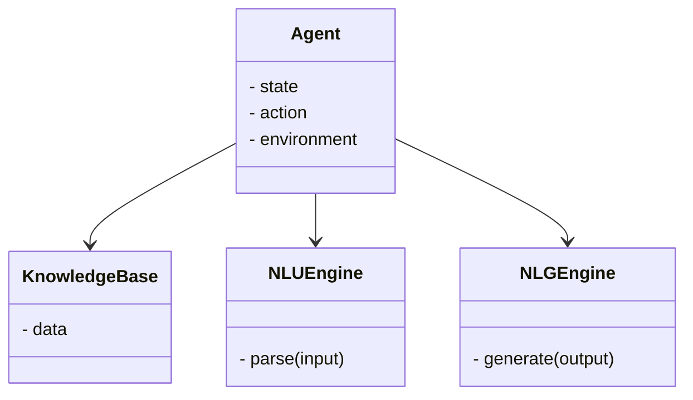
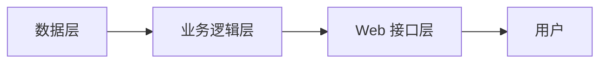

                 


# AI Agent 架构设计：基于 LLM 的智能助手系统构建

> 关键词：AI Agent, LLM, 智能助手, 架构设计, 系统构建

> 摘要：本文详细探讨了基于大语言模型（LLM）的AI Agent架构设计，从基本概念到核心算法，从系统架构到项目实战，全面解析AI Agent的构建过程。通过理论与实践相结合的方式，帮助读者理解AI Agent的工作原理，并掌握基于LLM的智能助手系统的设计与实现方法。

---

# 第1章: AI Agent 的背景与概念

## 1.1 AI Agent 的基本概念

### 1.1.1 什么是 AI Agent
AI Agent（人工智能代理）是一种能够感知环境、自主决策并执行任务的智能实体。它通过与用户的交互或外部系统的通信，完成特定的目标或提供服务。

### 1.1.2 AI Agent 的问题背景
随着大语言模型（LLM）技术的快速发展，AI Agent 已经成为人机交互的重要桥梁。然而，AI Agent 的设计和实现需要考虑多方面的挑战，包括复杂的任务处理逻辑、高效的知识检索能力以及实时的上下文理解能力。

### 1.1.3 AI Agent 的目标与应用场景
AI Agent 的目标是通过自然语言处理技术，为用户提供智能化的助手服务。其应用场景包括智能客服、个人助理、智能音箱、聊天机器人等。

## 1.2 AI Agent 的核心要素

### 1.2.1 感知、决策与执行
AI Agent 的核心功能可以分为三个部分：
1. **感知**：通过自然语言理解（NLU）技术，理解用户的需求。
2. **决策**：基于知识库和推理能力，生成最优的响应策略。
3. **执行**：通过自然语言生成（NLG）技术，将决策结果转化为自然语言输出。

### 1.2.2 状态、动作与环境
AI Agent 的工作过程涉及以下三个核心概念：
1. **状态**：表示系统的当前情况或用户的意图。
2. **动作**：AI Agent 根据当前状态做出的响应或操作。
3. **环境**：AI Agent 所处的外部世界，包括用户、数据库、外部系统等。

### 1.2.3 AI Agent 的边界与外延
AI Agent 的边界是指其功能的限制范围，而外延则是其能力的扩展。AI Agent 可以通过与外部系统的集成，进一步增强其功能，例如与知识库、API 网关、第三方服务等进行交互。

## 1.3 本章小结
本章介绍了 AI Agent 的基本概念、核心要素及其应用场景，为后续的深入学习奠定了基础。

---

# 第2章: AI Agent 的核心概念与联系

## 2.1 AI Agent 的核心原理

### 2.1.1 AI Agent 的感知机制
AI Agent 的感知机制通过自然语言理解技术，将用户的输入转化为可处理的结构化数据。例如，用户输入“今天北京的天气怎么样”，AI Agent 需要识别出用户的意图是查询天气信息。

### 2.1.2 AI Agent 的决策模型
AI Agent 的决策模型基于知识库和推理能力，生成最优的响应策略。例如，AI Agent 可以通过查询天气数据库，生成“北京今天晴，温度在15℃到25℃之间”的响应。

### 2.1.3 AI Agent 的执行方式
AI Agent 的执行方式通过自然语言生成技术，将决策结果转化为自然语言输出。例如，AI Agent 可以生成“今天北京的天气晴朗，气温在15℃到25℃之间”的自然语言响应。

## 2.2 核心概念对比表

### 2.2.1 状态与动作的对比
| 概念 | 描述 |
|------|------|
| 状态 | 表示系统的当前情况或用户的意图 |
| 动作 | 表示 AI Agent 根据当前状态做出的响应或操作 |

### 2.2.2 环境与任务的关联
| 概念 | 描述 |
|------|------|
| 环境 | AI Agent 所处的外部世界，包括用户、数据库、外部系统等 |
| 任务 | AI Agent 需要完成的具体目标 |

### 2.2.3 感知与决策的联系
| 感知 | 决策 |
|------|------|
| 输入：用户需求 | 输入：知识库和推理能力 |
| 输出：结构化数据 | 输出：最优响应策略 |

## 2.3 实体关系图



## 2.4 本章小结
本章详细讲解了 AI Agent 的核心原理及其核心概念之间的关系，通过对比表和实体关系图帮助读者更好地理解 AI Agent 的工作原理。

---

# 第3章: 基于 LLM 的 AI Agent 算法原理

## 3.1 大语言模型的原理

### 3.1.1 编码与解码的过程
大语言模型通过编码器（Encoder）将输入的自然语言转化为向量表示，再通过解码器（Decoder）将向量表示解码为输出的自然语言。

### 3.1.2 模型的输入与输出
模型的输入是用户输入的自然语言文本，输出是经过模型处理后的自然语言文本。

### 3.1.3 LLM 的核心算法
大语言模型的核心算法包括编码器-解码器架构、注意力机制（Attention）和前馈神经网络等。

## 3.2 AI Agent 的算法实现

### 3.2.1 感知层算法
感知层算法通过自然语言理解技术，将用户的输入转化为结构化数据。例如，使用词嵌入（Word Embedding）和序列标注（Sequence Labeling）技术。

### 3.2.2 决策层算法
决策层算法通过知识库查询和推理能力，生成最优的响应策略。例如，使用基于规则的推理和基于概率的推理。

### 3.2.3 执行层算法
执行层算法通过自然语言生成技术，将决策结果转化为自然语言输出。例如，使用生成对抗网络（GAN）和强化学习（Reinforcement Learning）技术。

## 3.3 算法流程图



## 3.4 本章小结
本章详细讲解了大语言模型的原理及其在 AI Agent 中的应用，通过算法流程图帮助读者更好地理解 AI Agent 的实现过程。

---

# 第4章: AI Agent 的系统分析与架构设计

## 4.1 问题场景介绍

### 4.1.1 用户需求
用户需要一个基于 LLM 的 AI Agent 系统，能够提供智能客服、个人助理等服务。

### 4.1.2 系统目标
系统的目标是设计一个高效的 AI Agent 架构，能够支持多种任务和场景。

## 4.2 系统功能设计

### 4.2.1 领域模型
领域模型包括以下模块：
- **自然语言处理模块**：负责用户的输入处理。
- **知识库查询模块**：负责知识库的查询和检索。
- **对话管理模块**：负责对话的上下文管理和状态跟踪。



### 4.2.2 系统架构设计
系统架构采用分层架构，包括数据层、业务逻辑层和 Web 接口层。



### 4.2.3 系统接口设计
系统接口包括以下内容：
- **NLP 模块接口**：负责用户的输入处理。
- **知识库查询接口**：负责知识库的查询和检索。
- **对话管理接口**：负责对话的上下文管理和状态跟踪。

### 4.2.4 系统交互流程
系统交互流程包括以下步骤：
1. 用户输入需求。
2. 系统解析用户的输入。
3. 系统根据解析结果查询知识库。
4. 系统生成响应。
5. 系统输出响应。

```mermaid
sequenceDiagram
User ->> Agent: 用户需求
Agent ->> NLUEngine: 解析用户需求
NLUEngine ->> KnowledgeBase: 查询知识库
KnowledgeBase --> NLUEngine: 返回结果
NLUEngine ->> NLGEngine: 生成响应
N

