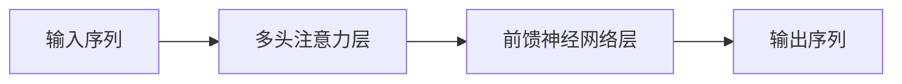
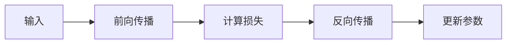
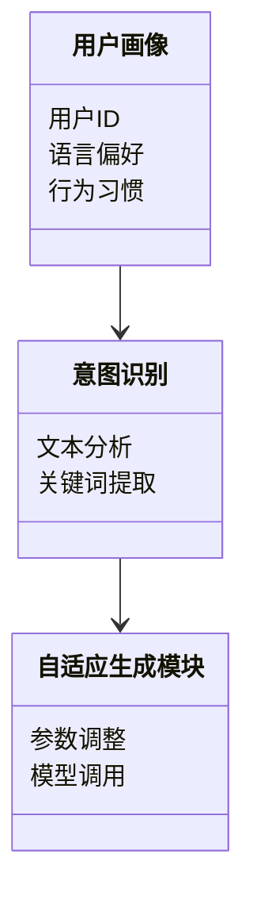
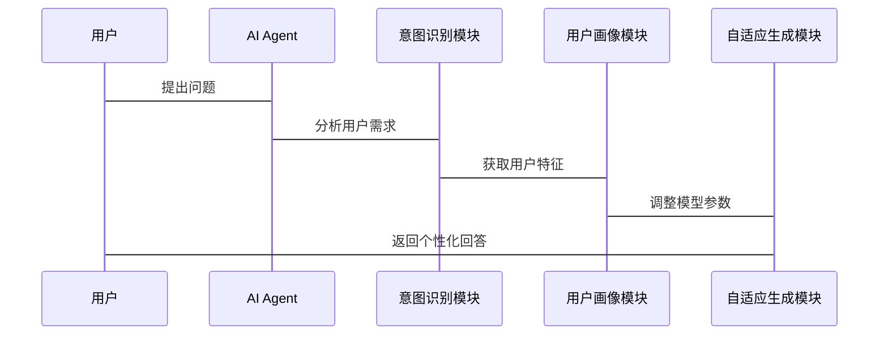

                 


# AI Agent 的个性化定制：调教 LLM 以适应不同用户

> 关键词：AI Agent, LLM, 个性化定制, 模型调教, 自然语言处理

> 摘要：本文深入探讨了AI Agent的个性化定制方法，重点分析了如何通过调教大型语言模型（LLM）来满足不同用户的需求。文章从背景介绍、核心概念、算法原理、系统架构到项目实战，全面解析了实现个性化LLM调教的各个方面，为读者提供了一套系统化的解决方案。

---

## 第一部分: AI Agent 的个性化定制概述

## 第1章: 引言

### 1.1 什么是AI Agent
#### 1.1.1 AI Agent的基本概念
AI Agent（人工智能代理）是一种能够感知环境并采取行动以实现特定目标的智能实体。它可以是一个软件程序，也可以是一个物理设备，通过与用户的交互或环境数据的处理，为用户提供智能化的服务。

#### 1.1.2 LLM与AI Agent的关系
大型语言模型（LLM）作为AI Agent的核心驱动力，通过自然语言处理技术，使AI Agent能够理解和生成人类语言，从而实现更复杂的任务，如对话生成、文本摘要、情感分析等。

#### 1.1.3 个性化定制的意义
个性化定制是将AI Agent的能力与特定用户的需求相结合，使其能够更好地服务于用户。通过调教LLM，AI Agent可以适应不同用户的语言习惯、行为模式和偏好，从而提供更精准的服务。

---

## 第2章: 背景介绍

### 2.1 AI Agent的核心概念
#### 2.1.1 AI Agent的定义与分类
AI Agent可以分为简单反射式代理、基于模型的反射式代理、目标驱动的代理和效用驱动的代理。不同类型的代理适用于不同的场景，例如客服机器人、智能助手等。

#### 2.1.2 LLM的基本原理
LLM通过深度神经网络模型，利用大量的训练数据，学习语言的规律和语义信息。其核心在于编码器-解码器结构和注意力机制，能够处理长上下文和复杂的语言结构。

#### 2.1.3 个性化定制的实现方式
个性化定制可以通过调整模型的超参数、微调模型参数或结合外部知识库等方式实现。不同的定制方法适用于不同的场景和需求。

---

## 第3章: 核心概念与联系

### 3.1 LLM的工作原理
#### 3.1.1 注意力机制的数学模型
注意力机制通过计算输入序列中每个位置的重要性，生成一个加权表示。其数学公式如下：
$$
\text{Attention}(Q, K, V) = \text{softmax}\left(\frac{QK^T}{\sqrt{d_k}}\right)V
$$

#### 3.1.2 解码器的结构特点
解码器通过自注意力机制生成输出序列，其结构包括多头注意力层和前馈神经网络层。下图展示了解码器的结构：


#### 3.1.3 模型调参的核心方法
模型调参包括超参数调整、学习率优化和正则化方法。常用的超参数包括批次大小、学习率和训练轮数等。

---

## 第4章: 算法原理

### 4.1 LLM的训练流程
LLM的训练过程包括前向传播和损失计算。前向传播生成模型输出，损失函数衡量预测值与真实值的差异。下图展示了训练流程：


### 4.2 个性化调教的数学模型
个性化调教可以通过调整模型的权重或引入用户特定的特征向量来实现。例如，用户特征向量可以表示为：
$$
u = \{u_1, u_2, ..., u_n\}
$$
其中，$u_i$ 表示用户在第i个维度上的特征。

---

## 第5章: 系统分析与架构设计

### 5.1 问题场景介绍
假设我们需要设计一个AI Agent，用于为用户提供个性化的客服服务。用户可能有不同的语言习惯和需求，例如，有的用户喜欢简洁的回答，有的用户则希望得到详细的解释。

### 5.2 系统功能设计
下图展示了系统的核心功能模块：


### 5.3 系统架构设计
下图展示了系统的分层架构：


### 5.4 接口设计与交互流程
下图展示了系统的交互流程：


---

## 第6章: 项目实战

### 6.1 环境安装
安装所需的依赖：
```bash
pip install transformers torch
```

### 6.2 核心代码实现
```python
from transformers import AutoModelWithLMHead, AutoTokenizer

class PersonalizedLLM:
    def __init__(self, model_name, user_features):
        self.model = AutoModelWithLMHead.from_pretrained(model_name)
        self.tokenizer = AutoTokenizer.from_pretrained(model_name)
        self.user_features = user_features

    def generate_response(self, input_text):
        # 调整模型参数以适应用户特征
        inputs = self.tokenizer.encode(input_text, return_tensors='pt')
        outputs = self.model.generate(inputs, max_length=50, do_sample=True)
        return self.tokenizer.decode(outputs[0], skip_special_tokens=True)
```

### 6.3 案例分析
以电商客服为例，用户询问退货流程。系统首先分析用户的语言偏好，然后生成符合用户习惯的回答。

---

## 第7章: 最佳实践

### 7.1 关键点总结
1. 数据隐私保护
2. 模型调教的可解释性
3. 用户反馈的实时调整

### 7.2 小结
个性化定制是实现高效AI Agent的核心，通过深入理解用户需求和场景，结合先进的自然语言处理技术，可以为用户提供更优质的服务。

### 7.3 注意事项
1. 避免过度拟合
2. 定期更新模型
3. 保护用户隐私

### 7.4 拓展阅读
1.《Effective Machine Learning》
2.《Deep Learning》

---

## 作者：AI天才研究院 & 禅与计算机程序设计艺术

---

希望这篇文章能够帮助您更好地理解AI Agent的个性化定制方法。如果需要进一步探讨或调整，请随时告知！

