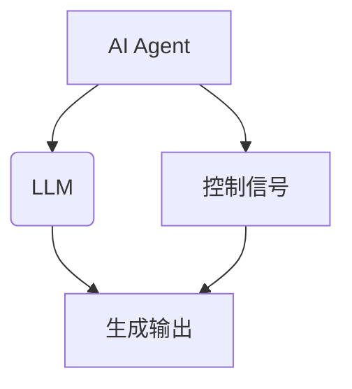
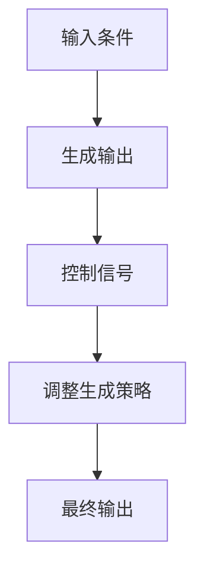
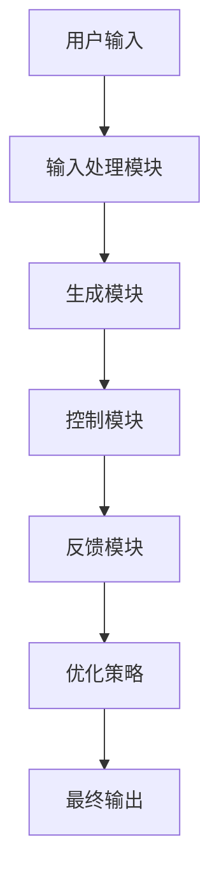
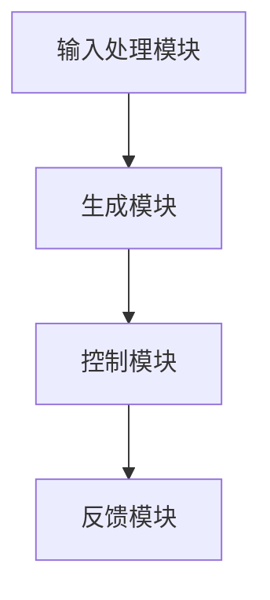
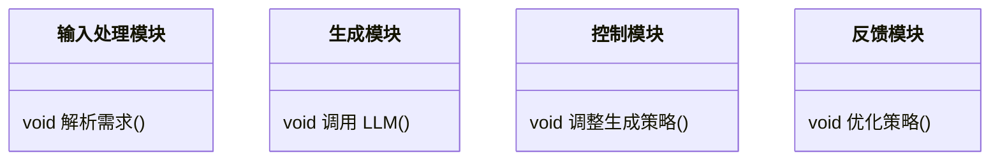

                 


# AI Agent 的可控生成：精确控制 LLM 的输出

## 关键词：AI Agent, LLM, 可控生成, 输出控制, 生成式AI, 人工智能

## 摘要：本文深入探讨了AI Agent如何精确控制大语言模型（LLM）的输出，从技术原理到实际应用，全面解析了AI Agent在LLM输出控制中的作用与实现方法。文章结合理论分析和实战案例，详细阐述了可控生成的核心算法、系统架构以及实际项目中的应用，为读者提供了全面的技术指导和实践参考。

---

# 第1章 AI Agent 的可控生成概述

## 1.1 问题背景与描述

### 1.1.1 AI Agent 的定义与核心概念

AI Agent（人工智能代理）是指能够感知环境并采取行动以实现特定目标的智能实体。它通常具备以下核心特征：

- **自主性**：能够在没有外部干预的情况下独立运作。
- **反应性**：能够根据环境反馈实时调整行为。
- **目标导向性**：所有行为都以实现特定目标为导向。

AI Agent 的典型应用场景包括智能助手、推荐系统、自动化交易系统等。

### 1.1.2 LLM 输出控制的必要性

大语言模型（LLM）是一种基于深度学习的生成模型，能够生成高质量的文本输出。然而，LLM 的输出往往缺乏可控性，可能会生成不符合预期或安全要求的内容。例如：

- 在金融领域，LLM 可能生成错误的交易建议。
- 在医疗领域，LLM 可能生成不准确的诊断建议。

因此，对 LLM 的输出进行精确控制变得尤为重要。

### 1.1.3 可控生成的目标与边界

可控生成的目标是在确保生成内容质量的同时，将其严格限制在特定范围内。具体目标包括：

- **内容准确性**：确保生成内容与事实一致。
- **语义连贯性**：确保生成内容逻辑清晰、语义连贯。
- **安全性**：避免生成有害或违规内容。

可控生成的边界包括：

- 不超出模型的能力范围。
- 不违背伦理和法律规范。
- 不破坏用户体验。

---

## 1.2 AI Agent 与 LLM 的关系

### 1.2.1 LLM 的基本工作原理

LLM 的核心是基于概率的生成模型。模型通过训练数据学习语言的统计规律，并在生成阶段根据输入条件概率生成最可能的输出。典型的 LLM 包括 Transformer 和 GPT 系列模型。

### 1.2.2 AI Agent 在 LLM 中的作用

AI Agent 作为 LLM 的控制器，负责接收输入、调用 LLM 生成输出，并根据反馈调整生成策略。其主要作用包括：

- **输入处理**：接收用户输入并解析需求。
- **输出控制**：通过内部策略限制 LLM 的生成范围。
- **反馈优化**：根据用户反馈优化生成策略。

### 1.2.3 可控生成的实现路径

可控生成的实现路径包括：

- **基于规则的控制**：通过预定义规则过滤生成内容。
- **基于概率的控制**：通过调整生成概率实现内容偏好。
- **基于强化学习的控制**：通过强化学习优化生成策略。

---

## 1.3 可控生成的核心技术挑战

### 1.3.1 LLM 的不可控性问题

LLM 的不可控性主要表现在以下几个方面：

- **生成偏差**：模型可能根据训练数据生成具有偏差的输出。
- **不确定性**：生成结果具有概率性，难以完全控制。
- **不可解释性**：生成过程难以被完全解释。

### 1.3.2 输出控制的实现难点

输出控制的实现难点包括：

- **控制粒度**：如何实现精确的内容控制。
- **性能优化**：如何在控制输出的同时保持生成效率。
- **模型适应性**：如何让模型适应不同的控制需求。

### 1.3.3 技术实现的边界与限制

技术实现的边界与限制包括：

- **模型能力限制**：模型的能力决定了控制的可能性。
- **计算资源限制**：复杂的控制策略需要更多的计算资源。
- **伦理限制**：生成内容需要符合伦理和法律规范。

---

## 1.4 应用场景与价值

### 1.4.1 AI Agent 在不同领域的应用

AI Agent 的应用场景包括：

- **智能客服**：提供个性化的客户服务。
- **内容生成**：生成高质量的文本内容。
- **决策支持**：辅助决策者制定策略。

### 1.4.2 可控生成的实际价值

可控生成的实际价值体现在以下几个方面：

- **提升用户体验**：通过精确控制生成内容，提高用户满意度。
- **降低风险**：避免生成有害或违规内容。
- **提高效率**：通过自动化生成减少人工干预。

### 1.4.3 技术进步对社会的影响

技术进步对社会的影响包括：

- **推动产业升级**：通过自动化生成提高生产效率。
- **促进技术创新**：推动人工智能技术的进一步发展。
- **改善生活质量**：为用户提供更智能、更便捷的服务。

---

# 第2章 AI Agent 的核心概念解析

## 2.1 AI Agent 的核心原理

### 2.1.1 AI Agent 的基本原理

AI Agent 的基本原理包括感知、决策和行动三个环节。感知阶段通过传感器获取环境信息，决策阶段通过算法选择最优行动，行动阶段通过执行器实现决策。

### 2.1.2 LLM 的生成机制

LLM 的生成机制基于 Transformer 模型，通过自注意力机制捕捉文本中的长距离依赖关系，并通过解码器生成目标输出。

### 2.1.3 可控生成的实现方法

可控生成的实现方法包括：

- **输入控制**：通过调整输入条件影响生成结果。
- **参数控制**：通过调整模型参数实现内容偏好。
- **输出过滤**：通过后处理过滤生成内容。

---

## 2.2 核心概念的属性特征对比

### 2.2.1 AI Agent 的属性特征

| 属性 | 特征 |
|------|------|
| 自主性 | 独立运作 |
| 反应性 | 实时调整 |
| 目标导向性 | 以目标为导向 |

### 2.2.2 LLM 的属性特征

| 属性 | 特征 |
|------|------|
| 生成能力 | 高质量文本生成 |
| 概率性 | 输出具有概率性 |
| 训练数据依赖性 | 生成结果依赖训练数据 |

### 2.2.3 可控生成的属性特征

| 属性 | 特征 |
|------|------|
| 控制粒度 | 精确控制 |
| 可解释性 | 可控性与可解释性之间的平衡 |

---

## 2.3 实体关系图



---

# 第3章 可控生成的算法原理

## 3.1 算法原理概述

### 3.1.1 基于概率的生成模型

基于概率的生成模型通过计算每个可能输出的概率分布，选择概率最高的输出作为最终结果。其核心公式为：

$$ P(y|x) = \frac{P(x,y)}{P(x)} $$

其中，$x$ 是输入，$y$ 是输出。

### 3.1.2 基于强化学习的生成模型

基于强化学习的生成模型通过定义奖励函数，引导模型生成符合预期的输出。其核心公式为：

$$ R(y) = \sum_{i=1}^{n} r_i y_i $$

其中，$r_i$ 是奖励系数，$y_i$ 是生成的第 $i$ 个字符。

### 3.1.3 可控生成的实现方法

可控生成的实现方法包括：

- **基于规则的控制**：通过预定义规则过滤生成内容。
- **基于概率的控制**：通过调整生成概率实现内容偏好。
- **基于强化学习的控制**：通过强化学习优化生成策略。

---

## 3.2 算法实现细节

### 3.2.1 算法流程图



### 3.2.2 代码实现

```python
def controlled_generation(input_text, control_signal):
    # 生成输出
    output = model.generate(input_text)
    # 应用控制信号
    filtered_output = apply_control(output, control_signal)
    return filtered_output
```

### 3.2.3 数学模型和公式

数学模型和公式：

$$ P(y|x) = \frac{P(x,y)}{P(x)} $$

其中，$P(y|x)$ 是条件概率，$P(x,y)$ 是联合概率，$P(x)$ 是边缘概率。

---

# 第4章 系统分析与架构设计

## 4.1 系统分析

### 4.1.1 系统功能设计

系统功能设计包括：

- **输入处理模块**：接收用户输入并解析需求。
- **生成模块**：调用 LLM 生成输出。
- **控制模块**：根据控制策略调整生成输出。
- **反馈模块**：根据用户反馈优化生成策略。

### 4.1.2 系统架构设计

系统架构设计如下：



### 4.1.3 系统接口设计

系统接口设计包括：

- **输入接口**：接收用户输入。
- **输出接口**：返回生成内容。
- **控制接口**：接收控制信号。

### 4.1.4 系统交互流程

系统交互流程如下：

1. 用户输入需求。
2. 输入处理模块解析需求。
3. 生成模块调用 LLM 生成输出。
4. 控制模块根据控制策略调整生成输出。
5. 反馈模块根据用户反馈优化生成策略。

---

## 4.2 系统架构设计

### 4.2.1 系统架构图



### 4.2.2 系统类图



---

## 4.3 系统交互流程

### 4.3.1 系统交互流程图


---

# 第5章 项目实战

## 5.1 环境安装

项目实战环境安装包括：

- **Python 3.8+**
- **TensorFlow 2.0+**
- **PyTorch 1.9+**
- **Transformers库**

## 5.2 系统核心实现

### 5.2.1 代码实现

```python
from transformers import GPT2LMHeadModel, GPT2Tokenizer

model = GPT2LMHeadModel.from_pretrained('gpt2')
tokenizer = GPT2Tokenizer.from_pretrained('gpt2')

def controlled_generation(input_text, max_length=50):
    inputs = tokenizer.encode(input_text, return_tensors='pt')
    outputs = model.generate(inputs, max_length=max_length, do_sample=True)
    return tokenizer.decode(outputs[0], skip_special_tokens=True)
```

### 5.2.2 代码解读

代码解读：

- 使用 GPT2 模型进行生成。
- 通过设置 `do_sample=True` 启用采样生成。
- 通过 `max_length` 控制生成长度。

## 5.3 实际案例分析

### 5.3.1 案例一：金融领域

**案例描述**：在金融领域，AI Agent 需要生成符合金融规范的交易建议。

**实现步骤**：

1. 安装必要的库。
2. 加载金融领域的训练数据。
3. 使用强化学习优化生成策略。

### 5.3.2 案例二：医疗领域

**案例描述**：在医疗领域，AI Agent 需要生成准确的诊断建议。

**实现步骤**：

1. 加载医疗领域的训练数据。
2. 使用基于规则的控制方法过滤生成内容。
3. 通过用户反馈优化生成策略。

---

## 5.4 项目总结

### 5.4.1 项目核心代码

```python
def controlled_generation(input_text, max_length=50):
    inputs = tokenizer.encode(input_text, return_tensors='pt')
    outputs = model.generate(inputs, max_length=max_length, do_sample=True)
    return tokenizer.decode(outputs[0], skip_special_tokens=True)
```

### 5.4.2 项目实现步骤

项目实现步骤包括：

1. 安装必要的库。
2. 加载训练数据。
3. 调用 LLM 生成输出。
4. 应用控制策略优化生成结果。

---

# 第6章 最佳实践与小结

## 6.1 最佳实践

### 6.1.1 方法论

- **分阶段控制**：在生成的不同阶段进行控制。
- **多策略结合**：结合多种控制方法实现更好的效果。
- **持续优化**：根据反馈不断优化生成策略。

### 6.1.2 注意事项

- **模型选择**：选择合适的模型和参数。
- **数据质量**：确保训练数据的质量和多样性。
- **反馈机制**：建立有效的反馈机制。

## 6.2 小结

### 6.2.1 核心要点

- AI Agent 的定义与核心概念。
- 可控生成的实现方法与技术挑战。
- 实际项目的实现步骤与注意事项。

### 6.2.2 未来展望

未来展望包括：

- 更复杂的控制策略。
- 更高效的生成算法。
- 更广泛的应用场景。

---

# 附录

## 附录1 项目代码

```python
from transformers import GPT2LMHeadModel, GPT2Tokenizer

model = GPT2LMHeadModel.from_pretrained('gpt2')
tokenizer = GPT2Tokenizer.from_pretrained('gpt2')

def controlled_generation(input_text, max_length=50):
    inputs = tokenizer.encode(input_text, return_tensors='pt')
    outputs = model.generate(inputs, max_length=max_length, do_sample=True)
    return tokenizer.decode(outputs[0], skip_special_tokens=True)
```

## 附录2 参考文献

- 《Deep Learning》
- 《Generative AI》
- 《Reinforcement Learning》

---

# 作者

作者：AI天才研究院/AI Genius Institute & 禅与计算机程序设计艺术/Zen And The Art of Computer Programming

