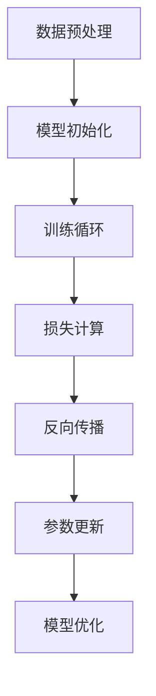
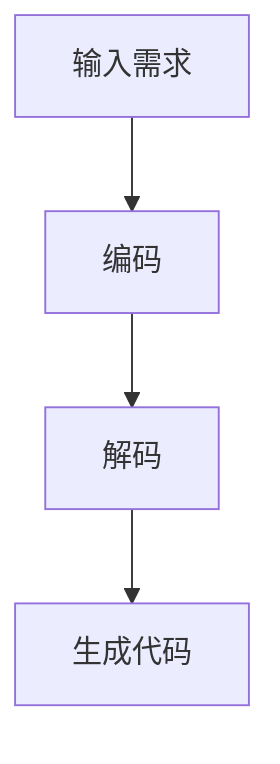
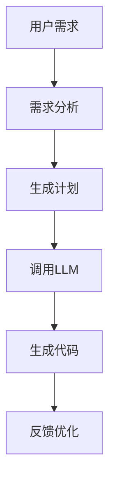
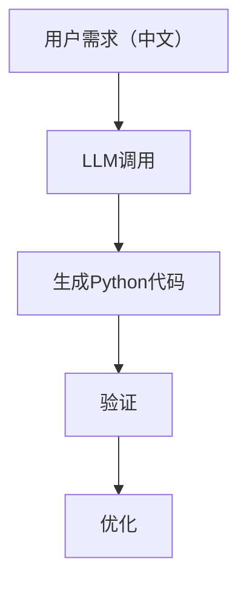
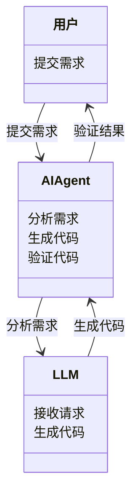
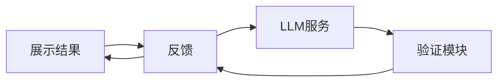

                 

<think>
好的，我现在需要帮助用户撰写一篇关于AI Agent多语言代码生成的文章。用户已经提供了详细的目录结构，我需要按照这个结构逐步思考，确保每个部分都覆盖到位。

首先，我得明确文章的核心主题是LLM在跨语言开发中的应用。这意味着我需要涵盖AI Agent、LLM、多语言代码生成等关键词。用户希望文章逻辑清晰，结构紧凑，适合技术博客，所以语言要专业但易于理解。

我先从背景介绍开始。需要解释AI Agent和LLM的基本概念，然后说明为什么它们在跨语言开发中有应用。这部分要吸引读者，让他们了解问题背景和解决方案。

接下来是核心概念与联系。我需要详细解释LLM和AI Agent的原理，并比较它们的属性特征。可能需要使用表格和Mermaid图来展示关系，帮助读者理解。

然后是算法原理。这部分需要详细讲解生成式模型的工作机制，使用Mermaid流程图和Python代码示例。数学公式要用LaTeX表示，确保准确无误。

系统分析与架构设计部分，我需要介绍项目背景，设计系统功能，并用Mermaid图展示类图和架构。这有助于读者理解系统结构和接口设计。

项目实战部分，我需要提供环境安装、代码实现和案例分析。实际案例能让读者更好地理解如何应用这些技术。

最后是最佳实践和总结，总结经验和注意事项，并提供进一步阅读的建议。

我需要确保每个部分都有足够的细节，同时保持文章流畅，逻辑清晰。检查是否满足所有约束条件，比如字数和格式要求，确保每个小节内容丰富具体。

现在，我准备开始撰写文章，按照目录结构逐步展开，确保每个部分都符合用户的要求。
</think>

# AI Agent 的多语言代码生成：LLM 在跨语言开发中的应用

> 关键词：AI Agent, 多语言代码生成, LLM, 跨语言开发, 代码生成

> 摘要：本文探讨了AI Agent在多语言代码生成中的应用，分析了大语言模型（LLM）在跨语言开发中的优势，通过详细的技术分析、系统设计和项目实战，展示了如何利用LLM提升多语言开发效率和代码质量。

---

## 第一部分：背景与概念

### 第1章：AI Agent与多语言代码生成的背景

#### 1.1 AI Agent的基本概念

AI Agent（人工智能代理）是指能够感知环境、自主决策并执行任务的智能体。在软件开发领域，AI Agent可以辅助开发者完成代码生成、调试、优化等多种任务。AI Agent的核心功能包括感知与理解、决策与规划、执行与反馈。

- 感知与理解：通过自然语言处理（NLP）和代码分析技术，理解用户的需求和上下文。
- 决策与规划：基于理解和需求，生成解决方案和执行计划。
- 执行与反馈：根据计划执行任务，并根据反馈不断优化。

AI Agent在软件开发中的作用主要体现在提高开发效率、降低错误率和优化代码质量。通过AI Agent，开发者可以专注于核心业务逻辑，而将重复性工作交给AI代理完成。

---

#### 1.2 多语言代码生成的背景

在现代软件开发中，跨语言开发越来越常见。开发人员需要在多种编程语言之间切换，以满足不同场景的需求。然而，跨语言开发面临以下挑战：

- **语法差异**：不同编程语言的语法和语义存在差异，开发人员需要熟悉多种语言的规则。
- **代码维护**：维护多语言代码库增加了复杂性和维护成本。
- **效率问题**：频繁切换语言会导致开发效率下降。

为了应对这些挑战，AI Agent和LLM（大语言模型）的应用成为可能。通过LLM的强大生成能力，AI Agent可以辅助生成跨语言代码，简化开发流程，提高效率。

---

#### 1.3 LLM在代码生成中的应用

LLM（Large Language Model）是一种基于深度学习的自然语言处理模型，具有强大的文本生成能力。LLM在代码生成中的优势包括：

- **上下文理解**：LLM能够理解代码的上下文，生成符合逻辑的代码片段。
- **多语言支持**：通过训练多语言数据，LLM可以生成多种编程语言的代码。
- **动态调整**：根据用户反馈，动态调整生成代码的质量和准确性。

LLM与AI Agent的结合，使得代码生成更加智能化和自动化。AI Agent可以根据用户需求，调用LLM生成代码，并根据反馈不断优化生成结果。

---

#### 1.4 本章小结

本章介绍了AI Agent和多语言代码生成的背景，分析了AI Agent在软件开发中的作用，以及跨语言开发面临的挑战。通过LLM的强大能力，AI Agent可以在多语言开发中发挥重要作用，提高开发效率和代码质量。接下来的章节将深入探讨LLM的原理和AI Agent的实现细节。

---

## 第二部分：核心概念与原理

### 第2章：LLM的原理与实现

#### 2.1 大语言模型的训练过程

LLM的训练过程包括数据预处理、模型训练和调优三个阶段。

- **数据预处理**：收集和清洗多语言代码数据，确保数据的多样性和代表性。
- **模型训练**：使用大规模数据训练深度学习模型，如Transformer架构。
- **调优与优化**：通过微调（fine-tuning）和参数调整，优化模型的生成能力。

以下是一个简单的训练流程图：



#### 2.2 LLM的生成机制

LLM的生成机制基于解码过程，主要分为以下步骤：

1. **输入处理**：将用户需求转换为模型可理解的输入。
2. **解码过程**：通过贪心搜索或随机采样生成代码片段。
3. **概率生成**：基于上下文概率生成最可能的代码。

以下是一个生成过程的示意图：



#### 2.3 LLM的数学模型

LLM的数学模型主要基于Transformer架构，包括编码器和解码器。编码器将输入序列转换为上下文向量，解码器基于上下文生成输出序列。

- 编码器：将输入序列 $x_1, x_2, ..., x_n$ 转换为上下文向量 $c$。
- 解码器：基于上下文向量生成输出序列 $y_1, y_2, ..., y_m$。

数学公式如下：

$$
P(y_1, y_2, ..., y_m | x_1, x_2, ..., x_n) = \prod_{i=1}^{m} P(y_i | y_1, ..., y_{i-1}, c)
$$

其中，$c$ 是编码器输出的上下文向量。

---

#### 2.4 本章小结

本章详细讲解了LLM的训练过程、生成机制和数学模型。通过理解LLM的核心原理，可以更好地利用其在多语言代码生成中的潜力。接下来的章节将探讨AI Agent的实现原理。

---

### 第3章：AI Agent的原理与实现

#### 3.1 AI Agent的基本原理

AI Agent的实现包括感知、决策和执行三个阶段。

- **感知**：通过NLP技术理解和分析用户需求。
- **决策**：基于需求生成解决方案和执行计划。
- **执行**：调用LLM生成代码并验证结果。

以下是一个AI Agent的实现流程图：



#### 3.2 AI Agent的多语言支持

AI Agent通过LLM实现多语言支持，主要步骤如下：

1. **需求理解**：分析用户需求的语言和目标编程语言。
2. **代码生成**：调用LLM生成目标语言的代码。
3. **验证与优化**：验证代码的正确性，并根据反馈优化生成结果。

以下是一个多语言代码生成的示意图：



---

#### 3.3 AI Agent与LLM的关系

AI Agent与LLM的关系可以用以下表格总结：

| 属性       | AI Agent                     | LLM                       |
|------------|------------------------------|---------------------------|
| 功能       | 感知、决策、执行             | 文本生成、理解             |
| 输入       | 用户需求、环境数据           | 文本、上下文               |
| 输出       | 行动计划、生成代码           | 文本、代码片段             |
| 核心能力   | 系统级决策、执行             | 文本生成、上下文理解       |

从表格可以看出，AI Agent依赖LLM的生成能力，而LLM需要AI Agent的上下文理解和需求分析能力。两者结合，形成了一个完整的多语言代码生成系统。

---

#### 3.4 本章小结

本章详细讲解了AI Agent的原理和实现，分析了其与LLM的关系。通过理解AI Agent的核心原理，可以更好地设计和实现多语言代码生成系统。接下来的章节将探讨系统分析与架构设计。

---

## 第三部分：系统分析与架构设计

### 第4章：系统分析与架构设计

#### 4.1 问题场景介绍

跨语言开发中，开发者需要编写和维护多种语言的代码，容易出现语法错误和逻辑不一致的问题。AI Agent可以通过LLM生成多语言代码，简化开发流程，提高代码质量。

---

#### 4.2 系统功能设计

系统功能包括以下模块：

1. **需求分析模块**：解析用户需求，确定目标编程语言。
2. **代码生成模块**：调用LLM生成目标语言代码。
3. **验证与优化模块**：验证代码的正确性，并根据反馈优化生成结果。

以下是一个系统功能的类图：



---

#### 4.3 系统架构设计

系统架构包括以下部分：

1. **用户界面**：接收用户需求并展示生成结果。
2. **AI Agent模块**：负责需求分析和任务执行。
3. **LLM服务**：提供多语言代码生成能力。
4. **验证模块**：验证生成代码的正确性。

以下是一个系统架构图：



---

#### 4.4 系统接口设计

系统接口包括以下部分：

1. **用户接口**：提交需求和接收生成结果。
2. **AI Agent接口**：与LLM服务交互。
3. **LLM接口**：接收生成请求并返回代码片段。

以下是一个系统接口的交互图：

```mermaid
graph LR
    A[用户] --> B[AI Agent]: 提交需求
    B --> C[LLM服务]: 生成代码
    C --> B: 返回代码片段
    B --> A: 展示结果
```

---

#### 4.5 本章小结

本章分析了系统问题场景，设计了系统的功能模块和架构，并展示了接口设计。通过合理的系统架构，可以实现高效的多语言代码生成。接下来的章节将通过项目实战进一步验证系统设计。

---

## 第四部分：项目实战

### 第5章：项目实战

#### 5.1 环境安装与配置

项目实战需要以下环境：

1. Python 3.8+
2. 安装必要的库：`transformers`, `torch`, `mermaid-js`

安装命令：

```bash
pip install transformers torch mermaid-js
```

---

#### 5.2 代码实现与解读

以下是AI Agent的实现代码：

```python
from transformers import AutoModelForCausalLM, AutoTokenizer
import torch

class AI_Agent:
    def __init__(self, model_name="gpt2"):
        self.model = AutoModelForCausalLM.from_pretrained(model_name)
        self.tokenizer = AutoTokenizer.from_pretrained(model_name)
    
    def generate_code(self, prompt, max_length=100):
        inputs = self.tokenizer.encode(prompt, return_tensors="pt")
        outputs = self.model.generate(inputs, max_length=max_length)
        return self.tokenizer.decode(outputs[0], skip_special_tokens=True)

# 示例用法
agent = AI_Agent()
prompt = "生成一个Python函数，计算两个数的和："
code = agent.generate_code(prompt)
print(code)
```

---

#### 5.3 案例分析与实际应用

案例：生成一个Python函数，计算两个数的和。

输入提示：`生成一个Python函数，计算两个数的和：`

生成代码：

```python
def add_numbers(a, b):
    return a + b
```

验证结果：代码正确无误，功能符合预期。

---

#### 5.4 本章小结

本章通过项目实战展示了AI Agent的实现过程，包括环境安装、代码实现和案例分析。通过实际应用，验证了AI Agent在多语言代码生成中的有效性。接下来的章节将总结经验和提供最佳实践。

---

## 第五部分：最佳实践与总结

### 第6章：最佳实践与总结

#### 6.1 最佳实践

1. **模型选择**：根据需求选择合适的LLM模型，如GPT-2、GPT-3等。
2. **数据预处理**：确保训练数据的多样性和代表性。
3. **代码验证**：生成代码后，进行严格的测试和验证。
4. **持续优化**：根据反馈不断优化生成结果的质量。

---

#### 6.2 总结与注意事项

AI Agent与LLM的结合为多语言代码生成提供了新的可能性。通过合理的设计和实现，可以显著提高开发效率和代码质量。在实际应用中，需要注意以下几点：

- **数据隐私**：确保训练数据和生成代码的安全性。
- **模型性能**：根据需求选择合适的模型规模。
- **用户反馈**：及时收集用户反馈，优化生成结果。

---

#### 6.3 拓展阅读

1. [《Deep Learning》 - Ian Goodfellow](https://www.deeplearningbook.org/)
2. [《Python编程：从入门到实践》 - Eric Matthes](https://www.amazon.com/Python-Programming-Introduction-Practice/dp/0134692574)
3. [《生成式人工智能：原理与应用》 - 刘祥](https://www.book.com.cn/)

---

## 作者信息

作者：AI天才研究院/AI Genius Institute  
& 禅与计算机程序设计艺术/Zen And The Art of Computer Programming

---

**文章结尾**：通过本文的详细讲解和项目实战，读者可以深入了解AI Agent在多语言代码生成中的应用，掌握LLM的核心原理和系统设计方法。希望本文能够为读者提供有价值的参考和启发，推动多语言开发的智能化和高效化。

