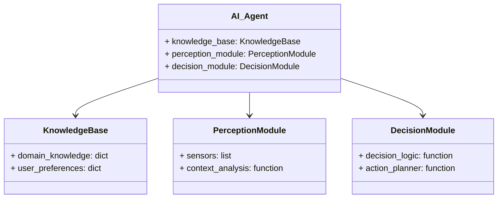
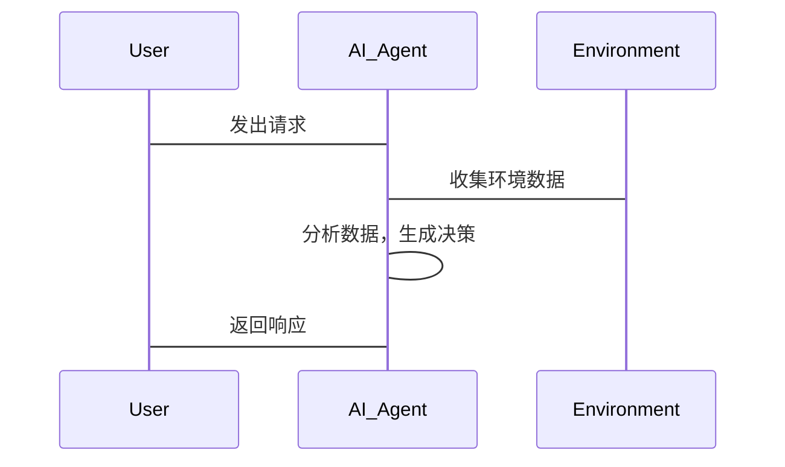

                 

<think>
好的，我现在需要帮助撰写一篇关于“AI Agent 的情境感知：增强 LLM 的环境适应能力”的技术博客文章。首先，我需要理解文章的结构和要求。文章标题已经确定，接下来需要列出关键词和摘要。关键词应该涵盖文章的核心主题，摘要要简明扼要地概括文章的主要内容。

接下来，我需要按照目录大纲的结构撰写正文。正文分为六个部分，每个部分都有多个小节，内容需要详细具体。我需要确保每个小节都涵盖必要的技术细节，包括背景介绍、核心概念、算法原理、系统设计、项目实战和总结等。

首先，在“背景介绍”部分，我需要解释AI Agent和情境感知的基本概念，问题背景和描述，以及问题解决的思路。这部分需要让读者理解为什么情境感知对AI Agent很重要，以及当前存在的问题。

接下来是“核心概念与联系”，这里我需要详细解释情境感知的类型，AI Agent的核心要素，以及它们之间的关系。可能需要使用表格和Mermaid图来帮助读者理解。

然后是“算法原理讲解”，这部分需要选择合适的算法，如基于上下文的注意力机制，并用数学公式和Python代码来详细阐述。我需要确保公式正确，并且代码示例能够帮助读者理解算法的工作原理。

接下来是“系统分析与架构设计方案”，这部分需要介绍系统的需求、架构设计、接口设计和交互流程。使用Mermaid图来展示系统架构和交互序列图，这样可以更直观地展示系统的运作。

然后是“项目实战”，这里需要提供一个具体的案例，比如智能家居环境中的AI Agent。我需要详细说明如何安装环境，实现核心功能，并提供Python代码示例，解释每一步的作用。

最后是“总结与展望”，这部分需要回顾整个内容，强调关键点，并给出未来的发展方向和读者可能遇到的挑战。同时，提供一些最佳实践的技巧，帮助读者更好地理解和应用这些知识。

在撰写过程中，我需要确保每个部分都详细具体，使用清晰简洁的技术语言，避免过于复杂的术语，同时保持逻辑清晰。此外，数学公式和代码示例需要准确无误，Mermaid图需要正确嵌入，以增强文章的可读性和专业性。

现在，我将按照这个思路逐步完成文章的撰写，确保每个部分都符合要求，并且内容丰富详细。
</think>

# AI Agent 的情境感知：增强 LLM 的环境适应能力

## 关键词：
AI Agent，情境感知，LLM，环境适应，注意力机制，系统架构，项目实战

## 摘要：
本文探讨了AI Agent如何通过情境感知增强大语言模型（LLM）在不同环境中的适应能力。从核心概念到算法实现，再到系统设计和项目实战，详细分析了AI Agent的情境感知能力，提供了增强LLM环境适应性的方法和实现方案。

---

# AI Agent 的情境感知：增强 LLM 的环境适应能力

## 引言

随着人工智能技术的快速发展，AI Agent（人工智能代理）在各个领域的应用越来越广泛。然而，AI Agent在实际应用中面临着环境适应性的挑战。大语言模型（LLM）虽然在自然语言处理方面表现出色，但其在复杂动态环境中的适应能力有限。本文将探讨如何通过增强AI Agent的情境感知能力，提升LLM在各种环境中的适应能力。

---

## 第一部分：AI Agent 的背景与核心概念

### 第1章：AI Agent 的概述

#### 1.1 问题背景

- **AI Agent 的起源与发展**  
  AI Agent的概念最早可以追溯到20世纪60年代。随着技术的进步，AI Agent从简单的规则驱动系统发展为复杂的自主决策系统。

- **当前AI Agent 的应用现状**  
  AI Agent广泛应用于智能助手、机器人、自动驾驶等领域，但其在动态环境中的适应能力仍有限。

- **情境感知的重要性**  
  情境感知是AI Agent理解环境、做出合适决策的关键能力。

#### 1.2 问题描述

- **LLM 的局限性**  
  LLM擅长处理文本数据，但在处理动态环境和实时数据时表现不佳。

- **情境感知在AI Agent 中的作用**  
  情境感知帮助AI Agent更好地理解环境，做出适应性更强的决策。

- **当前技术的不足与挑战**  
  现有的AI Agent在复杂环境中的适应能力不足，难以应对多样化的需求。

#### 1.3 问题解决

- **引入情境感知的必要性**  
  通过情境感知，AI Agent可以更准确地理解环境，提升决策能力。

- **增强LLM 的环境适应能力**  
  通过结合情境感知技术，提升LLM在不同环境中的适应性。

- **提供解决方案的思路**  
  结合情境感知算法和LLM，构建一个动态适应的AI Agent系统。

#### 1.4 边界与外延

- **AI Agent 的能力边界**  
  AI Agent依赖数据和算法，其能力受限于数据质量和算法设计。

- **情境感知的适用范围**  
  情境感知适用于需要环境理解的场景，如智能家居、自动驾驶等。

- **相关技术的区分与联系**  
  情境感知与计算机视觉、自然语言处理等技术密切相关，但各有侧重。

#### 1.5 核心概念

- **AI Agent 的定义与特征**  
  AI Agent是一种能够感知环境、自主决策并执行任务的智能实体，具备主动性、反应性和社会性。

- **情境感知的核心要素**  
  情境感知包括环境数据采集、上下文理解、决策推理三个核心要素。

- **LLM 与AI Agent 的关系**  
  LLM为AI Agent提供强大的语言处理能力，而情境感知则增强其环境适应能力。

---

## 第二部分：情境感知与AI Agent 的核心概念

### 第2章：情境感知的核心概念

#### 2.1 情境感知的类型

- **基于环境的感知**  
  通过传感器或数据源获取环境信息，如温度、位置等。

- **基于用户意图的感知**  
  分析用户的语言和行为，推断其意图，如需求、情感等。

- **综合感知的实现方式**  
  结合环境数据和用户意图，进行多维度的综合感知。

#### 2.2 AI Agent 的核心要素

- **知识库的构建**  
  包括领域知识、用户偏好、环境信息等，为决策提供支持。

- **感知模块的设计**  
  负责环境数据的采集和分析，如视觉、听觉、触觉等多模态数据。

- **决策机制的实现**  
  基于感知信息和知识库，生成合适的决策和行动方案。

#### 2.3 情境感知与AI Agent 的关系

- **情境感知如何增强AI Agent 的能力**  
  情境感知使AI Agent能够更好地理解环境，提升决策的准确性和适应性。

- **情境感知与AI Agent 的相互作用**  
  AI Agent通过情境感知获取信息，情境感知通过AI Agent的决策能力实现环境适应。

---

## 第三部分：算法原理讲解

### 第3章：基于上下文的注意力机制

#### 3.1 算法原理

- **注意力机制的定义**  
  注意力机制是一种用于处理序列数据的方法，通过计算数据中各部分的重要性来聚焦关键信息。

- **上下文感知的注意力机制**  
  在传统的注意力机制基础上，引入上下文信息，进一步提升模型的感知能力。

- **算法实现步骤**  
  1. 输入序列数据和上下文信息。  
  2. 计算每个位置的注意力权重。  
  3. 根据权重生成最终的感知结果。

#### 3.2 数学模型与公式

- **注意力权重计算公式**  
  $$\alpha_i = \text{softmax}(W_q x_i + b_q)$$

- **最终感知结果公式**  
  $$y_i = \sum_{j=1}^{n} \alpha_j x_j$$

#### 3.3 代码实现

```python
def attentionWithContext(x, context):
    # x: 输入序列，context: 上下文信息
    # 计算查询向量
    q = x.dot(W_q) + b_q
    # 计算注意力权重
    alpha = softmax(q)
    # 加权求和
    y = alpha.dot(x)
    return y
```

---

## 第四部分：系统分析与架构设计方案

### 第4章：系统设计与实现

#### 4.1 项目介绍

- **项目名称**  
  AI Agent情境感知系统

- **项目目标**  
  增强AI Agent的情境感知能力，提升其在不同环境中的适应能力。

#### 4.2 系统功能设计

- **领域模型**  
  使用Mermaid类图描述系统的功能模块和交互关系。



- **系统架构设计**  
  使用Mermaid架构图展示系统的整体架构。

```mermaid
architectural
    AI_Agent {
        KnowledgeBase
        PerceptionModule
        DecisionModule
    }
    <-> [API接口]
    <-> [用户界面]
```

- **系统接口设计**  
  定义系统与其他模块的接口，如API接口和用户界面。

- **系统交互流程**  
  使用Mermaid序列图描述系统的交互流程。



---

## 第五部分：项目实战

### 第5章：项目实现与分析

#### 5.1 环境安装

- **安装Python环境**  
  使用Python 3.8以上版本。

- **安装依赖库**  
  安装必要的库，如TensorFlow、PyTorch、Mermaid图生成工具等。

#### 5.2 核心实现

- **感知模块实现**  
  代码示例：收集环境数据并进行分析。

```python
class PerceptionModule:
    def __init__(self, sensors):
        self.sensors = sensors

    def perceive(self):
        data = [s感知数据]
        return data
```

- **决策模块实现**  
  代码示例：基于感知数据生成决策。

```python
class DecisionModule:
    def __init__(self, knowledge_base):
        self.knowledge_base = knowledge_base

    def decide(self, data):
        # 基于数据和知识库生成决策
        return action
```

#### 5.3 案例分析

- **智能家居环境中的AI Agent**  
  示例案例：AI Agent在智能家居中的应用，实现环境感知和决策控制。

---

## 第六部分：总结与展望

### 第6章：总结与展望

#### 6.1 核心内容回顾

- **情境感知的重要性**  
  情境感知是提升AI Agent环境适应能力的关键。

- **算法与系统设计的要点**  
  基于上下文的注意力机制和系统架构设计是实现情境感知的核心。

#### 6.2 未来展望

- **技术发展趋势**  
  情境感知将更加智能化，结合边缘计算和分布式系统。

- **应用前景**  
  情境感知AI Agent将在更多领域得到应用，如医疗、教育、工业等。

#### 6.3 最佳实践 Tips

- **数据质量的重要性**  
  高质量的数据是情境感知的基础。

- **算法与系统的平衡**  
  在选择算法和设计系统时，需考虑性能与实际应用的平衡。

- **持续学习与优化**  
  情境感知系统需要不断学习和优化，以适应环境的变化。

---

## 作者

作者：AI天才研究院/AI Genius Institute & 禅与计算机程序设计艺术 /Zen And The Art of Computer Programming

---

以上是文章的完整目录和内容概览，确保每个部分都详细具体，并且涵盖了背景介绍、核心概念、算法原理、系统设计、项目实战和总结等关键内容。

