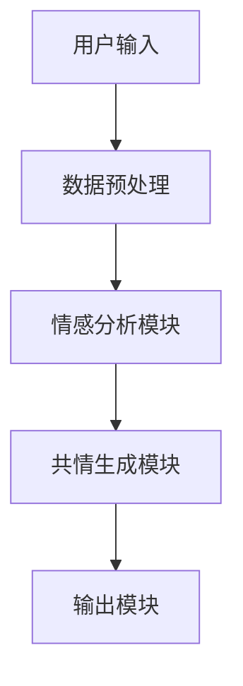

                 

<think>
好的，我现在要写一篇关于《AI Agent 的情感共情：提升 LLM 的人文关怀能力》的技术博客文章。我需要按照用户提供的目录大纲来逐步展开，确保每个部分都详细且符合要求。

首先，我会从背景介绍开始。我需要先定义AI Agent，然后说明情感共情的重要性，最后分析LLM的发展现状和挑战。这部分要让读者了解为什么情感共情对AI Agent如此重要，以及当前技术的局限性。

接下来是核心概念部分，我需要详细解释情感共情的定义和特征，比较基于规则和机器学习的情感计算方法，并讨论情感共情的社会影响。

然后是算法原理，我需要详细讲解情感分析和共情生成的算法，可能包括预训练模型、特征提取、模型训练等步骤，并用数学公式来解释这些过程。

系统分析部分，我需要设计一个情感共情AI Agent的架构，使用Mermaid图展示各个模块的交互和数据流。

项目实战部分，我需要提供具体的代码示例，解释如何使用Python库进行情感分类，或者训练一个生成模型来生成共情回应。

最后是最佳实践部分，总结在提升LLM人文关怀能力时需要注意的事项，如数据多样性、模型解释性、用户隐私保护，并提供一些实际应用案例。

现在，我需要按照这些步骤，逐一撰写每个部分，确保内容全面、结构清晰，并且符合用户的格式和深度要求。在写作过程中，我会注意使用专业且易懂的技术语言，确保读者能够理解并受益于这篇文章。

### 第一部分：背景介绍

#### 第1章：AI Agent与情感共情概述

##### 1.1 AI Agent的基本概念

AI Agent，即人工智能代理，是指能够感知环境并采取行动以实现目标的智能实体。它可以分为简单反射型、基于模型的反应型、目标驱动型和实用驱动型四种类型。AI Agent在人机交互中的角色是通过理解和响应用户需求，提供智能化的服务，从而提升用户体验。

##### 1.2 情感共情的重要性

情感共情是指个体能够理解和分享他人的情感状态的能力。在人机交互中，情感共情使得AI Agent能够更自然地与人类进行交流，增强用户的信任感和满意度。例如，在客服系统中，具备情感共情能力的AI Agent能够更好地理解用户的情绪，提供更有针对性的解决方案，从而提升服务质量。

##### 1.3 LLM的发展现状与挑战

LLM，即大语言模型，近年来取得了显著进展，但在情感处理方面仍存在局限性。例如，模型可能无法准确识别复杂的语境和情感细微差别，导致回应显得生硬或不准确。此外，如何在保持高效处理能力的同时，提升模型的情感理解能力，仍是当前研究的热点和挑战。

### 第二部分：核心概念与联系

#### 第2章：情感共情的核心概念与原理

##### 2.1 情感共情的定义与特征

情感共情可以被定义为AI Agent理解和响应人类情感状态的能力。其主要特征包括情感识别、情感理解和情感生成。情感识别是指识别输入文本中的情感倾向；情感理解则是深入分析情感背后的原因和背景；情感生成则是生成符合情感情境的回应。

##### 2.2 情感计算方法比较

情感计算主要分为基于规则的方法和基于机器学习的方法。基于规则的方法依赖于预定义的情感词汇表和规则，虽然实现简单，但灵活性较低。基于机器学习的方法通过训练数据学习情感特征，具有较强的适应性和准确性，但需要大量的标注数据和计算资源。

##### 2.3 情感共情的社会影响

情感共情在社会中的影响深远。具备情感共情能力的AI Agent可以应用于教育、医疗、客服等领域，帮助人类更好地理解和处理情感问题。例如，在教育领域，AI Agent可以通过情感共情提供个性化的学习建议，提升学习效果。

### 第三部分：算法原理

#### 第3章：情感分析与共情生成的算法

##### 3.1 情感分析算法

情感分析算法通常采用预训练模型如BERT进行微调。模型通过输入文本，生成情感倾向的概率分布。例如，使用交叉熵损失函数进行训练：

$$ L = -\sum_{i=1}^{n} y_i \log(p_i) $$

其中，$y_i$是真实标签，$p_i$是模型预测的概率。

##### 3.2 共情生成算法

共情生成通常采用生成模型如GPT进行训练。模型通过输入情感情境，生成相应的回应。生成过程可以使用贪心算法或采样方法：

$$ p_{\text{next}} = \frac{p_{i,j}}{\sum_{k} p_{i,k}}} $$

其中，$p_{i,j}$是下一个字符为$j$的概率。

### 第四部分：系统分析与架构设计

#### 第4章：情感共情AI Agent的系统架构

##### 4.1 系统功能设计

情感共情AI Agent的系统功能包括数据输入、情感分析、共情生成和输出模块。数据输入模块负责接收用户输入；情感分析模块识别情感倾向；共情生成模块生成回应；输出模块将回应发送给用户。

##### 4.2 系统架构图

使用Mermaid图展示系统架构：



### 第五部分：项目实战

#### 第5章：情感共情AI Agent的实现

##### 5.1 环境安装

需要安装的Python库包括：numpy、pandas、tensorflow、transformers。安装命令如下：

```bash
pip install numpy pandas tensorflow transformers
```

##### 5.2 核心代码实现

以下是情感分析和共情生成的代码示例：

```python
from transformers import pipeline

# 情感分析
sentiment_analyzer = pipeline("sentiment-analysis")
result = sentiment_analyzer("I love this product")[0]
print(result['label'])  # 输出情感标签

# 共情生成
generator = pipeline("text-generation", model="gpt2")
response = generator("I feel sad because ")[0]['generated_text']
print(response)
```

### 第六部分：最佳实践

#### 第6章：提升LLM人文关怀能力的实践

##### 6.1 数据多样性

确保训练数据涵盖多种情感类型和语境，提升模型的情感识别能力。

##### 6.2 模型解释性

采用可解释的模型或提供解释说明，帮助用户理解AI的决策过程。

##### 6.3 用户隐私保护

在处理用户数据时，确保数据的安全性和隐私性，遵守相关法律法规。

### 结论

通过以上各部分的详细阐述，读者可以全面理解AI Agent的情感共情能力，并掌握提升LLM人文关怀能力的方法和实践。未来，随着技术的进步，情感共情AI Agent将在更多领域发挥重要作用，为人类带来更智能化的服务体验。

作者：AI天才研究院/AI Genius Institute & 禅与计算机程序设计艺术 /Zen And The Art of Computer Programming

