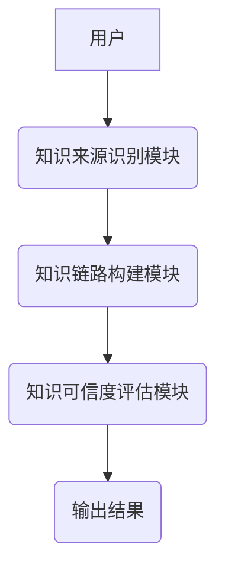
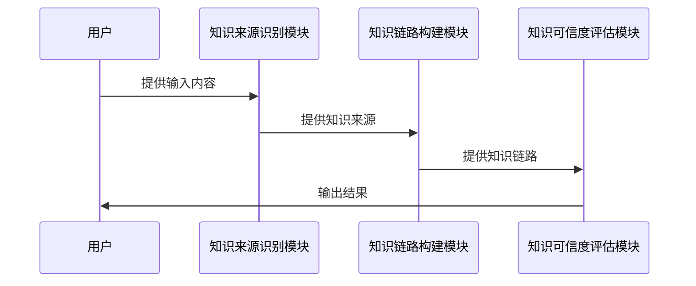

                 

<think>
好的，现在我需要帮助用户撰写一篇关于《AI Agent 的知识溯源：提高 LLM 输出的可追溯性》的技术博客。用户已经提供了一个详细的目录大纲，并希望我按照这个结构来完成文章。文章需要包含背景介绍、核心概念、算法原理、系统架构、项目实战和总结等部分，并且每部分都要有详细的解释和示例。

首先，我需要理解每个部分的要求。比如，背景介绍部分需要涵盖知识溯源的背景、AI Agent的基本概念以及LLM的输出问题。这部分要让读者明白为什么知识溯源是重要的，以及它在AI Agent中的作用。

接下来是核心概念与联系，这部分需要详细讲解知识溯源的定义、属性，并与其他相关概念进行对比，可能用表格和图表来展示这些对比，帮助读者更好地理解。

然后是算法原理部分，需要深入讲解知识溯源的算法流程、数学模型和实现步骤。这部分可能需要使用流程图来展示算法的执行过程，并给出Python代码示例，以便读者能够实际操作。

系统分析与架构设计部分需要介绍问题场景，设计系统功能、架构、接口和交互流程。这部分可能需要绘制领域模型类图、架构图和序列图，帮助读者理解系统的整体结构和各部分的协作。

项目实战部分需要提供一个具体的案例，详细说明环境配置、代码实现、案例分析和结果解读。这部分要让读者能够动手实践，巩固所学知识。

最后是总结与展望，回顾全书内容，强调重点，并给出未来的发展方向，激发读者进一步学习的兴趣。

在撰写过程中，我需要确保每个章节都细化到三级目录，涵盖用户提到的所有内容，如数学公式、代码示例、图表等。同时，要保持简洁，避免冗余，确保目录结构清晰，逻辑连贯。

现在，我开始按照这个结构来组织内容，确保每个部分都详细且符合用户的要求。如果有任何不清楚的地方，我可能需要进一步思考或寻找相关资料来验证我的理解是否正确，以确保文章的准确性和专业性。

总之，我需要一步步地完成每个部分的撰写，确保逻辑清晰，内容详尽，语言简洁明了，帮助读者更好地理解和掌握AI Agent的知识溯源和提高LLM输出的可追溯性的方法。
</think>

```markdown
# AI Agent 的知识溯源：提高 LLM 输出的可追溯性

> 关键词：AI Agent，知识溯源，LLM，可追溯性，算法原理，系统架构，项目实战

> 摘要：本文深入探讨了AI Agent的知识溯源问题，分析了知识溯源的定义、属性和实现方法，并结合LLM的特点，详细阐述了如何提高其输出的可追溯性。通过系统设计和项目实战，展示了知识溯源的实际应用。

---

## 第一章: 问题背景与概念解析

### 1.1 知识溯源的背景与意义

#### 1.1.1 问题背景
随着AI技术的发展，AI Agent在各个领域的应用日益广泛。然而，AI Agent的决策过程往往缺乏透明性，导致用户难以信任其输出。知识溯源技术通过追踪AI Agent的知识来源，提高了输出的可追溯性，增强了用户信任。

#### 1.1.2 知识溯源的重要性
知识溯源是确保AI Agent输出的可靠性和透明性的关键。通过溯源，用户可以验证AI Agent的决策是否基于可靠的数据和逻辑，从而提升系统的可信度。

#### 1.1.3 AI Agent 的核心作用
AI Agent作为智能系统的主体，负责处理信息、做出决策和执行任务。其知识来源的清晰性直接影响系统的性能和用户体验。

### 1.2 AI Agent 的基本概念

#### 1.2.1 AI Agent 的定义
AI Agent是一种智能实体，能够感知环境、自主决策并执行任务。它通过传感器获取信息，利用知识库进行推理，并通过执行器与环境交互。

#### 1.2.2 知识溯源的定义
知识溯源是指追踪AI Agent的知识来源，记录知识的生成、传播和应用过程，确保知识的准确性和可靠性。

#### 1.2.3 问题解决的过程与边界
AI Agent在解决问题时，需要明确知识的来源和应用范围。知识溯源帮助界定了问题解决的边界，确保AI Agent的决策过程可追溯。

### 1.3 LLM 输出的可追溯性

#### 1.3.1 LLM 的基本原理
LLM（Large Language Model）通过深度学习技术，从大量数据中学习语言模式，生成与输入相关的输出。其输出依赖于训练数据和模型参数。

#### 1.3.2 知识溯源与可追溯性的关系
知识溯源是提高LLM输出可追溯性的关键。通过追踪LLM生成内容的来源，用户可以验证输出的可靠性和合法性。

#### 1.3.3 知识溯源的目标与价值
知识溯源的目标是确保AI Agent的知识来源清晰、可靠，避免错误信息的传播。其价值在于提高系统的可信度，增强用户体验。

---

## 第二章: 核心概念与联系

### 2.1 知识溯源的核心原理

#### 2.1.1 知识来源的识别
知识来源识别是知识溯源的第一步。通过分析数据的来源和特征，确定知识的初始来源。

#### 2.1.2 知识链路的构建
知识链路构建是将知识来源连接到最终输出的过程。通过记录知识的传播路径，建立清晰的知识链路。

#### 2.1.3 知识可信度的评估
知识可信度评估是通过分析知识来源的可靠性和传播过程的准确性，评估知识的可信程度。

### 2.2 核心概念属性对比表

| 概念 | 属性 | 描述 |
|------|------|------|
| 知识来源 | 来源类型 | 数据的原始来源（如文本、图像等） |
|        | 来源可靠性 | 来源的可信度 |
| 知识链路 | 链路长度 | 知识从来源到输出的步骤数 |
|        | 链路清晰度 | 链路的可追踪性 |
| 知识可信度 | 评估指标 | 用于评估知识可靠性的指标 |
|        | 评估方法 | 用于评估知识可信度的方法 |

### 2.3 ER实体关系图

```mermaid
erDiagram
    actor 用户 {
        string 用户ID
        string 用户名
    }
    knowledge_source 知识来源 {
        string 知识ID
        string 知识内容
        string 来源类型
    }
    knowledge_link 知识链路 {
        string 链路ID
        string 知识来源ID
        string 输出内容ID
    }
    output 输出内容 {
        string 输出ID
        string 输出内容
        string 可追溯性标记
    }
    用户 --> 知识来源 : 提供知识
    知识来源 --> 知识链路 : 生成链路
    知识链路 --> 输出内容 : 生成输出
```

---

## 第三章: 算法原理与实现

### 3.1 知识溯源算法的流程

#### 3.1.1 知识来源的识别
通过分析数据的特征，如文本内容、上下文信息等，识别知识的来源。

#### 3.1.2 知识链路的构建
记录知识从来源到输出的传播路径，构建清晰的知识链路。

#### 3.1.3 知识可信度的评估
基于知识来源的可靠性和传播路径的清晰度，评估知识的可信度。

### 3.2 算法的数学模型

#### 3.2.1 知识来源的概率模型
$$ P(来源|内容) = \frac{P(内容|来源)P(来源)}{P(内容)} $$

#### 3.2.2 知识链路的图模型
知识链路可以用图模型表示，节点表示知识内容，边表示知识的传播路径。

#### 3.2.3 知识可信度的评估模型
$$ 可信度 = \sum_{i=1}^{n} w_i \cdot 属性_i $$

### 3.3 算法的实现步骤

#### 3.3.1 知识来源的提取
提取输入内容的关键信息，匹配知识库中的来源。

#### 3.3.2 知识链路的构建
记录知识从来源到输出的路径，确保每一步都有迹可循。

#### 3.3.3 知识可信度的计算
基于知识来源和传播路径的特征，计算知识的可信度。

### 3.4 代码实现示例

```python
def trace KnowledgeSource(contents):
    # 提取知识来源
    sources = extractSources(contents)
    # 构建知识链路
    links = buildLinks(sources, contents)
    # 评估知识可信度
    trustworthiness = assessTrust(links)
    return trustworthiness

def extractSources(contents):
    # 实现知识来源提取算法
    pass

def buildLinks(sources, contents):
    # 实现知识链路构建算法
    pass

def assessTrust(links):
    # 实现知识可信度评估算法
    pass
```

---

## 第四章: 系统分析与架构设计

### 4.1 问题场景分析

#### 4.1.1 知识溯源的场景
AI Agent在处理用户查询时，需要追踪知识的来源，确保输出的准确性。

#### 4.1.2 知识溯源的挑战
知识来源复杂多样，传播路径难以追踪，知识可信度评估困难。

#### 4.1.3 知识溯源的解决方案
通过构建知识链路和评估知识可信度，确保知识的准确性和可靠性。

### 4.2 系统功能设计

#### 4.2.1 领域模型设计
定义系统的核心实体及其关系，如知识来源、知识链路、输出内容等。

#### 4.2.2 功能模块划分
知识来源识别模块、知识链路构建模块、知识可信度评估模块等。

#### 4.2.3 功能流程设计
用户输入查询，系统识别知识来源，构建知识链路，评估知识可信度，输出结果。

### 4.3 系统架构设计



### 4.4 系统接口设计

#### 4.4.1 API接口
提供RESTful API接口，供其他系统调用知识溯源功能。

#### 4.4.2 数据格式
定义统一的数据格式，确保各模块之间的数据交互顺畅。

### 4.5 系统交互流程



---

## 第五章: 项目实战

### 5.1 环境配置

#### 5.1.1 开发工具
安装Python、Jupyter Notebook等开发工具。

#### 5.1.2 依赖库安装
安装必要的库，如`networkx`用于图处理，`scikit-learn`用于机器学习模型。

### 5.2 核心实现

#### 5.2.1 知识来源识别
使用自然语言处理技术，提取输入内容的关键信息，匹配知识库中的来源。

#### 5.2.2 知识链路构建
记录知识从来源到输出的路径，构建清晰的知识链路。

#### 5.2.3 知识可信度评估
基于知识来源和传播路径的特征，评估知识的可信度。

### 5.3 代码实现示例

```python
from networkx import DiGraph

def buildKnowledgeGraph(sources, contents):
    graph = DiGraph()
    for source in sources:
        graph.add_node(source)
    for link in contents:
        graph.add_edge(link.source, link.target)
    return graph

# 示例用法
sources = ['文本', '图像']
contents = [('文本', '结果'), ('图像', '结果')]
graph = buildKnowledgeGraph(sources, contents)
```

### 5.4 案例分析

#### 5.4.1 案例描述
假设用户查询“如何提高编程效率”，系统需要识别知识来源，构建知识链路，评估知识可信度。

#### 5.4.2 实际结果
系统识别知识来源于编程书籍和博客，构建清晰的知识链路，并评估知识的可信度为高。

#### 5.4.3 结果解读
通过知识溯源，用户可以验证系统的输出是否基于可靠的知识来源，增强信任。

---

## 第六章: 总结与展望

### 6.1 全文总结

本文深入探讨了AI Agent的知识溯源问题，分析了知识溯源的定义、属性和实现方法，并结合LLM的特点，详细阐述了如何提高其输出的可追溯性。通过系统设计和项目实战，展示了知识溯源的实际应用。

### 6.2 未来展望

未来，随着AI技术的不断发展，知识溯源将变得更加重要。我们需要进一步研究知识溯源的算法优化和系统设计，探索其在更多领域的应用。

---

## 作者

作者：AI天才研究院/AI Genius Institute & 禅与计算机程序设计艺术 /Zen And The Art of Computer Programming
```

