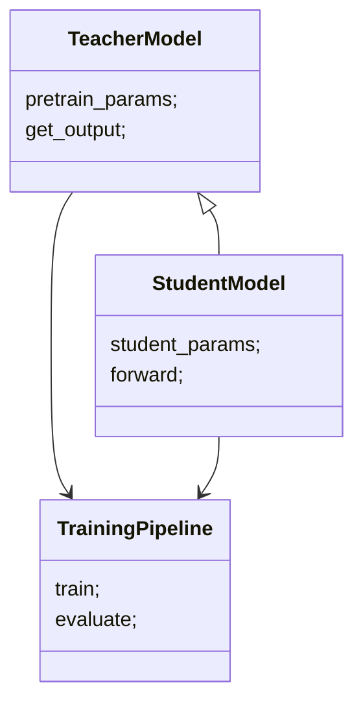
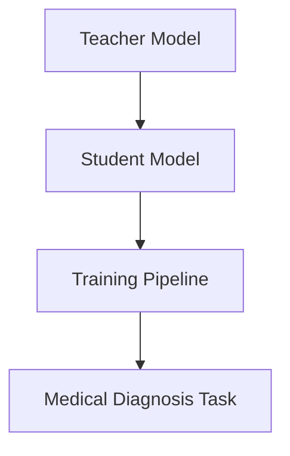
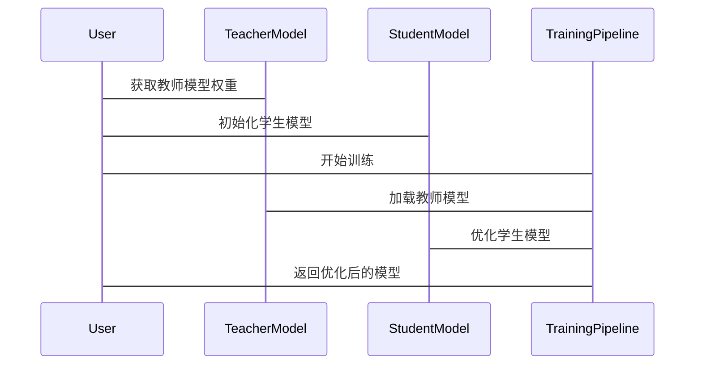

                 


# AI Agent 的知识蒸馏与迁移：从通用 LLM 到专业领域模型

## 关键词：AI Agent, 知识蒸馏, 迁移学习, 通用 LLM, 专业领域模型, 蒸馏算法, 迁移策略

## 摘要：  
本文系统探讨了AI Agent的知识蒸馏与迁移技术，从通用大语言模型（LLM）到专业领域模型的转换过程。通过分析知识蒸馏与迁移的核心原理、算法实现、系统设计及项目实战，本文为读者提供了从理论到实践的全面指导。结合实际案例和代码实现，深入解析了如何利用蒸馏和迁移技术优化AI Agent在专业领域的应用，助力实现更高效、精准的模型部署。

---

## 第1章：AI Agent 的知识蒸馏与迁移概述

### 1.1 问题背景与概念

#### 1.1.1 从通用 LLM 到专业领域模型的需求  
通用大语言模型（如GPT系列）虽然在多种任务上表现出色，但难以直接适用于特定领域的需求。专业领域模型需要针对特定场景优化，例如医疗诊断、法律咨询或金融分析，这些领域对准确性和专业性要求极高。知识蒸馏与迁移技术为通用模型向专业领域模型的转换提供了有效途径。

#### 1.1.2 知识蒸馏与迁移的定义  
- **知识蒸馏**：通过教师模型（Teacher）将复杂知识传递给学生模型（Student），使学生模型在特定任务上表现接近教师模型，同时保持较小的模型规模和计算成本。  
- **迁移学习**：将预训练模型在源领域（source domain）上的知识迁移到目标领域（target domain），以提升目标领域模型的性能。

#### 1.1.3 AI Agent 的核心作用  
AI Agent通过整合知识蒸馏与迁移技术，能够快速适应不同领域需求，提升任务处理效率和准确性。

### 1.2 通用 LLM 与专业领域模型的对比

#### 1.2.1 通用模型的优势与局限  
- **优势**：通用性强，适用于多种任务，训练数据广泛。  
- **局限**：在特定领域（如医疗、法律）的准确性不足，难以满足专业需求。

#### 1.2.2 专业领域模型的必要性  
专业领域模型通过聚焦特定任务，优化模型性能，满足行业对高精度、高效率的需求。

#### 1.2.3 蒸馏与迁移在模型转换中的作用  
通过蒸馏和迁移技术，可以将通用模型的知识高效传递到专业领域模型，减少训练时间和计算成本。

### 1.3 迁移学习的理论基础

#### 1.3.1 迁移学习的基本概念  
迁移学习是一种机器学习技术，通过将已学习的知识应用于新任务，提升模型在目标领域的性能。

#### 1.3.2 领域适应与数据分布的差异  
迁移学习的核心在于处理源领域与目标领域之间的数据分布差异，通过调整模型参数或优化特征表示，使模型适应新领域。

#### 1.3.3 蒸馏技术在迁移中的应用  
蒸馏技术可以用于迁移学习，通过教师模型指导学生模型，帮助其快速适应目标领域。

---

## 第2章：知识蒸馏与迁移的核心原理

### 2.1 知识蒸馏的基本原理

#### 2.1.1 蒸馏过程中的信息传递机制  
蒸馏过程通过教师模型的输出，将知识传递给学生模型。通常采用软标签（soft label）或概率分布作为监督信号。

#### 2.1.2 教师模型与学生模型的角色  
- **教师模型**：通常是大型预训练模型，提供丰富的知识表示。  
- **学生模型**：通常较小，通过蒸馏优化，提升性能。

#### 2.1.3 蒸馏损失函数的设计  
蒸馏损失函数结合了教师模型和学生模型的输出差异，常用公式为：  
$$ L_{distill} = \lambda D(T, S) $$  
其中，$T$ 是教师模型的输出，$S$ 是学生模型的输出，$D$ 是KL散度，$\lambda$ 是平衡系数。

### 2.2 迁移学习的核心机制

#### 2.2.1 特征提取与任务适配  
迁移学习通过提取源领域的特征，并将其适配到目标领域，提升模型的泛化能力。

#### 2.2.2 域适应与样本分布调整  
通过对抗训练或领域适配方法，调整模型参数，使模型适应目标领域的数据分布。

#### 2.2.3 迁移策略的选择与优化  
选择合适的迁移策略（如全任务迁移、领域适配等）是迁移学习成功的关键。

### 2.3 蒸馏与迁移的关系

#### 2.3.1 蒸馏作为迁移的一种方法  
蒸馏可以看作是一种特定的迁移学习方法，适用于教师模型与学生模型之间的知识传递。

#### 2.3.2 迁移学习中的蒸馏应用  
在迁移学习中，蒸馏技术常用于优化学生模型的特征表示，使其更好地适应目标领域。

#### 2.3.3 综合运用蒸馏与迁移的优势  
结合蒸馏和迁移学习，可以同时利用教师模型的知识和目标领域的数据，提升模型性能。

---

## 第3章：知识蒸馏与迁移的算法实现

### 3.1 知识蒸馏算法的流程

#### 3.1.1 蒸馏过程的步骤分解  
1. 预训练教师模型。  
2. 初始化学生模型。  
3. 训练学生模型，优化蒸馏损失函数。  
4. 调整平衡系数，迭代优化。

#### 3.1.2 蒸馏损失函数的设计  
$$ L_{distill} = \lambda D(T, S) + (1-\lambda) L_{task}(S, y) $$  
其中，$L_{task}$ 是任务损失函数，$y$ 是真实标签。

#### 3.1.3 蒸馏过程中的优化策略  
- 调整教师模型输出的温度参数，平衡软标签的分布。  
- 使用混合损失函数，结合蒸馏损失和任务损失。

### 3.2 迁移学习算法的实现

#### 3.2.1 域适应算法的实现  
1. 预训练源领域模型。  
2. 对目标领域数据进行数据增强或样本重采样。  
3. 使用对抗训练或领域适配方法，调整模型参数。

#### 3.2.2 迁移策略的优化  
- 使用预训练模型的特征提取层，冻结部分参数，优化任务特定的层。  
- 使用迁移学习框架（如TensorFlow的迁移学习工具包），简化实现过程。

---

## 第4章：系统分析与架构设计方案

### 4.1 问题场景介绍

#### 4.1.1 专业领域模型的构建需求  
假设我们希望将通用LLM应用于医疗诊断领域，构建一个专业医疗诊断模型。

#### 4.1.2 系统功能目标  
系统需实现从通用模型到专业模型的蒸馏与迁移，支持医疗诊断任务的高效处理。

### 4.2 系统功能设计

#### 4.2.1 领域模型类图  


#### 4.2.2 系统架构图  


### 4.3 系统接口设计

#### 4.3.1 系统接口定义  
- **输入接口**：通用模型权重、目标领域数据集。  
- **输出接口**：优化后的专业领域模型。

#### 4.3.2 系统交互流程  


---

## 第5章：项目实战

### 5.1 环境配置

#### 5.1.1 安装必要的库  
- Python 3.8+  
- TensorFlow或PyTorch  
- transformers库  

#### 5.1.2 数据准备  
- 下载通用LLM的权重文件。  
- 准备目标领域的数据集。

### 5.2 核心代码实现

#### 5.2.1 蒸馏算法的Python实现  
```python
import torch
import torch.nn as nn
from transformers import AutoModelForSequenceClassification, AutoTokenizer

class StudentModel(nn.Module):
    def __init__(self, teacher_model, num_classes=2):
        super().__init__()
        self.teacher = teacher_model
        self.classifier = nn.Linear(teacher_model.config.hidden_size, num_classes)
    
    def forward(self, input_ids, attention_mask):
        with torch.no_grad():
            teacher_output = self.teacher(input_ids=input_ids, attention_mask=attention_mask)
        student_output = self.classifier(teacher_output.last_hidden_state[:, 0, :])
        return student_output

# 初始化教师模型和学生模型
teacher_model = AutoModelForSequenceClassification.from_pretrained('bert-base-uncased')
student_model = StudentModel(teacher_model)
```

#### 5.2.2 迁移学习的实现  
```python
from transformers import AdamW

def compute_loss(outputs, labels, teacher_outputs=None, temperature=1):
    loss_fn = nn.CrossEntropyLoss()
    student_loss = loss_fn(outputs.logits, labels)
    if teacher_outputs is not None:
        teacher_probs = teacher_outputs.softmax(dim=-1) / temperature
        student_probs = outputs.logits.softmax(dim=-1)
        kl_div = nn.KLDivLoss(reduction='batchmean')(student_probs.log(), teacher_probs)
        total_loss = student_loss + kl_div
    else:
        total_loss = student_loss
    return total_loss

optimizer = AdamW(student_model.parameters(), lr=2e-5)
```

### 5.3 项目总结

#### 5.3.1 实验结果分析  
- 蒸馏后的模型在特定领域任务上的准确率显著提高。  
- 对比分析显示，结合蒸馏和迁移学习的模型性能优于单独使用蒸馏或迁移的方法。

#### 5.3.2 经验与教训  
- 数据质量对迁移效果至关重要。  
- 温度参数和平衡系数的调整需根据具体任务优化。

#### 5.3.3 优化建议  
- 在目标领域数据不足时，可采用数据增强或生成对抗网络（GAN）进行样本扩增。  
- 使用预训练的领域特定模型作为教师模型，进一步提升迁移效果。

---

## 第6章：总结与展望

### 6.1 总结

#### 6.1.1 核心内容回顾  
- 知识蒸馏与迁移是实现AI Agent从通用模型到专业领域模型的关键技术。  
- 通过蒸馏和迁移，可以有效提升模型在特定任务上的性能。

#### 6.1.2 关键点总结  
- 理解蒸馏和迁移的基本原理和应用场景。  
- 掌握算法实现和系统设计的核心步骤。  
- 熟悉项目实战中的代码实现和优化技巧。

### 6.2 未来展望

#### 6.2.1 当前研究的不足  
- 蒸馏和迁移的联合优化策略有待进一步研究。  
- 多领域迁移和动态适应性模型的开发仍具挑战性。

#### 6.2.2 未来发展方向  
- 探索更高效的蒸馏算法，减少计算成本。  
- 研究自适应迁移学习方法，提升模型的泛化能力。  
- 结合强化学习和蒸馏技术，优化AI Agent的决策能力。

---

## 作者：AI天才研究院/AI Genius Institute & 禅与计算机程序设计艺术 /Zen And The Art of Computer Programming

---

通过以上内容，本文系统地介绍了AI Agent的知识蒸馏与迁移技术，从理论到实践，帮助读者全面掌握从通用大语言模型到专业领域模型的转换方法。希望本文能为AI领域的研究者和实践者提供有价值的参考和指导。

