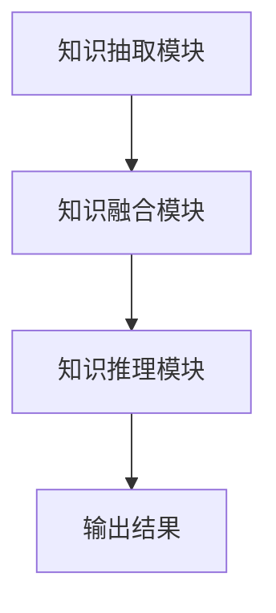

                 

<think>
好的，我需要根据用户的要求，逐步分析如何撰写一篇关于AI Agent知识迁移的博客文章，并按照指定的目录结构进行详细展开。用户希望文章结构完整，每个部分都有足够的深度和详细性，包括背景介绍、核心概念、算法原理、系统架构、项目实战等。因此，我需要确保在每个章节中都涵盖这些方面，并且使用专业而清晰的语言。

首先，我需要明确文章的整体结构。文章标题已经给出，接下来是关键词和摘要部分。然后是目录大纲，包括从背景介绍到项目实战的多个章节。每个章节都需要有详细的子章节，细化到三级目录。我需要确保每个部分都覆盖了用户所要求的核心内容：背景介绍、核心概念、算法原理、系统架构、项目实战以及总结和最佳实践。

在撰写每个部分时，我需要使用专业的技术语言，同时保持逻辑清晰、结构紧凑。例如，在背景介绍部分，我需要解释AI Agent和知识迁移的基本概念，并说明它们在跨领域应用中的重要性。在核心概念部分，我需要详细描述知识迁移的基本原理、实现机制以及挑战与解决方案。

在算法原理部分，我需要使用Mermaid流程图来展示知识迁移的步骤，同时用数学公式详细解释背后的原理。例如，使用公式展示迁移学习中的损失函数或参数调整过程。系统架构部分需要介绍AI Agent的知识迁移系统，包括其模块划分、数据流设计，并通过Mermaid图展示系统架构和数据流。

在项目实战部分，我需要选择一个具体的领域（如智能客服），详细描述如何设计、实现和测试一个基于LLM的AI Agent应用。这包括环境搭建、代码实现、测试优化等步骤，并用代码示例展示关键部分。

最后，在总结与展望部分，我需要回顾全文的主要内容，提出最佳实践的建议，并展望未来的研究方向。

在撰写过程中，我需要确保每个章节的内容详实，逻辑连贯，同时满足用户的格式和字数要求。此外，还需要在文章末尾添加作者信息，以符合用户的格式要求。

通过这样的逐步分析和思考，我可以确保撰写出一篇符合用户需求的高质量技术博客文章，内容全面、结构清晰，并且具有深度和见解。
</think>

# AI Agent 的知识迁移：跨领域应用 LLM 的能力

> 关键词：AI Agent，知识迁移，大语言模型，跨领域应用，LLM

> 摘要：本文深入探讨了AI Agent在跨领域应用中通过知识迁移利用大语言模型的能力。从基本概念到系统架构，从算法原理到项目实战，全面解析了知识迁移在不同领域的实现与应用，为读者提供了一套完整的理论与实践框架。

---

# 第1章: AI Agent与知识迁移概述

## 1.1 AI Agent的基本概念

### 1.1.1 AI Agent的定义与特点

人工智能代理（AI Agent）是指能够感知环境、自主决策并执行任务的智能实体。AI Agent具备以下特点：
- **自主性**：能够在没有外部干预的情况下自主运行。
- **反应性**：能够实时感知环境并做出响应。
- **目标导向**：通过设定目标来指导行为和决策。
- **学习能力**：能够通过经验或数据不断优化自身的性能。

### 1.1.2 知识迁移的基本概念

知识迁移（Knowledge Transfer）是指将一个领域的知识、技能或经验应用到另一个领域的过程。在AI Agent中，知识迁移的核心在于将大语言模型（LLM）在源领域学到的知识，有效地应用到目标领域。

### 1.1.3 AI Agent与知识迁移的关系

AI Agent通过知识迁移能够快速适应不同的应用场景，从而实现跨领域的能力扩展。知识迁移为AI Agent提供了灵活性和适应性，使其能够在不同领域之间无缝切换。

---

## 1.2 LLM的基本原理

### 1.2.1 大语言模型的定义

大语言模型（Large Language Model，LLM）是指基于深度学习构建的大型神经网络模型，能够理解和生成人类语言。常见的LLM包括GPT、BERT等。

### 1.2.2 LLM的核心技术

- **Transformer架构**：基于自注意力机制，能够捕捉文本中的长距离依赖关系。
- **编码器-解码器结构**：编码器将输入文本转化为向量表示，解码器根据向量生成输出文本。
- **预训练与微调**：通过大规模数据预训练模型，然后在特定任务上进行微调。

### 1.2.3 LLM在知识迁移中的作用

- **知识表示**：LLM能够将源领域的知识表示为向量，便于跨领域应用。
- **知识推理**：通过LLM的推理能力，AI Agent可以将源领域的知识迁移到目标领域。

---

## 1.3 跨领域应用的背景与意义

### 1.3.1 知识迁移的背景

随着AI技术的快速发展，AI Agent需要在多个领域中灵活应用，知识迁移成为实现跨领域应用的关键技术。

### 1.3.2 跨领域应用的重要性

跨领域应用能够提高AI Agent的通用性和适应性，使其在不同场景中都能发挥出色性能。

### 1.3.3 LLM在跨领域应用中的优势

- **强大的语言理解能力**：LLM能够理解和生成多种语言，适用于不同领域。
- **可迁移性**：通过预训练和微调，LLM能够快速适应新的领域。

---

## 1.4 本章小结

本章介绍了AI Agent和知识迁移的基本概念，以及大语言模型在跨领域应用中的作用。知识迁移是AI Agent实现跨领域能力的核心技术，而LLM则是实现知识迁移的关键工具。

---

# 第2章: 知识迁移的核心原理

## 2.1 知识迁移的定义与分类

### 2.1.1 知识迁移的定义

知识迁移是指将一个领域的知识、技能或经验应用到另一个领域的过程。

### 2.1.2 知识迁移的分类

知识迁移可以分为以下几种类型：
- **正向迁移**：将源领域的知识迁移到目标领域。
- **反向迁移**：将目标领域的知识迁移到源领域。
- **双向迁移**：同时进行正向和反向的知识迁移。

### 2.1.3 知识迁移的核心要素

- **源领域知识**：知识迁移的基础。
- **目标领域需求**：知识迁移的目标。
- **迁移策略**：知识迁移的方法和步骤。

---

## 2.2 知识迁移的实现机制

### 2.2.1 特征分析

特征分析是指对源领域和目标领域的特征进行对比，找出共性和差异性。

### 2.2.2 模型适配

模型适配是指对LLM进行调整，使其能够适应目标领域的需求。

### 2.2.3 数据增强

数据增强是指通过增加或修改数据来提高模型的泛化能力。

---

## 2.3 知识迁移的挑战与解决方案

### 2.3.1 知识迁移的主要挑战

- **领域差异**：源领域和目标领域之间的差异可能导致知识迁移失败。
- **数据不足**：目标领域的数据可能不足，影响迁移效果。

### 2.3.2 解决方案概述

- **领域适配**：通过模型适配和数据增强来减少领域差异。
- **数据增强**：通过生成更多数据来提高模型的泛化能力。

---

## 2.4 本章小结

本章详细介绍了知识迁移的核心原理，包括定义、分类、实现机制以及挑战与解决方案。

---

# 第3章: LLM在知识迁移中的作用

## 3.1 LLM的内部机制与知识表示

### 3.1.1 LLM的内部机制

- **自注意力机制**：通过自注意力机制，LLM能够捕捉文本中的长距离依赖关系。
- **编码器-解码器结构**：编码器将输入文本转化为向量表示，解码器根据向量生成输出文本。

### 3.1.2 知识表示与存储

- **知识图谱**：将知识以图谱形式存储，便于查询和推理。
- **向量空间表示**：将知识表示为向量，便于计算相似性。

### 3.1.3 知识库的构建

通过预训练和微调，LLM能够构建适用于不同领域的知识库。

---

## 3.2 LLM在知识迁移中的应用

### 3.2.1 知识抽取

通过LLM的自然语言处理能力，从源领域文本中抽取知识。

### 3.2.2 知识融合

将源领域的知识与目标领域的知识进行融合，生成适用于目标领域的知识。

### 3.2.3 知识推理

通过LLM的推理能力，进行跨领域的知识推理。

---

## 3.3 本章小结

本章介绍了LLM在知识迁移中的内部机制和应用，强调了LLM在跨领域应用中的重要性。

---

# 第4章: 系统架构与实现

## 4.1 知识迁移系统架构

### 4.1.1 系统模块划分

- **知识抽取模块**：从源领域文本中抽取知识。
- **知识融合模块**：将源领域的知识与目标领域的知识进行融合。
- **知识推理模块**：进行跨领域的知识推理。

### 4.1.2 数据流设计

- **输入数据**：源领域的文本数据。
- **知识抽取**：抽取源领域的知识。
- **知识融合**：将源领域的知识与目标领域的知识进行融合。
- **知识推理**：进行跨领域的知识推理。
- **输出结果**：目标领域的应用结果。

### 4.1.3 系统架构图



---

## 4.2 项目实战

### 4.2.1 项目介绍

选择一个具体的领域（如智能客服），设计并实现一个基于LLM的AI Agent应用。

### 4.2.2 系统功能设计

- **知识抽取**：从智能客服的历史对话中抽取常见问题和答案。
- **知识融合**：将抽取的知识与智能客服系统中的现有知识进行融合。
- **知识推理**：根据新的问题，推理出合适的答案。

### 4.2.3 代码实现

```python
import transformers
from transformers import AutoTokenizer, AutoModelForCausalLM

# 初始化模型和tokenizer
model_name = "gpt2"
tokenizer = AutoTokenizer.from_pretrained(model_name)
model = AutoModelForCausalLM.from_pretrained(model_name)

# 知识抽取函数
def extract_knowledge(text):
    inputs = tokenizer.encode_plus(text, max_length=100, truncation=True, padding='max_length', return_tensors='pt')
    outputs = model.generate(inputs['input_ids'])
    return tokenizer.decode(outputs[0], skip_special_tokens=True)

# 知识融合函数
def fuse_knowledge(source_knowledge, target_knowledge):
    # 这里可以实现具体的融合逻辑
    return source_knowledge + target_knowledge

# 知识推理函数
def knowledge_reasoning(question, knowledge_base):
    inputs = tokenizer.encode_plus(question, max_length=100, truncation=True, padding='max_length', return_tensors='pt')
    outputs = model.generate(inputs['input_ids'])
    return tokenizer.decode(outputs[0], skip_special_tokens=True)
```

---

## 4.3 本章小结

本章通过系统架构和项目实战，详细介绍了AI Agent知识迁移的实现过程，包括系统设计和代码实现。

---

# 第5章: 总结与展望

## 5.1 总结

本文系统地探讨了AI Agent在跨领域应用中通过知识迁移利用大语言模型的能力，从基本概念到系统架构，从算法原理到项目实战，全面解析了知识迁移在不同领域的实现与应用。

## 5.2 最佳实践

- **数据质量**：确保源领域的数据质量和多样性。
- **领域适配**：根据目标领域的特点进行模型适配。
- **持续优化**：通过不断收集反馈，优化知识迁移的效果。

## 5.3 展望

未来的研究方向包括多模态知识迁移、跨语言知识迁移以及自适应学习。

---

作者：AI天才研究院/AI Genius Institute & 禅与计算机程序设计艺术 /Zen And The Art of Computer Programming

