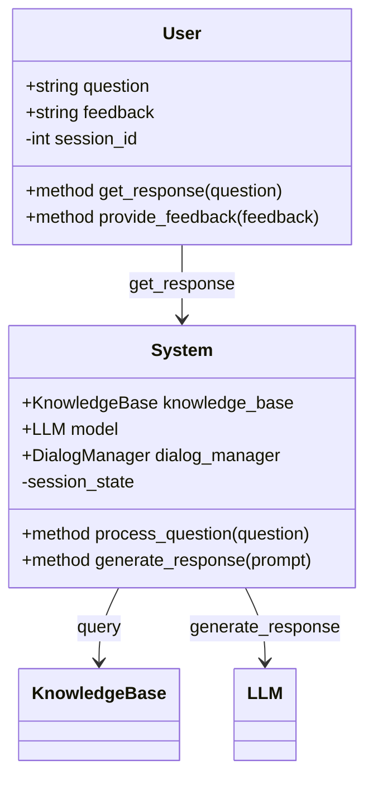
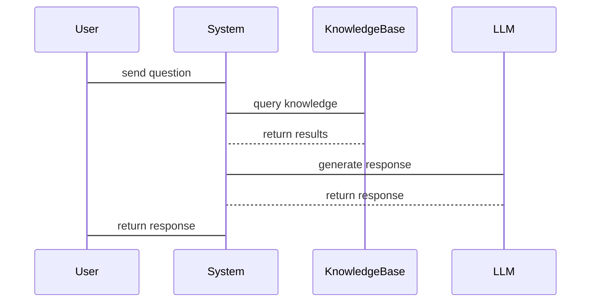

                 

<think>
嗯，我现在需要按照用户的要求，撰写一篇关于“AI Agent 的知识问答：构建基于 LLM 的智能问答系统”的技术博客文章。首先，我得理解用户的需求。用户希望我以一个世界级专家的身份，用清晰、专业的技术语言，一步一步地分析和推理，构建一个基于大语言模型的智能问答系统。

好，我先从文章的结构开始考虑。用户已经提供了详细的目录大纲，我需要按照这个大纲来组织内容。首先，我得明确每章的核心内容，然后逐步展开。

首先，第一部分是AI Agent的基础知识。我需要介绍AI Agent的基本概念、分类以及大语言模型的基本原理。这部分要让读者理解什么是AI Agent，以及大模型在问答系统中的作用。

接下来是第二部分，详细讲解智能问答系统的核心概念与架构设计。我需要分析问答系统的主要功能模块，比如自然语言理解、对话管理、自然语言生成等。同时，还需要设计系统的架构图，展示各个模块之间的交互关系。

第三部分是算法实现，这部分需要详细讲解大模型的训练和推理过程。我得用Mermaid图展示算法流程，并提供Python代码示例。数学公式也要用Latex格式展示，确保内容准确且易于理解。

第四部分是系统分析与架构设计，这部分需要介绍系统的功能模块、架构设计、接口设计和交互流程。可能需要绘制类图和序列图，帮助读者理解系统内部的工作原理。

第五部分是项目实战，我需要指导读者如何安装环境、实现核心功能、分析案例并总结项目经验。这部分要提供具体的代码示例和实际应用案例，让读者能够动手实践。

最后是最佳实践和小结，总结全书内容，给出一些注意事项和未来的发展方向，帮助读者在实际应用中避免误区，并了解技术的前沿动态。

在写作过程中，我需要确保每部分内容详细且逻辑清晰，同时使用专业但易懂的语言。对于关键概念，如数学公式和算法流程，我需要仔细推导并用图表辅助说明，确保读者能够深入理解。

现在，我需要按照目录大纲逐步填充内容，确保每一章节都有足够的细节，涵盖用户提到的各个方面。同时，要注意文章的结构和流畅性，使整篇文章读起来连贯且有深度。

总之，我需要系统地组织内容，从基础到进阶，逐步引导读者掌握构建基于大模型的智能问答系统的方法和技巧。确保每部分内容详实，结构合理，语言专业，同时具备实际的应用价值。
</think>

# AI Agent 的知识问答：构建基于 LLM 的智能问答系统

> 关键词：AI Agent, 大语言模型, 智能问答系统, 自然语言处理, 对话生成, 系统架构

> 摘要：本文详细介绍了如何利用大语言模型（LLM）构建智能问答系统，从AI Agent的基本概念到系统架构设计，再到算法实现和项目实战，全面解析了构建基于LLM的智能问答系统的全过程。

---

## 第一部分: AI Agent 的基础知识

### 第1章: AI Agent 的核心概念与技术背景

#### 1.1 AI Agent 的定义与分类

##### 1.1.1 什么是 AI Agent
AI Agent（人工智能代理）是指能够感知环境并采取行动以实现目标的智能体。AI Agent 可以是软件程序、机器人或其他智能系统，其核心目标是通过与用户的交互或环境的交互来完成特定任务。

##### 1.1.2 AI Agent 的主要分类
AI Agent 可以分为以下几类：
1. **简单反射型 Agent**：基于固定的规则对输入做出反应，如自动回复机器人。
2. **基于模型的反射型 Agent**：维护对环境的状态表示，并根据状态变化做出决策。
3. **目标驱动型 Agent**：基于明确的目标采取行动，如自动驾驶汽车。
4. **效用驱动型 Agent**：通过最大化效用函数来做出决策。

##### 1.1.3 AI Agent 的核心特征
- **自主性**：能够在没有外部干预的情况下运行。
- **反应性**：能够实时感知环境并做出反应。
- **目标导向性**：有明确的目标或任务驱动。
- **学习能力**：能够通过经验或数据改进性能。

---

#### 1.2 大语言模型（LLM）的基本原理

##### 1.2.1 什么是大语言模型
大语言模型（Large Language Model, LLM）是指经过大量数据训练的深度学习模型，能够理解和生成人类语言。LLM 的核心是基于 transformer 架构，通过自注意力机制捕捉语言的上下文关系。

##### 1.2.2 LLM 的主要技术特点
- **大规模训练数据**：通常使用数百万甚至数十亿的文本数据进行训练。
- **自注意力机制**：能够捕捉长距离依赖关系，理解上下文。
- **生成能力**：通过解码器结构生成连贯的文本。
- **多任务能力**：可以通过调整模型参数完成多种任务，如问答、翻译、文本摘要等。

##### 1.2.3 LLM 的训练与推理过程
1. **训练阶段**：
   - 使用大量的文本数据进行监督学习。
   - 通过优化目标函数（如交叉熵损失）调整模型参数。
2. **推理阶段**：
   - 输入问题或提示，模型生成对应的回答或文本。

---

#### 1.3 智能问答系统的发展历程

##### 1.3.1 传统问答系统的局限性
传统的问答系统通常基于规则或关键词匹配，难以处理复杂的语义理解和上下文依赖。

##### 1.3.2 基于规则的问答系统
- 通过预定义的规则和模板匹配问题，生成回答。
- 优点：简单易实现。
- 缺点：难以处理复杂和多样化的提问。

##### 1.3.3 基于深度学习的问答系统
- 利用神经网络模型（如 LSTM、transformer）处理自然语言文本。
- 优点：能够处理复杂的语义理解和上下文关系。
- 缺点：需要大量数据和计算资源。

---

### 第2章: AI Agent 在智能问答系统中的应用

#### 2.1 智能问答系统的典型应用场景

##### 2.1.1 客服自动化
- 通过智能问答系统为用户提供自动化的客户服务，如解答常见问题、处理订单查询等。

##### 2.1.2 信息检索
- 在搜索引擎中，智能问答系统可以帮助用户更准确地找到所需信息。

##### 2.1.3 个性化推荐
- 根据用户的提问内容和历史行为，推荐相关内容或产品。

---

#### 2.2 AI Agent 的核心功能模块

##### 2.2.1 自然语言理解（NLU）
- **功能**：将用户的自然语言输入转换为结构化的信息，如提取关键词、识别意图等。
- **技术**：基于词嵌入（如 Word2Vec、GloVe）或预训练模型（如 BERT）进行文本解析。

##### 2.2.2 对话管理（DM）
- **功能**：根据上下文信息，生成合适的回复。
- **技术**：基于马尔可夫链或端到端的对话模型（如 transformer）进行对话管理。

##### 2.2.3 自然语言生成（NLG）
- **功能**：将结构化的信息生成自然语言文本。
- **技术**：基于生成式模型（如 GPT）生成回答。

---

#### 2.3 基于 LLM 的问答系统的优势

##### 2.3.1 高准确性
- 通过大规模数据训练，LLM 能够生成准确且连贯的回答。

##### 2.3.2 强大的上下文理解能力
- 基于自注意力机制，LLM 能够捕捉上下文关系，理解语义。

##### 2.3.3 实时响应能力
- 通过高效的模型推理，LLM 可以实现实时回答。

---

## 第二部分: 智能问答系统的核心概念与架构设计

### 第3章: AI Agent 的知识问答系统架构

#### 3.1 知识问答系统的整体架构

##### 3.1.1 系统输入与输出
- **输入**：用户的问题或提示。
- **输出**：系统的回答或反馈。

##### 3.1.2 系统功能模块划分
1. **输入解析模块**：解析用户的输入，提取关键词和意图。
2. **知识库查询模块**：根据解析结果查询知识库，获取相关信息。
3. **对话生成模块**：根据查询结果生成回答。

##### 3.1.3 系统的技术选型
- **模型选择**：选择合适的 LLM（如 GPT-3、BERT）。
- **框架选择**：选择合适的深度学习框架（如 TensorFlow、PyTorch）。

---

#### 3.2 基于 LLM 的问答系统设计

##### 3.2.1 系统输入处理
- **文本预处理**：对输入文本进行分词、去停用词等处理。
- **模型调用**：将处理后的文本输入 LLM，获取生成结果。

##### 3.2.2 模型调用与结果解析
- **模型调用**：通过 API 或本地推理调用 LLM。
- **结果解析**：对模型生成的文本进行解析，提取关键信息。

##### 3.2.3 结果输出与反馈
- **输出格式**：将结果格式化为 JSON、文本或其他格式。
- **用户反馈**：收集用户的反馈，优化系统性能。

---

#### 3.3 系统的性能优化

##### 3.3.1 模型压缩与轻量化
- **模型剪枝**：移除冗余的模型参数。
- **模型蒸馏**：通过知识蒸馏技术将大模型压缩为小模型。

##### 3.3.2 系统的可扩展性设计
- **模块化设计**：将系统划分为多个模块，便于扩展。
- **分布式部署**：通过分布式计算提升系统性能。

##### 3.3.3 系统的稳定性保障
- **错误处理**：设计完善的错误处理机制。
- **监控与日志**：实时监控系统运行状态，记录日志便于调试。

---

## 第三部分: 知识问答系统的实现细节

### 第4章: 知识问答系统的实现细节

#### 4.1 系统功能模块实现

##### 4.1.1 输入解析模块

###### 4.1.1.1 文本预处理
```python
import re
import string

def preprocess_text(text):
    # 分词
    tokens = text.split()
    # 去除停用词
    stop_words = set(["is", "am", "the", "a", "an"])
    filtered_tokens = [token for token in tokens if token not in stop_words]
    return ' '.join(filtered_tokens)
```

###### 4.1.1.2 意图识别
```python
from transformers import pipeline

intent_classifier = pipeline("text-classification", model="snli")
intent = intent_classifier("用户的问题")[0]["label"]
```

##### 4.1.2 知识库查询模块

###### 4.1.2.1 知识库结构设计
- 数据库设计：使用 MongoDB 存储知识库数据，支持全文检索。
- 数据结构：存储问题、答案和相关上下文信息。

##### 4.1.3 对话生成模块

###### 4.1.3.1 对话生成算法选择
- 使用 GPT-2 或 GPT-3 进行对话生成。
- 模型训练：根据特定领域数据微调模型。

---

#### 4.2 基于 LLM 的对话生成

##### 4.2.1 对话生成的算法选择
- **算法选择**：选择 GPT-3 作为对话生成模型。
- **模型调用**：
  ```python
  from transformers import AutoModelForCausalLM, AutoTokenizer

  model_name = "gpt3"
  tokenizer = AutoTokenizer.from_pretrained(model_name)
  model = AutoModelForCausalLM.from_pretrained(model_name)
  ```

##### 4.2.2 对话生成的实现
```python
def generate_response(prompt, max_length=50):
    inputs = tokenizer.encode(prompt, return_tensors="pt")
    outputs = model.generate(inputs, max_length=max_length, do_sample=True)
    response = tokenizer.decode(outputs[0], skip_special_tokens=True)
    return response
```

---

## 第四部分: 系统分析与架构设计方案

### 第5章: 系统分析与架构设计方案

#### 5.1 系统功能设计

##### 5.1.1 领域模型设计


##### 5.1.2 系统架构设计
```mermaid
graph TD
    A[User] --> B[System]: send question
    B[System] --> C[KnowledgeBase]: query knowledge
    B[System] --> D[LLM]: generate response
    B[System] --> A[User]: return response
```

##### 5.1.3 系统接口设计
- **输入接口**：接收用户的提问。
- **输出接口**：返回系统的回答或反馈。
- **内部接口**：模块之间的通信接口。

##### 5.1.4 系统交互流程


---

## 第五部分: 项目实战

### 第6章: 项目实战

#### 6.1 环境安装

##### 6.1.1 安装 Python 和相关库
```bash
pip install transformers
pip install torch
pip install numpy
```

##### 6.1.2 安装 LLM 模型
```bash
pip install -q -r requirements.txt
```

---

#### 6.2 系统核心实现源代码

##### 6.2.1 输入解析模块
```python
import re
import string

def preprocess_text(text):
    # 分词
    tokens = text.split()
    # 去除停用词
    stop_words = set(["is", "am", "the", "a", "an"])
    filtered_tokens = [token for token in tokens if token not in stop_words]
    return ' '.join(filtered_tokens)
```

##### 6.2.2 知识库查询模块
```python
from transformers import pipeline

intent_classifier = pipeline("text-classification", model="snli")
intent = intent_classifier("用户的问题")[0]["label"]
```

##### 6.2.3 对话生成模块
```python
from transformers import AutoModelForCausalLM, AutoTokenizer

model_name = "gpt3"
tokenizer = AutoTokenizer.from_pretrained(model_name)
model = AutoModelForCausalLM.from_pretrained(model_name)

def generate_response(prompt, max_length=50):
    inputs = tokenizer.encode(prompt, return_tensors="pt")
    outputs = model.generate(inputs, max_length=max_length, do_sample=True)
    response = tokenizer.decode(outputs[0], skip_special_tokens=True)
    return response
```

---

## 第六部分: 最佳实践与小结

### 第7章: 最佳实践与小结

#### 7.1 最佳实践

##### 7.1.1 模型优化
- **模型选择**：根据任务需求选择合适的模型。
- **模型调优**：通过微调和参数调整优化模型性能。

##### 7.1.2 系统部署
- **本地部署**：在服务器上部署系统。
- **云部署**：利用云服务提供商（如 AWS、Azure）进行部署。

##### 7.1.3 用户反馈
- **用户反馈收集**：收集用户对系统回答的反馈。
- **系统优化**：根据反馈优化系统性能。

---

#### 7.2 小结

通过本文的介绍，我们详细探讨了如何利用大语言模型构建智能问答系统。从 AI Agent 的基础知识到系统的实现细节，再到项目的实战部署，我们为读者提供了一套完整的解决方案。未来，随着 AI 技术的不断发展，智能问答系统将更加智能化和个性化，为用户提供更好的服务体验。

---

## 作者

作者：AI天才研究院/AI Genius Institute & 禅与计算机程序设计艺术 /Zen And The Art of Computer Programming

