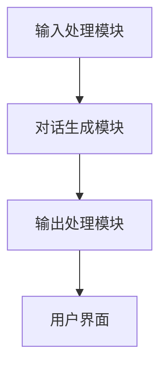

                 

<think>
好的，我现在需要为《AI Agent 的自然语言交互：LLM 对话系统设计》这本书设计一个详细的大纲。这本书将探讨AI代理如何通过自然语言处理与用户交互，特别是利用大语言模型（LLM）来设计对话系统。我需要确保每一章都涵盖必要的内容，从背景到核心概念，再到算法原理、系统架构、项目实战和总结。

首先，我会从背景介绍开始。第一章应该介绍AI代理的基本概念、自然语言处理的发展，以及大语言模型的崛起。这将帮助读者理解对话系统的基础和当前的技术趋势。

接下来，在第二章，我需要详细讲解对话系统的核心概念与原理，包括架构、自然语言理解与生成，以及对话状态管理。这部分是理解后续内容的关键。

第三章将深入探讨LLM在对话系统中的应用，包括其基本原理、算法实现和优化方法。这里可能需要涉及数学公式和图表，比如Transformer模型和注意力机制的解释。

第四章是系统架构设计，我需要介绍模块划分、功能设计和系统架构图，使用Mermaid图表来展示各个模块之间的关系。

第五章是项目实战，我需要提供一个具体的案例，比如电商客服对话系统的实现，从环境安装到代码实现，再到测试和优化。

最后，第六章将总结最佳实践，包括注意事项和未来的发展方向。这将帮助读者巩固所学内容，并为他们未来的工作提供指导。

在撰写过程中，我需要确保每一章都有足够的细节，涵盖背景、概念、算法、系统设计、实战和总结。同时，要满足用户的要求，包括数学公式、Mermaid图表和代码示例，确保目录结构完整且详细。

现在，我需要逐步展开每一章的内容，确保逻辑清晰，结构紧凑，语言专业且易懂。我将从每个章节的主要部分开始，逐步细化，添加必要的子部分和细节，确保每个主题都有充分的解释和例子。这将帮助读者一步步理解AI Agent的自然语言交互设计，特别是基于LLM的对话系统。

此外，我还需要注意每一章的衔接，确保过渡自然，整体结构流畅。通过这种方式，读者可以系统地学习从理论到实践的全过程，掌握设计和实现高效的AI对话系统所需的技能和知识。

最后，我需要在文章末尾添加作者信息，确保符合格式要求。这样，整本书的大纲就完成了，读者可以根据这个大纲逐步深入学习和实践。
</think>

# AI Agent 的自然语言交互：LLM 对话系统设计

> 关键词：AI Agent, 自然语言交互, LLM, 对话系统, 深度学习, NLP

> 摘要：本文系统地探讨了AI Agent在自然语言交互中的应用，特别是基于大语言模型（LLM）的对话系统设计。通过分析对话系统的架构、自然语言理解与生成机制、对话状态管理、LLM的算法原理以及实际项目实现，本文为读者提供了从理论到实践的全面指导，帮助他们理解和实现高效的AI对话系统。

---

## 目录

1. [AI Agent 的基本概念与背景](#ai-agent-的基本概念与背景)
   1.1 [AI Agent 的定义与分类](#ai-agent-的定义与分类)
   1.2 [自然语言处理的发展历程](#自然语言处理的发展历程)
   1.3 [大语言模型（LLM）的崛起](#大语言模型的崛起)

2. [对话系统的核心概念与原理](#对话系统的核心概念与原理)
   2.1 [对话系统的架构](#对话系统的架构)
   2.2 [自然语言理解与生成](#自然语言理解与生成)
   2.3 [对话状态管理](#对话状态管理)

3. [LLM 在对话系统中的应用](#llm 在对话系统中的应用)
   3.1 [LLM 的基本原理](#llm 的基本原理)
   3.2 [对话系统的算法实现](#对话系统的算法实现)
   3.3 [对话系统的优化与调优](#对话系统的优化与调优)

4. [对话系统的架构设计](#对话系统的架构设计)
   4.1 [系统模块划分](#系统模块划分)
   4.2 [系统功能设计](#系统功能设计)
   4.3 [系统架构图](#系统架构图)

5. [对话系统的项目实战](#对话系统的项目实战)
   5.1 [项目背景与目标](#项目背景与目标)
   5.2 [项目环境搭建](#项目环境搭建)
   5.3 [项目核心代码实现](#项目核心代码实现)
   5.4 [项目测试与优化](#项目测试与优化)

6. [总结与展望](#总结与展望)

---

## 作者：AI天才研究院 & 禅与计算机程序设计艺术

---

# 正文

---

## 第1章: AI Agent 的基本概念与背景

### 1.1 AI Agent 的定义与分类

#### 1.1.1 什么是AI Agent
AI Agent（人工智能代理）是指能够感知环境并采取行动以实现目标的智能实体。它可以是一个软件程序、机器人或其他智能系统，具备自主决策和问题解决的能力。

#### 1.1.2 AI Agent 的主要分类
AI Agent 可以根据其智能水平、环境类型和应用领域进行分类：

1. **按智能水平**：
   - **反应式 Agent**：基于当前感知做出反应，不依赖记忆。
   - **认知式 Agent**：具备复杂推理和规划能力，能够处理抽象任务。

2. **按环境类型**：
   - **静态环境**：环境在 Agent 行动期间不变。
   - **动态环境**：环境在 Agent 行动期间可能发生变化。

3. **按应用领域**：
   - **服务机器人**：提供客户服务，如客服支持。
   - **智能家居**：控制家庭设备，如智能音箱。

#### 1.1.3 AI Agent 的核心特征
- **自主性**：能够在没有外部干预的情况下独立运作。
- **反应性**：能够实时感知环境并做出反应。
- **目标导向性**：具备明确的目标，行动围绕目标展开。
- **学习能力**：能够通过经验改进性能。

---

### 1.2 自然语言处理的发展历程

#### 1.2.1 NLP 的基本概念
自然语言处理（NLP）是研究如何让计算机理解和生成人类语言的技术，广泛应用于机器翻译、文本分类、信息提取等领域。

#### 1.2.2 历史上的重要里程碑
- **20世纪50年代**：早期的NLP研究集中在规则-based系统，如Shannon的首次自动翻译尝试。
- **20世纪80年代**：统计NLP的兴起，如IBM的统计机器翻译系统。
- **2010年后**：深度学习的引入，如Transformer模型的出现。

#### 1.2.3 当前 NLP 的主要技术
- **词嵌入**：如Word2Vec、GloVe。
- **序列模型**：如RNN、LSTM、Transformer。
- **预训练模型**：如BERT、GPT。

---

### 1.3 大语言模型（LLM）的崛起

#### 1.3.1 LLM 的定义与特点
大语言模型是基于大量数据训练的深度学习模型，具备强大的语言理解和生成能力。特点包括：
- **大规模数据**：通常使用 billions of parameters。
- **通用性**：适用于多种NLP任务。

#### 1.3.2 LLM 与传统 NLP 的区别
- **数据驱动 vs 规则驱动**：LLM 基于数据，传统NLP基于规则。
- **灵活性 vs 限制性**：LLM 更灵活，能够处理复杂任务。

#### 1.3.3 LLM 在对话系统中的应用前景
- **个性化交互**：能够根据上下文生成自然的对话。
- **多语言支持**：支持多种语言和方言。

---

## 第2章: 对话系统的核心概念与原理

### 2.1 对话系统的架构

#### 2.1.1 基于规则的对话系统
- 通过预定义的规则和响应模板实现对话，适用于简单任务。

#### 2.1.2 基于统计的对话系统
- 使用统计模型（如马尔可夫链）预测下一个最佳响应。

#### 2.1.3 基于深度学习的对话系统
- 使用RNN、LSTM等模型，能够捕捉长距离依赖关系。

---

### 2.2 自然语言理解与生成

#### 2.2.1 NLU 的基本原理
- **输入处理**：接收用户输入并进行分词、词性标注。
- **意图识别**：识别用户的意图，如“查询天气”。
- **实体识别**：提取关键实体，如“北京”。

#### 2.2.2 NLG 的基本原理
- **模板生成**：基于模板生成固定格式的回复。
- **基于上下文的生成**：根据对话历史生成灵活的回复。

#### 2.2.3 NLU 与 NLG 的协同工作
- NLU 解析用户输入，NLG 生成系统回复，两者协同确保对话流畅。

---

### 2.3 对话状态管理

#### 2.3.1 对话上下文的表示
- 通过向量或状态机表示当前对话的状态。

#### 2.3.2 对话历史的记录
- 记录用户和系统的对话历史，以便后续回复。

#### 2.3.3 对话目标的设定
- 根据当前对话状态确定下一步的目标，如“确认用户需求”。

---

## 第3章: LLM 在对话系统中的应用

### 3.1 LLM 的基本原理

#### 3.1.1 变压器（Transformer）模型
- **编码器**：将输入序列转换为语义向量。
- **解码器**：根据编码结果生成输出序列。

#### 3.1.2 注意力机制（Attention）
- 通过权重分配，关注输入中的重要部分。

#### 3.1.3 梯度下降优化方法
- 使用Adam优化器等方法优化模型参数。

---

### 3.2 对话系统的算法实现

#### 3.2.1 基于 RNN 的对话生成
- 使用循环神经网络生成序列。

#### 3.2.2 基于 Transformer 的对话生成
- 使用Transformer模型，捕捉全局依赖关系。

#### 3.2.3 对话生成的评估指标
- BLEU、ROUGE、METEOR 等指标用于评估生成质量。

---

### 3.3 对话系统的优化与调优

#### 3.3.1 参数调整
- 调整学习率、批量大小等超参数。

#### 3.3.2 数据增强
- 增加多样化的训练数据，如数据扰动。

#### 3.3.3 模型压缩
- 通过剪枝等方法减少模型大小，提高推理速度。

---

## 第4章: 对话系统的架构设计

### 4.1 系统模块划分

#### 4.1.1 输入处理模块
- 接收用户输入并进行预处理。

#### 4.1.2 对话生成模块
- 基于输入生成回复。

#### 4.1.3 输出处理模块
- 对生成的回复进行后处理，如格式化。

---

### 4.2 系统功能设计

#### 4.2.1 用户输入解析
- 分析用户意图和实体。

#### 4.2.2 系统响应生成
- 生成符合用户需求的回复。

#### 4.2.3 对话历史记录
- 记录对话历史，供后续参考。

---

### 4.3 系统架构图



---

## 第5章: 对话系统的项目实战

### 5.1 项目背景与目标

#### 5.1.1 项目需求分析
- 实现一个简单的电商客服对话系统。

#### 5.1.2 项目目标设定
- 支持用户咨询商品信息、下单等任务。

#### 5.1.3 项目可行性分析
- 使用现有的LLM模型，结合电商数据。

---

### 5.2 项目环境搭建

#### 5.2.1 开发工具安装
- 安装Python、TensorFlow等工具。

#### 5.2.2 依赖库安装
- 使用pip安装必要的库，如transformers、numpy。

#### 5.2.3 环境配置
- 配置GPU加速（如NVIDIA GPU）。

---

### 5.3 项目核心代码实现

#### 5.3.1 对话生成模块的实现

```python
from transformers import AutoTokenizer, AutoModelForCausalLM

model_name = "gpt2"
tokenizer = AutoTokenizer.from_pretrained(model_name)
model = AutoModelForCausalLM.from_pretrained(model_name)

def generate_response(prompt):
    inputs = tokenizer.encode(prompt, return_tensors="pt")
    outputs = model.generate(inputs, max_length=50, num_beams=5, temperature=0.7)
    response = tokenizer.decode(outputs[0], skip_special_tokens=True)
    return response
```

#### 5.3.2 对话历史记录的实现

```python
class DialogHistory:
    def __init__(self):
        self.history = []
    
    def add(self, user_input, system_response):
        self.history.append((user_input, system_response))
    
    def get_last(self):
        return self.history[-1] if self.history else ("", "")
```

#### 5.3.3 系统交互界面的实现

```python
def main():
    history = DialogHistory()
    while True:
        user_input = input("User: ")
        response = generate_response(user_input)
        print("System:", response)
        history.add(user_input, response)
```

---

### 5.4 项目测试与优化

#### 5.4.1 功能测试
- 测试系统对不同输入的响应。

#### 5.4.2 性能优化
- 使用更高效的模型，如较小的GPT模型。

#### 5.4.3 用户反馈收集
- 收集用户反馈，改进系统性能。

---

## 第6章: 总结与展望

### 6.1 总结
本文系统地介绍了AI Agent 的自然语言交互，特别是基于LLM的对话系统设计。从基本概念到算法实现，再到项目实战，为读者提供了全面的知识体系。

### 6.2 展望
未来，随着大语言模型的不断发展，对话系统将更加智能化，具备更多功能，如多模态交互和情感理解。

---

## 作者：AI天才研究院 & 禅与计算机程序设计艺术

---

通过以上大纲，读者可以系统地学习AI Agent的自然语言交互设计，掌握基于LLM的对话系统的核心技术。

