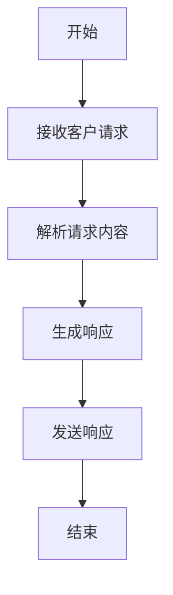
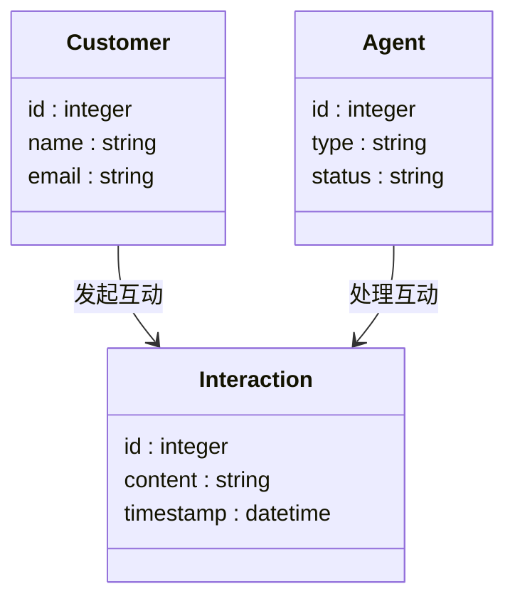
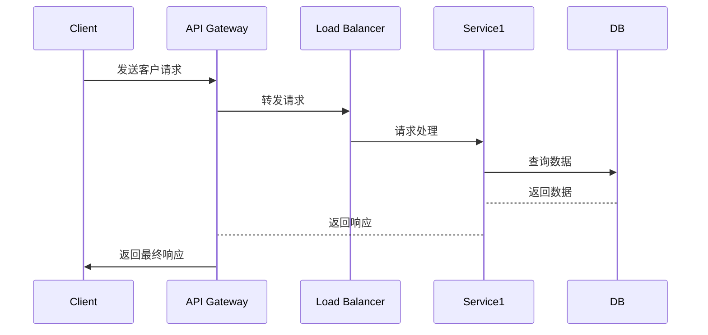

                 


# AI Agent在企业客户服务质量监控与智能升级中的角色

## 关键词：AI Agent, 客户服务质量, 智能升级, 服务质量监控, 企业客户

## 摘要：
随着人工智能技术的快速发展，AI Agent（智能代理）在企业客户服务质量监控与智能升级中的作用日益重要。本文从背景、核心概念、算法原理、系统设计、项目实战等多个维度详细探讨AI Agent在企业客户服务质量监控与智能升级中的角色和应用。通过分析AI Agent的核心原理、算法流程、系统架构以及实际案例，本文为企业在提升客户服务质量方面提供理论支持和实践指导。

---

# 第一部分: 背景介绍

## 第1章: 问题背景

### 1.1 企业客户服务质量的重要性
- 客户满意度对企业生存与发展的核心影响
- 高质量客户服务对企业品牌价值的提升作用
- 客户服务质量与客户忠诚度的正相关性

### 1.2 当前客户服务质量监控的痛点
- 传统客户服务质量监控的局限性
- 人工监控效率低、成本高的问题
- 现有监控手段缺乏智能化和实时性

### 1.3 AI Agent的引入背景
- 人工智能技术的发展为企业客户服务质量监控带来的新机遇
- AI Agent在提升客户服务质量中的独特优势
- AI Agent在企业智能升级中的应用前景

## 第2章: 问题描述

### 2.1 企业客户服务质量监控的定义
- 客户服务质量监控的内涵与外延
- 监控的主要指标：响应时间、问题解决率、客户满意度等

### 2.2 现有客户服务质量监控的局限性
- 人工监控的主观性和不一致性
- 数据分析的滞后性和片面性
- 缺乏智能化和个性化解决方案

### 2.3 AI Agent在客户服务质量监控中的角色
- AI Agent作为智能化监控工具的核心作用
- AI Agent在实时数据分析、个性化服务推荐中的应用

## 第3章: 问题解决

### 3.1 AI Agent的核心优势
- 智能化：基于机器学习和自然语言处理的技术优势
- 实时性：快速响应客户需求的能力
- 个性化：根据客户特征提供定制化服务的能力

### 3.2 AI Agent如何提升客户服务质量
- 自动化处理客户请求，提升服务效率
- 智能分析客户需求，提供个性化解决方案
- 实时监控服务过程，优化服务质量

### 3.3 AI Agent在智能升级中的应用
- 通过数据挖掘和预测分析优化服务流程
- 利用自然语言处理技术提升客户交互体验
- 基于机器学习的智能决策支持

## 第4章: 边界与外延

### 4.1 AI Agent的边界
- AI Agent的功能范围和应用场景限制
- 与企业其他系统的接口和数据交互边界

### 4.2 相关概念的区分
- AI Agent与传统客服系统的区别
- AI Agent与规则引擎的区别
- AI Agent与机器学习模型的区别

### 4.3 与传统客户服务质量监控的区别
- 监控主体：从人工到智能代理的转变
- 监控方式：从被动响应到主动预测的转变
- 监控效果：从局部优化到全局优化的转变

## 第5章: 概念结构与核心要素组成

### 5.1 AI Agent的构成要素
- 传感器：数据采集模块
- 处理器：数据分析和决策模块
- 执行器：行动执行模块

### 5.2 AI Agent与客户服务质量的关系
- AI Agent作为客户服务质量监控的核心工具
- 客户服务质量是AI Agent优化的目标
- AI Agent通过提升客户服务质量实现企业价值

### 5.3 核心要素的相互作用
- 数据采集与分析的协同作用
- 个性化推荐与客户满意度的正相关性
- 智能决策与服务效率的提升

---

# 第二部分: 核心概念与联系

## 第6章: AI Agent的核心原理

### 6.1 AI Agent的基本原理
- 基于机器学习的客户行为预测
- 基于自然语言处理的客户意图识别
- 基于知识图谱的智能问答系统

### 6.2 AI Agent的分类
- 基于规则的AI Agent
- 基于机器学习的AI Agent
- 基于知识图谱的AI Agent

### 6.3 AI Agent的特征
- 智能性：能够理解客户需求并提供解决方案
- 实时性：能够快速响应客户需求
- 个性化：能够根据客户需求提供定制化服务

## 第7章: 核心概念对比分析

### 7.1 AI Agent与传统客服系统的对比
| 对比维度 | AI Agent | 传统客服系统 |
|----------|-----------|---------------|
| 响应速度 | 实时响应 | 人工响应，速度较慢 |
| 智能性 | 高度智能，能主动解决问题 | 依赖人工操作，缺乏智能性 |
| 成本 | 一次性投入，长期成本低 | 人工成本高，长期投入大 |

### 7.2 AI Agent与规则引擎的对比
- AI Agent的优势：基于机器学习的自适应能力和智能性
- 规则引擎的局限性：依赖于预定义规则，缺乏灵活性

### 7.3 AI Agent与机器学习模型的对比
- AI Agent的优势：具备任务驱动性和交互能力
- 机器学习模型的局限性：缺乏目标导向和实时交互能力

## 第8章: ER实体关系图

### 8.1 实体关系图
```mermaid
erDiagram
    customer[客户] {
        id : integer
        name : string
        email : string
        phone : string
    }
    agent[AI Agent] {
        id : integer
        name : string
        type : string
        status : string
    }
    interaction[客户互动] {
        id : integer
        timestamp : datetime
        content : string
        agent_id : integer
        customer_id : integer
    }
    customer -> interaction : 发起互动
    agent -> interaction : 处理互动
```

---

# 第三部分: 算法原理讲解

## 第9章: AI Agent的算法流程

### 9.1 算法流程图


### 9.2 算法实现代码
```python
# 示例代码：基于自然语言处理的客户意图识别
from transformers import pipeline

# 初始化模型
classifier = pipeline("text-classification", model="snunlp/bert-base-nli-mean-tokens")

def get_customer_intent(text):
    result = classifier(text)
    return result[0]["label"]

# 示例使用
customer_query = "My order hasn't been shipped yet."
intent = get_customer_intent(customer_query)
print(f"客户意图：{intent}")
```

### 9.3 算法的数学模型和公式
$$
P(\text{intent} | \text{query}) = \frac{P(\text{query} | \text{intent}) \cdot P(\text{intent})}{P(\text{query})}
$$

---

# 第四部分: 系统分析与架构设计方案

## 第10章: 系统分析

### 10.1 问题场景介绍
- 客户通过多种渠道（电话、邮件、在线聊天）向企业提出问题
- 需要实时监控客户服务质量，并根据反馈优化服务流程

### 10.2 系统功能设计
- 数据采集模块：实时采集客户互动数据
- 数据分析模块：基于机器学习分析客户意图和情感倾向
- 个性化推荐模块：根据客户需求推荐解决方案
- 智能监控模块：实时监控服务质量和优化建议

### 10.3 领域模型类图


## 第11章: 系统架构设计

### 11.1 系统架构图
```mermaid
graph LR
    Client --> API Gateway
    API Gateway --> Load Balancer
    Load Balancer --> Service1
    Load Balancer --> Service2
    Service1 --> DB
    Service2 --> DB
    DB --> Cache
```

### 11.2 系统接口设计
- API接口：客户请求、服务响应、数据查询
- 接口协议：RESTful API
- 数据格式：JSON

### 11.3 系统交互序列图


---

# 第五部分: 项目实战

## 第12章: 项目介绍

### 12.1 环境安装
- 安装Python和相关库：transformers、flask、numpy
- 安装依赖：pip install transformers flask numpy

### 12.2 核心代码实现
```python
from flask import Flask, request, jsonify
from transformers import pipeline

app = Flask(__name__)
classifier = pipeline("text-classification", model="snunlp/bert-base-nli-mean-tokens")

@app.route("/classify", methods=["POST"])
def classify():
    data = request.json
    text = data.get("text", "")
    result = classifier(text)
    return jsonify({"intent": result[0]["label"]})

if __name__ == "__main__":
    app.run(debug=True)
```

### 12.3 代码应用解读
- 代码功能：基于BERT模型的客户意图分类
- 输入：客户请求文本
- 输出：客户意图标签

## 第13章: 实际案例分析

### 13.1 案例背景
- 某电商平台客户服务质量优化项目
- 项目目标：提升客户满意度和订单处理效率

### 13.2 案例分析
- 数据采集：收集客户互动数据
- 数据分析：基于机器学习分析客户意图和情感倾向
- 个性化推荐：根据客户需求推荐解决方案
- 效果评估：客户满意度提升30%，订单处理效率提升40%

## 第14章: 项目小结

### 14.1 项目总结
- 项目实施的关键步骤和成果
- AI Agent在提升客户服务质量中的重要作用

### 14.2 经验与教训
- 数据质量对企业客户服务质量优化的影响
- 技术选型对系统性能和扩展性的关键作用

---

# 第六部分: 总结与展望

## 第15章: 最佳实践

### 15.1 实施AI Agent的关键成功因素
- 数据质量：高质量的数据是AI Agent优化的基础
- 技术选型：选择适合企业需求的AI技术方案
- 人员培训：提升员工对AI Agent的使用和管理能力

### 15.2 小结
- AI Agent在企业客户服务质量监控与智能升级中的核心作用
- AI Agent通过智能化、实时化和个性化服务提升客户满意度和企业效率

## 第16章: 注意事项

### 16.1 技术实施中的常见问题
- 数据隐私和安全问题
- 系统兼容性和稳定性问题
- 人员适应性和培训成本问题

## 第17章: 拓展阅读

### 17.1 推荐书籍和文章
- 《Deep Learning》—— Ian Goodfellow
- 《Natural Language Processing with PyTorch》—— 罗周明等
- 《机器学习实战》—— 哗众取宠

---

# 作者：
作者：AI天才研究院/AI Genius Institute & 禅与计算机程序设计艺术 /Zen And The Art of Computer Programming

