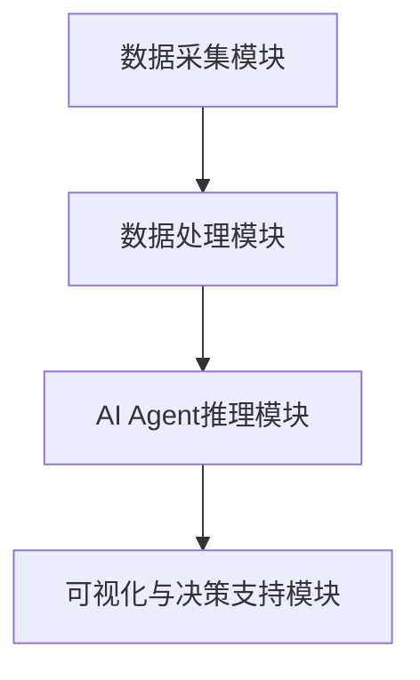
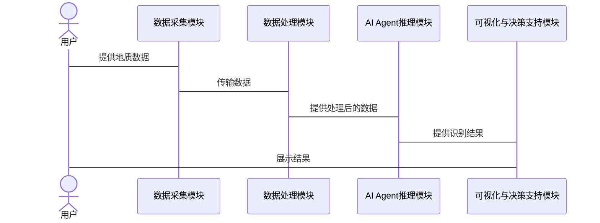

                 


# AI Agent在地质勘探中的应用：矿产资源识别

> 关键词：AI Agent, 地质勘探, 矿产资源识别, 机器学习, 深度学习, 数据分析

> 摘要：本文探讨了AI Agent在地质勘探中的应用，特别是在矿产资源识别方面。通过分析地质数据的复杂性与多样性，本文详细介绍了AI Agent的核心原理、算法选择、系统架构设计以及实际项目中的应用。同时，本文还提供了最佳实践和小结，帮助读者更好地理解和应用AI Agent技术在地质勘探中的潜力。

---

## 第一部分: AI Agent在地质勘探中的应用概述

### 第1章: 地质勘探与AI Agent的背景介绍

#### 1.1 地质勘探的现状与挑战
##### 1.1.1 地质勘探的传统方法与局限性
地质勘探是寻找和开发矿产资源的关键过程，传统方法依赖于地质调查、地球化学分析和地球物理勘探等技术。然而，这些方法通常耗时长、成本高，并且在复杂地质环境中容易受到主观因素的影响，导致勘探效率低下。

##### 1.1.2 矿产资源识别的重要性
矿产资源是经济发展的重要基础，准确识别和评估矿产资源储量对国家经济和可持续发展至关重要。传统方法在复杂地质条件下的局限性使得矿产资源识别面临巨大挑战。

##### 1.1.3 AI技术在地质勘探中的潜力
人工智能技术，尤其是AI Agent（智能体），能够通过数据驱动的方法提高地质勘探的效率和准确性。AI Agent能够处理大量复杂地质数据，识别潜在矿床，并优化勘探策略。

#### 1.2 AI Agent的基本概念与特点
##### 1.2.1 AI Agent的定义与核心要素
AI Agent是一种能够感知环境、自主决策并执行任务的智能实体。它具备感知能力、决策能力、行动能力和学习能力，能够在动态环境中适应变化。

##### 1.2.2 AI Agent与传统AI的区别
传统AI主要依赖规则和模式匹配，而AI Agent具备更强的自主性和适应性，能够根据环境反馈动态调整行为。AI Agent在地质勘探中的应用更加注重实时数据处理和自主决策。

##### 1.2.3 AI Agent在地质勘探中的优势
AI Agent能够快速处理和分析海量地质数据，识别潜在矿床，优化勘探路径，并提高勘探效率。此外，AI Agent能够通过学习不断优化其决策模型，从而提高勘探的准确性和可靠性。

---

### 第2章: AI Agent与地质勘探的结合

#### 2.1 AI Agent在矿产资源识别中的应用背景
##### 2.1.1 地质数据的复杂性与多样性
地质数据包括岩石类型、矿物成分、地球化学元素分布等多种信息，数据复杂且多样性高，传统方法难以高效处理。

##### 2.1.2 AI Agent在数据处理中的优势
AI Agent能够通过机器学习和深度学习算法，从复杂地质数据中提取有用信息，识别潜在矿床，并预测矿产分布。

##### 2.1.3 矿产资源识别的智能化需求
随着矿产资源的日益枯竭，智能化勘探成为必然趋势。AI Agent能够帮助地质学家更高效地识别和评估矿产资源，降低勘探成本。

#### 2.2 AI Agent与地质勘探的核心联系
##### 2.2.1 数据驱动的地质分析
AI Agent通过分析地质数据，构建地质模型，识别潜在矿床，并预测矿产分布。

##### 2.2.2 AI Agent在地质模型构建中的作用
AI Agent能够通过机器学习算法，从大量地质数据中提取特征，构建高精度的地质模型，为矿产资源识别提供科学依据。

##### 2.2.3 AI Agent与地质勘探流程的优化
AI Agent能够优化地质勘探流程，从数据采集、处理、分析到决策支持，全面提升勘探效率和准确性。

---

### 第3章: AI Agent在矿产资源识别中的核心概念

#### 3.1 AI Agent的核心原理
##### 3.1.1 数据采集与预处理
AI Agent首先通过传感器和数据库采集地质数据，并进行预处理，包括数据清洗、标准化和特征提取。

##### 3.1.2 特征提取与模型训练
通过机器学习算法，AI Agent从地质数据中提取关键特征，并训练分类或回归模型，用于矿产资源识别。

##### 3.1.3 模型推理与结果解释
AI Agent利用训练好的模型对新数据进行推理，生成矿产资源识别结果，并通过可视化工具进行解释和展示。

#### 3.2 AI Agent与地质数据的关系
##### 3.2.1 数据的多样性与复杂性
地质数据具有多源异构的特点，包括文本、图像、数值等多种数据类型，AI Agent需要具备处理复杂数据的能力。

##### 3.2.2 数据驱动的地质分析方法
AI Agent通过数据驱动的方法，从地质数据中发现潜在规律，为矿产资源识别提供科学依据。

##### 3.2.3 数据质量对模型性能的影响
高质量的数据是AI Agent发挥效用的前提，数据噪声和缺失会影响模型的准确性和可靠性。

#### 3.3 AI Agent与地质勘探的对比分析
##### 3.3.1 传统地质勘探方法的优缺点
传统方法依赖经验丰富的地质学家，具有主观性强、效率低、成本高等缺点。

##### 3.3.2 AI Agent在地质勘探中的优势
AI Agent能够快速处理大量数据，识别潜在矿床，并优化勘探策略，显著提高勘探效率和准确性。

##### 3.3.3 两者的结合与互补
AI Agent与传统地质勘探方法结合，能够充分发挥各自的优点，形成互补，实现更高效的矿产资源识别。

---

## 第4章: AI Agent在地质勘探中的算法原理

### 4.1 矿产资源识别的算法选择
#### 4.1.1 传统机器学习算法
传统机器学习算法如支持向量机（SVM）、随机森林（Random Forest）等，适用于小规模数据的分类和回归任务。

#### 4.1.2 深度学习算法
深度学习算法如卷积神经网络（CNN）、循环神经网络（RNN）等，适用于处理复杂非结构化数据，如地质图像和遥感数据。

#### 4.1.3 算法

---

### 4.2 算法实现与代码示例
#### 4.2.1 数据预处理
```python
import pandas as pd
import numpy as np

# 加载数据
data = pd.read_csv('geological_data.csv')

# 数据清洗
data.dropna(inplace=True)

# 标准化处理
from sklearn.preprocessing import StandardScaler
scaler = StandardScaler()
scaled_data = scaler.fit_transform(data)
```

#### 4.2.2 模型训练
```python
from sklearn.model_selection import train_test_split
from sklearn.ensemble import RandomForestClassifier
from sklearn.metrics import accuracy_score

# 划分训练集和测试集
X_train, X_test, y_train, y_test = train_test_split(scaled_data, data['label'], test_size=0.2)

# 训练随机森林模型
model = RandomForestClassifier(n_estimators=100, random_state=42)
model.fit(X_train, y_train)

# 预测与评估
y_pred = model.predict(X_test)
print('Accuracy:', accuracy_score(y_test, y_pred))
```

#### 4.2.3 模型解释
通过特征重要性分析，我们可以确定哪些地质特征对矿产资源识别最为关键。例如，某岩石成分的含量可能是矿床分布的主要影响因素。

---

## 第五部分: 项目实战

### 5.1 项目介绍
本项目旨在利用AI Agent技术，开发一个矿产资源识别系统，实现地质数据的智能分析和矿床预测。

### 5.2 系统功能设计
#### 5.2.1 数据采集模块
通过传感器和数据库采集地质数据，包括岩石成分、地球化学元素分布等。

#### 5.2.2 地质数据处理模块
对数据进行清洗、标准化和特征提取，为模型训练提供高质量数据。

#### 5.2.3 AI Agent推理模块
利用机器学习模型对地质数据进行分析，生成矿产资源识别结果。

#### 5.2.4 可视化与决策支持模块
通过可视化工具展示分析结果，并为地质勘探提供决策支持。

### 5.3 系统架构设计
#### 5.3.1 系统架构图


#### 5.3.2 系统接口设计
系统提供API接口，方便与其他地质勘探系统集成。

### 5.4 系统交互流程


---

## 第六部分: 最佳实践与小结

### 6.1 最佳实践
#### 6.1.1 数据质量的重要性
确保数据的准确性和完整性，减少数据噪声对模型的影响。

#### 6.1.2 模型调优技巧
通过交叉验证和超参数优化，提高模型的准确性和泛化能力。

#### 6.1.3 系统安全性与伦理问题
确保系统数据的安全性，遵守相关法律法规，避免数据泄露和滥用。

### 6.2 小结
本文详细介绍了AI Agent在地质勘探中的应用，特别是在矿产资源识别方面。通过分析地质数据的复杂性与多样性，本文探讨了AI Agent的核心原理、算法选择、系统架构设计以及实际项目中的应用。未来，随着AI技术的不断发展，AI Agent在地质勘探中的应用将更加广泛和深入。

---

作者：AI天才研究院/AI Genius Institute & 禅与计算机程序设计艺术 /Zen And The Art of Computer Programming

