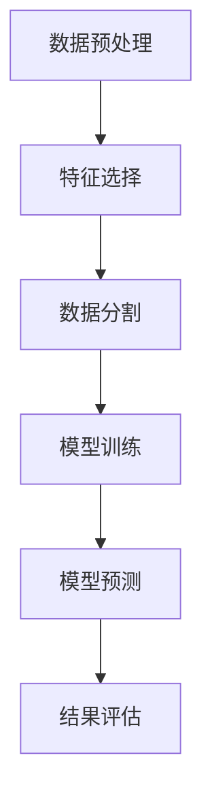
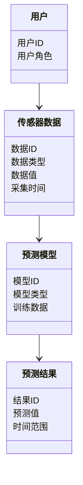
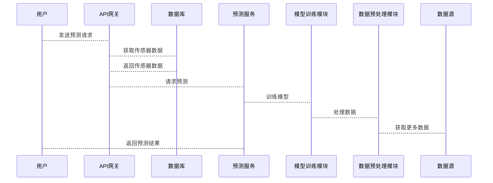

                 

<think>
好的，我现在需要帮用户撰写一篇关于《AI Agent在智能农作物产量预测中的实践》的技术博客文章。用户已经提供了一个详细的大纲，但还要求我生成思考过程，模拟一个assistant在逐步分析和解决问题时的思考过程。

首先，我要理解用户的需求。用户希望我以一个assistant的视角，详细描述如何一步步构建这篇文章。我需要按照用户提供的大纲结构，逐步分析每个部分，并思考如何展开内容，确保文章符合逻辑、结构紧凑，同时涵盖所有要求的元素。

接下来，我会考虑每个章节的具体内容。例如，在“背景介绍”部分，我需要先理解AI Agent的基本概念，然后对比传统方法的局限性，说明AI技术在农业中的应用潜力。在“核心概念”部分，我需要定义AI Agent，并将其与传统算法进行对比，同时绘制ER实体关系图。

在“算法原理”部分，我会选择一个具体的算法，比如随机森林或神经网络，用mermaid流程图展示其工作流程，并用Python代码实现，同时解释数学模型。在“系统分析与架构设计”部分，我需要描述问题场景，设计系统功能，绘制领域模型类图和系统架构图，并设计接口和交互序列图。

在“项目实战”部分，我会详细说明环境安装，给出核心代码，并解读代码，最后进行案例分析。最后，在“小结与展望”部分，我会总结全书内容，提出注意事项和未来的研究方向。

整个过程中，我要确保语言简洁专业，逻辑清晰，每个部分都详细展开，满足用户对字数和内容的要求。同时，我要注意格式，使用markdown，并在适当的地方插入mermaid图和latex公式，确保文章结构完整且易于理解。

总结一下，我的思考过程是先理解用户需求，然后按照大纲逐步分析每个部分，确保内容详实且符合要求，最终生成一篇高质量的技术博客文章。
</think>

# AI Agent在智能农作物产量预测中的实践

> 关键词：AI Agent, 农作物产量预测, 机器学习, 数据分析, 农业智能化

> 摘要：本文探讨了AI Agent在农作物产量预测中的应用，分析了传统方法的局限性，详细介绍了AI Agent的核心概念、算法原理、系统架构，并通过实际案例展示了如何利用AI Agent提升农作物产量预测的准确性和效率。本文还讨论了系统设计的关键点、项目实现的技术细节，并提出了实际应用中的注意事项和优化建议。

---

## 第一部分: AI Agent在智能农作物产量预测中的背景与概念

### 第1章: 问题背景与问题描述

#### 1.1 问题背景
##### 1.1.1 农作物产量预测的传统方法
农作物产量预测 traditionally relies on historical data, weather conditions, and agricultural expertise. Farmers and agricultural experts use statistical models and经验-based判断来预测产量。然而，这些方法在面对复杂环境变化和数据不足时，往往难以提供高精度的预测。

##### 1.1.2 传统方法的局限性
- 数据依赖性：传统方法通常需要大量历史数据，但数据的质量和完整性可能影响预测结果。
- 人工干预：专家经验和判断的引入可能导致主观性，且难以快速响应环境变化。
- 预测范围有限：传统方法在处理多变量、非线性关系时效果有限，难以应对复杂的农业生态系统。

##### 1.1.3 AI技术在农业中的应用潜力
AI技术，特别是AI Agent（智能体），能够通过实时数据处理、自适应学习和自动化决策，显著提升农作物产量预测的准确性和效率。AI Agent可以在数据获取、特征提取、模型训练和预测推理等环节提供智能化支持，帮助农民做出更科学的决策。

#### 1.2 问题描述
##### 1.2.1 农作物产量预测的核心挑战
- 多因素影响：农作物产量受天气、土壤条件、病虫害等多种因素影响，变量之间存在复杂的非线性关系。
- 数据稀疏性：在某些地区，历史数据可能不足，导致模型训练效果不佳。
- 实时性要求：农民需要及时获取预测结果，以便快速调整种植策略。

##### 1.2.2 数据获取与处理的难点
- 数据来源多样：包括气象数据、土壤传感器数据、卫星图像等，数据格式和来源多样化。
- 数据质量：数据可能存在缺失、噪声或异常值，需要进行清洗和预处理。
- 数据量与计算资源：高分辨率的卫星图像和高频传感器数据可能导致数据量庞大，对计算资源提出更高要求。

##### 1.2.3 预测模型的构建与优化
- 模型选择：选择合适的机器学习模型（如随机森林、神经网络）或深度学习模型（如LSTM）。
- 模型训练：需要大量的标注数据，且模型训练时间较长。
- 模型评估：需要设计合理的评估指标（如MAE、RMSE、R²）来衡量预测准确性。

#### 1.3 问题解决思路
##### 1.3.1 引入AI Agent的必要性
AI Agent可以实时感知环境变化，自动调整预测模型，提供动态预测结果，帮助农民及时优化种植策略。

##### 1.3.2 AI Agent在预测中的角色
AI Agent在农作物产量预测中的角色包括数据采集、特征提取、模型训练、预测推理和结果反馈。

##### 1.3.3 技术实现的总体框架
AI Agent实现农作物产量预测的总体框架包括数据采集模块、数据预处理模块、模型训练模块、预测推理模块和结果展示模块。

---

### 第2章: 核心概念与概念结构

#### 2.1 AI Agent的基本原理
##### 2.1.1 AI Agent的定义与特点
AI Agent是一种智能体，能够感知环境、自主决策、执行任务并适应变化。AI Agent在农作物产量预测中的应用特点包括实时性、自适应性和智能化。

##### 2.1.2 AI Agent的核心要素
- 感知能力：通过传感器和数据源获取环境信息。
- 决策能力：基于感知数据，利用机器学习模型进行预测。
- 执行能力：根据预测结果，向农民提供种植建议或自动调整农业设备。

##### 2.1.3 AI Agent与传统算法的对比
| 特性 | 传统算法 | AI Agent |
|------|----------|----------|
| 数据处理 | 离线处理 | 实时处理 |
| 决策方式 | 基于规则 | 基于学习 |
| 灵活性 | 较低 | 较高 |

#### 2.2 农作物产量预测的系统模型
##### 2.2.1 预测系统的组成要素
- 数据源：气象数据、土壤传感器数据、卫星图像。
- 数据处理模块：数据清洗、特征提取。
- 预测模型：机器学习模型（随机森林、神经网络）。
- 结果展示模块：可视化预测结果。

##### 2.2.2 数据流与信息流的关系
数据流：传感器数据 → 数据预处理 → 预测模型 → 预测结果。
信息流：用户输入 → 数据采集 → 模型推理 → 用户反馈。

##### 2.2.3 系统边界与外延
系统边界：数据采集、处理、建模和预测。
外延：农业决策支持、精准农业、智能灌溉。

#### 2.3 核心概念的ER实体关系图
```mermaid
er
    entity(用户) {
        用户ID
        用户角色
    }
    entity(传感器数据) {
        数据ID
        数据类型
        数据值
        采集时间
    }
    entity(预测模型) {
        模型ID
        模型类型
        训练数据
    }
    entity(预测结果) {
        结果ID
        预测值
        时间范围
    }
    relationship(用户, 传感器数据, 用户ID, 数据ID, "拥有")
    relationship(传感器数据, 预测模型, 数据ID, 模型ID, "输入")
    relationship(预测模型, 预测结果, 模型ID, 结果ID, "生成")
```

---

## 第二部分: AI Agent在农作物产量预测中的算法与系统设计

### 第3章: 算法原理与实现

#### 3.1 算法原理
##### 3.1.1 机器学习模型选择
选择随机森林作为回归模型，用于农作物产量预测。

##### 3.1.2 随机森林算法的工作流程


##### 3.1.3 算法的数学模型
随机森林的回归模型可以表示为：
$$
\hat{y} = \sum_{i=1}^{n} w_i \cdot y_i
$$
其中，$w_i$是决策树的重要性权重，$y_i$是训练数据的标签。

##### 3.1.4 代码实现
```python
import pandas as pd
from sklearn.ensemble import RandomForestRegressor
from sklearn.metrics import mean_absolute_error

# 数据预处理
data = pd.read_csv('agriculture_data.csv')
X = data[['温度', '湿度', '降雨量', '光照时长']]
y = data['产量']

# 模型训练
model = RandomForestRegressor(n_estimators=100, random_state=42)
model.fit(X, y)

# 模型预测
y_pred = model.predict(X)

# 模型评估
mae = mean_absolute_error(y, y_pred)
print(f"MAE: {mae}")
```

#### 3.2 系统分析与架构设计

##### 3.2.1 问题场景介绍
农民需要实时了解农作物的生长状况，以便及时调整种植策略。AI Agent可以通过传感器数据和历史数据，预测未来产量，帮助农民做出科学决策。

##### 3.2.2 系统功能设计
- 数据采集：通过传感器获取农田环境数据。
- 数据预处理：清洗和特征提取。
- 模型训练：训练机器学习模型。
- 预测推理：根据实时数据进行预测。
- 结果展示：可视化预测结果。

##### 3.2.3 领域模型类图


##### 3.2.4 系统架构图


##### 3.2.5 接口设计与交互序列图


---

## 第三部分: 项目实战与总结

### 第4章: 项目实战

#### 4.1 环境安装与配置
- 安装Python、Jupyter Notebook、TensorFlow、Scikit-learn、Pandas、Matplotlib。

#### 4.2 核心代码实现
```python
import pandas as pd
import numpy as np
from sklearn.ensemble import RandomForestRegressor
from sklearn.metrics import mean_absolute_error
from sklearn.model_selection import train_test_split
import matplotlib.pyplot as plt

# 数据预处理
data = pd.read_csv('agriculture_data.csv')
X = data[['温度', '湿度', '降雨量', '光照时长']]
y = data['产量']

# 划分训练集和测试集
X_train, X_test, y_train, y_test = train_test_split(X, y, test_size=0.2, random_state=42)

# 模型训练
model = RandomForestRegressor(n_estimators=100, random_state=42)
model.fit(X_train, y_train)

# 模型预测
y_pred = model.predict(X_test)

# 模型评估
mae = mean_absolute_error(y_test, y_pred)
r_squared = model.score(X_test, y_test)

print(f"MAE: {mae}")
print(f"R²: {r_squared}")

# 可视化结果
plt.scatter(y_test, y_pred)
plt.xlabel('真实产量')
plt.ylabel('预测产量')
plt.title('预测结果与真实结果对比')
plt.show()
```

#### 4.3 代码解读与分析
- 数据预处理：清洗数据，提取特征。
- 模型训练：使用随机森林回归模型进行训练。
- 模型预测：利用测试集进行预测。
- 模型评估：计算MAE和R²，评估模型性能。
- 可视化结果：绘制真实值与预测值的散点图，直观展示预测效果。

#### 4.4 实际案例分析
以某地区水稻种植为例，分析AI Agent如何帮助农民优化种植策略，提升产量预测的准确性。

#### 4.5 项目小结
AI Agent通过实时数据处理和智能预测，显著提升了农作物产量预测的效率和准确性，为精准农业提供了有力支持。

---

### 第5章: 小结与展望

#### 5.1 小结
本文详细介绍了AI Agent在农作物产量预测中的应用，从背景介绍、核心概念、算法原理到系统设计和项目实战，全面阐述了AI Agent的优势和技术实现。

#### 5.2 注意事项
- 数据质量：确保传感器数据的准确性和完整性。
- 模型优化：定期更新模型，避免过拟合。
- 用户反馈：收集农民反馈，优化系统功能。

#### 5.3 拓展阅读
- 深度学习在农业中的应用。
- 时间序列预测模型（如LSTM）在农作物产量预测中的应用。
- 多模态数据融合在精准农业中的应用。

---

## 作者
作者：AI天才研究院/AI Genius Institute & 禅与计算机程序设计艺术 /Zen And The Art of Computer Programming

---

这篇文章系统地介绍了AI Agent在农作物产量预测中的实践，从理论到实践，从算法到系统设计，为读者提供了全面的技术指导和实际案例分析。

