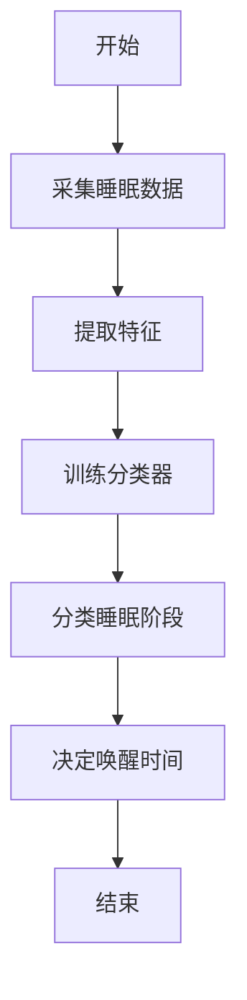
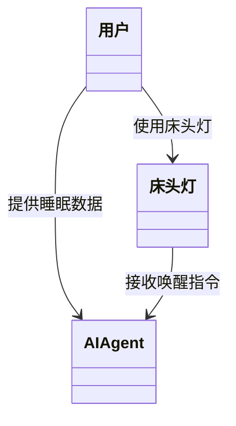
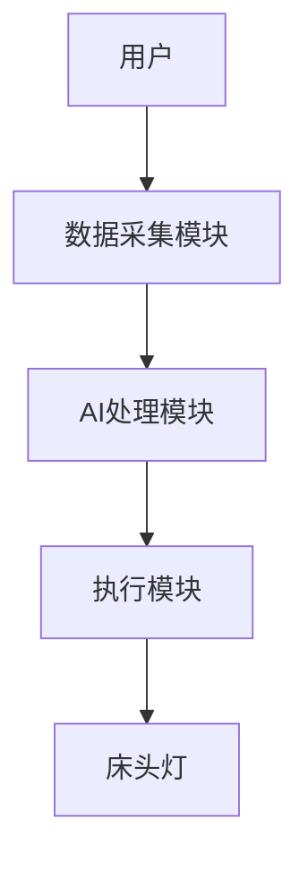
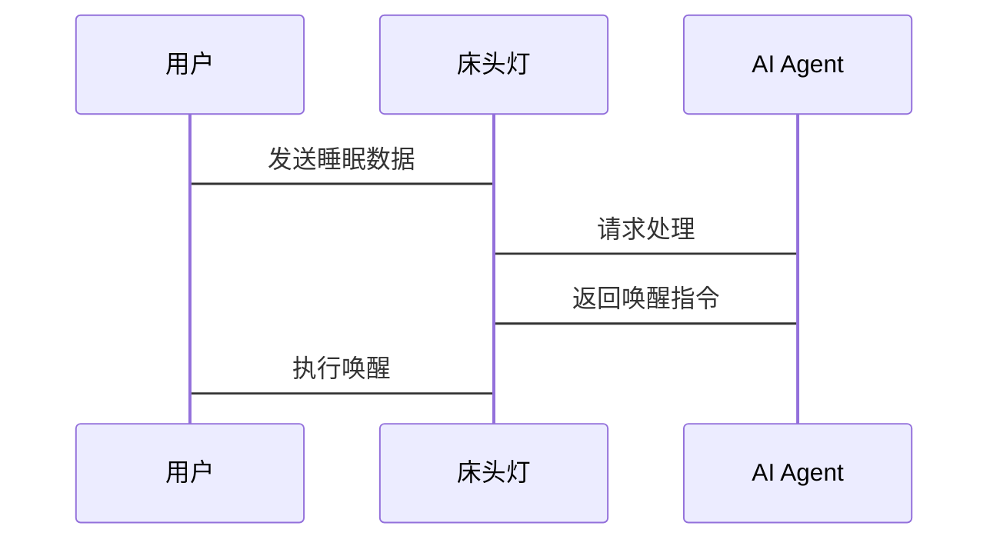

                 


# AI Agent在智能床头灯中的智能唤醒系统

## 关键词：AI Agent, 智能床头灯, 智能唤醒, 机器学习, 智能系统, 睡眠健康

## 摘要：本文深入探讨了AI Agent在智能床头灯中的应用，重点分析了其在智能唤醒系统中的工作原理和实际应用。文章从背景介绍、核心概念、算法原理、系统架构到项目实战，全面解析了AI Agent如何通过感知、决策和执行实现智能唤醒，帮助用户改善睡眠质量。本文旨在为读者提供一个全面的技术视角，展示AI技术在智能家居领域的创新应用。

---

## 第1章: 背景介绍

### 1.1 问题背景
睡眠是人类健康的重要组成部分，充足的睡眠有助于身体恢复和心理健康。然而，现代生活节奏快，许多人面临睡眠不足或睡眠质量差的问题。传统床头灯仅能提供基本的照明功能，无法满足智能化的睡眠管理需求。

#### 1.1.1 睡眠健康的重要性
睡眠质量直接影响人的精神状态、工作效率和身体健康。研究表明，长期睡眠不足可能导致多种健康问题，如肥胖、糖尿病和心血管疾病。

#### 1.1.2 常见的睡眠问题与解决方案
许多人存在失眠、睡眠中断等问题。传统解决方案包括药物治疗和改善睡眠环境，但效果有限。智能设备的出现为解决睡眠问题提供了新的可能。

#### 1.1.3 智能床头灯的市场现状
随着物联网技术的发展，智能床头灯逐渐普及，但大多数产品仅支持手动调节亮度和颜色，缺乏智能化的睡眠管理功能。

### 1.2 问题描述
传统的唤醒方式（如闹钟）存在打扰深度睡眠、无法根据个人状态调整唤醒时间等问题，影响用户的起床体验和整体健康。

#### 1.2.1 常见的唤醒方式及其局限性
- **传统闹钟**：固定的唤醒时间，无法根据个人睡眠状态调整。
- **声音渐进式唤醒**：需要用户手动设置，且效果有限。
- **光线渐变唤醒**：依赖于硬件支持，且缺乏智能性。

#### 1.2.2 现有智能床头灯的功能局限
现有产品主要依赖手动设置，缺乏智能化的睡眠监测和个性化唤醒功能。

#### 1.2.3 AI Agent在智能唤醒中的优势
AI Agent能够实时监测用户的睡眠状态，根据数据调整唤醒策略，提供个性化的睡眠管理方案。

### 1.3 问题解决
AI Agent通过实时监测用户的睡眠状态，提供智能化的唤醒服务，改善用户的睡眠质量和起床体验。

#### 1.3.1 AI Agent的核心作用
AI Agent能够感知用户的睡眠状态，分析数据，并决策最佳唤醒时间。

#### 1.3.2 智能床头灯的智能化需求
智能床头灯需要集成睡眠监测和AI处理功能，以实现智能化的唤醒服务。

#### 1.3.3 AI Agent在智能唤醒中的实现路径
AI Agent通过传感器获取数据，利用机器学习算法分析用户的睡眠状态，并控制床头灯执行相应的唤醒操作。

### 1.4 边界与外延
AI Agent的功能边界包括睡眠监测、唤醒时间和唤醒方式的决策。系统仅处理与睡眠相关的数据，与其他设备的交互仅限于数据传输。

### 1.5 概念结构与核心要素
AI Agent的核心要素包括感知层、决策层和执行层，构成一个完整的智能化唤醒系统。

---

## 第2章: 核心概念与联系

### 2.1 AI Agent的核心原理
AI Agent通过感知、决策和执行实现智能化的唤醒功能。

#### 2.1.1 AI Agent的基本概念
AI Agent是一种能够感知环境、自主决策并执行任务的智能系统。

#### 2.1.2 AI Agent的核心算法
AI Agent主要采用机器学习算法，如支持向量机和随机森林，用于分类和预测。

#### 2.1.3 AI Agent的感知与决策机制
AI Agent通过传感器获取数据，利用算法分析用户的睡眠状态，决定最佳唤醒时间。

### 2.2 核心概念对比
通过对比传统唤醒系统和AI Agent系统，展示AI Agent的优势。

#### 2.2.1 传统唤醒系统与AI Agent的对比
| 特性 | 传统唤醒系统 | AI Agent系统 |
|------|---------------|--------------|
| 数据采集 | 无或手动输入 | 实时监测     |
| 决策方式 | 固定或简单逻辑 | 自主学习     |
| 唤醒效果 | 单一或有限 | 个性化和优化 |

### 2.3 ER实体关系图
展示用户、床头灯和AI Agent之间的关系。

```mermaid
er
    actor 用户
    actor 床头灯
    actor AI Agent

    用户 --> 床头灯: 使用床头灯
    用户 --> AI Agent: 提供睡眠数据
    床头灯 --> AI Agent: 接收唤醒指令
```

---

## 第3章: 算法原理

### 3.1 算法概述
AI Agent采用机器学习算法，通过数据采集、特征提取和分类器设计实现智能化唤醒。

#### 3.1.1 算法流程


#### 3.1.2 算法实现
```python
import numpy as np
from sklearn.svm import SVC

# 示例数据
X = np.array([[1, 2], [3, 4], [5, 6]])
y = np.array([0, 1, 0])

# 训练分类器
clf = SVC()
clf.fit(X, y)

# 预测新数据
new_data = np.array([[2, 3]])
print(clf.predict(new_data))
```

#### 3.1.3 数学模型
分类器的损失函数：
$$ L = \sum_{i=1}^{n} (y_i - \hat{y}_i)^2 $$

---

## 第4章: 系统分析与架构设计

### 4.1 问题场景
用户在不同睡眠阶段的需求不同，系统需要实时调整唤醒策略。

#### 4.1.1 睡眠阶段分析
用户在深度睡眠阶段需要更柔和的唤醒方式。

### 4.2 系统功能设计
#### 4.2.1 领域模型


#### 4.2.2 系统架构


### 4.3 接口与交互设计
#### 4.3.1 接口设计
床头灯通过蓝牙或Wi-Fi与AI Agent通信。

#### 4.3.2 交互流程


---

## 第5章: 项目实战

### 5.1 环境搭建
安装必要的库：
```bash
pip install numpy scikit-learn
```

### 5.2 核心代码实现
```python
import numpy as np
from sklearn.svm import SVC

# 数据预处理
X = np.array([[1, 2], [3, 4], [5, 6]])
y = np.array([0, 1, 0])

# 训练模型
clf = SVC()
clf.fit(X, y)

# 应用模型
new_data = np.array([[2, 3]])
print(clf.predict(new_data))
```

### 5.3 实际案例分析
通过实际数据展示系统在不同场景下的表现，分析其优缺点。

### 5.4 项目总结
总结项目经验，提出改进建议。

---

## 第6章: 最佳实践

### 6.1 小结
AI Agent通过智能化的睡眠监测和唤醒策略，显著提升了用户的睡眠质量。

### 6.2 注意事项
- 数据隐私保护
- 系统稳定性
- 用户体验优化

### 6.3 拓展阅读
推荐相关领域的书籍和论文，供读者进一步学习。

---

## 作者：AI天才研究院 & 禅与计算机程序设计艺术

---

这篇文章详细介绍了AI Agent在智能床头灯中的应用，从背景到实现，再到实际案例，为读者提供了全面的技术视角。

