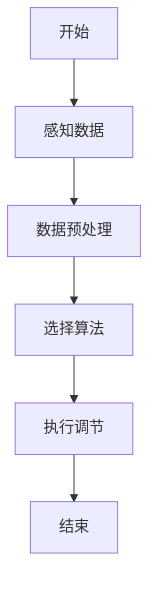
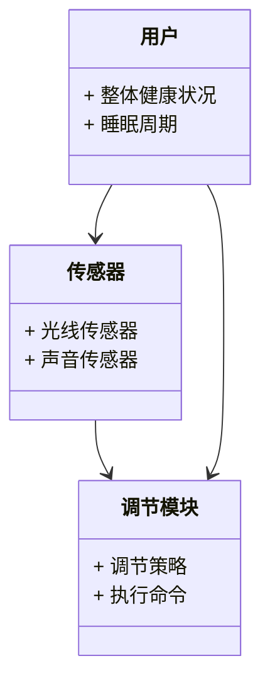
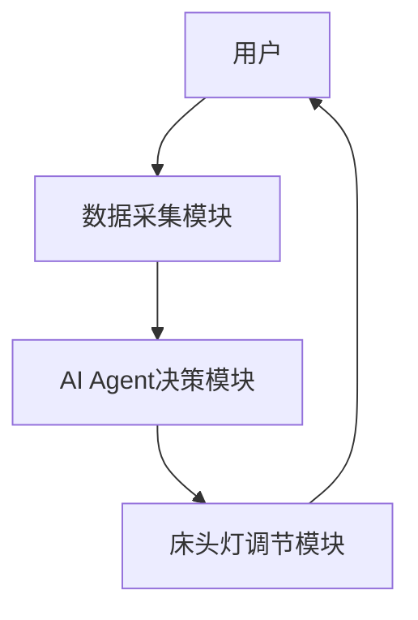
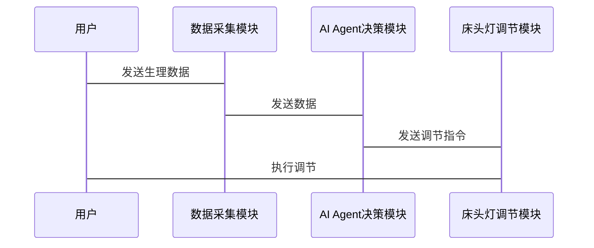

                 


# AI Agent在智能床头灯中的生理节律调节

**关键词**：AI Agent、智能床头灯、生理节律、调节、算法、系统架构、项目实战

**摘要**：本文探讨AI Agent在智能床头灯中的应用，重点分析其如何通过调节光线、声音等环境因素来优化用户的生理节律。文章从背景、原理、算法、系统架构到项目实战，详细阐述AI Agent在调节生理节律中的作用，并提供技术实现和案例分析。

---

## 第1章：AI Agent与生理节律调节的背景介绍

### 1.1 问题背景

#### 1.1.1 生理节律的基本概念

生理节律是指生物体内的一种生理周期性变化，如睡眠-觉醒周期、体温变化和激素分泌等。这些节律通常由生物钟调控，帮助人体适应环境的变化。然而，现代生活方式的改变，如不规律的作息时间、电子设备的普及等，常常打乱生理节律，导致健康问题，如失眠、疲劳和免疫力下降。

#### 1.1.2 生理节律调节的重要性

调节生理节律对于维持人体健康至关重要。良好的生理节律有助于提高睡眠质量、增强免疫力、改善情绪和工作效率。智能床头灯通过调节光强、色温和播放声音，可以有效干预用户的生理节律，帮助用户恢复正常的生物钟。

#### 1.1.3 AI Agent在生理节律调节中的作用

AI Agent（智能代理）是一种能够感知环境、做出决策并执行动作的智能系统。在智能床头灯中，AI Agent可以通过分析用户的生理数据（如心率、体温、睡眠周期）和环境数据（如光线、声音），动态调整床头灯的亮度、颜色和声音，以优化用户的生理节律。

---

### 1.2 问题描述

#### 1.2.1 生理节律失调的常见原因

现代生活中，许多人因为工作压力、电子设备使用过度等原因，导致生理节律失调。常见的问题包括失眠、疲劳、注意力不集中等。

#### 1.2.2 智能床头灯调节生理节律的优势

智能床头灯可以通过调节光环境和声音来影响人的生理状态。例如，蓝光可以抑制褪黑激素的分泌，帮助用户保持清醒；暖光可以促进褪黑激素分泌，帮助用户放松和入睡。

#### 1.2.3 AI Agent在智能床头灯中的应用目标

AI Agent的目标是通过实时监测用户的生理数据和环境数据，动态调整床头灯的光强、颜色和声音，以优化用户的生理节律。

---

### 1.3 问题解决

#### 1.3.1 AI Agent如何调节生理节律

AI Agent通过以下步骤调节生理节律：
1. **感知**：采集用户的生理数据（如心率、体温、睡眠周期）和环境数据（如光线、声音）。
2. **决策**：根据数据生成调节策略，如调整床头灯的亮度和颜色。
3. **执行**：通过床头灯执行调节策略，优化用户的生理节律。

#### 1.3.2 智能床头灯调节生理节律的具体实现

智能床头灯通过以下方式实现调节：
1. **光线调节**：根据用户的生理数据，调整床头灯的亮度和颜色。
2. **声音调节**：播放舒缓的声音帮助用户放松。

#### 1.3.3 AI Agent与智能床头灯的协同工作

AI Agent与智能床头灯协同工作，实时调整床头灯的参数，优化用户的生理节律。

---

### 1.4 边界与外延

#### 1.4.1 AI Agent调节生理节律的适用范围

AI Agent适用于需要调节生理节律的用户，如失眠患者、长期熬夜的上班族等。

#### 1.4.2 智能床头灯调节生理节律的局限性

智能床头灯调节生理节律的效果可能受到用户个体差异和环境因素的影响。

#### 1.4.3 相关技术的边界与外延

AI Agent调节生理节律的技术边界包括数据采集精度、算法优化和用户隐私保护。

---

### 1.5 概念结构与核心要素组成

#### 1.5.1 AI Agent的核心要素

AI Agent的核心要素包括感知模块、决策模块和执行模块。

#### 1.5.2 生理节律调节的系统组成

生理节律调节系统包括数据采集模块、数据处理模块和调节执行模块。

#### 1.5.3 智能床头灯的硬件与软件结构

智能床头灯的硬件包括光线传感器、声音播放模块和床头灯本体。软件包括数据采集模块、AI Agent算法模块和调节控制模块。

---

## 第2章：AI Agent的核心概念与联系

### 2.1 AI Agent的原理

#### 2.1.1 AI Agent的基本原理

AI Agent通过感知环境、分析数据、制定决策并执行动作，实现对生理节律的调节。

#### 2.1.2 AI Agent的感知、决策与执行过程

1. **感知**：AI Agent通过传感器获取用户的生理数据和环境数据。
2. **决策**：AI Agent基于感知数据，制定调节策略。
3. **执行**：AI Agent通过床头灯执行调节策略。

#### 2.1.3 AI Agent在生理节律调节中的具体应用

AI Agent可以根据用户的生理数据，动态调整床头灯的亮度和颜色。

---

### 2.2 核心概念对比

#### 2.2.1 AI Agent与传统自动调节系统的对比

AI Agent的优势在于其智能化和自适应能力，能够根据实时数据动态调整。

#### 2.2.2 不同AI Agent算法的对比

- 基于规则的AI Agent：通过预定义规则进行调节。
- 基于学习的AI Agent：通过机器学习算法优化调节策略。

#### 2.2.3 生理节律调节中的关键参数对比

关键参数包括亮度、色温和声音频率。

---

### 2.3 ER实体关系图

```mermaid
er
actor: 用户
actor: 传感器
actor: 调节模块
```

---

## 第3章：AI Agent算法原理

### 3.1 算法原理概述

#### 3.1.1 强化学习的基本原理

强化学习是一种通过试错学习优化策略的方法。

#### 3.1.2 监督学习在AI Agent中的应用

监督学习通过标记数据训练模型，预测最优调节策略。

#### 3.1.3 聚类算法在生理节律调节中的应用

聚类算法用于将用户数据分成不同的类别，制定个性化的调节策略。

---

### 3.2 算法流程图



---

### 3.3 算法实现

#### 3.3.1 强化学习算法实现

```python
import numpy as np
from collections import deque

class AI-Agent:
    def __init__(self, state_space, action_space):
        self.state_space = state_space
        self.action_space = action_space
        self.Q_table = np.zeros((state_space, action_space))
    
    def perceive(self, state):
        return state
    
    def decide(self, state):
        return np.argmax(self.Q_table[state])
    
    def learn(self, state, action, reward):
        self.Q_table[state][action] += reward
```

---

### 3.4 算法优化

#### 3.4.1 Q-learning算法的数学模型

$$ Q(s, a) = Q(s, a) + \alpha \times (r + \gamma \times \max Q(s', a') - Q(s, a)) $$

---

## 第4章：系统分析与架构设计

### 4.1 问题场景介绍

用户使用智能床头灯，通过AI Agent调节生理节律。

### 4.2 项目介绍

开发一个基于AI Agent的智能床头灯系统。

---

### 4.3 系统功能设计

#### 4.3.1 领域模型类图



---

### 4.4 系统架构设计

#### 4.4.1 系统架构图



---

### 4.5 接口设计

系统接口包括用户界面、传感器接口和床头灯控制接口。

---

### 4.6 交互流程图



---

## 第5章：项目实战

### 5.1 环境安装

安装Python、numpy、mermaid等工具。

---

### 5.2 核心代码实现

#### 5.2.1 AI Agent核心代码

```python
class AI-Agent:
    def __init__(self, state_space, action_space):
        self.state_space = state_space
        self.action_space = action_space
        self.Q_table = np.zeros((state_space, action_space))
    
    def perceive(self, state):
        return state
    
    def decide(self, state):
        return np.argmax(self.Q_table[state])
    
    def learn(self, state, action, reward):
        self.Q_table[state][action] += reward
```

---

### 5.3 代码应用解读

解释代码的功能和实现细节。

---

### 5.4 实际案例分析

分析实际案例，展示AI Agent如何调节生理节律。

---

### 5.5 项目小结

总结项目实现的关键点和经验教训。

---

## 第6章：总结与展望

### 6.1 总结

本文详细介绍了AI Agent在智能床头灯中的应用，分析了其调节生理节律的原理和实现。

### 6.2 未来展望

未来，AI Agent将向多模态调节、个性化优化和实时反馈的方向发展。

---

**作者：AI天才研究院 & 禅与计算机程序设计艺术**

