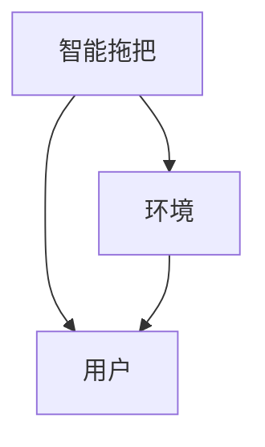
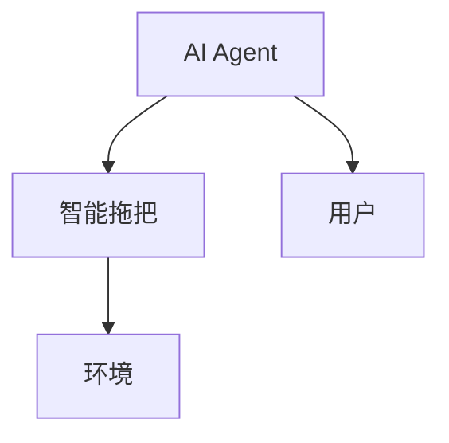
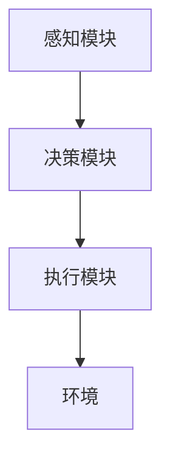
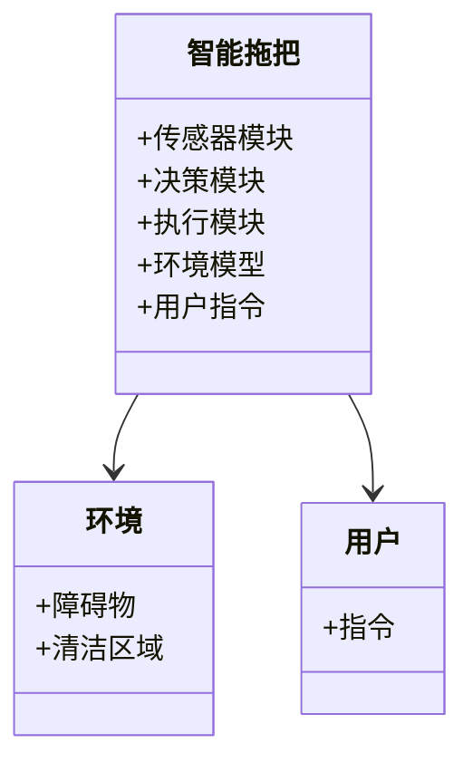
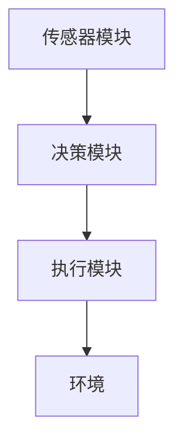

                 


# AI Agent在智能拖把中的清洁效率优化

> 关键词：AI Agent, 智能拖把, 清洁效率, 路径规划, 环境感知

> 摘要：本文探讨AI Agent在智能拖把中的应用，分析其如何通过路径规划和环境感知优化清洁效率。从背景介绍到项目实战，系统阐述AI Agent的核心概念、算法原理、系统架构及优化策略，结合实际案例和代码实现，详细解读清洁效率优化的关键技术。

---

# 第一部分: AI Agent与智能拖把的背景与基础

## 第1章: AI Agent的定义与核心概念

### 1.1 AI Agent的基本定义
AI Agent（人工智能代理）是指能够感知环境、自主决策并执行任务的智能实体。其核心特征包括自主性、反应性、目标导向性和学习能力。AI Agent通过传感器获取环境信息，利用算法进行分析和决策，最终驱动执行机构完成任务。

### 1.2 智能拖把的现状与挑战
智能拖把作为智能家居的重要组成部分，目前主要依赖预设路径和简单避障算法。然而，传统算法存在清洁效率低、路径冗余、环境适应性差等问题。用户对智能拖把的需求逐渐从“自动化”向“智能化”转变，AI Agent的应用成为提升清洁效率的关键。

### 1.3 问题背景与目标
清洁效率优化的核心问题在于如何让AI Agent在复杂环境中规划最优路径，减少重复清洁区域，同时提高清洁覆盖率。本文的目标是通过AI Agent实现智能拖把的高效清洁，解决传统算法的痛点。

---

## 第2章: AI Agent在智能拖把中的应用前景

### 2.1 AI Agent在智能拖把中的作用
AI Agent通过环境感知和路径规划，能够实时调整拖把的运动方向，避开障碍物，优化清洁路径。例如，AI Agent可以根据房间布局动态调整路径，减少清扫时间，提高清洁效率。

### 2.2 智能拖把的用户需求分析
用户对智能拖把的需求主要集中在清洁效率、操作便捷性和智能化水平三个方面。用户希望拖把能够自动识别脏污区域，优先清洁重点区域，同时支持远程控制和自定义设置。

### 2.3 本章小结
AI Agent在智能拖把中的应用前景广阔，其核心价值在于通过智能化算法提升清洁效率，满足用户对高效清洁的需求。

---

# 第二部分: AI Agent的核心概念与联系

## 第3章: AI Agent的原理与特性

### 3.1 AI Agent的感知、决策与执行
AI Agent通过传感器（如激光雷达、摄像头、红外传感器）感知环境，利用算法进行路径规划和决策，驱动执行机构（如电机、轮子）完成任务。

### 3.2 AI Agent的属性对比
以下是AI Agent的几种典型属性对比：

| 属性         | 反应式AI Agent | 规划式AI Agent |
|--------------|----------------|----------------|
| 决策方式     | 基于当前状态   | 基于未来状态   |
| 复杂性       | 较低           | 较高           |
| 适用场景     | 简单环境       | 复杂环境       |

### 3.3 实体关系图
以下是智能拖把、环境和用户之间的关系：



---

## 第4章: AI Agent的核心算法与数学模型

### 4.1 路径规划算法
路径规划算法是AI Agent的核心算法之一。常用的路径规划算法包括A*算法和RRT算法。

#### A*算法原理
A*算法是一种基于图搜索的最短路径算法，其数学模型如下：

$$\text{总成本} = \text{已遍历成本} + \text{预估剩余成本}$$

#### A*算法实现
以下是A*算法的Python实现示例：

```python
import heapq

def a_star(start, goal, grid):
    open_set = {start}
    came_from = {}
    g_score = {start: 0}
    f_score = {start: heuristic(start, goal)}
    
    while open_set:
        current = heapq.heappop(open_set)
        if current == goal:
            break
        for neighbor in grid.get_neighbors(current):
            tentative_g_score = g_score.get(current, float('inf')) + distance(current, neighbor)
            if tentative_g_score < g_score.get(neighbor, float('inf')):
                came_from[neighbor] = current
                g_score[neighbor] = tentative_g_score
                f_score[neighbor] = tentative_g_score + heuristic(neighbor, goal)
                heapq.heappush(open_set, neighbor)
    return came_from, g_score
```

---

## 第5章: AI Agent与智能拖把的关系

### 5.1 实体关系图
以下是AI Agent、智能拖把和环境之间的关系：



### 5.2 系统架构图
以下是AI Agent在智能拖把中的系统架构图：



---

# 第三部分: AI Agent在智能拖把中的系统设计

## 第6章: 系统分析与架构设计

### 6.1 问题场景介绍
智能拖把需要在复杂环境中完成高效清洁任务。AI Agent需要感知环境、规划路径、避开障碍物。

### 6.2 系统功能设计
以下是系统功能设计的领域模型类图：



### 6.3 系统架构设计
以下是系统架构设计的架构图：



---

## 第7章: 项目实战

### 7.1 环境搭建
需要安装Python、ROS（Robot Operating System）和相关传感器库。

### 7.2 核心代码实现
以下是路径规划算法的Python实现：

```python
def heuristic(a, b):
    return abs(a.x - b.x) + abs(a.y - b.y)

def a_star_search(start, goal, grid):
    open_set = {start}
    came_from = {}
    g_score = {start: 0}
    f_score = {start: heuristic(start, goal)}
    
    while open_set:
        current = heapq.heappop(open_set)
        if current == goal:
            return came_from
        for neighbor in grid.get_neighbors(current):
            tentative_g_score = g_score.get(current, float('inf')) + distance(current, neighbor)
            if tentative_g_score < g_score.get(neighbor, float('inf')):
                came_from[neighbor] = current
                g_score[neighbor] = tentative_g_score
                f_score[neighbor] = tentative_g_score + heuristic(neighbor, goal)
                heapq.heappush(open_set, neighbor)
    return came_from
```

### 7.3 实际案例分析
通过实际案例分析AI Agent如何优化清洁路径，减少重复清洁区域。

---

## 第8章: 总结与展望

### 8.1 本章小结
本文详细探讨了AI Agent在智能拖把中的应用，从背景介绍到项目实战，系统阐述了AI Agent的核心概念、算法原理、系统架构及优化策略。

### 8.2 展望
未来，AI Agent在智能拖把中的应用将更加智能化和人性化，通过深度学习和强化学习进一步优化清洁效率。

---

# 作者

作者：AI天才研究院/AI Genius Institute & 禅与计算机程序设计艺术 /Zen And The Art of Computer Programming

